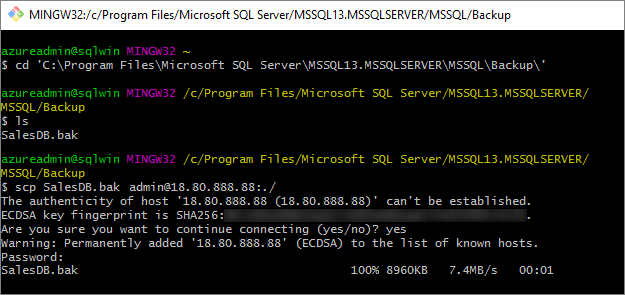

# Migrate a SQL Server database from Windows to Linux using backup and restore

[!INCLUDE [SQL Server - Linux](../includes/applies-to-version/sql-linux.md)]

SQL Server's backup and restore feature is the recommended way to migrate a database from SQL Server on Windows to SQL Server on Linux. In this tutorial, you will walk through the steps required to move a database to Linux with backup and restore techniques.

> [!div class="checklist"]
> * Create a backup file on Windows with SSMS
> * Install a Bash shell on Windows
> * Move the backup file to Linux from the Bash shell
> * Restore the backup file on Linux with Transact-SQL
> * Run a query to verify the migration

You can also create a SQL Server Always On Availability Group to migrate a SQL Server database from Windows to Linux. See [sql-server-linux-availability-group-cross-platform](sql-server-linux-availability-group-cross-platform.md).

## Prerequisites

The following prerequisites are required to complete this tutorial:

* Windows machine with the following:
  * [SQL Server](https://www.microsoft.com/sql-server/sql-server-downloads) installed.
  * [SQL Server Management Studio](../ssms/download-sql-server-management-studio-ssms.md) installed.
  * Target database to migrate.

* Linux machine with the following installed:
  * SQL Server ([RHEL](quickstart-install-connect-red-hat.md), [SLES](quickstart-install-connect-suse.md), or [Ubuntu](quickstart-install-connect-ubuntu.md)) with command-line tools.

## Create a backup on Windows

There are several ways to create a backup file of a database on Windows. The following steps use SQL Server Management Studio (SSMS).

1. Start **SQL Server Management Studio** on your Windows machine.

1. In the connection dialog, enter **localhost**.

1. In Object Explorer, expand **Databases**.

1. Right-click your target database, select **Tasks**, and then click **Back Up...**.

   

1. In the **Backup Up Database** dialog, verify that **Backup type** is **Full** and **Back up to** is **Disk**. Note name and location of the file. For example, a database named **YourDB** on SQL Server 2016 has a default backup path of `C:\Program Files\Microsoft SQL Server\MSSQL13.MSSQLSERVER\MSSQL\Backup\YourDB.bak`.

1. Select **OK** to back up your database.

> [!NOTE]
> Another option is to run a Transact-SQL query to create the backup file. The following Transact-SQL command performs the same actions as the previous steps for a database called **YourDB**:
>
> ```sql
> BACKUP DATABASE [YourDB] TO  DISK =
> N'C:\Program Files\Microsoft SQL Server\MSSQL13.MSSQLSERVER\MSSQL\Backup\YourDB.bak'
> WITH NOFORMAT, NOINIT, NAME = N'YourDB-Full Database Backup',
> SKIP, NOREWIND, NOUNLOAD, STATS = 10
> GO
> ```

## Install a Bash shell on Windows

To restore the database, you must first transfer the backup file from the Windows machine to the target Linux machine. In this tutorial, we move the file to Linux from a Bash shell (terminal window) running on Windows.

1. Install a Bash shell on your Windows machine that supports the **scp** (secure copy) and **ssh** (remote login) commands. Two examples include:

   * The [Windows Subsystem for Linux](/windows/wsl/about) (Windows 10)
   * The Git Bash Shell ([https://git-scm.com/downloads](https://git-scm.com/downloads))

1. Open a Bash session on Windows.

## <a id="scp"></a> Copy the backup file to Linux

1. In your Bash session, navigate to the directory containing your backup file. For example:

   ```bash
   cd 'C:\Program Files\Microsoft SQL Server\MSSQL13.MSSQLSERVER\MSSQL\Backup\'
   ```

1. Use the **scp** command to transfer the file to the target Linux machine. The following example transfers **YourDB.bak** to the home directory of *user1* on the Linux server with an IP address of *192.0.2.9*:

   ```bash
   scp YourDB.bak user1@192.0.2.9:./
   ```
   

> [!TIP]
> There are alternatives to using scp for file transfer. One is to use [Samba](https://help.ubuntu.com/community/Samba) to configure an SMB network share between Windows and Linux. For a walkthrough on Ubuntu, see [How to Create a Network Share Via Samba](https://help.ubuntu.com/community/How%20to%20Create%20a%20Network%20Share%20Via%20Samba%20Via%20CLI%20%28Command-line%20interface/Linux%20Terminal%29%20-%20Uncomplicated,%20Simple%20and%20Brief%20Way!). Once established, you can access it as a network file share from Windows, such as **\\\\machinenameorip\\share**.

## Move the backup file before restoring

At this point, the backup file is on your Linux server in your user's home directory. Before restoring the database to SQL Server, you must place the backup in a subdirectory of **/var/opt/mssql**, as this is owned by the user `mssql` and group `mssql`. If you are looking to change the default backup location, see the [Configure with mssql-conf](sql-server-linux-configure-mssql-conf.md#backupdir) article.

1. In the same Windows Bash session, connect remotely to your target Linux machine with **ssh**. The following example connects to the Linux machine **192.0.2.9** as user **user1**.

   ```bash
   ssh user1@192.0.2.9
   ```

   You are now running commands on the remote Linux server.

1. Enter super user mode.

   ```bash
   sudo su
   ```

1. Create a new backup directory. The -p parameter does nothing if the directory already exists.

   ```bash
   mkdir -p /var/opt/mssql/backup
   ```

1. Move the backup file to that directory. In the following example, the backup file resides in the home directory of *user1*. Change the command to match the location and file name of your backup file.

   ```bash
   mv /home/user1/YourDB.bak /var/opt/mssql/backup/
   ```

1. Exit super user mode.

   ```bash
   exit
   ```

## Restore your database on Linux

To restore the database backup, you can use the **RESTORE DATABASE** Transact-SQL (TQL) command.

> [!NOTE]
> The following steps use the **sqlcmd** tool. If you haven't install SQL Server Tools, see [Install SQL Server command-line tools on Linux](sql-server-linux-setup-tools.md).

1. In the same terminal, launch **sqlcmd**. The following example connects to the local SQL Server instance with the **SA** user. Enter the password when prompted, or specify the password by adding the **-P** parameter.

   ```bash
   sqlcmd -S localhost -U SA
   ```

1. At the `>1` prompt, enter the following **RESTORE DATABASE** command, pressing ENTER after each line (you cannot copy and paste the entire multi-line command at once). Replace all occurrences of `YourDB` with the name of your database.

   ```sql
   RESTORE DATABASE YourDB
   FROM DISK = '/var/opt/mssql/backup/YourDB.bak'
   WITH MOVE 'YourDB' TO '/var/opt/mssql/data/YourDB.mdf',
   MOVE 'YourDB_Log' TO '/var/opt/mssql/data/YourDB_Log.ldf'
   GO
   ```

   You should get a message the database is successfully restored.

   `RESTORE DATABASE` may return an error like the following example:

   ```bash
   File 'YourDB_Product' cannot be restored to 'Z:\Microsoft SQL Server\MSSQL11.GLOBAL\MSSQL\Data\YourDB\YourDB_Product.ndf'. Use WITH MOVE to identify a valid location for the file.
   Msg 5133, Level 16, State 1, Server servername, Line 1
   Directory lookup for the file "Z:\Microsoft SQL Server\MSSQL11.GLOBAL\MSSQL\Data\YourDB\YourDB_Product.ndf" failed with the operating system error 2(The system cannot find the file specified.).
   ```
   
   In this case, the database contains secondary files. If these files are not specified in the `MOVE` clause of `RESTORE DATABASE`, the restore procedure will try to create them in the same path as the original server. 

   You can list all files included in the backup:
   ```sql
   RESTORE FILELISTONLY FROM DISK = '/var/opt/mssql/backup/YourDB.bak'
   GO
   ```
   You should get a list like the one below (listing only the two first columns):
   ```sql
   LogicalName         PhysicalName                                                                 ..............
   ----------------------------------------------------------------------------------------------------------------------
   YourDB              Z:\Microsoft SQL Server\MSSQL11.GLOBAL\MSSQL\Data\YourDB\YourDB.mdf          ..............
   YourDB_Product      Z:\Microsoft SQL Server\MSSQL11.GLOBAL\MSSQL\Data\YourDB\YourDB_Product.ndf  ..............
   YourDB_Customer     Z:\Microsoft SQL Server\MSSQL11.GLOBAL\MSSQL\Data\YourDB\YourDB_Customer.ndf ..............
   YourDB_log          Z:\Microsoft SQL Server\MSSQL11.GLOBAL\MSSQL\Data\YourDB\YourDB_Log.ldf      ..............
   ```
   
   You can use this list to create `MOVE` clauses for the additional files. In this example, the `RESTORE DATABASE` is:

   ```sql
   RESTORE DATABASE YourDB
   FROM DISK = '/var/opt/mssql/backup/YourDB.bak'
   WITH MOVE 'YourDB' TO '/var/opt/mssql/data/YourDB.mdf',
   MOVE 'YourDB_Product' TO '/var/opt/mssql/data/YourDB_Product.ndf',
   MOVE 'YourDB_Customer' TO '/var/opt/mssql/data/YourDB_Customer.ndf',
   MOVE 'YourDB_Log' TO '/var/opt/mssql/data/YourDB_Log.ldf'
   GO
   ```


1. Verify the restoration by listing all of the databases on the server. The restored database should be listed.

   ```sql
   SELECT Name FROM sys.Databases
   GO
   ```

1. Run other queries on your migrated database. The following command switches context to the **YourDB** database and selects rows from one of its tables.

   ```sql
   USE YourDB
   SELECT * FROM YourTable
   GO
   ```

1. When you are done using **sqlcmd**, type `exit`.

1. When you are done working in the remote **ssh** session, type `exit` again.

## Next steps

In this tutorial, you learned how to back up a database on Windows and move it to a Linux server running SQL Server. You learned how to:
> [!div class="checklist"]
> * Use SSMS and Transact-SQL to create a backup file on Windows
> * Install a Bash shell on Windows
> * Use **scp** to move backup files from Windows to Linux
> * Use **ssh** to remotely connect to your Linux machine
> * Relocate the backup file to prepare for restore
> * Use **sqlcmd** to run Transact-SQL commands
> * Restore the database backup with the **RESTORE DATABASE** command 
> * Run the query to verify the migration

Next, explore other migration scenarios for SQL Server on Linux. 

> [!div class="nextstepaction"]
>[Migrate databases to SQL Server on Linux](sql-server-linux-migrate-overview.md)
