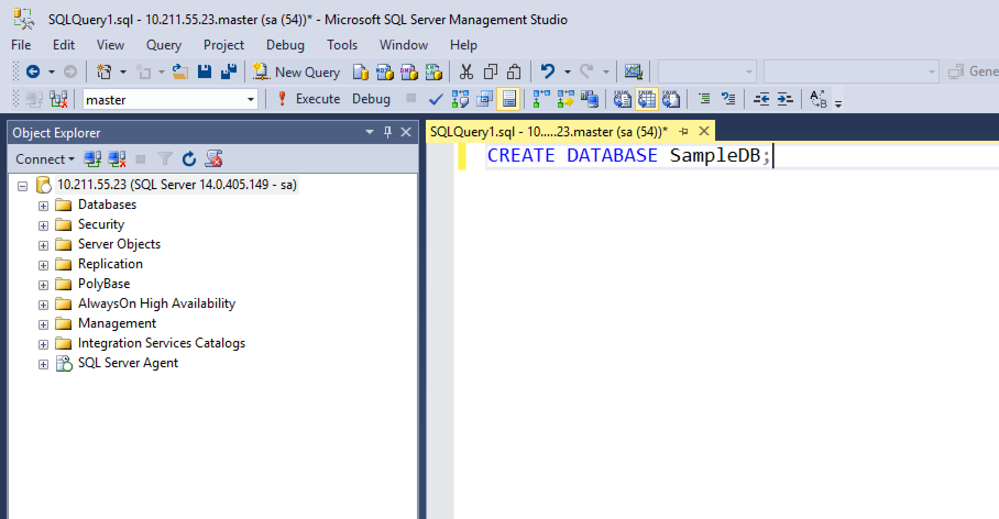
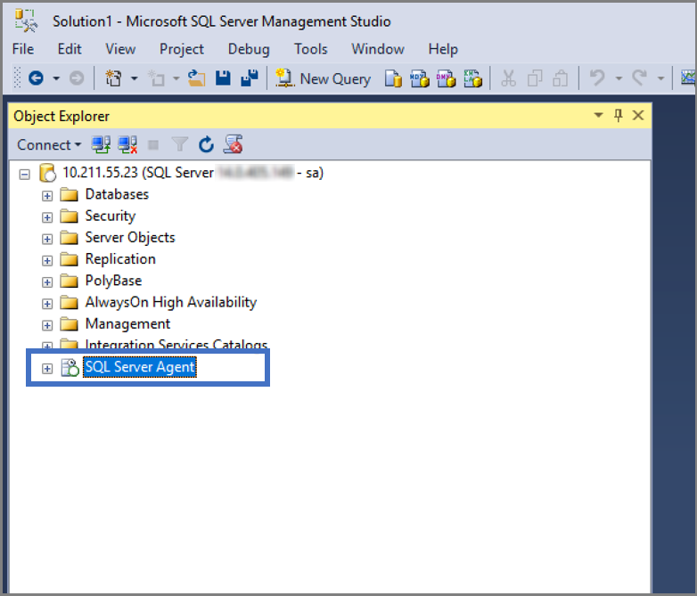
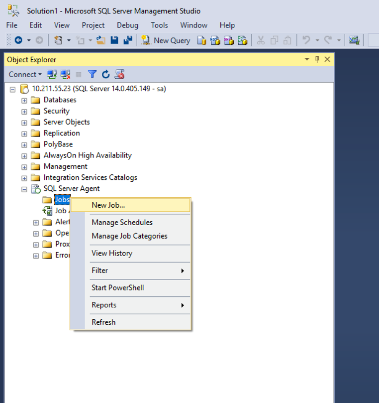
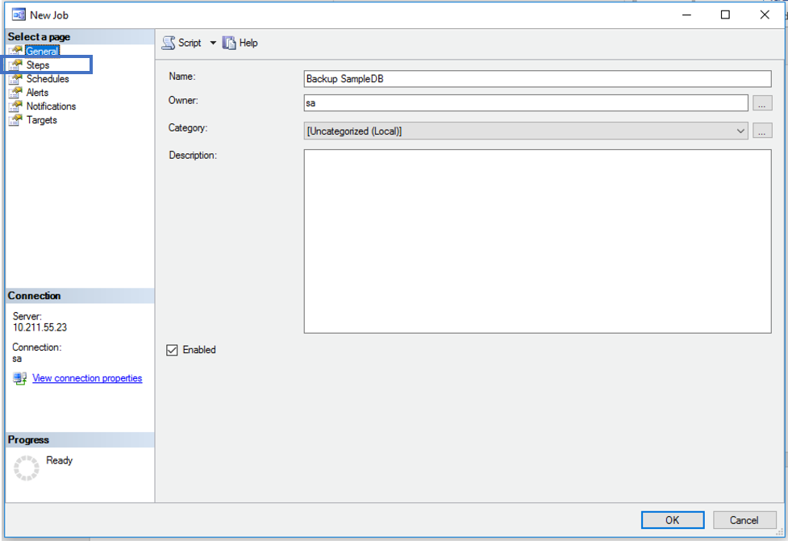
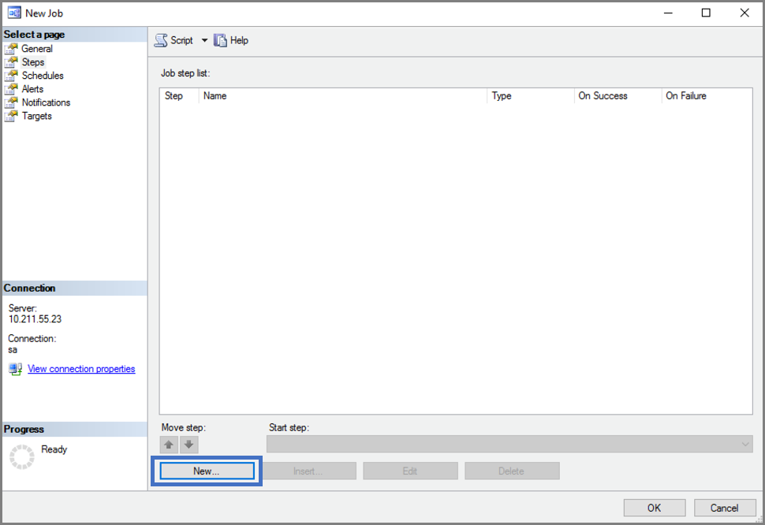
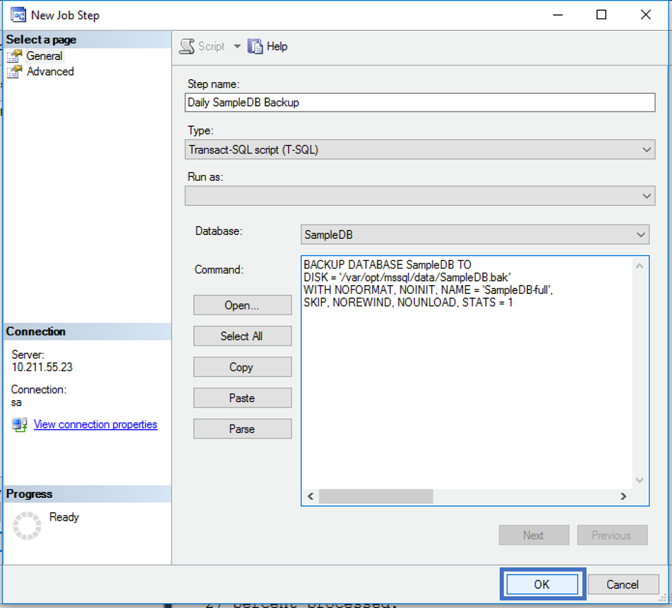
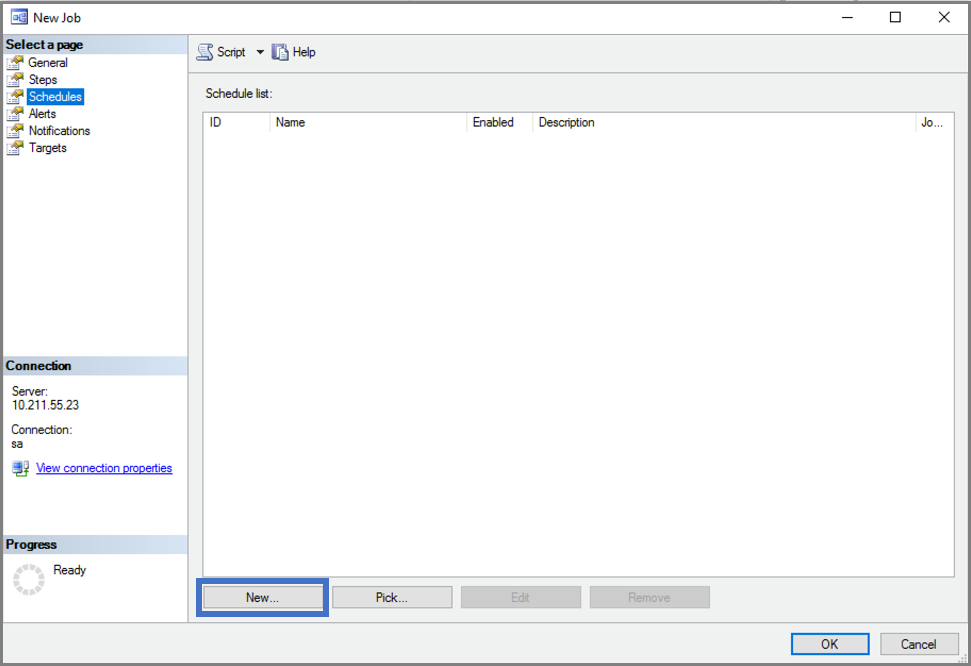
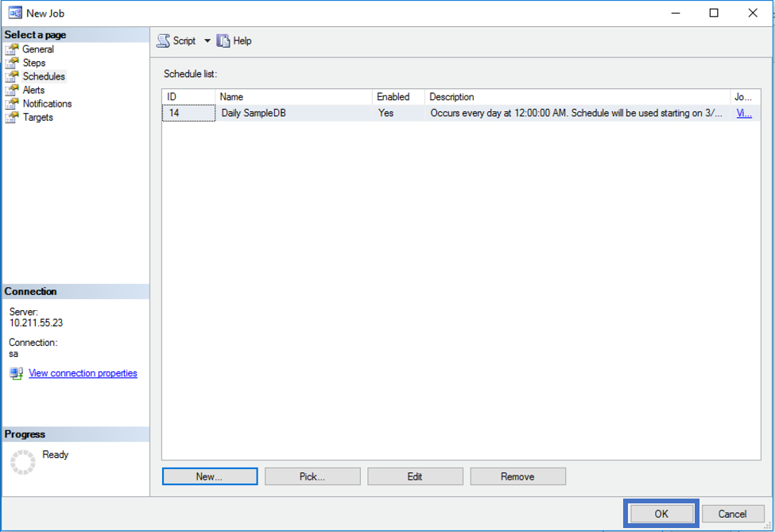
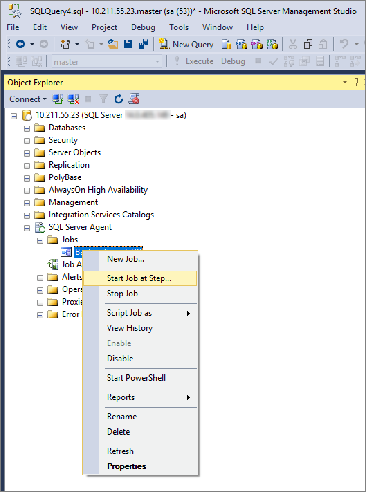

# Create and run SQL Server Agent jobs on Linux

[!INCLUDE[appliesto-ss-xxxx-xxxx-xxx-md-linuxonly](../includes/appliesto-ss-xxxx-xxxx-xxx-md-linuxonly.md)]

SQL Server jobs are used to regularly perform the same sequence of commands in your SQL Server database. This tutorial provides an example of how to create a SQL Server Agent job on Linux using both Transact-SQL and SQL Server Management Studio (SSMS).

> [!div class="checklist"]
> * Install SQL Server Agent on Linux
> * Create a new job to perform daily database backups
> * Schedule and run the job
> * Perform the same steps in SSMS (optional)

For known issues with SQL Server Agent on Linux, see the [Release Notes](sql-server-linux-release-notes.md).

## Prerequisites

The following prerequisites are required to complete this tutorial:

* Linux machine with the following prerequisites:
  * SQL Server ([RHEL](quickstart-install-connect-red-hat.md), [SLES](quickstart-install-connect-suse.md), or [Ubuntu](quickstart-install-connect-ubuntu.md)) with command-line tools.

The following prerequisites are optional:

* Windows machine with SSMS:
  * [SQL Server Management Studio](https://docs.microsoft.com/sql/ssms/download-sql-server-management-studio-ssms) for optional SSMS steps.

## Enable SQL Server Agent

To use SQL Server Agent on Linux, you must first enable SQL Server Agent on a machine that already has SQL Server installed.

1. To enable SQL Server Agent, follow the step below.
  ```bash
  sudo /opt/mssql/bin/mssql-conf set sqlagent.enabled true 
  ```

1. Restart SQL Server with the following command:
  ```bash
  sudo systemctl restart mssql-server
  ```

> [!NOTE]
> Starting with SQL Server 2017 CU4, SQL Server Agent is included with the **mssql-server** package and is disabled by default. For Agent set up prior to CU4 visit, [Install SQL Server Agent on Linux](sql-server-linux-setup-sql-agent.md).

## Create a sample database

Use the following steps to create a sample database named **SampleDB**. This database is used for the daily backup job.

1. On your Linux machine, open a bash terminal session.

1. Use **sqlcmd** to run a Transact-SQL **CREATE DATABASE** command.

   ```bash
   /opt/mssql-tools/bin/sqlcmd -S localhost -U SA -Q 'CREATE DATABASE SampleDB'
   ```

1. Verify the database is created by listing the databases on your server.

   ```bash
   /opt/mssql-tools/bin/sqlcmd -S localhost -U SA -Q 'SELECT Name FROM sys.Databases'
   ```

## Create a job with Transact-SQL

The following steps create a SQL Server Agent job on Linux with Transact-SQL commands. The job runs a daily backup of the sample database, **SampleDB**.

> [!TIP]
> You can use any T-SQL client to run these commands. For example, on Linux you can use [sqlcmd](sql-server-linux-setup-tools.md) or [Visual Studio Code](sql-server-linux-develop-use-vscode.md). From a remote Windows Server, you can also run queries in SQL Server Management Studio (SSMS) or use the UI interface for job management, which is described in the next section.

1. Use [sp_add_job](../relational-databases/system-stored-procedures/sp-add-job-transact-sql.md) to create a job named `Daily SampleDB Backup`.

   ```sql
   -- Adds a new job executed by the SQLServerAgent service
   -- called 'Daily SampleDB Backup'
   USE msdb ;
   GO
   EXEC dbo.sp_add_job
      @job_name = N'Daily SampleDB Backup' ;
   GO
   ```

1. Call [sp_add_jobstep](../relational-databases/system-stored-procedures/sp-add-jobstep-transact-sql.md) to create a job step that creates a backup of the `SampleDB` database.

   ```sql
   -- Adds a step (operation) to the job
   EXEC sp_add_jobstep
      @job_name = N'Daily SampleDB Backup',
      @step_name = N'Backup database',
      @subsystem = N'TSQL',
      @command = N'BACKUP DATABASE SampleDB TO DISK = \
         N''/var/opt/mssql/data/SampleDB.bak'' WITH NOFORMAT, NOINIT, \
         NAME = ''SampleDB-full'', SKIP, NOREWIND, NOUNLOAD, STATS = 10',
      @retry_attempts = 5,
      @retry_interval = 5 ;
   GO
   ```

1. Then create a daily schedule for your job with [sp_add_schedule](../relational-databases/system-stored-procedures/sp-add-jobschedule-transact-sql.md).

   ```sql
   -- Creates a schedule called 'Daily'
   EXEC dbo.sp_add_schedule
      @schedule_name = N'Daily SampleDB',
      @freq_type = 4,
      @freq_interval = 1,
      @active_start_time = 233000 ;
   USE msdb ;
   GO
   ```

1. Attach the job schedule to the job with [sp_attach_schedule](../relational-databases/system-stored-procedures/sp-attach-schedule-transact-sql.md).

   ```sql
   -- Sets the 'Daily' schedule to the 'Daily SampleDB Backup' Job
   EXEC sp_attach_schedule
      @job_name = N'Daily SampleDB Backup',
      @schedule_name = N'Daily SampleDB';
   GO
   ```

1. Use [sp_add_jobserver](../relational-databases/system-stored-procedures/sp-add-jobserver-transact-sql.md) to assign the job to a target server. In this example, the target is the local server.

   ```sql
   EXEC dbo.sp_add_jobserver
      @job_name = N'Daily SampleDB Backup',
      @server_name = N'(LOCAL)';
   GO
   ```
1. Start the job with [sp_start_job](../relational-databases/system-stored-procedures/sp-start-job-transact-sql.md).

   ```sql
   EXEC dbo.sp_start_job N' Daily SampleDB Backup' ;
   GO
   ```

## Create a job with SSMS

You can also create and manage jobs remotely using SQL Server Management Studio (SSMS) on Windows.

1. Start SSMS on Windows and connect to your Linux SQL Server instance. For more information, see [Manage SQL Server on Linux with SSMS](sql-server-linux-manage-ssms.md).

1. Verify that you have created a sample database named **SampleDB**.

   

1. Verify that SQL Agent was [installed](sql-server-linux-setup-sql-agent.md) and configured correctly. Look for the plus sign next to SQL Server Agent in the Object Explorer. If SQL Server Agent is not enabled, try restarting the **mssql-server** service on Linux.

   

1. Create a new job.

   

1. Give your job a name and create your job step.

   

1. Specify what subsystem you want to use and what the job step should do.

   

   

1. Create a new job schedule.

   

   

1. Start your job.

   

## Next Steps

In this tutorial, you learned how to:

> [!div class="checklist"]
> * Install SQL Server Agent on Linux
> * Use Transact-SQL and system stored procedures to create jobs
> * Create a job that performs daily database backups
> * Use SSMS UI to create and manage jobs

Next, explore other capabilities for creating and managing jobs:

> [!div class="nextstepaction"]
>[SQL Server Agent documentation](https://docs.microsoft.com/sql/ssms/agent/sql-server-agent)
