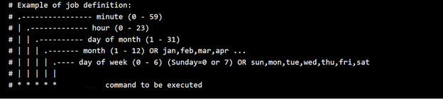
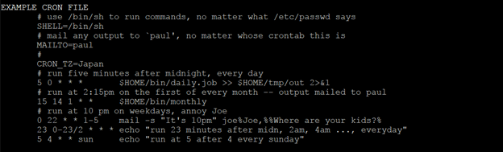

# Schedule SQL Server Integration Services package execution on Linux with cron

[!INCLUDE [SQL Server - Linux](../includes/applies-to-version/sql-linux.md)]

When you run SQL Server Integration Services (SSIS) and SQL Server on Windows, you can automate the execution of SSIS packages by using SQL Server Agent. When you run SQL Server and SSIS on Linux, however, the SQL Server Agent utility isn't available to schedule jobs on Linux. Instead, you use the cron service, which is widely used on Linux platforms to automate package execution.

This article provides examples that show how to automate the execution of SSIS packages. The examples are written to run on Red Hat Enterprise. The code is similar for other Linux distributions, such as Ubuntu.

## Prerequisites

Before you use the cron service to run jobs, check to see whether it is running on your computer.

To check the status of the cron service, use the following command: `systemctl status crond.service`.

If the service is not active (that is, it is not running), consult your administrator to set up and configure the cron service properly.

## Create jobs

A cron job is a task that you can configure to run regularly at a specified interval. The job can be as simple as a command that you would normally type directly in the console or run as a shell script.

For easy management and maintenance purposes, we recommend that you put your package-execution commands in a script that contains a descriptive name.

Here is an example of a simple shell script for running a package. It contains only a single command, but you can add more commands as required.

```bash
# A simple shell script that contains a simple package execution command
# Script name: SSISpackageName.daily

/opt/ssis/bin/dtexec /F yourSSISpackageName.dtsx >> $HOME/tmp/out 2>&1
```

## Schedule jobs with the cron service

After you have defined your jobs, you can schedule them to run automatically by using the cron service.

To add your job for cron to run, add the job in the crontab file. To open the crontab file in an editor where you can add or update the job, use the following command: `crontab -e`.

To schedule the previously described job to run daily at 2:10 AM, add the following line to the crontab file:

```
# run <SSIS package name> at 2:10 AM every day
10 2 \* \* \* $/HOME/SSIS/jobs/SSISpackageName.daily
```

Save the crontab file, and then quit the editor.

To understand the format of the sample command, review the information in the following section.
 
## Format of a crontab file

The following image shows the format description of the job line that's added to the crontab file.



To get a more detailed description of the crontab file format, use the following command: `man 5 crontab`.

Here's a partial example of the output that helps to explain the example in this article:



## Related content about SSIS on Linux
-   [Extract, transform, and load data on Linux with SSIS](sql-server-linux-migrate-ssis.md)
-   [Install SQL Server Integration Services (SSIS) on Linux](sql-server-linux-setup-ssis.md)
-   [Configure SQL Server Integration Services on Linux with ssis-conf](sql-server-linux-configure-ssis.md)
-   [Limitations and known issues for SSIS on Linux](sql-server-linux-ssis-known-issues.md)
