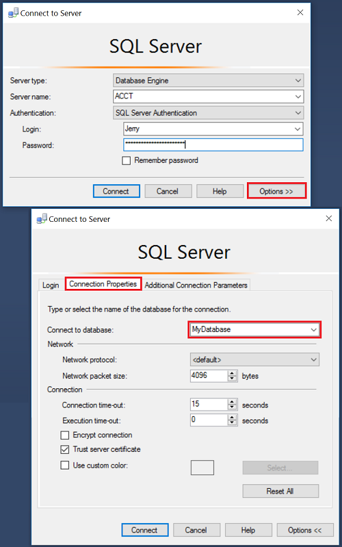

---
# required metadata

title: SQL Server security on Linux | SQL Server vNext CTP1 | Microsoft Docs 
description: This topic describes typical security actions.  
author: BYHAM   
ms.author: rickbyh   
manager: jhubbard  
ms.date: 12/09/2016  
ms.topic: article  
ms.prod: sql-linux   
ms.technology: database-engine  
ms.assetid: ecc72850-8b01-492e-9a27-ec817648f0e0  

# optional metadata

# keywords: ""
# ROBOTS: ""
# audience: ""
# ms.devlang: ""
# ms.reviewer: ""
# ms.suite: ""
# ms.tgt_pltfrm: ""
# ms.custom: ""

---
# Get started with security features of SQL Server on Linux

If you are a Linux user who is new to SQL Server, the following tasks walk you through some of the security tasks. These are not unique or specific to Linux, but it helps to give you an idea of areas to investigate further. In each example, a link is provided to the in-depth documentation for that area.

>  [!NOTE]
>  The following examples use the **AdventureWorks** sample database. For instructions on how to obtain and install this sample database, see [Restore a SQL Server database from Windows to Linux](../sql-server-linux-restore-database.md).


## Create a database User for authentication

SQL Server has several types of users. The recommended type of user for most customers is called a *contained database user*. This is a user account that authenticates at the individual user-database. As a security feature, the contained database user has no inherent ability connect to master database on SQL Server.

>  [!IMPORTANT]
>  When connecting, the user-database must be specified in the connection string. When using Management Studio, in the **Connection** dialog box, click **Options**. The database can be specified on the **Connection Properties** tab.
>     


    


### Who can create to a user-database without a user account? 

- A SQL Server administrator account can connect to any database.  
- When someone creates a database they become the database owner, which can connect to that database.

### Create a user

Connect to a user-database and use the [CREATE USER](https://msdn.microsoft.com/library/ms173463.aspx) statement to create more users. Always use a strong password in place of the asterisks below.

The following statement, creates a contained database user named Jerry.

``` 
CREATE USER Jerry WITH PASSWORD = '**********';
```

Later you can authorize any existing user to create a more database users, by granting them the  `ALTER ANY USER` permission. For example: `GRANT ALTER ANY USER TO Jerry;` Now Jerry can create more users.


## Granting access with least privileges

The first people to connect to a user-database will be the administrator and database owner accounts. However these users have all the the permissions available on the database. This is more permission than most users should have. 

When you are just getting started, you can assign some general categories of permissions by using the built-in *fixed database roles*. For example, the `db_datareader` fixed database role can read all tables in the database, but make no changes. Grant membership in a fixed database role by using the [ALTER ROLE](https://msdn.microsoft.com/library/ms189775.aspx) statement. The following example add the user `Jerry` to the `db_datareader` fixed database role.

```
ALTER ROLE db_datareader ADD MEMBER Jerry;
```

For a list of the fixed database roles, see [Database-Level Roles](https://msdn.microsoft.com/library/ms189121.aspx).

Later, when you are ready to configure more precise access to your data (highly recommended), create your own user-defined database roles using [CREATE ROLE](https://msdn.microsoft.com/library/ms187936.aspx) statement. Then assign specific granular permissions to you custom roles.

For example, the following statements create a database role named `Sales`, grants the `Sales` group the ability to see, update, and delete rows from the `Orders` table, and then adds the user `Jerry` to the `Sales` role.

```
CREATE ROLE Sales;
GRANT SELECT ON Object::Sales TO Orders;
GRANT UPDATE ON Object::Sales TO Orders;
GRANT DELETE ON Object::Sales TO Orders;
ALTER ROLE Sales ADD MEMBER Jerry;
```

For more information about the permission system, see [Getting Started with Database Engine Permissions](https://msdn.microsoft.com/library/mt667986.aspx).


## Configure row-level security  

[Row-Level Security](https://msdn.microsoft.com/library/dn765131.aspx) enables you to restrict access to rows in a database based on the user executing a query. This feature is useful for scenarios like ensuring that customers can only access their own data or that workers can only access data that is pertinent to their department.   

The steps below walk through setting up two Users with different row-level access to the `Sales.SalesOrderHeader` table. 

Create two user accounts to test the row level security: 

```
CREATE USER Manager WITHOUT LOGIN;   
CREATE USER SalesPerson280 WITHOUT LOGIN; 
```

Grant read access on the `Sales.SalesOrderHeader` table to both users: 

```
GRANT SELECT ON Sales.SalesOrderHeader TO Manager;   
GRANT SELECT ON Sales.SalesOrderHeader TO SalesPerson280; 
```

Create a new schema and inline table-valued function. The function returns 1 when a row in the `SalesPersonID` column matches the ID of a `SalesPerson` login or if the user executing the query is the Manager user.  

```  
CREATE SCHEMA Security;   
GO   

CREATE FUNCTION Security.fn_securitypredicate(@SalesPersonID AS int)     
    RETURNS TABLE 
WITH SCHEMABINDING 
AS     
   RETURN SELECT 1 AS fn_securitypredicate_result    
WHERE ('SalesPerson' + CAST(@SalesPersonId as VARCHAR(16)) = USER_NAME())     
    OR (USER_NAME() = 'Manager'); 
```

Create a security policy adding the function as both a filter and a block predicate on the table:  

```
CREATE SECURITY POLICY SalesFilter   
ADD FILTER PREDICATE Security.fn_securitypredicate(SalesPersonID)    
  ON Sales.SalesOrderHeader,   
ADD BLOCK PREDICATE Security.fn_securitypredicate(SalesPersonID)    
  ON Sales.SalesOrderHeader   
WITH (STATE = ON);   
```

Execute the following to query the `SalesOrderHeader` table as each user. Verify that `SalesPerson280` only sees the 95 rows from their own sales and that the `Manager` can see all the rows in the table.  

```    
EXECUTE AS USER = 'SalesPerson280';   
SELECT * FROM Sales.SalesOrderHeader;    
REVERT; 
 
EXECUTE AS USER = 'Manager';   
SELECT * FROM Sales.SalesOrderHeader;   
REVERT;   
```
 
Alter the security policy to disable the policy.  Now both users can access all rows. 

```
ALTER SECURITY POLICY SalesFilter   
WITH (STATE = OFF);    
``` 


## Enable SQL Server dynamic data masking

[Dynamic Data Masking](https://msdn.microsoft.com/library/mt130841.aspx) enables you to limit the exposure of sensitive data to users of an application by fully or partially masking certain columns. 

Use an `ALTER TABLE` statement to add a masking function to the `EmailAddress` column in the `Person.EmailAddress` table: 
 
```
ALTER TABLE Person.EmailAddress    
ALTER COLUMN EmailAddress    
ADD MASKED WITH (FUNCTION = 'email()');
``` 
 
Create a new user `TestUser` with `SEELCT` permission on the table, then execute a query as `TestUser` to view the masked data:   

```  
CREATE USER TestUser WITHOUT LOGIN;   
GRANT SELECT ON Person.EmailAddress TO TestUser;    
 
EXECUTE AS USER = 'TestUser';   
SELECT EmailAddresssID, EmailAddress FROM Person.EmailAddress;       
REVERT;    
```
 
Verify that the masking function changes the email address in the first record from:
  
|EmailAddresssID |EmailAddress |  
|----|---- |   
|1 |ken0@adventure-works.com |    
 
into 

|EmailAddresssID |EmailAddress |  
|----|---- |   
|1 |kXXX@XXXX.com |   


## Transparent Data Encryption

One threat to your database is the risk that someone will steal the database files off of your hard-drive. This could happen with an intrusion that gets elevated access to your system, through the actions of a problem employee, or by theft of the computer containing the files (such as a laptop).

Transparent Data Encryption (TDE) encrypts the data files as they are stored on the hard drive. The master database of the SQL Server database engine has the encryption key, so that the database engine can manipulate the data. The database files cannot be read without access to the key. High-level administrators can manage, backup, and recreate the key, so the database can be moved, but only by selected people. When TDE is configured, the `tempdb` database is also automatically encrypted. 

Since the Database Engine can read the data, Transparent Data Encryption does not protect against unauthorized access by administrators of the computer who can directly read memory, or access SQL Server through an administrator account.

### Configure TDE

- Create a master key
- Create or obtain a certificate protected by the master key
- Create a database encryption key and protect it by the certificate
- Set the database to use encryption

Configuring TDE requires `CONTROL` permission on the master database and `CONTROL` permission on the user database. Typically an administrator configures TDE. 

The following example illustrates encrypting and decrypting the `AdventureWorks2016` database using a certificate installed on the server named `MyServerCert`.


---
USE master;  
GO  

CREATE MASTER KEY ENCRYPTION BY PASSWORD = '<UseStrongPasswordHere>';  
GO  

CREATE CERTIFICATE MyServerCert WITH SUBJECT = 'My DEK Certificate';  
GO  

USE AdventureWorks2016;  
GO
  
CREATE DATABASE ENCRYPTION KEY  
WITH ALGORITHM = AES_128  
ENCRYPTION BY SERVER CERTIFICATE MyServerCert;  
GO
  
ALTER DATABASE AdventureWorks2016  
SET ENCRYPTION ON;  
GO  
---

To remove TDE, execute `ALTER DATABASE AdventureWorks2016 SET ENCRYPTION OFF;`

The encryption and decryption operations are scheduled on background threads by SQL Server. You can view the status of these operations using the catalog views and dynamic management views in the list that appears later in this topic.

>  [!WARNING]
>  Backup files of databases that have TDE enabled are also encrypted by using the database encryption key. As a result, when you restore these backups, the certificate protecting the database encryption key must be available. This means that in addition to backing up the database, you have to make sure that you maintain backups of the server certificates to prevent data loss. Data loss will result if the certificate is no longer available. For more information, see [SQL Server Certificates and Asymmetric Keys](https://msdn.microsoft.com/library/bb895327.aspx).

For more information about TDE, see [Transparent Data Encryption (TDE)](https://msdn.microsoft.com/en-us/library/bb934049.aspx).

## Configure backup encryption

SQL Server has the ability to encrypt the data while creating a backup. By specifying the encryption algorithm and the encryptor (a certificate or asymmetric key) when creating a backup, you can create an encrypted backup file.   
The following are the supported encryption options:  
  
-   **Encryption Algorithm:** The supported encryption algorithms are: AES 256, AES 192, and AES 128. (Triple DES is deprecated.)  
  
-   **Encryptor:** A certificate or asymmetric Key  
  
> [!WARNING]  
>  It is very important to back up the certificate or asymmetric key, and preferably to a different location than the backup file it was used to encrypt. Without the certificate or asymmetric key, you cannot restore the backup, rendering the backup file unusable. 
 
 
The following example creates a certificate, and then creates a backup protected by the certificate.

```
USE master;  
GO  
CREATE CERTIFICATE BackupEncryptCert   
   WITH SUBJECT = 'Database backups';  
GO 

BACKUP DATABASE [MYTestDB]  
TO DISK = N'C:\Program Files\Microsoft SQL Server\MSSQL13.MSSQLSERVER\MSSQL\Backup\MyTestDB.bak'  
WITH  
  COMPRESSION,  
  ENCRYPTION   
   (  
   ALGORITHM = AES_256,  
   SERVER CERTIFICATE = BackupEncryptCert  
   ),  
  STATS = 10  
GO  
```

For more information, see [Backup Encryption](https://msdn.microsoft.com/library/dn449489.aspx).

