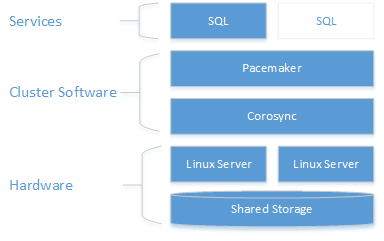

# Failover Cluster Instances - SQL Server on Linux

[!INCLUDE [SQL Server - Linux](../includes/applies-to-version/sql-linux.md)]

This article explains the concepts related to SQL Server failover cluster instances (FCI) on Linux. 

To create a SQL Server FCI on Linux, see [Configure SQL Server FCI on Linux](sql-server-linux-shared-disk-cluster-configure.md)

## The Clustering Layer

* In RHEL, the clustering layer is based on Red Hat Enterprise Linux (RHEL) [HA add-on](https://access.redhat.com/documentation/en-us/red_hat_enterprise_linux/7/pdf/high_availability_add-on_overview/red_hat_enterprise_linux-7-high_availability_add-on_overview-en-us.pdf). 

    > [!NOTE] 
    > Access to Red Hat HA add-on and documentation requires a subscription. 

* In SLES, the clustering layer is based on SUSE Linux Enterprise [High Availability Extension (HAE)](https://www.suse.com/products/highavailability).

    For more information on cluster configuration, resource agent options, management, best practices, and recommendations, see [SUSE Linux Enterprise High Availability Extension 12 SP2](https://www.suse.com/documentation/sle-ha-12/index.html).

Both the RHEL HA add-on and the SUSE HAE are built on [Pacemaker](https://clusterlabs.org/).

As the following diagram shows, storage is presented to two servers. Clustering components - Corosync and Pacemaker - coordinate communications and resource management. One of the servers has the active connection to the storage resources and the SQL Server. When Pacemaker detects a failure the clustering components manage moving the resources to the other node.  

 

> [!NOTE]
> At this point, SQL Server's integration with Pacemaker on Linux is not as coupled as with WSFC on Windows. From within SQL, there is no knowledge about the presence of the cluster, all orchestration is outside in and the service is controlled as a standalone instance by Pacemaker. Also, virtual network name is specific to WSFC, there is no equivalent of the same in Pacemaker. It is expected that @@servername and sys.servers to return the node name, while the cluster dmvs sys.dm_os_cluster_nodes and sys.dm_os_cluster_properties will no records. To use a connection string that points to a string server name and not use the IP, they will have to register in their DNS server the IP used to create the virtual IP resource (as explained in the following sections) with the chosen server name.

## Number of Instances and Nodes

One key difference with SQL Server on Linux is that there can only be one install of SQL Server per Linux server. That installation is called an instance. This means that unlike Windows Server which supports up to 25 FCIs per Windows Server failover cluster (WSFC), a Linux-based FCI will only have a single instance. This one instance is also a default instance; there is no concept of a named instance on Linux. 

A Pacemaker cluster can only have up to 16 nodes when Corosync is involved, so a single FCI can span up to 16 servers. An FCI implemented with Standard Edition of SQL Server supports up to two nodes of a cluster even if the Pacemaker cluster has the maximum 16 nodes.

In a SQL Server FCI, the SQL Server instance is active on either one node or the other.

## IP Address and Name
On a Linux Pacemaker cluster, each SQL Server FCI needs its own unique IP address and name. If the FCI configuration spans multiple subnets, one IP address will be required per subnet. The unique name and IP address(es) are used to access the FCI so that applications and end users do not need to know which underlying server of the Pacemaker cluster.

The name of the FCI in DNS should be the same as the name of the FCI resource that gets created in the Pacemaker cluster.
Both the name and IP address must be registered in DNS.

## Shared Storage
All FCIs, whether they are on Linux or Windows Server, require some form of shared storage. This storage is presented to all servers that can possibly host the FCI, but only a single server can use the storage for the FCI at any given time. The options available for shared storage under Linux are:

- iSCSI
- Network File System (NFS)
- Server Message Block (SMB)
Under Windows Server, there are slightly different options. One option not currently supported for Linux-based FCIs is the ability to use a disk that is local to the node for TempDB, which is SQL Server's temporary workspace.

In a configuration that spans multiple locations, what is stored at one data center must be synchronized with the other. In the event of a failover, the FCI will be able to come online and the storage is seen to be the same. Achieving this will require some external method for storage replication, whether it is done via the underlying storage hardware or some software-based utility. 

>[!NOTE]
>For SQL Server, Linux-based deployments using disks presented directly to a server such must be formatted with XFS or EXT4. Other file systems are currently not supported. Any changes will be reflected here.

The process for presenting shared storage is the same for the different supported methods:

- Configure the shared storage
- Mount the storage as a folder to the servers that will serve as nodes of the Pacemaker cluster for the FCI
- If required, move the SQL Server system databases to shared storage
- Test that SQL Server works from each server connected to the shared storage

One major difference with SQL Server on Linux is that while you can configure the default user data and log file location, the system databases must always exist at `/var/opt/mssql/data`. On Windows Server, there is the ability to move the system databases including TempDB. This fact plays into how shared storage is configured for an FCI.

The default paths for non-system databases can be changed using the `mssql-conf` utility. For information on how to change the defaults, [Change the default data or log directory location](sql-server-linux-configure-mssql-conf.md#datadir). You can also store SQL Server data and transaction in other locations as long as they have the proper security even if it is not a default location; the location would need to be stated.

The following topics explain how to configure supported storage types for a Linux based SQL Server FCI:

- [Configure failover cluster instance - iSCSI - SQL Server on Linux](sql-server-linux-shared-disk-cluster-configure-iscsi.md)
- [Configure failover cluster instance - NFS - SQL Server on Linux](sql-server-linux-shared-disk-cluster-configure-nfs.md)
- [Configure failover cluster instance - SMB - SQL Server on Linux](sql-server-linux-shared-disk-cluster-configure-smb.md)
