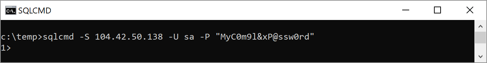
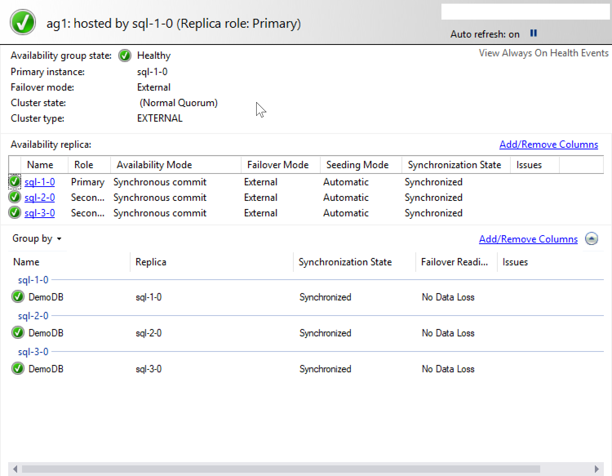

# Configure a SQL Server Always On availability group on Docker containers in Kubernetes with Azure Kubernetes Service (AKS)

This tutorial demonstrates how to configure a highly available SQL Server instance in a container on AKS. You can also [deploy a SQL Server container in Kubernetes](tutorial-sql-server-containers-kubernetes.md). To compare the two different Kubernetes solutions, see [High availability for SQL Server containers](sql-server-linux-container-ha-overview.md).

In this tutorial, you learn how to:  

> [!div class="checklist"]
> * Create storage
> * Deploy the SQL Server operator to a Kubernetes cluster 
> * Create Kubernetes secrets
> * Deploy SQL Server instances and health agents
> * Connect to the primary replica
> * Add a database to the availability group

This tutorial demonstrates the architecture in [Azure Kubernetes Service (AKS)](http://docs.microsoft.com/azure/aks/). If you don’t have an Azure subscription, create a [free account](https://azure.microsoft.com/free/?WT.mc_id=A261C142F) before you begin.

This diagram represents the solution that you make in this tutorial:


### Deployment methodology for Kubernetes

Several of the steps in this article create a manifest and then deploy the manifest to the cluster. The manifest is a .yaml file with the description of the Kubernetes objects that you deploy.

The .yaml files in this example are available at [sql-server-samples](https://github.com/Microsoft/sql-server-samples/tree/master/samples/features/high%20availability).

The objects include storage, operators, pods, containers, and services.

## Prerequisites

* General familiarity with these technologies

  * [Kubernetes](http://kubernetes.io) version 1.8
  * [Azure Kubernetes Service (AKS)](http://docs.microsoft.com/azure/aks/)
  * [SQL Server on Docker](quickstart-install-connect-docker.md)
  * [SQL Server Always On availability group](../database-engine/availability-groups/windows/overview-of-always-on-availability-groups-sql-server.md)

* A Kubernetes cluster with four nodes.

  For instructions, refer to [Tutorial: Deploy an Azure Kubernetes Service (AKS) cluster](http://docs.microsoft.com/azure/aks/tutorial-kubernetes-deploy-cluster).

* Install [`kubectl`](https://docs.microsoft.com/en-us/azure/aks/tutorial-kubernetes-deploy-cluster#install-the-kubectl-cli).

## Configuration and deployment procedures

The tutorial will show how to apply the .yaml files to your Kubernetes cluster.

## Create the secrets

To create Kubernetes secrets to store the passwords for the SQL Server SA account and the SQL Server master key, run the following command.

```azurecli
kubectl create secret generic sql-secrets --from-literal=sapassword="MyC0m9l&xP@ssw0rd" --from-literal=masterkeypassword="MyC0m9l&xP@ssw0rd2"
```

In a production environment use a different, complex password.

## Deploy the operator

A Kubernetes operator deploys instances of SQL Server and configures the availability group in the Kubernetes cluster. 

See an example operator at [`operator.yaml`](https://github.com/Microsoft/sql-server-samples/blob/master/samples/features/high%20availability/Kubernetes/sample-manifest-files/operator.yaml)

Download `operator.yaml` from [sql-server-samples](https://github.com/Microsoft/sql-server-samples/blob/master/samples/features/high%20availability/Kubernetes/sample-manifest-files/)

Deploy the operator as one replica Kubernetes deployment.

To deploy the operator:

Deploy the operator with the `kubectl apply` command.

```azurecli
kubectl apply -f operator.yaml
```

## Create the SQL Server AG Deployment

The next step creates the SQL Server instances and the availability group in one Kubernetes deployment. After you apply this deployment to the cluster, the operator will deploy the SQL Server instances as Docker containers. This deployment will result in three StatefulSets with one pod each. Every pod will include two containers:

* SQL Server instance based on the `mssql-server` image
* HA supervisor

In addition, the deployment describes a load balancer service for the availability group listener

To deploy mssql-server:

1. Copy [sqlserver.yaml](https://github.com/Microsoft/sql-server-samples/tree/master/samples/features/high%20availability/Kubernetes/sample-manifest-files/sqlserver.yaml) to your computer.
2. Update `sqlserver.yaml` for your environment.


To deploy the SQL Server instances and create the availability group, run the following command.

```azurecli
kubectl apply -f sqlserver.yaml
```

## Deploy AG services

In the Kubernetes cluster create load balancer services to direct calls to replicas in the availability group.

[ag-services.yaml](https://github.com/Microsoft/sql-server-samples/tree/master/samples/features/high%20availability/Kubernetes/sample-manifest-files) creates four services.

* ag1-primary connects to the primary replica.
* ag1-secondary-sync connects to a synchronous secondary replica.
* ag1-secondary-async connects to an asynchronous secondary replica.
* ag1-secondary-config connects to a configuration only replica. 

  >[!NOTE]
  >These load balancer services are provided as examples. In this tutorial there is not configuration-only replica.


Deploy the load balancer services so that you can connect to the availability group.

To deploy the services, run the following command.

```azurecli
kubectl apply -f ag-services.yaml
```

### Monitor the deployment

You can use [Kubernetes dashboard with Azure Kubernetes Service (AKS)](https://docs.microsoft.com/en-us/azure/aks/kubernetes-dashboard) to monitor the deployment. 

Use `az aks browse` to launch the dashboard. 

After deployment, only AG membership list and post-init T-SQL script can be updated. Other properties cannot be updated - the resource must be deleted and recreated. Credentials for the auto-generated users can be rotated using a `mssql-server-k8s-rotate-creds` job.

## Connect to the SQL Server instance hosting the primary replica

The `ag-services.yaml` describes a Kubernetes service name `ag1-primary`. `ag1-primary` creates an Azure load balancer that point the SQL Server instance hosting the primary replica. Use the external IP address of the service as target server, `sa` as account, and the password you created earlier in the `mssql secret` for the password.

Use `kubectl get services` to get this IP address.

For example:


In the image above, `ag1-primary` service has an external IP address of `104.42-50.138`. 

To connect to SQL Server with SQL authentication, use the `sa` account, the value for `sapassword` from the secret you created, and this IP address.

For example:

```cmd
sqlcmd -S 104.42.50.138 -U sa -P "MyC0m9l&xP@ssw0rd"
```



You can also connect with [SQL Server Management Studio](../ssms/download-sql-server-management-studio-ssms.md).

To verify your connection, to the SQL Server instance hosting the primary replica run the following query:

```sql
SELECT @@SERVERNAME;
```

The query returns the name of the SQL Server instance that hosts the primary replica.

At this point, the Kubernetes cluster has three instances of SQL Server in docker containers. An availability group spans all three instances of SQL Server, but no database is in the availability group. The next step is to add a database to the availability group.

## Add a database to the availability group

To add a database to the availability group:

1. Create a database

  ```sql
  CREATE DATABASE [DemoDB]
  ```

1. Take a full backup of the database to start the transaction log chain

  ```sql
  BACKUP DATABASE [DemoDB] 
  TO  DISK = N'/var/opt/mssql/data/DemoDB.bak' 
    WITH NOFORMAT, 
    NOINIT,  
    NAME = N'DemoDB-Full Database Backup', 
    SKIP, 
    NOREWIND, 
    NOUNLOAD,  
    STATS = 10;
  GO
  ```

1. Add the database to the availability group

  ```sql
  ALTER AVAILABILITY GROUP ag1 ADD DATABASE [DemoDB]; 
  ```

The replica is automatically configured with automatic seeding mode so the availability group seeds the database onto the secondary replicas.

In SQL Server Management Studios, you can connect to the primary replica and see the availability group in the dashboard.

The following sample shows the availability group with replicas on three nodes configured in the dashboard.



## Verify failure and recovery

To verify failure detection and failover you can delete the pod hosting the primary replica. Kubernetes will elect a new primary replica and redirect the listener. Then it will recreate the deleted pod. 

To demonstrate this process, do the following steps:

1. List the pod running SQL Server.

   ```azurecli
   kubectl get pods
   ```

2. Identify the pod running the primary replica.

   Either connect to the primary replica using the external IP and query `@@servername` or use `kubectl` to get the appropriate pod. This command will return the name of the pod that includes the container running the primary replica of the AG:

   ```azurecli
   kubectl get pods --selector="role.ag.mssql.microsoft.com/ag1"="primary" --output=jsonpath={.items..metadata.name}
   ```

3. Delete the pod.

   ```azurecli
   kubectl delete pod <podName>
   ```

Replace `<podName>` with the value returned from the previous step for pod name. 

Kubernetes automatically fails over to one of the available sync secondary replicas as well as recreates the deleted pod.

## Clean up resources

When no longer needed, delete the resource group and all related resources. Run the following command:
>[!WARNING]
>This command completely deletes everything in the resource group. None of the components of the Kubernetes cluster will be available after you delete the resource group.

```azurecli
az group delete --name <MyResourceGroup>
```

To run the command above, replace `<MyResourceGroup>` with the name of your resource group. 

Azure deletes the resource group.

## Summary

In this tutorial, you learned how to:  

> [!div class="checklist"]
> * Create storage
> * Deploy the SQL Server operator to a Kubernetes cluster 
> * Create Kubernetes secrets
> * Deploy SQL Server instances and health agents
> * Connect to the primary replica
> * Add a database to the availability group

## Next steps

> [!div class="nextstepaction"]
>[Introduction to Kubernetes](http://docs.microsoft.com/azure/aks/intro-kubernetes)
>[Manage SQL Server on Kubernetes](sql-server-linux-kubernetes-manage.md)
