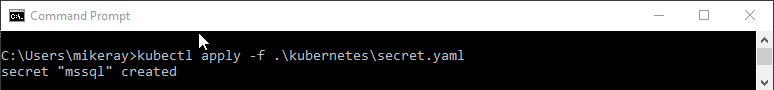

# Configure SQL Server container in Kubernetes for high availability

[!INCLUDE[tsql-appliesto-sslinux-only](../includes/tsql-appliesto-sslinux-only.md)]

Follow this article to configure a SQL Server instance on Kubernetes in Azure Container Service (AKS) with persistent storage for high availability. 

This tutorial demonstrates how to configure a highly available SQL Server instance in containers using AKS. 

> [!div class="checklist"]
> * Create storage
> * Create SA password
> * Create deployment
> * Connect with SQL Server Management Studios (SSMS)
> * Verify failure and recovery

### HA solution using Kubernetes running in Azure Container Service

Kubernetes 1.6+ has support for Storage Classes, Persistent Volume Claims, and the Azure disk volume driver. You can create and manage your SQL Server instances natively in Kubernetes. This article includes Kubernetes specs on how to deploy SQL Server on Kubernetes cluster running on Azure Container Service and how to use a deployment to achieve a high availability configuration similar to shared disk failover cluster instance. In this configuration, Kubernetes plays the role of the cluster orchestrator. Upon a failure of SQL Server instance running in a container, the orchestrator bootstraps another instance of the container that attaches to the same persistent storage, which maps to Azure disk.


## Prerequisites

* An Azure Container Service (AKS) cluster. 

   This tutorial creates a SQL Server container deployment in a Kubernetes cluster configured like the cluster in [Deploy an Azure Container Service (AKS) cluster](http://docs.microsoft.com/azure/aks/kubernetes-walkthrough). 

* A connection to the Kubernetes cluster. this tutorial uses [kubectl](https://kubernetes.io/docs/user-guide/kubectl/), the Kubernetes command-line interface. 

## Create storage

Configure a persistent volume, and persistent volume claim in the Kubernetes cluster. For background on Kubernetes storage, see [Persistent Volumes](http://kubernetes.io/docs/concepts/storage/persistent-volumes/).  Complete the following steps: 

1. Create a manifest to define the storage class and the persistent volume claim.  The manifest specifies the storage provisioner, parameters, and the reclaim policy. The Kubernetes cluster uses this manifest to create the persistent storage. 

   The following yaml example defines a storage class and persistent volume claim. The storage class is named `azure-disk` and the persistent volume claim is named `mssql-data`. The persistent volume claim metadata includes an annotation connecting it back to the storage class. 

   ```yaml
   kind: StorageClass
   apiVersion: storage.k8s.io/v1beta1
   metadata:
        name: azure-disk
   provisioner: kubernetes.io/azure-disk
   parameters:
     storageaccounttype: Standard_LRS
     kind: Managed
   ---
   kind: PersistentVolumeClaim
   apiVersion: v1
   metadata:
     name: mssql-data
     annotations:
       volume.beta.kubernetes.io/storage-class: azure-disk
   spec:
     accessModes:
     - ReadWriteOnce
     resources:
       requests:
         storage: 8Gi
   ```

   Save the file, for example **pvc.yaml**.

1. Create the persistent volume claim in Kubernetes.

   ```azurecli
   kubectl apply -f <Path to pvc.yaml file>
   ```

   * `<Path to pvc.yaml file>`
      * The location where you saved the file.

   The persistent volume is automatically created as an Azure storage account, and bound to the persistent volume claim. 

1. Verify the persistent volume claim.

   ```azurecli
   kubectl describe pvc <PersistentVolumeClaim>
   ```

   * `<PersistentVolumeClaim>`
      * The name of the persistent volume claim.

    

    In the preceding step, the persistent volume claim is named `mssql-data`. To see the metadata about the persistent volume claim, run the following command:

    ```azurecli
    kubectl describe pvc mssql-data
    ```

    The returned metadata includes a value called `Volume`. This value maps to the name of the blob.

    

    The value for volume, matches part of the name of the blob in the following image from Azure portal: 

    

1. Verify the persistent volume.

   ```azurecli
   kubectl describe pv
   ```

   `kubectl` returns metadata about the persistent volume that was automatically created and bound to the persistent volume claim. 

## Create SA password

Kubernetes can manage sensitive configuration information like passwords as secrets. Create a secret to store the SA password for SQL Server. 

1. Create manifest for the secret. The following yaml file for the secret that includes the SA password.  

   ```yaml
   apiVersion: v1
   kind: Secret
   metadata:
     name: mssql
   type: Opaque
   data:
     SA_PASSWORD: TXlDMG05bCZ4UEBzc3cwcmQ= 
   ```

   * `TXlDMG05bCZ4UEBzc3cwcmQ=`
      * In the manifest, the password for the SA account is encoded as base64. To set your password in the manifest, convert the password to base64. You can use a base64 encoder in a bash shell. For example, if your complex password is `MyC0m9l&xP@ssw0rd`, pass that string through a base64 encoder. The following script shows how to encode the password as base64 in bash. Use the `-n` parameter to prevent a newline character. 
      
      ```bash
      echo -n "MyC0m9l&xP@ssw0rd" | base64
      ```

      The result of the preceding script is the base64 encoded value for the string. Use this value in the manifest. 

   Save the file as `secret.yaml`.

1.  Create the secret in the Kubernetes cluster.

   ```azurecli
   kubectl apply -f <Path to secret.yaml file>
   ```

   

For more information about secret management in Kubernetes, see [Secrets](http://kubernetes.io/docs/concepts/configuration/secret/).

## Create the SQL Server container deployment

In this example, the SQL Server container is described as a [Kubernetes deployment object](https://kubernetes.io/docs/concepts/workloads/controllers/deployment/). In this step, create a manifest to describe the container based on the Microsoft SQL Server mssql-server-linux image. The manifest references the `mssql-server` persistent volume claim, and the `mssql` secret which you already applied to the Kubernetes cluster. 

1. Create a manifest - a yaml file - to describe the deployment. The following example describes a deployment including a container based on the SQL Server container image.

   ```yaml
   apiVersion: apps/v1beta1
   kind: Deployment
   metadata:
     name: mssql-deployment
   spec:
     replicas: 1
     template:
       metadata:
         labels:
           app: mssql
       spec:
         terminationGracePeriodSeconds: 10
         containers:
         - name: mssql
           image: microsoft/mssql-server-linux
           ports:
           - containerPort: 1433
           env:
           - name: ACCEPT_EULA
             value: "Y"
           - name: SA_PASSWORD
             valueFrom:
               secretKeyRef:
                 name: mssql
                 key: SA_PASSWORD 
           volumeMounts:
           - name: mssqldb
             mountPath: /var/opt/mssql
         volumes:
         - name: mssqldb
           persistentVolumeClaim:
             claimName: mssql-data
   ---
   apiVersion: v1
   kind: Service
   metadata:
     name: mssql-deployment
   spec:
     selector:
       app: mssql
     ports:
       - protocol: TCP
         port: 1433
         targetPort: 1433
     type: LoadBalancer
   ```

   Copy the preceding code into a new file, named `sqldeployment.yaml`. Update the following values: 

   * `value: "Developer"`
     * Sets the container to run SQL Server Developer edition. Developer edition is not licensed for production data. If the deployment is for production use, set the appropriate edition. Can be one of `Enterprise`, `Standard`, or `Express`. 

     >[!NOTE]
     >For more information, see [How to license SQL Server](http://www.microsoft.com/sql-server/sql-server-2017-pricing).

   * `persistentVolumeClaim`
     * This value requires an entry for `claimName:` that maps to the name used for the persistent volume claim. This article uses `mssql-data`. 

   * `name: SA_PASSWORD`
      * Configures the container image to set SA password as defined in this section.

      ```
                 valueFrom:
                  secretKeyRef:
                    name: mssql
                    key: SA_PASSWORD 
      ```

       When Kubernetes deploys the container, it will refer to the secret named `mssql` to get the value for the password. 

   >[!NOTE]
   >By using the `LoadBalancer` service type, the SQL Server container is accessible remotely (via the internet) at port 1433.

    Save the file, for example **sqldeployment.yaml**.

1. Create the deployment.

   ```azurecli
   kubectl apply -f <Path to sqldeployment.yaml file>
   ```

   * `<Path to sqldeployment.yaml file>`
      * The location where you saved the file.

   

   The deployment is created, with SQL Server running as a pod in the kubernetes cluster with connection to persistent storage.

   To view the status of the pod, type `kubectl get pod`.

   

   Learn more about [Kubernetes Deployments](https://kubernetes.io/docs/concepts/workloads/controllers/deployment/).

1. Verify the services are running. Run the following command:

   ```azurecli
   kubectl get services 
   ```

   

   Note the IP address for the SQL Server container. Use this IP address to connect to SQL Server. 

   For additional information about the status of the objects in the Kubernetes cluster, run:

   `az aks browse --resource-group <MyResourceGroup> --name <MyKubernetesClustername>` 

## Connect with SSMS

If you configured the container as described, you can connect with SSMS from outside of the Azure virtual network. To access via SSMS, use the external IP Address. If needed, supply the port of the instance. For example, `1433`. 

Use the password that you configured as a Kubernetes secret. Do not use the base64 encoded value. 

## Verify failure and recovery

To verify failure and recovery you can delete the pod. Do the following steps:

1. List the pod running SQL Server.

   ```azurecli
   kubectl get pods
   ```

   Note the name of the pod running SQL Server.

1. Delete the pod.

   ```azurecli
   kubectl delete pod mssql-deployment-0
   ```
   `mssql-deployment-0` is the value returned from the previous step for pod name. 

Kubernetes automatically recreates the pod to recover a SQL Server container and connect to the persistent storage.

In this tutorial, you learned how to 
> [!div class="checklist"]
> * Create storage
> * Create SA password
> * Create deployment
> * Connect with SQL Server Management Studios (SSMS)
> * Verify failure and recovery

## Next steps

> [!div class="nextstepaction"]
>[Intro - Kubernetes](http://docs.microsoft.com/en-us/azure/aks/intro-kubernetes)
