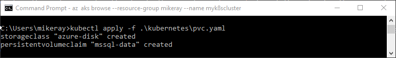
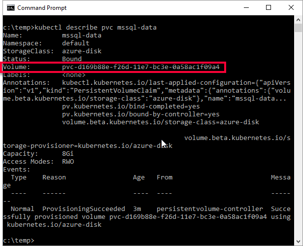
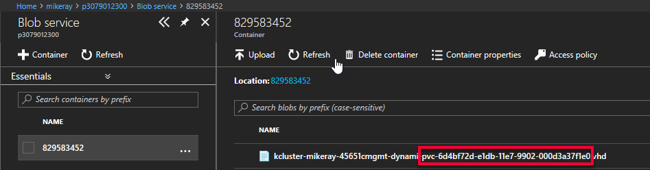
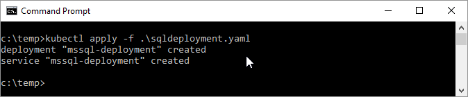
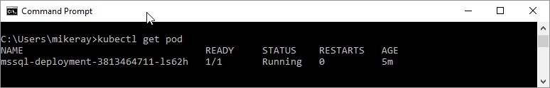
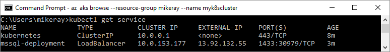

# Configure SQL Server container in Kubernetes for high availability

[!INCLUDE[tsql-appliesto-sslinux-only](../includes/tsql-appliesto-sslinux-only.md)]

Follow this article to configure a SQL Server instance on Kubernetes in Azure Container Service (AKS) with persistent storage for high availability. The solution provides resiliency. If the SQL Server instance fails, Kubernetes automatically recreates it in a new pod. AKS provides resiliency against a Kubernetes node failure. 

This tutorial demonstrates how to configure a highly available SQL Server instance in containers using AKS. 

> [!div class="checklist"]
> * Create SA password
> * Create storage
> * Create deployment
> * Connect with SQL Server Management Studios (SSMS)
> * Verify failure and recovery

### HA solution using Kubernetes running in Azure Container Service

Kubernetes 1.6+ has support for [Storage Classes](http://kubernetes.io/docs/concepts/storage/storage-classes/), [Persistent Volume Claims](http://kubernetes.io/docs/concepts/storage/storage-classes/#persistentvolumeclaims), and the [Azure disk volume driver](http://github.com/Azure/azurefile-dockervolumedriver). You can create and manage your SQL Server instances natively in Kubernetes. The example in this article shows how to create a [deployment](https://kubernetes.io/docs/concepts/workloads/controllers/deployment/) to achieve a high availability configuration similar to shared disk failover cluster instance. In this configuration, Kubernetes plays the role of the cluster orchestrator. When a SQL Server instance in a container fails, the orchestrator bootstraps another instance of the container that attaches to the same persistent storage.


In the preceding diagram, `mssql-server` is a container in a [pod](http://kubernetes.io/docs/concepts/workloads/pods/pod/). A [replica set](http://kubernetes.io/docs/concepts/workloads/controllers/replicaset/) ensures that the pod is automatically recovered after a node failure. Applications connect to the service. In this case, the service represents a load balancer that hosts an IP address that will stay the same after failure of the `mssql-server`.

In the following diagram, the `mssql-server` container has failed. The replica set recreates the pod on a different node, and `mssql-server` reconnects to the same persistent storage. The service connects to the recreated `mssql-server`.


In the following diagram, the node hosting the `mssql-server` container has failed. The replica set recreates the pod on a different node, and `mssql-server` reconnects to the same persistent storage. The service connects to the recreated `mssql-server`.


>[!NOTE]
>To protect against node failure, a Kubernetes cluster requires more than one node.

## Prerequisites

The tutorial requires a Kubernetes cluster. The steps use [kubectl](https://kubernetes.io/docs/user-guide/kubectl/), to manage the cluster. 

You can follow the instructions at [Deploy an Azure Container Service (AKS) cluster](http://docs.microsoft.com/en-us/azure/aks/tutorial-kubernetes-deploy-cluster) to create connect to a Kubernetes cluster in AKS with `kubectl`. 

## Create SA password

Create an SA password in the Kubernetes cluster. Kubernetes can manage sensitive configuration information like passwords as [secrets](http://kubernetes.io/docs/concepts/configuration/secret/).

The following command creates a password for the SA account:

   ```azurecli
   kubectl create secret generic mssql --from-literal=SA_PASSWORD="MyC0m9l&xP@ssw0rd"
   ```  

   The preceding command creates a secret in Kubernetes named `mssql` that holds the value `MyC0m9l&xP@ssw0rd` for the `SA_PASSWORD`.

   Replace `MyC0m9l&xP@ssw0rd` with a complex password.

## Create storage

Configure a [persistent volume](http://kubernetes.io/docs/concepts/storage/persistent-volumes/), and [persistent volume claim](http://kubernetes.io/docs/concepts/storage/persistent-volumes/#persistent-volume-claim-protection) in the Kubernetes cluster. Complete the following steps: 

1. Create a manifest to define the storage class and the persistent volume claim.  The manifest specifies the storage provisioner, parameters, and the [reclaim policy](http://kubernetes.io/docs/concepts/storage/persistent-volumes/#reclaiming). The Kubernetes cluster uses this manifest to create the persistent storage. 

   The following yaml example defines a storage class and persistent volume claim. The storage class provisioner is `azure-disk` because this Kubernetes cluster is in Azure. The storage account type is `Standard_LRS`. The persistent volume claim is named `mssql-data`. The persistent volume claim metadata includes an annotation connecting it back to the storage class. 

   ```yaml
   kind: StorageClass
   apiVersion: storage.k8s.io/v1beta1
   metadata:
        name: azure-disk
   provisioner: kubernetes.io/azure-disk
   parameters:
     storageaccounttype: Standard_LRS
     kind: Managed
   ---
   kind: PersistentVolumeClaim
   apiVersion: v1
   metadata:
     name: mssql-data
     annotations:
       volume.beta.kubernetes.io/storage-class: azure-disk
   spec:
     accessModes:
     - ReadWriteOnce
     resources:
       requests:
         storage: 8Gi
   ```

   Save the file, for example **pvc.yaml**.

1. Create the persistent volume claim in Kubernetes.

   ```azurecli
   kubectl apply -f <Path to pvc.yaml file>
   ```

   * `<Path to pvc.yaml file>`
      * The location where you saved the file.

   The persistent volume is automatically created as an Azure storage account, and bound to the persistent volume claim. 

    

1. Verify the persistent volume claim.

   ```azurecli
   kubectl describe pvc <PersistentVolumeClaim>
   ```

   * `<PersistentVolumeClaim>`
      * The name of the persistent volume claim.

    In the preceding step, the persistent volume claim is named `mssql-data`. To see the metadata about the persistent volume claim, run the following command:

    ```azurecli
    kubectl describe pvc mssql-data
    ```

    The returned metadata includes a value called `Volume`. This value maps to the name of the blob.

    

    The value for volume, matches part of the name of the blob in the following image from Azure portal: 

    

1. Verify the persistent volume.

   ```azurecli
   kubectl describe pv
   ```

   `kubectl` returns metadata about the persistent volume that was automatically created and bound to the persistent volume claim. 

## Create the deployment

In this example, the container hosts the SQL Server instance is described as a Kubernetes deployment object. The deployment creates a replica set. The replica set creates the pod. In this step, create a manifest to describe the container based on the Microsoft SQL Server [mssql-server-linux](https://hub.docker.com/r/microsoft/mssql-server-linux/) Docker image. The manifest references the `mssql-server` persistent volume claim, and the `mssql` secret which you already applied to the Kubernetes cluster. The manifest also describes a [service](http://kubernetes.io/docs/concepts/services-networking/service/). This service is a load balancer. The load balancer guarantees that the IP address persists after SQL Server instance is recovered. 

1. Create a manifest - a yaml file - to describe the deployment. The following example describes a deployment including a container based on the SQL Server container image.

   ```yaml
   apiVersion: apps/v1beta1
   kind: Deployment
   metadata:
     name: mssql-deployment
   spec:
     replicas: 1
     template:
       metadata:
         labels:
           app: mssql
       spec:
         terminationGracePeriodSeconds: 10
         containers:
         - name: mssql
           image: microsoft/mssql-server-linux
           ports:
           - containerPort: 1433
           env:
           - name: ACCEPT_EULA
             value: "Y"
           - name: SA_PASSWORD
             valueFrom:
               secretKeyRef:
                 name: mssql
                 key: SA_PASSWORD 
           volumeMounts:
           - name: mssqldb
             mountPath: /var/opt/mssql
         volumes:
         - name: mssqldb
           persistentVolumeClaim:
             claimName: mssql-data
   ---
   apiVersion: v1
   kind: Service
   metadata:
     name: mssql-deployment
   spec:
     selector:
       app: mssql
     ports:
       - protocol: TCP
         port: 1433
         targetPort: 1433
     type: LoadBalancer
   ```

   Copy the preceding code into a new file, named `sqldeployment.yaml`. Update the following values: 

   * `value: "Developer"`
     * Sets the container to run SQL Server Developer edition. Developer edition is not licensed for production data. If the deployment is for production use, set the appropriate edition. Can be one of `Enterprise`, `Standard`, or `Express`. 

      >[!NOTE]
      >For more information, see [How to license SQL Server](http://www.microsoft.com/sql-server/sql-server-2017-pricing).

   * `persistentVolumeClaim`
     * This value requires an entry for `claimName:` that maps to the name used for the persistent volume claim. This article uses `mssql-data`. 

   * `name: SA_PASSWORD`
      * Configures the container image to set SA password as defined in this section.

      ```yaml
      valueFrom:
        secretKeyRef:
          name: mssql
          key: SA_PASSWORD 
      ```

       When Kubernetes deploys the container, it refers to the secret named `mssql` to get the value for the password. 

   >[!NOTE]
   >By using the `LoadBalancer` service type, the SQL Server instance is accessible remotely (via the internet) at port 1433.

    Save the file, for example **sqldeployment.yaml**.

1. Create the deployment.

   ```azurecli
   kubectl apply -f <Path to sqldeployment.yaml file>
   ```

   * `<Path to sqldeployment.yaml file>`
      * The location where you saved the file.

   

   The deployment and service are created. The SQL Server instance is in a container - connected to persistent storage.

   To view the status of the pod, type `kubectl get pod`.

   

   >[!NOTE]
   >After the deployment is created, it may take a few minutes before the pod is visible. The delay is because the cluster needs to pull the [mssql-server-linux](https://hub.docker.com/r/microsoft/mssql-server-linux/) image from the Docker hub. After it is pulled the first time, subsequent deployments may be faster - if the deployment is to a node that already has the image cached on it. 

1. Verify the services are running. Run the following command:

   ```azurecli
   kubectl get services 
   ```

   This command returns services that are running, as well as the internal, and external IP addresses for the services. Note the external IP address for the `mssql-deployment` service.  Use this IP address to connect to SQL Server. 

   

   For additional information about the status of the objects in the Kubernetes cluster, run:

   ```azurecli
   az aks browse --resource-group <MyResourceGroup> --name <MyKubernetesClustername>
   ```  

## Connect to the SQL Server instance

If you configured the container as described, you can connect with an application from outside of the Azure virtual network. Use the `sa` account and the external IP address for the service. Use the password that you configured as the Kubernetes secret. 

You can use the following applications to connect to the SQL Server instance. 

* [SSMS](http://docs.microsoft.com/sql/linux/sql-server-linux-develop-use-ssms)

* [SSDT](http://docs.microsoft.com/en-us/sql/linux/sql-server-linux-develop-use-ssdt)

* sqlcmd
   To connect with `sqlcmd`, run the following command:

   ```cmd
   sqlcmd -S <External IP Address> -U sa -P "MyC0m9l&xP@ssw0rd"
   ```

   Replace the following values:
      - `<External IP Address>` with the IP address for the `mssql-deployment` service 
      - `MyC0m9l&xP@ssw0rd` with your password

## Verify failure and recovery

To verify failure and recovery you can delete the pod. Do the following steps:

1. List the pod running SQL Server.

   ```azurecli
   kubectl get pods
   ```

   Note the name of the pod running SQL Server.

1. Delete the pod.

   ```azurecli
   kubectl delete pod mssql-deployment-0
   ```
   `mssql-deployment-0` is the value returned from the previous step for pod name. 

## Summary

Kubernetes automatically recreates the pod to recover a SQL Server instance and connect to the persistent storage. Use `kubectl get pods` to verify that a new pod is deployed. Use `kubectl get services` to verify that the IP address for the new container is the same. 

> [!div class="checklist"]
> * Create SA password
> * Create storage
> * Create deployment
> * Connect with SQL Server Management Studios (SSMS)
> * Verify failure and recovery

## Next steps

> [!div class="nextstepaction"]
>[Intro - Kubernetes](http://docs.microsoft.com/en-us/azure/aks/intro-kubernetes)
