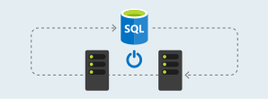
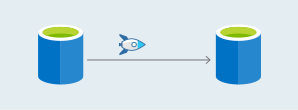
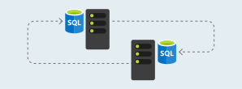

    

        <ul class="cardsY panelContent featuredContent">
            <li>
                <a href="https://www.microsoft.com/evalcenter/evaluate-sql-server-2019-ctp">
                    

                        

                            

                                

                                    

                                        
                                    

                                

                                

                                    Try SQL Server 2019 (preview)
                                

                            

                        

                    

                </a>
            </li>
            <li>
                <a href="https://azure.microsoft.com/services/virtual-machines/sql-server/?wt.mc_id=sqL16_vm">
                    

                        

                            

                                

                                    

                                        
                                    

                                

                                

                                    Get a Virtual Machine with SQL Server
                                

                            

                        

                    

                </a>
            </li>
            <li>
                <a href="/sql/ssms/download-sql-server-management-studio-ssms">
                    

                        

                            

                                

                                    

                                        
                                    

                                

                                

                                    Download SQL Server Management Studio
                                

                            

                        

                    

                </a>
            </li>              
        </ul>
    

    

        <h1>Business continuity</h1>
        <ul class="pivots tabLess">
            <li class="pivotItem" style="display: list-item;" data-id="#products">
                
                <ul id="products">
                    <li class="panelItem" data-index="0">
                        
                        <ul class="cardsD panelContent singlePanelContent" id="products1" style="margin-top: 0px; display: flex;">
                            <li>
                                <a href="/sql/database-engine/availability-groups/windows/overview-of-always-on-availability-groups-sql-server/">
                                    

                                        

                                            

                                                

                                                    

                                                        
                                                    

                                                

                                                

                                                    <h3>Always On Availability Groups</h3>
                                                    
Database level high availability, where independent instances host databases that are replicas of each other, hosted on failover clusters, and allow for the offload of read-only queries to secondary replicas

                                                

                                            

                                        

                                    

                                </a>
                            </li>
                            <li>
                                <a href="/sql/sql-server/failover-clusters/windows/always-on-failover-cluster-instances-sql-server/">
                                    

                                        

                                            

                                                

                                                    

                                                        
                                                    

                                                

                                                

                                                    <h3>Always On Failover Cluster Instances</h3>
                                                    
Instance level high availability, where a single instance lives between two or more Windows Failover Clusters

                                                

                                            

                                        

                                    

                                </a>
                            </li>
                            <li>
                                <a href="/sql/database-engine/database-mirroring/database-mirroring-sql-server">
                                    

                                        

                                            

                                                

                                                    

                                                        
                                                    

                                                

                                                

                                                    <h3>Database mirroring</h3>
                                                    
Database level high availability that allows for failover, does not require failover cluster, can offload reporting with the use of database snapshots

                                                

                                            

                                        

                                    

                                </a>
                            </li>
                            <li>
                                <a href="/sql/database-engine/log-shipping/">
                                    

                                        

                                            

                                                

                                                    

                                                        
                                                    

                                                

                                                

                                                    <h3>Log shipping</h3>
                                                    
A feature that automatically sends transaction log backups to a secondary standby server. 

                                                

                                            

                                        

                                    

                                </a>
                            </li>
                            <li>
                                <a href="/sql/relational-databases/backup-restore/back-up-and-restore-of-sql-server-databases/">
                                    

                                        

                                            

                                                

                                                    

                                                        
                                                    

                                                

                                                

                                                    <h3>Backup and restore</h3>
                                                    
A component that provides an essential safeguard for protecting critical data stored within SQL Server.

                                                

                                            

                                        

                                    

                                </a>
                            </li>
                            <li>
                                <a href="/sql/relational-databases/logs/the-transaction-log-sql-server/">
                                    

                                        

                                            

                                                

                                                    

                                                        
                                                    

                                                

                                                

                                                    <h3>Transaction log management</h3>
                                                    
A concept that helps facilitate the recovery of data in the event of a disaster.

                                                

                                            

                                        

                                    

                                </a>
                            </li>
                        </ul>
                    </li>
                </ul>
            </li>
        </ul>
    

        <h2>Keep in touch with us</h2>
        <ul class="links">
           <li>
                <a href="https://aka.ms/editsqldocs" data-linktype="external">
                    Contribute
                </a>
            </li>
           <li>
                <a href="https://docs.microsoft.com/sql/sql-server/sql-server-get-help" data-linktype="external">
                    Get help
                </a>
            </li>
           <li>
                <a href="https://aka.ms/sqldocsfeedback" data-linktype="external">
                    Feedback
                </a>
            </li>
           <li>
                <a href="https://aka.ms/sqldocsurvey" data-linktype="external">
                    Survey
                </a>
            </li>
           <li>
                <a href="https://cloudblogs.microsoft.com/sqlserver/" data-linktype="external">
                    Blog
                </a>
            </li>
            <li>
                <a href="https://twitter.com/sqldocs" data-linktype="external">
                    Twitter
                </a>
            </li>
            <li>
                <a href="https://social.msdn.microsoft.com/Forums/en-US/home?forum=sqldatabaseengine&filter=alltypes&sort=lastpostdesc" data-linktype="external">
                    MSDN Forum
                </a>
            </li>
            <li>
                <a href="https://feedback.azure.com/forums/908035-sql-server" data-linktype="external">
                    User Voice
                </a>
            </li>
        </ul>
    
