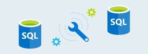
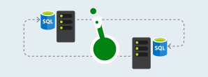

    

        <ul class="cardsY panelContent featuredContent">
            <li>
                <a href="https://www.microsoft.com/sql-server/sql-server-downloads">
                    

                        

                            

                                

                                    

                                        
                                    

                                

                                

                                    Download SQL Server
                                

                            

                        

                    

                </a>
            </li>
            <li>
                <a href="https://azure.microsoft.com/services/virtual-machines/sql-server/?wt.mc_id=sqL16_vm">
                    

                        

                            

                                

                                    

                                        
                                    

                                

                                

                                    Get a Virtual Machine with SQL Server
                                

                            

                        

                    

                </a>
            </li>
            <li>
                <a href="/sql/ssms/download-sql-server-management-studio-ssms">
                    

                        

                            

                                

                                    

                                        
                                    

                                

                                

                                    Download SQL Server Management Studio
                                

                            

                        

                    

                </a>
            </li>              
        </ul>
    

    

        <h1>SQL Server: Install or Upgrade</h1>
        <ul class="pivots tabLess">
            <li class="pivotItem" style="display: list-item;" data-id="#products">
                
                <ul id="products">
                    <li class="panelItem" data-index="0">
                        
                        <ul class="cardsD panelContent singlePanelContent" id="products1" style="margin-top: 0px; display: flex;">
                            <li class="fullSpan">
                                

                                <h2></h2>
                            </li>
                            <li>
                                <a href="/sql/database-engine/install-windows/install-sql-server/">
                                    

                                        

                                            

                                                

                                                    

                                                        
                                                    

                                                

                                                

                                                    <h3>Install SQL Server</h3>
                                                    
An overview of different installation options we have for installing SQL Server.

                                                

                                            

                                        

                                    

                                </a>
                            </li>
                            <li>
                                <a href="/sql/analysis-services/instances/install-windows/install-analysis-services">
                                    

                                        

                                            

                                                

                                                    

                                                        
                                                    

                                                

                                                

                                                    <h3>Install SQL Server Analysis Services (SSAS)</h3>
                                                    
An analytical data engine that provides enterprise-grade semantic data models for business reports and client applications such as Power BI, Excel, Reporting Services, and other data visualization reports. 

                                                

                                            

                                        

                                    

                                </a>
                            </li>
                            <li>
                                <a href="/sql/integration-services/install-windows/install-integration-services/">
                                    

                                        

                                            

                                                

                                                    

                                                        
                                                    

                                                

                                                

                                                    <h3>Install SQL Server Integration Services (SSIS)</h3>
                                                    
 Use Integration Services to solve complex business problems by copying or downloading files, loading data warehouses, cleansing and mining data, and managing SQL Server objects and data. 

                                                

                                            

                                        

                                    

                                </a>
                            </li>
                            <li>
                                <a href="/sql/reporting-services/install-windows/install-reporting-services">
                                    

                                        

                                            

                                                

                                                    

                                                        
                                                    

                                                

                                                

                                                    <h3>Install SQL Server Reporting Services (SSRS)</h3>
                                                    
A solution for creating, publishing, and managing reports, then delivering them to the right users in different ways, whether that's viewing them in web browser, on their mobile device, or as an email in their in-box. 

                                                

                                            

                                        

                                    

                                </a>
                            </li> 
                            <li>
                                <a href="/sql/database-engine/install-windows/upgrade-sql-server/">
                                    

                                        

                                            

                                                

                                                    

                                                        
                                                    

                                                

                                                

                                                    <h3>Upgrade SQL Server</h3>
                                                

                                            

                                        

                                    

                                </a>
                            </li>
                            <li>
                                <a href="/sql/database-engine/install-windows/upgrade-analysis-services">
                                    

                                        

                                            

                                                

                                                    

                                                        
                                                    

                                                

                                                

                                                    <h3>Upgrade SQL Server Analysis Services (SSAS)</h3>
                                                

                                            

                                        

                                    

                                </a>
                            </li>
                            <li>
                                <a href="/sql/integration-services/install-windows/upgrade-integration-services/">
                                    

                                        

                                            

                                                

                                                    

                                                        
                                                    

                                                

                                                

                                                    <h3>Upgrade SQL Server Integration Services (SSIS)</h3>
                                                

                                            

                                        

                                    

                                </a>
                            </li>
                            <li>
                                <a href="/sql/reporting-services/install-windows/upgrade-and-migrate-reporting-services">
                                    

                                        

                                            

                                                

                                                    

                                                        
                                                    

                                                

                                                

                                                    <h3>Upgrade SQL Server Reporting Services (SSRS)</h3>
                                                

                                            

                                        

                                    

                                </a>
                            </li> 
                             <li class="fullSpan">
                                

                                <h2>Migrate to SQL Server</h2> 
                            </li>
                             <li>
                                <a href="/azure/dms/dms-overview/">
                                    

                                        

                                            

                                                

                                                    

                                                        
                                                    

                                                

                                                

                                                    <h3>Azure Database Migration Service</h3>
                                                    
Enables seamless migrations from multiple database sources to Azure Data platforms with minimal downtime.

                                                

                                            

                                        

                                    

                                </a>
                            </li>
                            <li>
                                <a href="/sql/dma/dma-overview/">
                                    

                                        

                                            

                                                

                                                    

                                                        
                                                    

                                                

                                                

                                                    <h3>Database Migration Assistant (DMA)</h3>
                                                    
Detects compatibility issues, recommends improvements for your target environment, and moves your database and data.

                                                

                                            

                                        

                                    

                                </a>
                            </li>
                            <li>
                                <a href="/sql/ssma/sql-server-migration-assistant/">
                                    

                                        

                                            

                                                

                                                    

                                                        
                                                    

                                                

                                                

                                                    <h3>SQL Server Migration Assistant (SSMA)</h3>
                                                    
Automates database migration to SQL Server from Microsoft Access, DB2, MySQL, Oracle, and SAP ASE.

                                                

                                            

                                        

                                    

                                </a>
                            </li>
                            <li>
                                <a href="/sql/dea/database-experimentation-assistant-overview">
                                    

                                        

                                            

                                                

                                                    

                                                        
                                                    

                                                

                                                

                                                    <h3>Database Experimentation Assistant (DEA)</h3>
                                                    
Assists in evaluating a target version of SQL Server for an existing workload.

                                                

                                            

                                        

                                    

                                </a>
                            </li>
                        </ul>
                    </li>
                </ul>
            </li>
        </ul>
    

        <h2>Keep in touch with us</h2>
        <ul class="links">
           <li>
                <a href="https://aka.ms/editsqldocs" data-linktype="external">
                    Contribute
                </a>
            </li>
           <li>
                <a href="https://docs.microsoft.com/sql/sql-server/sql-server-get-help" data-linktype="external">
                    Get help
                </a>
            </li>
           <li>
                <a href="https://aka.ms/sqldocsfeedback" data-linktype="external">
                    Feedback
                </a>
            </li>
           <li>
                <a href="https://aka.ms/sqldocsurvey" data-linktype="external">
                    Survey
                </a>
            </li>
           <li>
                <a href="https://cloudblogs.microsoft.com/sqlserver/" data-linktype="external">
                    Blog
                </a>
            </li>
            <li>
                <a href="https://twitter.com/sqldocs" data-linktype="external">
                    Twitter
                </a>
            </li>
            <li>
                <a href="https://social.msdn.microsoft.com/Forums/en-US/home?forum=sqldatabaseengine&filter=alltypes&sort=lastpostdesc" data-linktype="external">
                    MSDN Forum
                </a>
            </li>
            <li>
                <a href="https://feedback.azure.com/forums/908035-sql-server" data-linktype="external">
                    User Voice
                </a>
            </li>
        </ul>
    

