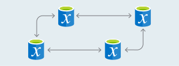

    

        <ul class="cardsY panelContent featuredContent">
            <li>
                <a href="https://www.microsoft.com/evalcenter/evaluate-sql-server-2019-ctp">
                    

                        

                            

                                

                                    

                                        
                                    

                                

                                

                                    Try SQL Server 2019 (preview)
                                

                            

                        

                    

                </a>
            </li>
            <li>
                <a href="https://azure.microsoft.com/services/virtual-machines/sql-server/?wt.mc_id=sqL16_vm">
                    

                        

                            

                                

                                    

                                        
                                    

                                

                                

                                    Get a Virtual Machine with SQL Server
                                

                            

                        

                    

                </a>
            </li>
            <li>
                <a href="/sql/ssms/download-sql-server-management-studio-ssms">
                    

                        

                            

                                

                                    

                                        
                                    

                                

                                

                                    Download SQL Server Management Studio
                                

                            

                        

                    

                </a>
            </li>              
        </ul>
    

    

        <h1>SQL Server: Migrate, Load, and Move Data</h1>
        <ul class="pivots tabLess">
            <li class="pivotItem" style="display: list-item;" data-id="#products">
                
                <ul id="products">
                    <li class="panelItem" data-index="0">
                        
                        <ul class="cardsD panelContent singlePanelContent" id="products1" style="margin-top: 0px; display: flex;">
                            <li class="fullSpan">
                                

                                <h2>Migrate databases to SQL</h2>
                            </li>
                                                         <li>
                                <a href="/azure/dms/dms-overview/">
                                    

                                        

                                            

                                                

                                                    

                                                        
                                                    

                                                

                                                

                                                    <h3>Azure Database Migration Service</h3>
                                                    
Enables seamless migrations from multiple database sources to Azure Data platforms with minimal downtime.

                                                

                                            

                                        

                                    

                                </a>
                            </li>
                            <li>
                                <a href="/sql/dma/dma-overview/">
                                    

                                        

                                            

                                                

                                                    

                                                        
                                                    

                                                

                                                

                                                    <h3>Database Migration Assistant (DMA)</h3>
                                                    
Detects compatibility issues, recommends improvements for your target environment, and moves your database and data.

                                                

                                            

                                        

                                    

                                </a>
                            </li>
                            <li>
                                <a href="/sql/ssma/sql-server-migration-assistant/">
                                    

                                        

                                            

                                                

                                                    

                                                        
                                                    

                                                

                                                

                                                    <h3>SQL Server Migration Assistant (SSMA)</h3>
                                                    
Automates database migration to SQL Server from Microsoft Access, DB2, MySQL, Oracle, and SAP ASE.

                                                

                                            

                                        

                                    

                                </a>
                            </li>
                            <li>
                                <a href="/sql/dea/database-experimentation-assistant-overview">
                                    

                                        

                                            

                                                

                                                    

                                                        
                                                    

                                                

                                                

                                                    <h3>Database Experimentation Assistant (DEA)</h3>
                                                    
Assists in evaluating a target version of SQL Server for an existing workload.

                                                

                                            

                                        

                                    

                                </a>
                            </li>
                            <li class="fullSpan">
                                

                                <h2>Load and Move Data</h2>
                            </li>
                            <li>
                                <a href="/sql/tools/bcp-utility/">
                                    

                                        

                                            

                                                

                                                    

                                                        
                                                    

                                                

                                                

                                                    <h3>BCP</h3>
                                                    
Bulk copy data between a data file, in a format that you specify, and your SQL database.

                                                

                                            

                                        

                                    

                                </a>
                            </li> 
                            <li>
                                <a href="/sql/relational-databases/import-export/import-flat-file-wizard">
                                    

                                        

                                            

                                                

                                                    

                                                        
                                                    

                                                

                                                

                                                    <h3>Import Flat File Wizard</h3>
                                                    
Use the wizard as a simple way to copy data from a flat file (.csv, .txt) into your SQL database. 

                                                

                                            

                                        

                                    

                                </a>
                            </li>
                            <li>
                                <a href="/sql/integration-services/import-export-data/import-and-export-data-with-the-sql-server-import-and-export-wizard">
                                    

                                        

                                            

                                                

                                                    

                                                        
                                                    

                                                

                                                

                                                    <h3>Import and Export Wizard</h3>
                                                    
Use the Wizard as a simple way to copy data from a wide variety of sources into your SQL database. 

                                                

                                            

                                        

                                    

                                </a>
                            </li>
                            <li>
                                <a href="/sql/integration-services/sql-server-integration-services">
                                    

                                        

                                            

                                                

                                                    

                                                        
                                                    

                                                

                                                

                                                    <h3>SQL Server Integration Services (SSIS)</h3>
                                                    
Extract and transform data from a wide variety of sources, such as flat files and relational data sources, and then load the data into your SQL database. 

                                                

                                            

                                        

                                    

                                </a>
                            </li>
                            <li>
                                <a href="/sql/relational-databases/replication/sql-server-replication/">
                                    

                                        

                                            

                                                

                                                    

                                                        
                                                    

                                                

                                                

                                                    <h3>Replication</h3>
                                                    
 A set of technologies for copying and distributing data and database objects from one database to another and then synchronizing between databases to maintain consistency.

                                                

                                            

                                        

                                    

                                </a>
                            </li>
                        </ul>
                    </li>
                </ul>
            </li>
        </ul>
    

        <h2>Keep in touch with us</h2>
        <ul class="links">
           <li>
                <a href="https://aka.ms/editsqldocs" data-linktype="external">
                    Contribute
                </a>
            </li>
           <li>
                <a href="https://docs.microsoft.com/sql/sql-server/sql-server-get-help" data-linktype="external">
                    Get help
                </a>
            </li>
           <li>
                <a href="https://aka.ms/sqldocsfeedback" data-linktype="external">
                    Feedback
                </a>
            </li>
           <li>
                <a href="https://aka.ms/sqldocsurvey" data-linktype="external">
                    Survey
                </a>
            </li>
           <li>
                <a href="https://cloudblogs.microsoft.com/sqlserver/" data-linktype="external">
                    Blog
                </a>
            </li>
            <li>
                <a href="https://twitter.com/sqldocs" data-linktype="external">
                    Twitter
                </a>
            </li>
            <li>
                <a href="https://social.msdn.microsoft.com/Forums/en-US/home?forum=sqldatabaseengine&filter=alltypes&sort=lastpostdesc" data-linktype="external">
                    MSDN Forum
                </a>
            </li>
            <li>
                <a href="https://feedback.azure.com/forums/908035-sql-server" data-linktype="external">
                    User Voice
                </a>
            </li>
        </ul>
    

