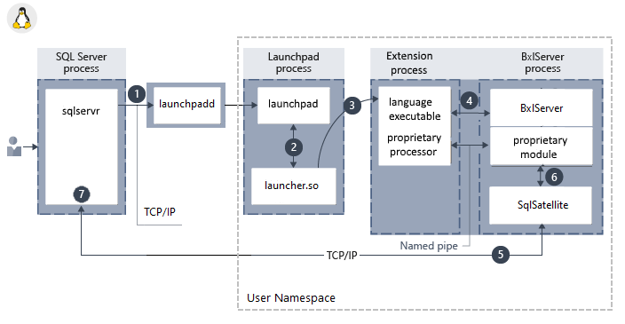

# Extensibility architecture in SQL Server Machine Learning Services 
[!INCLUDE [SQL Server 2016 and later](../../includes/applies-to-version/sqlserver2016.md)]

This article describes the architecture of the extensibility framework for running an external Python or R script on SQL server Machine Learning Services. The script executes in a language runtime environment as an extension to the core database engine.

## Background

The extensibility framework was introduced in SQL Server 2016 to support the R runtime with [R Services](../r/sql-server-r-services.md). SQL Server 2017 and later has support for Python with [Machine Learning Services](../sql-server-machine-learning-services.md).

The purpose of the extensibility framework is to provide an interface between SQL Server and data science languages such as R and Python. The goal is to reduce friction when moving data science solutions into production, and protecting data exposed during the development process. By executing a trusted scripting language within a secure framework managed by SQL Server, database administrators can maintain security while allowing data scientists access to enterprise data.

The following diagram visually describes opportunities and benefits of the extensible architecture.

  

An external script can be run by calling a stored procedure, and the results are returned as tabular results directly to SQL Server. This makes it easy to generate or consume machine learning from any application that can send a SQL query and handle the results.

+ External script execution is subject to SQL Server data security. A user running an external script can only access data that is equally available in a SQL query. If a query fails due to insufficient permission, a script run by the same user would also fail for the same reason. SQL Server security is enforced at the table, database, and instance level. Database administrators can manage user access, resources used by external scripts, and external code libraries added to the server.  

+ Scale and optimization opportunities have a dual basis: gains through the database platform (ColumnStore indexes, [resource governance](../../machine-learning/administration/resource-governor.md)); and extension-specific gains, for example when Microsoft libraries for R and Python are used for data science models. Whereas R is single-threaded, RevoScaleR functions are multi-threaded, capable of distributing a workload over multiple cores.

+ Deployment uses SQL Server methodologies. These can be stored procedures wrapping an external script, embedded SQL, or T-SQL queries calling functions like PREDICT to return results from forecasting models persisted on the server.

+ Developers with established skills in specific tools and IDEs can write code in those tools and then port the code to SQL Server.

## Architecture diagram

The architecture is designed such that external scripts run in a separate process from SQL Server, but with components that internally manage the chain of requests for data and operations on SQL Server. Depending on the version of SQL Server, supported language extensions include [R](extension-r.md), [Python](extension-python.md), and third-party languages such as Java and .NET.

  ***Component architecture in Windows:***
  
  
  
  ***Component architecture in Linux:***

  
  
Components include a **launchpad** service used to invoke external runtimes and library-specific logic for loading interpreters and libraries. The launcher loads a language runtime, plus any proprietary modules. For example, if your code includes RevoScaleR functions, a RevoScaleR interpreter is loaded. **BxlServer** and **SQL Satellite** manage communication and data transfer with SQL Server. 

In Linux, SQL uses a **launchpadd** service to communicate with a separate launchpad process for each user.

<a name="launchpad"></a>

## Launchpad

The [!INCLUDE[rsql_launchpad_md](../../includes/rsql-launchpad-md.md)] is a service that manages and executes external scripts, similar to the way that the full-text indexing and query service launches a separate host for processing full-text queries. The launchpad service can start only trusted launchers that are published by Microsoft, or that have been certified by Microsoft as meeting requirements for performance and resource management.

| Trusted launchers | Extension | SQL Server versions |
|-------------------|-----------|---------------------|
| RLauncher.dll for the R language for Windows | [R extension](extension-r.md) | SQL Server 2016 and later |
| Pythonlauncher.dll for Python language for Windows | [Python extension](extension-python.md) | SQL Server 2017 and later |
| RLauncher.so for the R language for Linux | [R extension](extension-r.md) | SQL Server 2019 and later |
| Pythonlauncher.so for Python language for Linux | [Python extension](extension-python.md) | SQL Server 2019 and later |

The [!INCLUDE[rsql_launchpad_md](../../includes/rsql-launchpad-md.md)] service runs under its own user account. If you change the account that runs launchpad, be sure to do so using SQL Server Configuration Manager, to ensure that changes are written to related files.

In Windows, a separate [!INCLUDE[rsql_launchpad_md](../../includes/rsql-launchpad-md.md)] service is created for each database engine instance to which you have added SQL Server Machine Learning Services. There is one launchpad service for each database engine instance, so if you have multiple instances with external script support, you will have a launchpad service for each one. A database engine instance is bound to the launchpad service created for it. All invocations of external script in a stored procedure or T-SQL result in the SQL Server service calling the launchpad service created for the same instance.

To execute tasks in a specific supported language, the launchpad gets a secured worker account from the pool, and starts a satellite process to manage the external runtime. Each satellite process inherits the user account of the launchpad and uses that worker account for the duration of script execution. If script uses parallel processes, they are created under the same, single worker account.

In Linux, only one database engine instance is supported and there is one launchpadd service bound to the instance. When a script is executed, the launchpadd service starts a separate launchpad process with the low-privileged user account **mssql_satellite**. Each satellite process inherits the mssql_satellite user account of launchpad and uses that for the duration of script execution.

## BxlServer and SQL Satellite

**BxlServer** is an executable provided by Microsoft that manages communication between SQL Server and the language runtime. It creates the Windows job objects for Windows, or the namespaces for Linux, that are used to contain external script sessions. It also provisions secure working folders for each external script job and uses SQL Satellite to manage data transfer between the external runtime and SQL Server. If you run [Process Explorer](/sysinternals/downloads/process-explorer) while a job is running, you might see one or multiple instances of BxlServer.

In effect, BxlServer is a companion to a language runtime environment that works with SQL Server to transfer data and manage tasks. BXL stands for Binary Exchange language and refers to the data format used to move data efficiently between SQL Server and external processes.

**SQL Satellite** is an extensibility API, included in the database engine, that supports external code or external runtimes implemented using C or C++.

BxlServer uses SQL Satellite for these tasks:

+ Reading input data
+ Writing output data
+ Getting input arguments
+ Writing output arguments
+ Error handling
+ Writing STDOUT and STDERR back to client

SQL Satellite uses a custom data format that is optimized for fast data transfer between SQL Server and external script languages. It performs type conversions and defines the schemas of the input and output datasets during communications between SQL Server and the external script runtime.

The SQL Satellite can be monitored by using Windows extended events (xEvents). For more information, see [Extended Events for SQL Server Machine Learning Services](../../machine-learning/administration/extended-events.md).

## Communication channels between components

Communication protocols among components and data platforms are described in this section.

+ **TCP/IP**

  By default, internal communications between SQL Server and the SQL Satellite use TCP/IP.

+ **Named Pipes**

  Internal data transport between the BxlServer and SQL Server through SQL Satellite uses a proprietary, compressed data format to enhance performance. Data is exchanged between language run times and BxlServer in BXL format, using Named Pipes.

+ **ODBC**

  Communications between external data science clients and a remote SQL Server instance use ODBC. The account that sends the script jobs to SQL Server must have both permissions to connect to the instance and to run external scripts.

  Additionally, depending on the task, the account might need these permissions:

  + Read data used by the job
  + Write data to tables: for example, when saving results to a table
  + Create database objects: for example, if saving external script as part of a new stored procedure.

  When SQL Server is used as the compute context for script executed from a remote client, and the executable must retrieve data from an external source, ODBC is used for writeback. SQL Server maps the identity of the user issuing the remote command to the identity of the user on the current instance, and runs the ODBC command using that user's credentials. The connection string needed to perform this ODBC call is obtained from the client code.

+ **RODBC (R only)** 

  Additional ODBC calls can be made inside the script by using **RODBC**. RODBC is a popular R package used to access data in relational databases; however, its performance is generally slower than comparable providers used by SQL Server. Many R scripts use embedded calls to RODBC as a way of retrieving "secondary" datasets for use in analysis. For example, the stored procedure that trains a model might define a SQL query to get the data for training a model, but use an embedded RODBC call to get additional factors, to perform lookups, or to get new data from external sources such as text files or Excel.

  The following code illustrates an RODBC call embedded in an R script:

    ```R
    library(RODBC);
    connStr <- paste("Driver=SQL Server;Server=", instance_name, ";Database=", database_name, ";Trusted_Connection=true;", sep="");
    dbhandle <- odbcDriverConnect(connStr)
    OutputDataSet <- sqlQuery(dbhandle, "select * from table_name");
    ```

+ **Other protocols**

  Processes that might need to work in "chunks" or transfer data back to a remote client can also use the [XDF file format](/machine-learning-server/r/concept-what-is-xdf). Actual data transfer is via encoded blobs.

## See Also

+ [R extension in SQL Server](extension-r.md)
+ [Python extension in SQL Server](extension-python.md)
