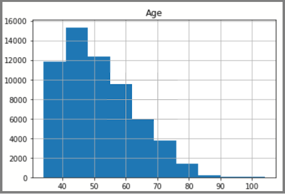

# Plot histograms in Python 
[!INCLUDE[SQL Server SQL DB SQL MI](../../includes/applies-to-version/sql-asdb-asdbmi.md)]

This article describes how to plot data using the Python package [pandas'.hist()](https://pandas.pydata.org/pandas-docs/stable/reference/api/pandas.DataFrame.hist.html). A SQL database is the source used to visualize the histogram data intervals that have consecutive, non-overlapping values.

## Prerequisites:

::: moniker range=">=sql-server-2017||>=sql-server-linux-ver15"
* [SQL Server for Windows](../../database-engine/install-windows/install-sql-server.md) or [for Linux](../../linux/sql-server-linux-overview.md)
::: moniker-end

::: moniker range="=azuresqldb-current"
* [Azure SQL Database](/azure/sql-database/sql-database-get-started-portal)
::: moniker-end

::: moniker range="=azuresqldb-mi-current"
* [Azure SQL Managed Instance](/azure/azure-sql/managed-instance/instance-create-quickstart)

* [SQL Server Management Studio](../../ssms/download-sql-server-management-studio-ssms.md) for restoring the sample database to Azure SQL Managed Instance.
::: moniker-end

* Azure Data Studio. To install, see [Azure Data Studio](../../azure-data-studio/what-is-azure-data-studio.md).

* [Restore sample DW database](../../samples/adventureworks-install-configure.md) to get sample data used in this article.

## Verify restored Database

You can verify that the restored database exists by querying the **Person.CountryRegion** table:
```sql
USE AdventureWorksDW;
SELECT * FROM Person.CountryRegion;
```
  
## Install Python packages

[Download and Install Azure Data Studio](../../azure-data-studio/download-azure-data-studio.md).

Install the following Python packages:
  * pyodbc
  * pandas

  To install these packages:

  1. In your Azure Data Studio notebook, select **Manage Packages**.
  2. In the **Manage Packages** pane, select the **Add new** tab.
  3. For each of the following packages, enter the package name, click **Search**, then click **Install**.

## Plot histogram

The distributed data displayed in the histogram is based on a SQL query from AdventureWorksDW. The histogram visualizes data and the frequency of data values. 
Edit the connection string variables: 'server', 'database', 'username', and 'password' to connect to SQL database.

To create a new notebook:

1. In Azure Data Studio, select **File**, select **New Notebook**.
2. In the notebook, select kernel **Python3**, select the **+code**.
3. Paste code in notebook, select **Run All**.

```python
import pyodbc 
import pandas as plt
# Some other example server values are
# server = 'localhost\sqlexpress' # for a named instance
# server = 'myserver,port' # to specify an alternate port
server = 'servername' 
database = 'AdventureWorksDW' 
username = 'yourusername' 
password = 'databasename'  
cnxn = pyodbc.connect('DRIVER={SQL Server};SERVER='+server+';DATABASE='+database+';UID='+username+';PWD='+ password)
cursor = cnxn.cursor()
sql = "SELECT DATEDIFF(year, c.BirthDate, GETDATE()) AS Age FROM [dbo].[FactInternetSales] s INNER JOIN dbo.DimCustomer c ON s.CustomerKey = c.CustomerKey"
df = plt.read_sql(sql, cnxn)
df.hist(bins=10)
```

The display shows the age distribution of customers in the FactInternetSales table.


