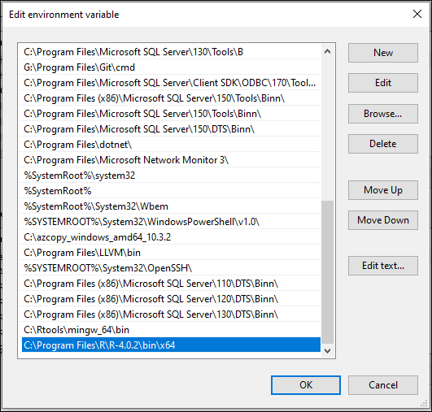

# Install an R custom runtime for SQL Server

[!INCLUDE [SQL Server 2019 and later](../../includes/applies-to-version/sqlserver2019.md)]

This article describes how to install a custom runtime for running R scripts with SQL Server. The custom runtime for R can be used in the following scenarios:

+ An installation of SQL Server with extensibility framework.

+ An installation of SQL Machine Learning Services for SQL Server 2019. The language extension can be used with [SQL Server Machine Learning Services](../sql-server-machine-learning-services.md) after completing some additional configuration steps.

::: moniker range=">=sql-server-ver15||=sqlallproducts-allversions"
> [!NOTE]
> This article describes how to install a custom runtime for R on Windows. To install on Linux, see the [Install an R custom runtime for SQL Server on Linux](custom-runtime-r.md?view=sql-server-linux-ver15&preserve-view=true)

<a name="pre_install_checklist"> </a>

## Pre-install checklist

+ [SQL Server 2019 for Windows (Cumulative Update 3 onwards).](../../database-engine/install-windows/install-sql-server.md)

+ [SQL Server Language Extensions on Windows with the extensibility framework.](../../language-extensions/install/install-sql-server-language-extensions-on-windows.md)

+ [R Version 3.3 or higher](https://cran.r-project.org/)

## Add SQL Server Language Extensions for Windows

> [!Note]
>For Machine Learning Services using SQL Server 2019, the extensibility framework for language extensions with the Launchpad service is already installed and you can skip this step.

Language Extensions use the extensibility framework for executing external code. Code execution is isolated from the core engine processes, but fully integrated with SQL Server query execution.

Complete the setup for SQL Server 2019.

1. Start the setup wizard for SQL Server 2019.

1. On the **Installation** tab, select **New SQL Server stand-alone installation or add features to an existing installation**.

    

1. On the **Feature Selection** page, select these options:

    - **Database Engine Services**

        To use Language Extensions with SQL Server, you must install an instance of the database engine. You can use either a default or a named instance.

    - **Machine Learning Services and Language Extensions**

       Select **Machine Learning Services and Language Extensions**. There's no need to select R.

    

1. On the **Ready to Install** page, verify that these selections are included, and select **Install**.

    + Database Engine Services
    + Machine Learning Services and Language Extensions

1. After setup is complete, if you're instructed to restart the computer, do so now. It's important to read the message from the Installation Wizard when you've finished with Setup. For more information, see [View and Read SQL Server Setup Log Files](https://docs.microsoft.com/sql/database-engine/install-windows/view-and-read-sql-server-setup-log-files).


## Install R

> [!Note]
>For SQL Machine Learning Services, R is already installed in the **R_SERVICES** folder of your SQL Server instance e.g. "C:\Program Files\Microsoft SQL Server\MSSQL15.MSSQLSERVER\R_SERVICES". If you want to keep using this path as your R_HOME, skip to the next step of installing Rcpp. Otherwise, if you want to use a different runtime of R, continue below to install it.

[Complete installation of R (>= 3.3)](https://cran.r-project.org/bin/windows/base/) and note the path where it's installed. This path is your **R_HOME**. For example, as shown below, R_HOME is "C:\Program Files\R\R-4.0.2"


> [!Note]
>In all the instructions below, %R_HOME% is the path to your R installation as noted above and should be replaced with that value.

## Install Rcpp package

+ Locate the R executable in %R_HOME%\bin. By default, it is in *C:\Program Files\R\R-4.0.2\bin*.


+ Start R from an *elevated* command prompt:

```CMD
%R_HOME%\bin\R.exe
```

In this *elevated* R prompt (%R_HOME%\bin\R.exe), run the following script to install the Rcpp package in the %R_HOME%\library folder.

```R
install.packages("Rcpp", lib="%R_HOME%/library");
```

## Update the system environment variables

1. Add or modify **R_HOME** as a system environment variable.
    + In **Search** type **environment.** Select **Edit the system environment variables.**
    + In the section System Variables. Select **Advanced** tab. Select **Environment Variables.**

    + Select **New** to create R_HOME.
    To modify, select **Edit** to change it. Modify its value to point to the custom R installation path.

    

2. Update the **PATH** environment variable.
    + Append the path to **R.dll** to the system **PATH** environment variable. To do that, select **PATH** then **Edit** and add %R_HOME%\bin\x64 to the list of paths.

    

3. Select **OK** to close remaining windows.

As an alternative, to set these environment variables from an *elevated* command prompt, run the following commands. Make sure to use the custom R installation path.

```CMD
setx /m R_HOME "path\to\installation\of\R"
setx /m PATH "path\to\installation\of\R\bin\x64;%PATH%"
```

## Grant access to the custom R installation folder

> [!Note]
>If you have installed R in the default location of **C:\Program Files\R\R-version**, you can skip this step.

Run the **icacls** commands from a new *elevated* command prompt to grant READ & EXECUTE access to the **SQL Server Launchpad Service user name** and SID **S-1-15-2-1** (**ALL APPLICATION PACKAGES**). The launchpad service user name is of the form `NT Service\MSSQLLAUNCHPAD$INSTANCENAME` where INSTANCENAME is the instance name of your SQL Server. The commands will recursively grant access to all files and folders under the given directory path.

Append the instance name to MSSQLLAUNCHPAD (`MSSQLLAUNCHPAD$INSTANCENAME`). In this example, INSTANCENAME is the default instance `MSSQLSERVER`.

1. Give permissions to **SQL Server Launchpad Service user name**

    ```cmd
    icacls "%R_HOME%" /grant "NT Service\MSSQLLAUNCHPAD$MSSQLSERVER":(OI)(CI)RX /T

2. Give permissions to **SID S-1-15-2-1**

    ```cmd
    icacls "%R_HOME%" /grant *S-1-15-2-1:(OI)(CI)RX /T

>[!Note]
>The above command grants permissions to the computer **SID S-1-15-2-1**, which is equivalent to ALL APPLICATION PACKAGES on an English version of Windows. Alternatively, you can use `icacls "%R_HOME%" /grant "ALL APPLICATION PACKAGES":(OI)(CI)RX /T` on an English version of Windows.

## Restart SQL Server Launchpad service

Find the name of the SQL Server Launchpad Service. It is of the form MSSQLLAUCHPAD$INSTANCENAME where INSTANCENAME is the instance name of your SQL Server. By default, the name is MSSQLLAUNCHPAD$MSSQLSERVER.

From an *elevated* command prompt, run the following commands. Make sure to replace MSSQLLAUNCHPAD$MSSQLSERVER with the name found above. In this example, INSTANCENAME is the default instance `MSSQLSERVER`.

```CMD
net stop MSSQLLAUNCHPAD$MSSQLSERVER
net start MSSQLLAUNCHPAD$MSSQLSERVER
```

As an alternative, right-click the SQL Server Launchpad service in the **Services** app of the system and select the **Restart** command. Or use [SQL Server Configuration Manager](../../relational-databases/sql-server-configuration-manager.md) to restart the service.

## Download R language extension

Download the zip file containing the R language extension (**R-lang-extension.zip**) from [here.](**GitHub link goes here**)

## Register external language

Register this R language extension with [CREATE EXTERNAL LANGUAGE](../../t-sql/statements/create-external-language-transact-sql.md) for each database you want to use it in. Use [Azure Data Studio](https://docs.microsoft.com/sql/azure-data-studio/download-azure-data-studio) to connect to SQL Server and run the following T-SQL.

Modify the path in this statement to reflect the location of the downloaded language extension zip file (R-lang-extension.zip) from above.

> [!Note]
>**R** is a reserved word. Use a different name for the external language e.g. myR.

```sql
CREATE EXTERNAL LANGUAGE [myR]
FROM (CONTENT = N'/path/to/R-lang-extension.zip', FILE_NAME = 'libRExtension.dll');
GO
```

::: moniker-end

::: moniker range=">=sql-server-linux-ver15||=sqlallproducts-allversions"
You can install SQL Server on Red Hat Enterprise Linux (RHEL), SUSE Linux Enterprise Server (SLES), and Ubuntu. For more information, see [the Supported platforms section in the Installation guidance for SQL Server on Linux](../../linux/sql-server-linux-setup.md).

> [!NOTE]
> This article describes how to install a custom runtime for R on Linux. To install on Windows, see the [Install an R custom for SQL Server on Windows](custom-runtime-r.md?view=sql-server-ver15&preserve-view=true)

<a name="pre_install_checklist"> </a>

## Pre-install checklist

+ [SQL Server 2019 for Linux (Cumulative Update 3 onwards).](../../linux/sql-server-linux-setup.md)
Before you install SQL Server on Linux, you must configure a Microsoft repository. For more information, see [configuring repositories](../../linux/sql-server-linux-change-repo.md)

+ [SQL Server Language Extensions on Linux with the extensibility framework.](../../linux/sql-server-linux-setup-language-extensions.md)

+ [R Version 3.3 or higher](https://cran.r-project.org/)

## Add SQL Server Language Extensions for Linux

> [!Note]
>For Machine Learning Services using SQL Server 2019, the **mssql-server-extensibility** package for language extensions is already installed and you can skip this step.

Language Extensions use the extensibility framework for executing external code. Code execution is isolated from the core engine processes, but fully integrated with SQL Server query execution.

### Ubuntu
> [!Tip]
> If possible, `sudo apt-get update` to refresh packages on the system prior to installation. Ubuntu might not have the https apt transport option. To install it, use `sudo apt-get install apt-transport-https`.
```bash
# Install as root or sudo
sudo apt-get install mssql-server-extensibility
```

### Red Hat
```bash
# Install as root or sudo
sudo yum install mssql-server-extensibility
```

### Suse
```bash
# Install as root or sudo
sudo zypper install mssql-server-extensibility
```

## Install R

>[!Note]
>For SQL Machine Learning Services, R is already installed in **/opt/microsoft/ropen/3.5.2/lib64/R**. If you want to keep using this path as your R_HOME, skip to the next step of installing **Rcpp**. Otherwise, if you want to use a different runtime of R, you first need to remove **microsoft-r-open-mro** before continuing to install a new version. Example for Ubuntu:
>```bash
>sudo apt remove microsoft-r-open-mro-3.5.2
>```

[Complete installation of R (>= 3.3)](https://cran.r-project.org/bin/linux/) by following the instructions for your respective linux platform. By default, R is installed in **/usr/lib/R**. This path is your **R_HOME**. If you install R in a different location, take note of that path as your R_HOME.

Example instructions for Ubuntu. Change the repository URL below for your version of R.

```bash
export DEBIAN_FRONTEND=noninteractive
sudo apt-get update
sudo apt-get --no-install-recommends -y install curl zip unzip apt-transport-https libstdc++6

# Add R CRAN repository. This repository works for R 4.0.x.
#
sudo apt-key adv --keyserver keyserver.ubuntu.com --recv-keys E298A3A825C0D65DFD57CBB651716619E084DAB9
sudo add-apt-repository 'deb https://cloud.r-project.org/bin/linux/ubuntu xenial-cran40/'
sudo apt-get update

# Install R runtime.
#
sudo apt-get -y install r-base-core
```

In all the instructions below, ${R_HOME} is the path to your R installation as noted here and should be replaced with that value.

## Install Rcpp package

+ Locate the R binary in ${R_HOME}/bin. By default, it is in **/usr/lib/R/bin**.

+ Start R

```bash
sudo ${R_HOME}/bin/R
```

+ In this *elevated* R prompt (${R_HOME}/bin/R), run the following script. to install the **Rcpp** package in the ${R_HOME}/library folder.

```R
install.packages("Rcpp", lib = "${R_HOME}/library");
```

## Using a custom installation of R

> [!Note]
>If you have installed R in the default location of **/usr/lib/R**, you can skip this section.

#### Update the environment variables

1. Add the R_HOME environment variable to mssql-launchpadd service config.

    + Edit **mssql-launchpadd** service.

    ```bash
    sudo systemctl edit mssql-launchpadd
    ```

    + Insert the following text in the **/etc/systemd/system/mssql-launchpadd.service.d/override.conf** file that opens. Set value of R_HOME to the custom R installation path.

    ```vi editor
    [Service]
    Environment="R_HOME=/path/to/installation/of/R"
    ```

    + Save and close.

2. Make sure **libR.so** can be loaded.

    + Create a custom-r.conf file in **/etc/ld.so.conf.d**.

    ```bash
    sudo vi /etc/ld.so.conf.d/custom-r.conf
    ```

    + In the file that opens, add path to **libR.so** from the custom R installation.

    ```vi editor
    /path/to/installation/of/R/lib
    ```

    + Save and close the new file.

    + Run `ldconfig` and verify **libR.so** can be loaded by running the following command and checking that all dependent libraries can be found.

    ```bash
    sudo ldconfig
    ldd /path/to/installation/of/R/lib/libR.so
    ```

#### Grant access to the custom R installation folder

Set the `datadirectories` option in the extensibility section of /var/opt/mssql/mssql.conf file to the custom R installation.

```bash
sudo /opt/mssql/bin/mssql-conf set extensibility.datadirectories /path/to/installation/of/R
```

#### Restart mssql-launchpadd service

> [!Note]
>If you have installed R in the default location of **/usr/lib/R**, you can skip this step.

```bash
sudo systemctl restart mssql-launchpadd
```

## Download R language extension

Download the zip file containing the R language extension (**R-lang-extension.zip**) from [here.](**GitHub link goes here**)

## Register external language

Register this R language extension with [CREATE EXTERNAL LANGUAGE](../../t-sql/statements/create-external-language-transact-sql.md) for each database you want to use it in. Use [Azure Data Studio](https://docs.microsoft.com/sql/azure-data-studio/download-azure-data-studio) to connect to SQL Server and run the following T-SQL.

Modify the path in this statement to reflect the location of the downloaded language extension zip file (R-lang-extension.zip) from above.

> [!Note]
>**R** is a reserved word. Use a different name for the external language e.g. myR.

```sql
CREATE EXTERNAL LANGUAGE [myR]
FROM (CONTENT = N'/path/to/R-lang-extension.zip', FILE_NAME = 'libRExtension.so.1.0');
GO
```

::: moniker-end

## Enable external script execution in SQL Server

An external script in R can be executed via the stored procedure [sp_execute_external script](../../relational-databases/system-stored-procedures/sp-execute-external-script-transact-sql.md) run against SQL Server. Run the following T-SQL using [Azure Data Studio](https://docs.microsoft.com/sql/azure-data-studio/download-azure-data-studio) to enable execution of this stored procedure.

```sql
sp_configure 'external scripts enabled', 1;
RECONFIGURE WITH OVERRIDE;
```

## Verify language extension installation

Use [Azure Data Studio](https://docs.microsoft.com/sql/azure-data-studio/download-azure-data-studio) to connect to SQL Server and run this script.

This script verifies the successful installation of the custom R language extension. Output of this script should display the R_HOME, path to R and the version of the custom R runtime. It confirms the script is using your custom runtime.

```sql
EXEC sp_execute_external_script
	@language =N'myR',
	@script=N'
print(R.home());
print(file.path(R.home("bin"), "R"));
print(R.version);
print("Hello RExtension!");'
```

## Verify parameters and datasets of different data types

This script tests different data types for input/output parameters and datasets.

```sql
DECLARE @sumVal INT = 12;
DECLARE @charVal VARCHAR(30) = N'Hello';
EXEC sp_execute_external_script
	@language =N'myR',
	@script=N'
print(sumVal);
print(charVal);
sumVal <- sumVal + 300;
OutputDataSet <- InputDataSet;'
	,@input_data_1 = N'select 1, cast(1.4 as real), ''Hi'', cast(''1'' as bit)'
	,@params = N'@sumVal int OUTPUT, @charVal VARCHAR(30)'
	,@sumVal = @sumVal OUTPUT
	,@charVal =  @charVal
WITH RESULT SETS ((intCol INT, doubleCol REAL, charCol CHAR(2), logicalCol BIT));
PRINT @sumVal;
```

## See also

+ [Extensibility framework in SQL Server](../concepts/extensibility-framework.md)
+ [Language Extensions Overview](../../language-extensions/language-extensions-overview.md)
