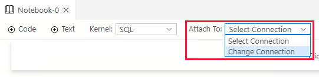
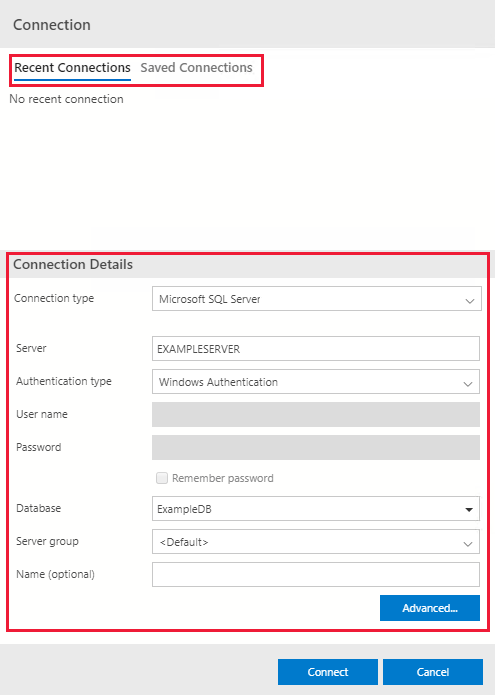
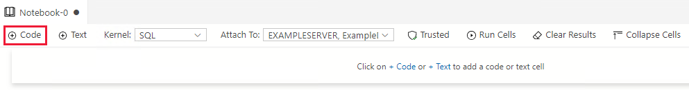
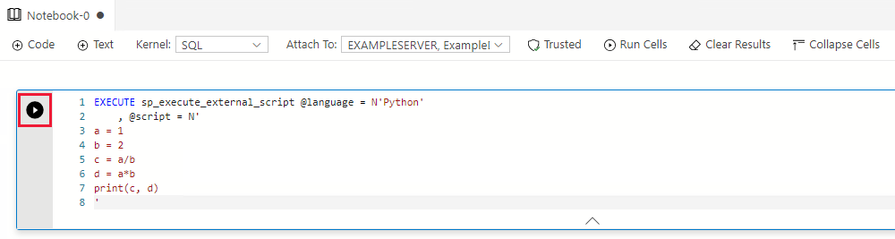
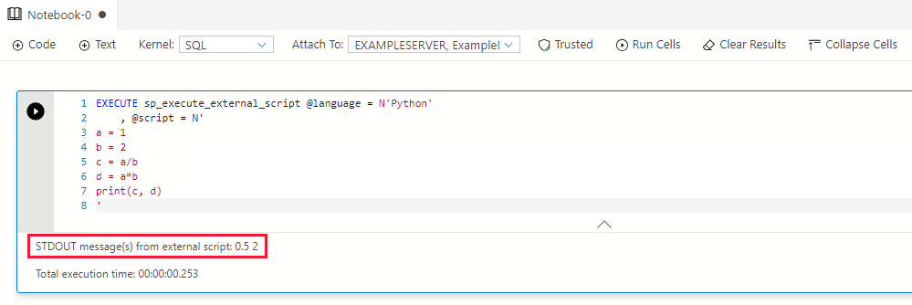
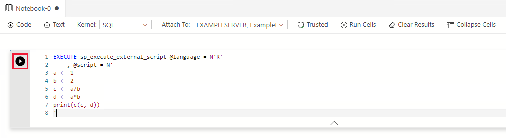
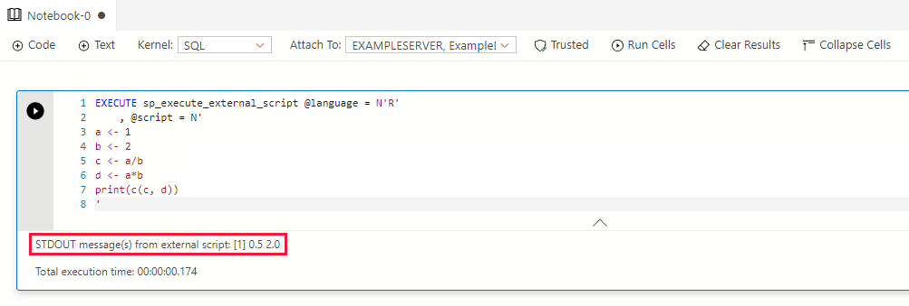

# Run Python and R scripts in Azure Data Studio notebooks with SQL Server Machine Learning Services
[!INCLUDE [SQL Server 2017 and later](../../includes/applies-to-version/sqlserver2017.md)]

Learn how to run Python and R scripts in [Azure Data Studio](../../azure-data-studio/what-is-azure-data-studio.md) notebooks with [SQL Server Machine Learning Services](../sql-server-machine-learning-services.md). Azure Data Studio is a cross-platform database tool.

## Prerequisites

- [Download and install Azure Data Studio](../../azure-data-studio/download-azure-data-studio.md) on your workstation computer. Azure Data Studio is cross-platform, and runs on Windows, macOS, and Linux.

- A server with SQL Server Machine Learning Services installed and enabled. You can use Machine Learning Services on Windows, Linux, or Big Data Clusters:

  - [Install SQL Server Machine Learning Services on Windows](sql-machine-learning-services-windows-install.md).
  - [Install SQL Server Machine Learning Services on Linux](../../linux/sql-server-linux-setup-machine-learning.md).
  - [Run Python and R scripts with Machine Learning Services on SQL Server Big Data Clusters](../../big-data-cluster/machine-learning-services.md).

## Create a SQL notebook

> [!IMPORTANT]
> Machine Learning Services runs as part of SQL Server. Therefore, you need to use a SQL kernel and not a Python kernel.

You can use Machine Learning Services in Azure Data Studio with a SQL notebook. To create a new notebook, follow these steps:

1. Click **File** and **New Notebook** to create a new notebook. The notebook will by default use the **SQL kernel**.

1. Click **Attach To** and **Change Connection**. 

    > [!div class="mx-imgBorder"]
    > 
    
1. Connect to an existing or new SQL Server. You can either:

    1. Choose an existing connection under **Recent Connections** or **Saved Connections**.

    1. Create a new connection under **Connection Details**. Fill out the connection details to your SQL Server and database.

    > [!div class="mx-imgBorder"]
    >   

## Run Python or R scripts

SQL Notebooks consist of code and text cells. Code cells are used to run Python or R scripts via the stored procedure [sp_execute_external_scripts](../../relational-databases/system-stored-procedures/sp-execute-external-script-transact-sql.md). Text cells can be used to document your code in the notebook.

### Run a Python script

Follow these steps to run a Python script:

1. Click **+ Code** to add a code cell.

    > [!div class="mx-imgBorder"]
    >   

1. Enter the following script in the code cell:

    ```sql
    EXECUTE sp_execute_external_script @language = N'Python'
        , @script = N'
    a = 1
    b = 2
    c = a/b
    d = a*b
    print(c, d)
    '
    ```

1. Click **Run cell** (the round black arrow) or press **F5** to run the single cell.

    > [!div class="mx-imgBorder"]
    >   

1. The result will be shown under the code cell.

    > [!div class="mx-imgBorder"]
    >   

### Run an R script

Follow these steps to run an R script:

1. Click **+ Code** to add a code cell.

    > [!div class="mx-imgBorder"]
    >   

1. Enter the following script in the code cell:

    ```sql
    EXECUTE sp_execute_external_script @language = N'R'
        , @script = N'
    a <- 1
    b <- 2
    c <- a/b
    d <- a*b
    print(c(c, d))
    '
    ```

1. Click **Run cell** (the round black arrow) or press **F5** to run the single cell.

    > [!div class="mx-imgBorder"]
    >   

1. The result will be shown under the code cell.

    > [!div class="mx-imgBorder"]
    >   

## Next steps

- [How to use notebooks in Azure Data Studio](../../azure-data-studio/notebooks/notebooks-guidance.md)
- [Create and run a SQL Server notebook](../../azure-data-studio/notebooks/notebooks-sql-kernel.md)
- [Quickstart: Run simple Python scripts with SQL Server Machine Learning Services](../tutorials/quickstart-python-create-script.md)
- [Quickstart: Run simple R scripts with SQL Server Machine Learning Services](../tutorials/quickstart-r-create-script.md)