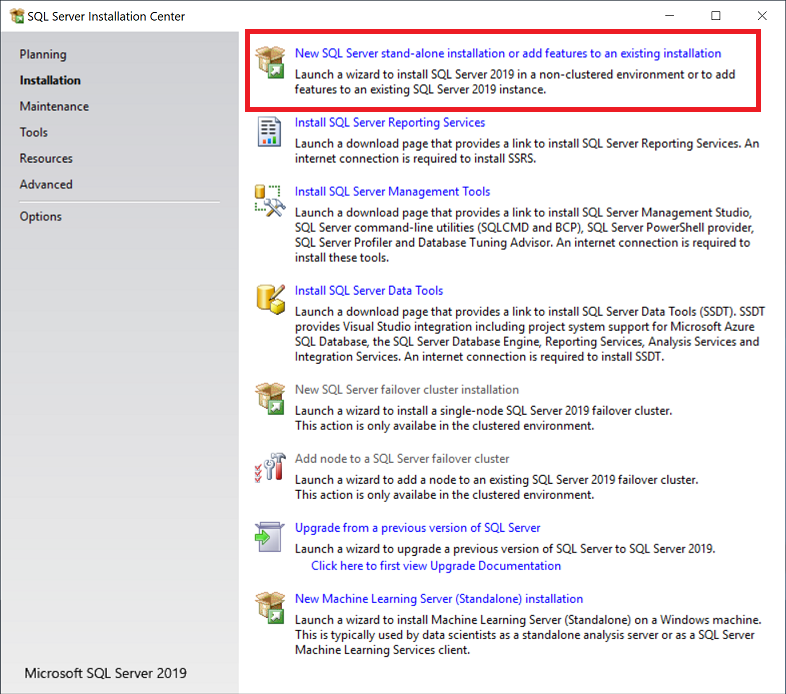
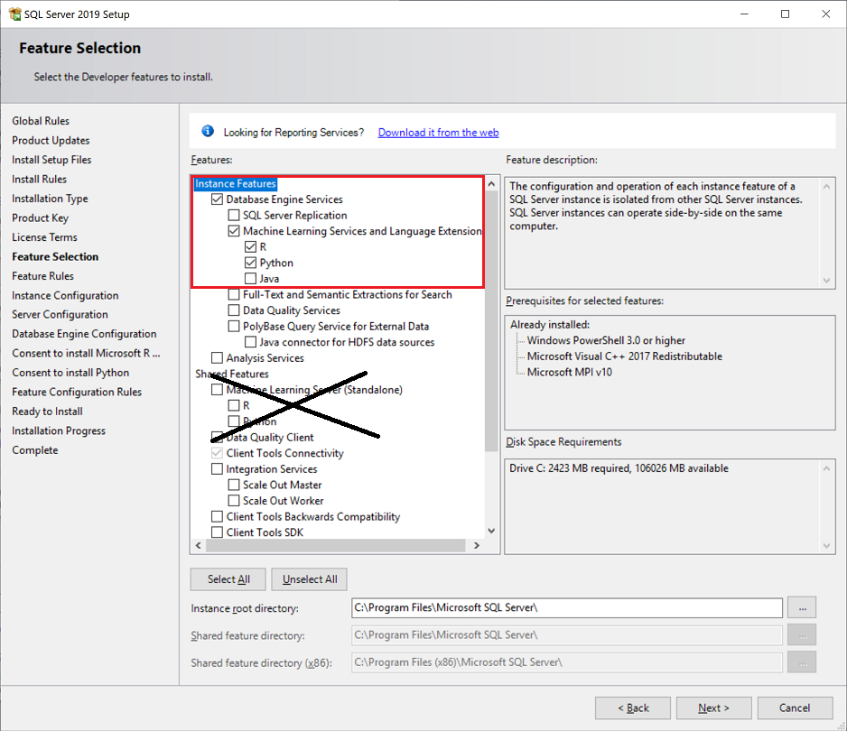

# Install SQL Server Machine Learning Services (Python and R) on Windows

[!INCLUDE [SQL Server 2016 2017 2019](../../includes/applies-to-version/sqlserver2016-2019-only.md)]

This article shows you how to install [SQL Server Machine Learning Services](../sql-server-machine-learning-services.md) on Windows. You can use Machine Learning Services to run Python and R scripts in-database.

> [!IMPORTANT]
> These instructions apply to [!INCLUDE[sssql16-md](../../includes/sssql16-md.md)], [!INCLUDE[sssql17-md](../../includes/sssql17-md.md)], and [!INCLUDE[sssql19-md](../../includes/sssql19-md.md)]. For [!INCLUDE[sssql22-md](../../includes/sssql22-md.md)], refer to [Install SQL Server 2022 Machine Learning Services on Windows](sql-machine-learning-services-windows-install-sql-2022.md).

## <a name="bkmk_prereqs"> </a> Pre-installation checklist

+ A database engine instance is required. You can't install just Python or R features, although you can add them incrementally to an existing instance.

+ For business continuity, [Always On availability groups](../../database-engine/availability-groups/windows/overview-of-always-on-availability-groups-sql-server.md) are supported for Machine Learning Services. Install Machine Learning Services, and configure packages, on each node.

+ Installing Machine Learning Services *is not supported* on an [Always On failover cluster instance](../../sql-server/failover-clusters/windows/always-on-failover-cluster-instances-sql-server.md) in SQL Server 2017. It's supported with SQL Server 2019 and later.
 
+ Don't install Machine Learning Services on a domain controller. The Machine Learning Services portion of setup will fail.

+ Don't install **Shared Features** > **Machine Learning Server (Standalone)** on the same computer that's running a database instance. A standalone server will compete for the same resources and diminish the performance of both installations.

+ Side-by-side installation with other versions of Python and R is supported, but we don't recommend it. It's supported because the SQL Server instance uses its own copies of the open-source R and Anaconda distributions. We don't recommend it because running code that uses Python and R on a computer outside SQL Server can lead to problems:
    
  + Using a different library and different executable files will create results that are inconsistent with what you're running in SQL Server.
  + SQL Server can't manage R and Python scripts that run in external libraries, leading to resource contention.

::: moniker range=">=sql-server-ver15"
> [!NOTE]
> Machine Learning Services is installed by default on SQL Server Big Data Clusters. You don't need to follow the steps in this article if you use a Big Data Cluster. For more information, see [Use Machine Learning Services (Python and R) on Big Data Clusters](../../big-data-cluster/machine-learning-services.md).
::: moniker-end

> [!IMPORTANT]
> After you finish setup, be sure to complete the post-configuration steps described in this article. These steps include enabling SQL Server to use external scripts and adding accounts that are required for SQL Server to run R and Python jobs on your behalf. Configuration changes generally require a restart of the instance or a restart of the Launchpad service.

## Get the installation media

[!INCLUDE[GetInstallationMedia](../../includes/getssmedia.md)]

::: moniker range="=sql-server-2017"
For more information on which SQL Server editions support Python and R integration with Machine Learning Services, see [Editions and supported features of SQL Server 2017](../../sql-server/editions-and-components-of-sql-server-2017.md).
::: moniker-end

::: moniker range="=sql-server-ver15"
For more information on which SQL Server editions support Python and R integration with Machine Learning Services, see [Editions and supported features of SQL Server 2019 (15.x)](../../sql-server/editions-and-components-of-sql-server-2019.md).
::: moniker-end

## Run setup

For local installations, you must run the setup as an administrator. If you install [!INCLUDE[ssNoVersion](../../includes/ssnoversion-md.md)] from a remote share, you must use a domain account that has read and execute permissions on the remote share.

1. Start the setup wizard for SQL Server.
  
2. On the **Installation** tab, select **New SQL Server stand-alone installation or add features to an existing installation**.

   ::: moniker range="=sql-server-2017"
   
   ::: moniker-end

   ::: moniker range="=sql-server-ver15"
   
   ::: moniker-end

3. On the **Feature Selection** page, select these options:

   ::: moniker range="=sql-server-2017"

   - **Database Engine Services**
     
     To use R and Python with SQL Server, you must install an instance of the database engine. You can use either a default instance or a named instance.

   - **Machine Learning Services (In-Database)**
     
     This option installs the database services that support R and Python script execution.

   ::: moniker-end

   ::: moniker range="=sql-server-ver15"

   - **Database Engine Services**
     
     To use R or Python with SQL Server, you must install an instance of the database engine. You can use either a default instance or a named instance.

   - **Machine Learning Services and Language Extension**
     
     This option installs the database services that support R and Python script execution.

   ::: moniker-end

   - **R**
     
     Select this option to add the Microsoft R packages, interpreter, and open-source R. 
     
   - **Python**
     
     Select this option to add the Microsoft Python packages, the Python 3.5 executable, and select libraries from the Anaconda distribution.
     
   ::: moniker range="=sql-server-ver15"
   For information on installing and using Java, see [Install SQL Server Java Language Extension on Windows](../../language-extensions/install/windows-java.md).
   ::: moniker-end
   
   ::: moniker range="=sql-server-2017"
   
   ::: moniker-end
   
   ::: moniker range="=sql-server-ver15"
   
   ::: moniker-end
   
   > [!NOTE]
   > Don't select the **Machine Learning Server (Standalone)** option under **Shared Features**. That option is intended for use on a separate computer.

::: moniker range="=sql-server-2017"

4. On the **Consent to Install Microsoft R Open** page, select **Accept** > **Next**. 

   The license agreement covers:
   
   + Microsoft R Open.
   + Open-source R base packages and tools.
   + Enhanced R packages and connectivity providers from the Microsoft development team.

5. On the **Consent to Install Python** page, select **Accept** > **Next**. The Python open-source license agreement also covers Anaconda and related tools, plus some new Python libraries from the Microsoft development team.

   > [!NOTE]
   > If the computer that you're using doesn't have internet access, you can pause setup at this point to download the installers separately. For more information, see [Install machine learning components without internet access](../install/sql-ml-component-install-without-internet-access.md).

6. On the **Ready to Install** page, verify that these selections are included, and then select **Install**:
  
   + Database Engine Services
   + Machine Learning Services (in-database)
   + R, Python, or both

   Note the location of the folder under the path `..\Setup Bootstrap\Log` where the configuration files are stored. When setup is complete, you can review the installed components in the summary file.

7. After setup is complete, if you're instructed to restart the computer, do so. It's important to read the message from the Installation Wizard when you finish setup. For more information, see [View and read SQL Server Setup log files](../../database-engine/install-windows/view-and-read-sql-server-setup-log-files.md).

::: moniker-end

::: moniker range="=sql-server-ver15"

4. On the **Consent to Install Microsoft R Open** page, select **Accept** > **Next**. This license agreement covers Microsoft R Open, which includes a distribution of the open-source R base packages and tools. It also includes enhanced R packages and connectivity providers from the Microsoft development team.

5. On the **Consent to Install Python** page, select **Accept** > **Next**. The Python open-source license agreement also covers Anaconda and related tools, plus some new Python libraries from the Microsoft development team.

6. On the **Ready to Install** page, verify that these selections are included, and then select **Install**:
  
   + Database Engine Services
   + Machine Learning Services (in-database)
   + R, Python, or both

   Note the location of the folder under the path `..\Setup Bootstrap\Log` where the configuration files are stored. When setup is complete, you can review the installed components in the summary file.

7. After setup is complete, if you're instructed to restart the computer, do so. It's important to read the message from the installation wizard when you finish setup. For more information, see [View and read SQL Server Setup log files](../../database-engine/install-windows/view-and-read-sql-server-setup-log-files.md).

::: moniker-end

## Set environment variables

For R feature integration only, you should set the `MKL_CBWR` environment variable to [ensure consistent output](https://software.intel.com/articles/introduction-to-the-conditional-numerical-reproducibility-cnr) from Intel Math Kernel Library (MKL) calculations:

1. In Control Panel, select **System and Security** > **System** > **Advanced System Settings** > **Environment Variables**.

1. Create a new user or system variable: 

   + Set the variable name to `MKL_CBWR`.
   + Set the variable value to `AUTO`.

This step requires a server restart. If you're about to enable script execution, you can hold off on the restart until all of the configuration work is done.

<a name="bkmk_enableFeature"></a>

## Enable script execution

1. Use [SQL Server Management Studio (SSMS)](../../ssms/download-sql-server-management-studio-ssms.md) or [Azure Data Studio](../../azure-data-studio/what-is-azure-data-studio.md) to connect to the instance where you installed SQL Server Machine Learning Services.
  
1. Select **New Query** to open a query window, and then run the following command:

    ```sql
    EXEC sp_configure
    ```

1.  The value for the property `external scripts enabled` should be `0` at this point. The feature is turned off by default. To turn it on so you can run R or Python scripts, run the following statement:
    
    ```sql
    EXEC sp_configure  'external scripts enabled', 1
    RECONFIGURE WITH OVERRIDE
    ```
    
    If you've already enabled the feature for the R language, you don't need to run `RECONFIGURE` a second time for Python. The underlying extensibility platform supports both languages.

## Restart the service

When the installation is complete, restart the database engine. Restarting the service also automatically restarts the related [!INCLUDE[rsql_launchpad](../../includes/rsql-launchpad-md.md)] service.

You can restart the service by using any of these methods:

- The right-click **Restart** command for the instance in Object Explorer in SSMS
- The **Services** Microsoft Management Console (MMC) item in Control Panel
- [SQL Server Configuration Manager](../../relational-databases/sql-server-configuration-manager.md) 

## Verify installation

Use the following steps to verify that all components used to launch external scripts are running:

1. In SQL Server Management Studio, open a new query window and run the following command:
    
   ```sql
   EXECUTE sp_configure  'external scripts enabled'
   ```

   Then, `run_value` is set to `1`.
    
1. Open the **Services** control panel item or SQL Server Configuration Manager, and verify that **SQL Server Launchpad service** is running. You should have one service for every database engine instance that has R or Python installed. For more information about the service, see [Extensibility architecture in SQL Server Machine Learning Services](../concepts/extensibility-framework.md). 
   
1. If Launchpad is running, you can run simple Python and R scripts to verify that external scripting runtimes can communicate with SQL Server.

   Open a new **Query** window in [!INCLUDE[ssManStudioFull](../../includes/ssmanstudiofull-md.md)], and then run a script such as:
   
   + For R:
   
     ```sql
     EXEC sp_execute_external_script  @language =N'R',
     @script=N'
     OutputDataSet <- InputDataSet;
     ',
     @input_data_1 =N'SELECT 1 AS hello'
     WITH RESULT SETS (([hello] int not null));
     GO
     ```
     
   + For Python:
     
     ```sql
     EXEC sp_execute_external_script  @language =N'Python',
     @script=N'
     OutputDataSet = InputDataSet;
     ',
     @input_data_1 =N'SELECT 1 AS hello'
     WITH RESULT SETS (([hello] int not null));
     GO
     ```
   
   The first time that the external script runtime is loaded, the script can take a little while to run. The results should be something like this:

   | hello |
   |----|
   | 1|

> [!NOTE]
> Columns or headings used in the Python script aren't returned automatically. To add column names for your output, you must specify the schema for the return data set. Do this by using the `WITH RESULTS` parameter of the stored procedure, naming the columns, and specifying the SQL data type.
>
> For example, you can add the following line to generate an arbitrary column name: `WITH RESULT SETS ((Col1 AS int))`.

::: moniker range=">=sql-server-2017"

<a name="apply-cu"></a>

## Apply updates

### Existing installation

If you've added Machine Learning Services to an existing SQL Server instance and have previously applied a cumulative update (CU), the versions of your database engine and the Machine Learning Services feature might be different. This difference might result in unexpected behavior or errors because `launchpad.exe` and `sqlservr.exe` have different versions. 

Follow these steps to bring Machine Learning Services to the same version as your database engine:

1. Determine the cumulative update that you have for the database engine. Run this T-SQL statement:

   ```sql
   SELECT @@VERSION
   ```
 
   Here's an example output from SQL Server 2019 CU 8:
 
   ```
   Microsoft SQL Server 2019 (RTM-CU8-GDR) (KB4583459) - 15.0.4083.2 (X64)   Nov  2 2020 18:35:09   Copyright (C) 2019 Microsoft Corporation  Developer Edition (64-bit) on Windows 10 Enterprise 10.0 (X64) (Build 19042: ) (Hypervisor)
   ```

   For more information, see [Determine the version, edition, and update level of SQL Server and its components](/troubleshoot/sql/general/determine-version-edition-update-level#machine-learning-services).

1. If necessary, download the [cumulative update](../../database-engine/install-windows/latest-updates-for-microsoft-sql-server.md) that you installed for the database engine.

1. Run the installation of the cumulative update, and follow the instructions to install it for Machine Learning Services again. Select the existing instance where Machine Learning Services is installed. The upgrade status shows **Incompletely Installed** on the **Feature Selection** page. 

1. Select **Next** and continue with installation.

### New installation

If you install Machine Learning Services with a new installation of the SQL Server database engine, we recommend that you apply the latest cumulative update to both the database engine and machine learning components.

On internet-connected devices, cumulative updates are typically applied through Windows Update. But you can also use the following steps for controlled updates. When you apply the update for the database engine, setup pulls cumulative updates for any Python or R features that you installed on the same instance. 

Disconnected servers require extra steps. For more information, see [Install on computers with no internet access > Apply cumulative updates](sql-ml-component-install-without-internet-access.md#apply-cu).

1. Start with a baseline instance already installed: SQL Server initial release.

1. Go to the [list of updates for Microsoft SQL Server](../../database-engine/install-windows/latest-updates-for-microsoft-sql-server.md).

1. Select the latest cumulative update. An executable is downloaded and extracted automatically.

1. Run Setup and accept the license terms. 

1. On the **Feature selection** page, review the features for which cumulative updates are applied. You should see every feature installed for the current instance, including machine learning features. Setup downloads the CAB files that are necessary to update all features.

   

1. Continue through the wizard. Accept the license terms for R and Python distributions. 

::: moniker-end

## Additional configuration

If the external script verification step was successful, you can run R or Python commands from SQL Server Management Studio, Visual Studio Code, or any other client that can send T-SQL statements to the server.

If you got an error when you ran the command, you might need to make additional configurations to the service or database. At the instance level, additional configurations might include:

* [Configure a firewall for SQL Server Machine Learning Services](../../machine-learning/security/firewall-configuration.md)
* [Enable additional network protocols](../../database-engine/configure-windows/enable-or-disable-a-server-network-protocol.md)
* [Enable remote connections](../../database-engine/configure-windows/configure-the-remote-access-server-configuration-option.md)
* [Create a login for SQLRUserGroup](../../machine-learning/security/create-a-login-for-sqlrusergroup.md)
* [Manage disk quotas](/windows/desktop/fileio/managing-disk-quotas) to prevent external scripts from running tasks that exhaust disk space

::: moniker range=">=sql-server-ver15"
In SQL Server 2019 on Windows, the isolation mechanism has changed. This mechanism affects *SQLRUserGroup*, firewall rules, file permission, and implied authentication. For more information, see [Isolation changes for Machine Learning Services](sql-server-machine-learning-services-2019.md).
::: moniker-end

<a name="bkmk_configureAccounts"></a> 
<a name="permissions-external-script"></a> 

On the database, you might need configuration updates. For more information, see [Give users permission to SQL Server Machine Learning Services](../../machine-learning/security/user-permission.md).

> [!NOTE]
> Whether the additional configuration is required depends on your security schema, where you installed SQL Server, and how you expect users to connect to the database and run external scripts.

## Suggested optimizations

Now that you have everything working, you might also want to optimize the server to support machine learning or install a pre-trained machine learning model.

::: moniker range="=sql-server-2017"

### Add more worker accounts

If you expect many users to run scripts concurrently, you can increase the number of worker accounts that are assigned to the Launchpad service. For more information, see [Scale concurrent execution of external scripts in SQL Server Machine Learning Services](../administration/scale-concurrent-execution-external-scripts.md).
::: moniker-end

### Optimize the server for script execution

The default settings for [!INCLUDE[ssNoVersion](../../includes/ssnoversion-md.md)] setup are intended to optimize the balance of the server for a variety of other services and applications.

Under the default settings, resources for machine learning are sometimes restricted or throttled, particularly in memory-intensive operations.

To ensure that machine learning jobs are prioritized and resourced appropriately, we recommend that you use SQL Server Resource Governor to configure an external resource pool. You might also want to change the amount of memory that's allocated to the [!INCLUDE[ssNoVersion](../../includes/ssnoversion-md.md)] database engine, or increase the number of accounts that run under the [!INCLUDE[rsql_launchpad](../../includes/rsql-launchpad-md.md)] service.

- To configure a resource pool for managing external resources, see [Create an external resource pool](../../t-sql/statements/create-external-resource-pool-transact-sql.md).
  
- To change the amount of memory reserved for the database, see [Server memory configuration options](../../database-engine/configure-windows/server-memory-server-configuration-options.md).
  
- To change the number of R accounts that [!INCLUDE[rsql_launchpad](../../includes/rsql-launchpad-md.md)] can start, see [Scale concurrent execution of external scripts in SQL Server Machine Learning Services](../administration/scale-concurrent-execution-external-scripts.md).

If you're using Standard Edition and don't have Resource Governor, you can use dynamic management views, SQL Server Extended Events, and Windows event monitoring to help manage the server resources.

### Install additional Python and R packages

The Python and R solutions that you create for SQL Server can call:

- Basic functions.
- Functions from the proprietary packages installed with SQL Server.
- Third-party packages that are compatible with the version of open-source Python and R that SQL Server installs.

Packages that you want to use from SQL Server must be installed in the default library that the instance uses. If you have a separate installation of Python or R on the computer, or if you installed packages to user libraries, you can't use those packages from T-SQL.

To install and manage additional packages, you can set up user groups to share packages on a per-database level, or you can configure database roles to enable users to install their own packages. For more information, see [Install Python packages](../package-management/install-additional-python-packages-on-sql-server.md) and [Install new R packages](../package-management/install-additional-r-packages-on-sql-server.md).

## Next steps

Python developers can learn how to use Python with SQL Server by following these tutorials:

+ [Python tutorial: Predict ski rental with linear regression in SQL Server Machine Learning Services](../tutorials/python-ski-rental-linear-regression-deploy-model.md)
+ [Python tutorial: Build a model to categorize customers with SQL machine learning](../tutorials/python-clustering-model.md)

R developers can get started with some simple examples and learn the basics of how R works with SQL Server. For your next step, see the following links:

+ [Quickstart: Run R in T-SQL](../tutorials/quickstart-r-create-script.md)
+ [Tutorial: In-database analytics for R developers](../tutorials/r-taxi-classification-introduction.md)
