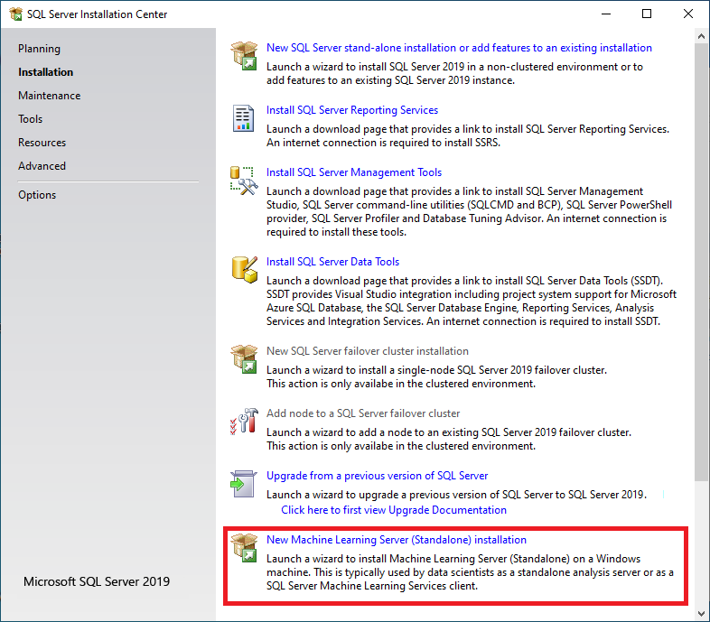
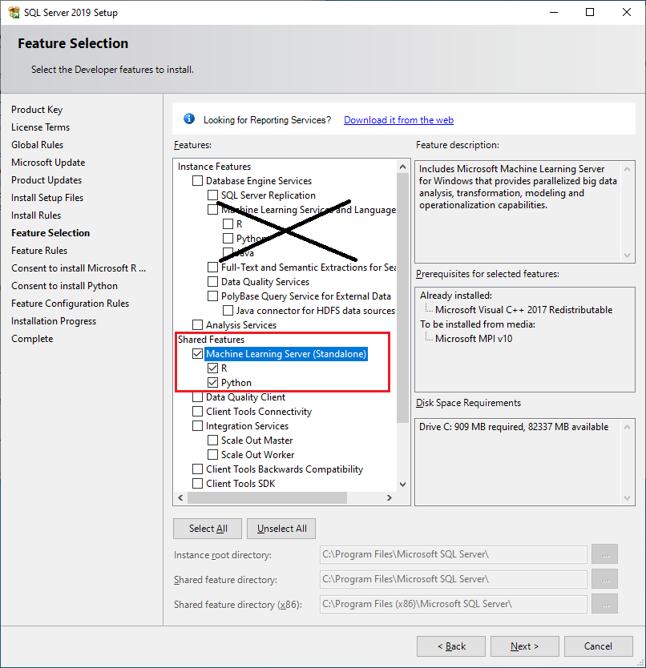

# Install Machine Learning Server (Standalone) or R Server (Standalone) using SQL Server Setup
[!INCLUDE [SQL Server 2016 2017 2019](../../includes/applies-to-version/sqlserver2016-2019-only.md)]

[!INCLUDE [ML Server retirement banner](~/includes/machine-learning-server-retirement.md)]

> [!IMPORTANT]
> Machine Learning Server (Standalone) is not shipped with [!INCLUDE[sssql22-md](../../includes/sssql22-md.md)]. This article refers to a retired feature of [!INCLUDE[sssql16-md](../../includes/sssql16-md.md)], [!INCLUDE[sssql17-md](../../includes/sssql17-md.md)], and [!INCLUDE[sssql19-md](../../includes/sssql19-md.md)].

::: moniker range="=sql-server-2017||=sql-server-ver15"
SQL Server Setup includes a **shared feature** option for installing a standalone machine learning server that runs outside of SQL Server. It's called **Machine Learning Server (Standalone)** and includes Python and R. 
::: moniker-end
::: moniker range="=sql-server-2016"
SQL Server Setup includes a **shared feature** option for installing a standalone machine learning server that runs outside of SQL Server. In SQL Server 2016, this feature is called **R Server (Standalone)**.  
::: moniker-end

A standalone server as installed by SQL Server Setup supports use cases and scenarios such as the following:

+ Remote execution, switching between local and remote sessions in the same console
+ Operationalization with web nodes and compute nodes
+ Web service deployment: the ability to package R and Python script into web services
+ Complete collection of R and Python function libraries

As an independent server decoupled from SQL Server, the R and Python environment is configured, secured, and accessed using the underlying operating system and tools provided in the standalone server, not SQL Server.

As an adjunct to SQL Server, a standalone server is useful if you need to develop high-performance machine learning solutions that can use remote compute contexts to the full range of supported data platforms. You can shift execution from the local server to a remote Machine Learning Server on a Spark cluster or on another SQL Server instance.

<a name="bkmk_prereqs"> </a>

## Pre-install checklist

If you installed a previous version, such as SQL Server 2016 R Server (Standalone) or Microsoft R Server, uninstall the existing installation before continuing.

As a general rule, we recommend that you treat standalone server and database engine instance-aware installations as mutually exclusive to avoid resource contention, but if you have sufficient resources, there is no prohibition against installing them both on the same physical computer.

You can only have one standalone server on the computer: either SQL Server Machine Learning Server (Standalone) or SQL Server R Server (Standalone). Be sure to uninstall one version before adding a new one.

::: moniker range="=sql-server-2016"
<a name="bkmk_ga_instalpatch"></a> 

 ###  Install patch requirement 

For SQL Server 2016 only: Microsoft has identified a problem with the specific version of Microsoft VC++ 2013 Runtime binaries that are installed as a prerequisite by SQL Server. If this update to the VC runtime binaries is not installed, SQL Server may experience stability issues in certain scenarios. Before you install SQL Server follow the instructions at [SQL Server Release Notes](../../sql-server/sql-server-2016-release-notes.md#bkmk_ga_instalpatch) to see if your computer requires a patch for the VC runtime binaries.  
::: moniker-end

## Get the installation media

[!INCLUDE[GetInstallationMedia](../../includes/getssmedia.md)]

::: moniker range=">=sql-server-2017"
## Run Setup

For local installations, you must run Setup as an administrator. If you install [!INCLUDE[ssNoVersion](../../includes/ssnoversion-md.md)] from a remote share, you must use a domain account that has read and execute permissions on the remote share.

1. Start the installation wizard.

2. Click the **Installation** tab, and select **New Machine Learning Server (Standalone) installation**.
    
   ::: moniker-end
   ::: moniker range="=sql-server-2017"
   
   ::: moniker-end
   ::: moniker range="=sql-server-ver15"
   
   ::: moniker-end
   ::: moniker range=">=sql-server-2017"

3. After the rules check is complete, accept SQL Server licensing terms, and select a new installation.

4. On the **Feature Selection** page, the following options should already be selected:

    - **Microsoft Machine Learning Server (Standalone)**

    - **R** and **Python** are both selected by default. You can deselect either language, but we recommend that you install at least one of the supported languages.

   ::: moniker-end
   ::: moniker range="=sql-server-2017"
   
   ::: moniker-end
   ::: moniker range="=sql-server-ver15"
   
   ::: moniker-end
   ::: moniker range=">=sql-server-2017"
    
   All other options should be ignored. 
    
   > [!NOTE]
   > Avoid installing the **Shared Features** if the computer already has Machine Learning Services installed for SQL Server in-database analytics. This creates duplicate libraries.
   > 
   > Also, whereas R or Python scripts running in SQL Server are managed by SQL Server so as not to conflict with memory used by other database engine services, the standalone machine learning server has no such constraints, and can interfere with other database operations. Finally, remote access via RDP session, which is often used for operationalization, is typically blocked by database administrators.
   > 
   > For these reasons, we generally recommend that you install Machine Learning Server (Standalone) on a separate computer from SQL Server Machine Learning Services.

5. Accept the license terms for downloading and installing base language distributions. When the **Accept** button becomes unavailable, you can click **Next**. 

6. On the **Ready to Install** page, verify your selections, and click **Install**.
::: moniker-end

::: moniker range="=sql-server-2016"
## Run Setup

For local installations, you must run Setup as an administrator. If you install [!INCLUDE[ssNoVersion](../../includes/ssnoversion-md.md)] from a remote share, you must use a domain account that has read and execute permissions on the remote share.

1. Start the installation wizard.

2. On the **Installation** tab, click **New R Server (Standalone) installation**.
    
   

3. After the rules check is complete, accept SQL Server licensing terms, and select a new installation.

4. On the **Feature Selection** page, the following option should be already selected:
    
   - **R Server (Standalone)**  
    
   
    
   All other options can be ignored. 
    
   > [!NOTE]
   > Avoid installing the **Shared Features** if you are running setup on a computer where R Services has already been installed for SQL Server in-database analytics. This creates duplicate libraries.
   > 
   > Whereas R scripts running in SQL Server are managed by SQL Server so as not to conflict with memory used by other database engine services, the standalone R Server has no such constraints, and can interfere with other database operations.
   > 
   > We generally recommend that you install R Server (Standalone) on a separate computer from SQL Server R Services (In-Database).

5. Accept the license terms for downloading and installing base language distributions. When the **Accept** button becomes unavailable, you can click **Next**. 

6. On the **Ready to Install** page, verify your selections, and click **Install**.
::: moniker-end

## Set environment variables

For R feature integration only, you should set the **MKL_CBWR** environment variable to [ensure consistent output](https://software.intel.com/articles/introduction-to-the-conditional-numerical-reproducibility-cnr) from Intel Math Kernel Library (MKL) calculations.

1. In Control Panel, click **System and Security** > **System** > **Advanced System Settings** > **Environment Variables**.

2. Create a new User or System variable. 

  + Set variable name to `MKL_CBWR`
  + Set the variable value to `AUTO`

3. Restart the server.

<a name="install-path"></a>

### Default installation folders

For R and Python development, it's common to have multiple versions on the same computer. As installed by SQL Server setup, the base distribution is installed in a folder associated with the SQL Server version that you used for setup.

The following table lists the paths for R and Python distributions created by Microsoft installers. For completeness, the table includes paths generated by SQL Server setup as well as the standalone installer for Microsoft Machine Learning Server.

|Version| Installation method | Default folder|
|----|----|----|
|SQL Server 2019 Machine Learning Server (Standalone) |  SQL Server 2019 setup wizard |`C:\Program Files\Microsoft SQL Server\150\R_SERVER` <br/>`C:\Program Files\Microsoft SQL Server\150\PYTHON_SERVER`|
|SQL Server 2017 Machine Learning Server (Standalone) |  SQL Server 2017 setup wizard |`C:\Program Files\Microsoft SQL Server\140\R_SERVER` <br/>`C:\Program Files\Microsoft SQL Server\140\PYTHON_SERVER`|
|Microsoft Machine Learning Server (Standalone) |  Windows standalone installer |`C:\Program Files\Microsoft\ML Server\R_SERVER`<br/>`C:\Program Files\Microsoft\ML Server\PYTHON_SERVER`|
|SQL Server Machine Learning Services (In-Database) |SQL Server 2019 setup wizard, with R language option|`C:\Program Files\Microsoft SQL Server\MSSQL15.<instance_name>\R_SERVICES`  <br/>`C:\Program Files\Microsoft SQL Server\MSSQL15.<instance_name>\PYTHON_SERVICES` |
|SQL Server Machine Learning Services (In-Database) |SQL Server 2017 setup wizard, with R language option|`C:\Program Files\Microsoft SQL Server\MSSQL14.<instance_name>\R_SERVICES`  <br/>`C:\Program Files\Microsoft SQL Server\MSSQL14.<instance_name>\PYTHON_SERVICES` |
|SQL Server 2016 R Server (Standalone) |  SQL Server 2016 setup wizard |`C:\Program Files\Microsoft SQL Server\130\R_SERVER`|
|SQL Server 2016 R Services (In-Database) |SQL Server 2016 setup wizard|`C:\Program Files\Microsoft SQL Server\MSSQL13.<instance_name>\R_SERVICES`|

<a name="apply-cu"></a>

## Apply updates

We recommend that you apply the latest cumulative update to both the database engine and machine learning components. Cumulative updates are installed through the Setup program. 

On internet-connected devices, you can download a self-extracting executable. Applying an update for the database engine automatically pulls in cumulative updates for existing R and Python features. 

On disconnected servers, extra steps are required. You must obtain the cumulative update for the database engine as well as the CAB files for machine learning features. All files must be transferred to the isolated server and applied manually.

1. Start with a baseline instance. You can only apply cumulative updates to existing installations:

  + Machine Learning Server (Standalone) from SQL Server 2019 initial release
  + Machine Learning Server (Standalone) from SQL Server 2017 initial release
  + R Server (Standalone) from SQL Server 2016 initial release, SQL Server 2016 SP 1, or SQL Server 2016 SP 2

2. Close any open R or Python sessions and stop any processes still running on the system.

3. If you enabled operationalization to run as web nodes and compute nodes for web service deployments, back up the **AppSettings.json** file as a precaution. Applying SQL Server 2017 CU13 or later revises this file, so you might want a backup copy to preserve the original version.

4. On an internet connected machine, download the latest cumulative update for your version from the [Latest updates for Microsoft SQL Server](../../database-engine/install-windows/latest-updates-for-microsoft-sql-server.md).

5. Download the latest cumulative update. It is an executable file.

6. On an internet-connected device, double-click the .exe to run Setup and step through the wizard to accept licensing terms, review affected features, and monitor progress until completion.

7. On a server with no internet connectivity:

   + Get corresponding CAB files for R and Python. For download links, see [CAB downloads for cumulative updates on SQL Server in-database analytics instances](sql-ml-cab-downloads.md).

   + Transfer all files, the main executable and CAB files, to a folder on the offline computer.

   + Double-click the .exe to run Setup. When installing a cumulate update on a server with no internet connectivity, you are prompted to select the location of the .cab files for R and Python.

8. Post-install, on a server for which you have enabled deployment with web nodes and compute nodes, edit **AppSettings.json**, adding an "MMLResourcePath" entry, directly under "MMLNativePath". For example:

    ```json
    "ScorerParameters": {
        "MMLNativePath": "C:\Program Files\Microsoft SQL Server\140\R_SERVER\library\MicrosoftML\mxLibs\x64\",
        "MMLResourcePath": "C:\Program Files\Microsoft SQL Server\140\R_SERVER\library\MicrosoftML\mxLibs\x64\"
    }
    ```

9. [Run the admin CLI utility](/machine-learning-server/operationalize/configure-admin-cli-launch) to restart the web and compute nodes. For steps and syntax, see [Monitor, start, and stop web and compute nodes](/machine-learning-server/operationalize/configure-admin-cli-stop-start).

## Development tools

A development IDE is not installed as part of setup. For more information about configuring a development environment, see [Set up R tools](../r/set-up-data-science-client.md) and [Set up Python tools](../python/setup-python-client-tools-sql.md).

## Next steps

R developers can get started with some simple examples, and learn the basics of how R works with SQL Server. For your next step, see the following links:

+ [Quickstart: Run R in T-SQL](../tutorials/quickstart-r-create-script.md)
+ [Tutorial: In-database analytics for R developers](../tutorials/r-taxi-classification-introduction.md)

::: moniker range=">=sql-server-2017"
Python developers can learn how to use Python with SQL Server by following these tutorials:

+ [Python tutorial: Predict ski rental with linear regression in SQL Server Machine Learning Services](../tutorials/python-ski-rental-linear-regression-deploy-model.md)
+ [Python tutorial: Categorizing customers using k-means clustering with SQL Server Machine Learning Services](../tutorials/python-clustering-model.md)
::: moniker-end
