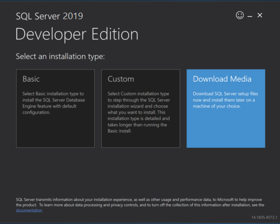
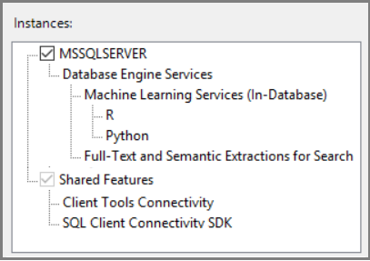

# Offline install SQL Server Machine Learning Services on Windows computers with no internet access

[!INCLUDE [SQL Server 2016 and later](../../includes/applies-to-version/sqlserver2016.md)]

This article describes how to install SQL Server Machine Learning Services on Windows offline on computers with no internet access isolated behind a network firewall.

By default, installers connect to Microsoft download sites to get required and updated components for machine learning on SQL Server. If firewall constraints prevent the installer from reaching these sites, you can use an internet-connected device to download files, transfer files to an offline server, and then run setup.

> [!IMPORTANT]
> Beginning with SQL Server 2022, R, Python, and Java runtimes are **no longer installed with SQL Setup** and **don't use CAB files**. Instead, you install your desired custom runtime(s) and packages separately. The offline installation process for SQL Server 2022 and later versions is similar to the online process — download and copy the runtime installers to the offline server. For CAB-based offline installation, see the SQL Server 2016, 2017, or 2019 sections in this article.

> [!NOTE]  
> Feature capabilities and installation options vary between versions of SQL Server. Use the version selector dropdown list to choose the appropriate version of SQL Server.

In-database analytics consist of database engine instance, plus additional components for R and Python integration, depending on the version of SQL Server.

- Beginning with [!INCLUDE [sssql22-md](../../includes/sssql22-md.md)], runtimes for R, Python, and Java, are no longer installed with SQL Setup. Instead, install your desired R and/or Python custom runtime(s) and packages. The offline installation process is therefore similar to the online process. For more information, see [Install SQL Server 2022 Machine Learning Services on Windows](sql-machine-learning-services-windows-install-sql-2022.md) or [Install SQL Server 2022 Machine Learning Services on Linux](../../linux/sql-server-linux-setup-machine-learning-sql-2022.md).
- SQL Server 2019 includes R, Python, and Java.
- SQL Server 2017 includes R and Python.
- SQL Server 2016 is R-only.

::: moniker range="=sql-server-ver16"

## SQL Server 2022 offline install

Offline installation of [!INCLUDE [sssql22-md](../../includes/sssql22-md.md)] is similar to the online installation experience.

1. Use SQL Setup to install the Machine Learning services feature.
1. Download any desired runtimes and copy them to the offline installation server. Custom runtimes for [!INCLUDE [sssql22-md](../../includes/sssql22-md.md)] are customer-installed. CAB files aren't used for [!INCLUDE [sssql22-md](../../includes/sssql22-md.md)].
1. Download any desired packages and copy them to the offline installation server. Otherwise, refer to instructions for installation from SQL Setup and installation of any desired custom packages:

   - [Install SQL Server 2022 Machine Learning Services (Python and R) on Windows](sql-machine-learning-services-windows-install-sql-2022.md)
   - [Install SQL Server Machine Learning Services (Python and R) on Linux](../../linux/sql-server-linux-setup-machine-learning-sql-2022.md)

::: moniker-end

::: moniker range="=sql-server-ver15"

On an isolated server, machine learning and R/Python language-specific features are added through CAB files.

## SQL Server 2019 offline install

To install SQL Server Machine Learning Services (R and Python) on an isolated server, start by downloading the initial release of SQL Server and the corresponding CAB files for R and Python support. Even if you plan to immediately update your server to use the latest cumulative update, an initial release must be installed first.

> [!NOTE]  
> SQL Server 2019 doesn't have service packs. The initial release is the only base line, with servicing through cumulative updates only.

### 1 - Download 2019 CABs

On a computer having an internet connection, download the CAB files providing R and Python features for the initial release and the installation media for SQL Server 2019.

Release  |Download link  |
---------|---------------|
Microsoft R Open        | [SRO_3.5.2.125_1033.cab](https://go.microsoft.com/fwlink/?linkid=2085686) |
Microsoft R Server      | [SRS_9.4.7.25_1033.cab](https://go.microsoft.com/fwlink/?linkid=2085792) |
Microsoft Python Open   | [SPO_4.5.12.120_1033.cab](https://go.microsoft.com/fwlink/?linkid=2085793) |
Microsoft Python Server | [SPS_9.4.7.25_1033.cab](https://go.microsoft.com/fwlink/?linkid=2085685) |

> [!NOTE]  
> The Java feature is included with the SQL Server installation media and doesn't need a separate CAB file.

### 2 - Get SQL Server 2019 installation media

1. On a computer having an internet connection, launch SQL Server 2019 Setup from your installation media.

1. Double-click setup and choose the **Download Media** installation type. With this option, setup creates a local .iso (or .cab) file containing the installation media.

   

::: moniker-end

::: moniker range="=sql-server-2017"

On an isolated server, machine learning and R/Python language-specific features are added through CAB files.

## SQL Server 2017 offline install

To install SQL Server Machine Learning Services (R and Python) on an isolated server, start by downloading the initial release of SQL Server and the corresponding CAB files for R and Python support. Even if you plan to immediately update your server to use the latest cumulative update, an initial release must be installed first.

> [!NOTE]  
> SQL Server 2017 doesn't have service packs. It's the first release of SQL Server to use the initial release as the only base line, with servicing through cumulative updates only.

### 1 - Download 2017 CABs

On a computer having an internet connection, download the CAB files providing R and Python features for the initial release and the installation media for SQL Server 2017.

Release  |Download link  |
---------|---------------|
Microsoft R Open     |[SRO_3.3.3.24_1033.cab](https://go.microsoft.com/fwlink/?LinkId=851496)|
Microsoft R Server      |[SRS_9.2.0.24_1033.cab](https://go.microsoft.com/fwlink/?LinkId=851507)|
Microsoft Python Open     |[SPO_9.2.0.24_1033.cab](https://go.microsoft.com/fwlink/?LinkId=851502) |
Microsoft Python Server    |[SPS_9.2.0.24_1033.cab](https://go.microsoft.com/fwlink/?LinkId=851508) |

### 2 - Get SQL Server 2017 installation media

1. On a computer having an internet connection, launch SQL Server 2017 Setup from your installation media.

1. Double-click setup and choose the **Download Media** installation type. With this option, setup creates a local .iso (or .cab) file containing the installation media.

   

::: moniker-end

::: moniker range="=sql-server-2017 || =sql-server-ver15"

## Transfer files

Copy the SQL Server installation media (.iso or .cab) and in-database analytics CAB files to the target computer. Place the CAB files and installation media file in the same folder on the target machine, such as the setup user's %TEMP% folder.

The %TEMP% folder is required for Python CAB files. For R, you can use %TEMP% or set the `myrcachedirectory` parameter to the CAB path.

## Run Setup

When you run SQL Server Setup on a computer disconnected from the internet, Setup adds an **Offline installation** page to the wizard so that you can specify the location of the CAB files you copied in the previous step.

1. To begin installation, double-click the .iso or .cab file to access the installation media. You should see the **setup.exe** file.

1. Right-click **setup.exe** and run as administrator.

1. When the setup wizard displays the licensing page for open-source R or Python components, select  **Accept**. Acceptance of licensing terms allows you to proceed to the next step.

1. When you get to the **Offline installation** page, in **Install Path**, specify the folder containing the CAB files you copied earlier.

1. Continue following the on-screen prompts to complete the installation.

::: moniker-end

## Apply cumulative updates

We recommend that you apply the latest cumulative update to both the database engine and machine learning components.

::: moniker range="=sql-server-ver16"

1. Start with a baseline instance. You can only apply cumulative updates to existing installations of the initial release of SQL Server.

1. On an internet connected device, go to the cumulative update list for your version of SQL Server. [See Determine the version, edition, and update level of SQL Server and its components](/troubleshoot/sql/general/determine-version-edition-update-level).

1. Select the latest cumulative update to download the executable.

1. Transfer all files to the same folder on the offline computer.

1. Run SQL Setup. Accept the licensing terms, and on the Feature selection page, review the features for which cumulative updates are applied. You should see every feature installed for the current instance, including machine learning features.

::: moniker-end

::: moniker range="=sql-server-2017 || =sql-server-ver15"

Cumulative updates are installed through the Setup program.

1. Start with a baseline instance. You can only apply cumulative updates to existing installations of the initial release of SQL Server.

1. On an internet connected device, go to the cumulative update list for your version of SQL Server. [See Determine the version, edition, and update level of SQL Server and its components](/troubleshoot/sql/general/determine-version-edition-update-level).

::: moniker-end

::: moniker range="=sql-server-2017 || =sql-server-ver15"
3. Select the latest cumulative update to download the executable.

1. Get corresponding CAB files for R and Python. For download links, see [CAB downloads for cumulative updates on SQL Server in-database analytics instances](sql-ml-cab-downloads.md).

1. Transfer all files, executable and CAB files, to the same folder on the offline computer.

1. Run Setup. Accept the licensing terms, and on the Feature selection page, review the features for which cumulative updates are applied. You should see every feature installed for the current instance, including machine learning features.

   

1. Continue through the wizard, accepting the licensing terms for R and Python distributions. During installation, you're prompted to choose the folder location containing the updated CAB files.
   ::: moniker-end

## Set environment variables

For R feature integration only, you should set the **MKL_CBWR** environment variable to [ensure consistent output](https://software.intel.com/articles/introduction-to-the-conditional-numerical-reproducibility-cnr) from Intel Math Kernel Library (MKL) calculations.

1. In Control Panel, select **System and Security** > **System** > **Advanced System Settings** > **Environment Variables**.

1. Create a new User or System variable.

   - Set variable name to `MKL_CBWR`
   - Set the variable value to `AUTO`

This step requires a server restart. If you're about to enable script execution, you can hold off on the restart until all of the configuration work is done.

## Post-install configuration

::: moniker range=">=sql-server-2017"
After installation is finished, restart the service and then configure the server to enable script execution:

- [Enable external script execution](sql-machine-learning-services-windows-install.md#bkmk_enableFeature)

An initial offline installation of SQL Server Machine Learning Services requires the same configuration as an online installation:

- [Verify installation](sql-machine-learning-services-windows-install.md#verify-installation)
- [Additional configuration as needed](sql-machine-learning-services-windows-install.md#additional-configuration)
  ::: moniker-end

## Related content

- [Install SQL Server Machine Learning Services (Python and R) on Windows](sql-machine-learning-services-windows-install.md)
- [Install SQL Server 2022 Machine Learning Services (Python and R) on Windows](sql-machine-learning-services-windows-install-sql-2022.md)
- [Install SQL Server 2019 Machine Learning Services (Python and R) on Linux](../../linux/install-upgrade/setup-machine-learning.md)
