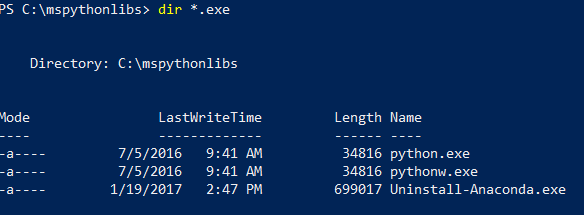
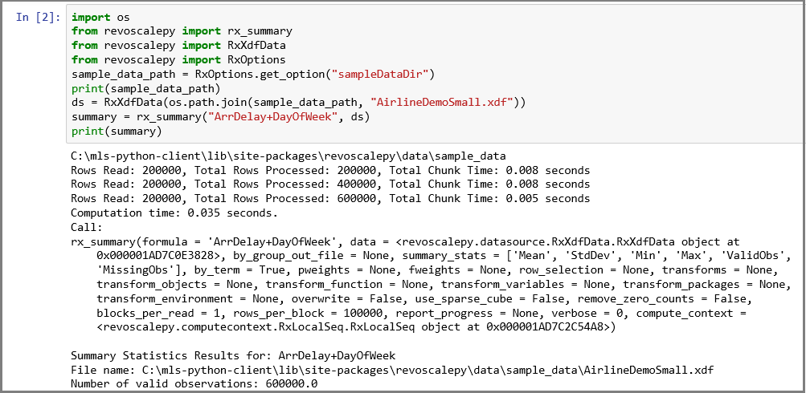
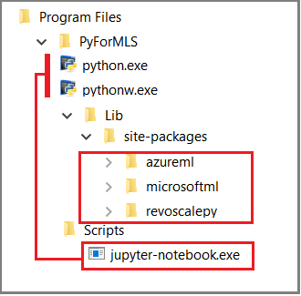

# Set up a data science client for Python development on SQL Server Machine Learning Services
[!INCLUDE [SQL Server 2016-2019 2019 linux only](../../includes/applies-to-version/sqlserver2016-2019-2019linux-only.md)]

Python integration is available in SQL Server 2017 and later, when you include the Python option in a [Machine Learning Services (In-Database) installation](../install/sql-machine-learning-services-windows-install.md). 

> [!NOTE]
> Currently this article applies to [!INCLUDE[sssql16-md](../../includes/sssql16-md.md)], [!INCLUDE[sssql17-md](../../includes/sssql17-md.md)], [!INCLUDE[sssql19-md](../../includes/sssql19-md.md)], and [!INCLUDE[sssql19-md](../../includes/sssql19-md.md)] for Linux only.

To develop and deploy Python solutions for SQL Server, install Microsoft's [revoscalepy](/machine-learning-server/python-reference/revoscalepy/revoscalepy-package) and other Python libraries your development workstation. The revoscalepy library, which is also on the remote SQL Server instance, coordinates computing requests between both systems. 

In this article, learn how to configure a Python development workstation so that you can interact with a remote SQL Server enabled for machine learning and Python integration. After completing the steps in this article, you will have the same Python libraries as those on SQL Server. You will also know how to push computations from a local Python session to a remote Python session on SQL Server.


To validate the installation, you can use built-in Jupyter Notebooks as described in this article, or [link the libraries](#install-ide) to PyCharm or any another IDE that you normally use.

> [!Tip]
> For a video demonstration of these exercises, see [Run R and Python remotely in SQL Server from Jupyter Notebooks](https://youtu.be/D5erljpJDjE).

## Commonly used tools

Whether you are a Python developer new to SQL, or a SQL developer new to Python and in-database analytics, you will need both a Python development tool and a T-SQL query editor such as [SQL Server Management Studio (SSMS)](../../ssms/download-sql-server-management-studio-ssms.md) to exercise all of the capabilities of in-database analytics.

For Python development, you can use Jupyter Notebooks, which come bundled in the Anaconda distribution installed by SQL Server. This article explains how to start Jupyter Notebooks so that you can run Python code locally and remotely on SQL Server.

SSMS is a separate download, useful for creating and running stored procedures on SQL Server, including those containing Python code. Almost any Python code that you write in Jupyter Notebooks can be embedded in a stored procedure. You can step through other quickstarts to learn about [SSMS and embedded Python](../tutorials/quickstart-python-create-script.md).

## 1 - Install Python packages

Local workstations must have the same Python package versions as those on SQL Server, including the base [Anaconda 4.2.0](https://anaconda.org/conda-forge/opencv/files?version=4.2.0) with [Python 3.5.2 distribution](https://www.python.org/downloads/release/python-352/), and Microsoft-specific packages.

An installation script adds three Microsoft-specific libraries to the Python client. The script installs: 

- [revoscalepy](/machine-learning-server/python-reference/revoscalepy/revoscalepy-package), used for defining data source objects and the compute context. 
- [microsoftml](../python/ref-py-microsoftml.md) providing machine learning algorithms. 
- [azureml](/machine-learning-server/python-reference/azureml-model-management-sdk/azureml-model-management-sdk) which applies to operationalization tasks associated with a standalone server context and might be of limited use for in-database analytics.

1. Download an installation script.

   + [https://aka.ms/mls-py](https://aka.ms/mls-py) installs version 9.2.1 of the Microsoft Python packages. This version corresponds to a default SQL Server instance. 

   + [https://aka.ms/mls93-py](https://aka.ms/mls93-py) installs version 9.3 of the Microsoft Python packages.

2. Open a PowerShell window with elevated administrator permissions (right-click **Run as administrator**).

3. Go to the folder in which you downloaded the installer and run the script. Add the `-InstallFolder` command-line argument to specify a folder location for the libraries. For example: 

   ```python
   cd {{download-directory}}
   .\Install-PyForMLS.ps1 -InstallFolder "C:\path-to-python-for-mls"
   ```

If you omit the install folder, the default is `%ProgramFiles%\Microsoft\PyForMLS`.

Installation takes some time to complete. You can monitor progress in the PowerShell window. When setup is finished, you have a complete set of packages. 

> [!Tip] 
> We recommend the [Python for Windows FAQ](https://docs.python.org/3/faq/windows.html) for general purpose information on running Python programs on Windows.

## 2 - Locate executables

Still in PowerShell, list the contents of the installation folder to confirm that Python.exe, scripts, and other packages are installed. 

1. Enter `cd \` to go to the root drive, and then enter the path you specified for `-InstallFolder` in the previous step. If you omitted this parameter during installation, the default is `cd %ProgramFiles%\Microsoft\PyForMLS`.

2. Enter `dir *.exe` to list the executables. You should see **python.exe**, **pythonw.exe**, and **uninstall-anaconda.exe**.

   
   
On systems having multiple versions of Python, remember to use this particular Python.exe if you want to load **revoscalepy** and other Microsoft packages.

> [!Note] 
> The installation script does not modify the PATH environment variable on your computer, which means that the new python interpreter and modules you just installed are not automatically available to other tools you might have. For help on linking the Python interpreter and libraries to tools, see [Install an IDE](#install-ide).

<a name="python-tools"></a>

## 3 - Open Jupyter Notebooks

Anaconda includes Jupyter Notebooks. As a next step, create a notebook and run some Python code containing the libraries you just installed.

1. At the PowerShell prompt, still in the `%ProgramFiles%\Microsoft\PyForMLS` directory, open Jupyter Notebooks from the Scripts folder:

   ```powershell
   .\Scripts\jupyter-notebook
   ```

   A notebook should open in your default browser at `https://localhost:8889/tree`.

   Another way to start is double-click **jupyter-notebook.exe**. 

2. Select **New** and then select **Python 3**.

   

3. Enter `import revoscalepy` and run the command to load one of the Microsoft-specific libraries.

4. Enter and run `print(revoscalepy.__version__)` to return the version information. You should see 9.2.1 or 9.3.0. You can use either of these versions with [revoscalepy on the server](../package-management/r-package-information.md).

4. Enter a more complex series of statements. This example generates summary statistics using [rx_summary](/machine-learning-server/python-reference/revoscalepy/rx-summary) over a local data set. Other functions get the location of the sample data and create a data source object for a local .xdf file.

   ```python
   import os
   from revoscalepy import rx_summary
   from revoscalepy import RxXdfData
   from revoscalepy import RxOptions
   sample_data_path = RxOptions.get_option("sampleDataDir")
   print(sample_data_path)
   ds = RxXdfData(os.path.join(sample_data_path, "AirlineDemoSmall.xdf"))
   summary = rx_summary("ArrDelay+DayOfWeek", ds)
   print(summary)
   ```

The following screenshot shows the input and a portion of the output, trimmed for brevity.

  

## 4 - Get SQL permissions

To connect to an instance of SQL Server to run scripts and upload data, you must have a valid login on the database server. You can use either a SQL login or integrated Windows authentication. We generally recommend that you use Windows integrated authentication, but using the SQL login is simpler for some scenarios, particularly when your script contains connection strings to external data.

At a minimum, the account used to run code must have permission to read from the databases you are working with, plus the special permission EXECUTE ANY EXTERNAL SCRIPT. Most developers also require permissions to create stored procedures, and to write data into tables containing training data or scored data. 

Ask the database administrator to [configure the following permissions for your account](../security/user-permission.md), in the database where you use Python:

+ **EXECUTE ANY EXTERNAL SCRIPT** to run Python on the server.
+ **db_datareader** privileges to run the queries used for training the model.
+ **db_datawriter** to write training data or scored data.
+ **db_owner** to create objects such as stored procedures, tables, functions. 
  You also need **db_owner** to create sample and test databases. 

If your code requires packages that are not installed by default with SQL Server, arrange with the database administrator to have the packages installed with the instance. SQL Server is a secured environment and there are restrictions on where packages can be installed. Ad hoc installation of packages as part of your code is not recommended, even if you have rights. Also, always carefully consider the security implications before installing new packages in the server library.


<a name="create-iris-remotely"></a>

## 5 - Create test data

If you have permissions to create a database on the remote server, you can run the following code to create the Iris demo database used for the remaining steps in this article.

### 5-1 - Create the irissql database remotely

```python
import pyodbc

# creating a new db to load Iris sample in
new_db_name = "irissql"
connection_string = "Driver=SQL Server;Server=localhost;Database={0};Trusted_Connection=Yes;" 
                        # you can also swap Trusted_Connection for UID={your username};PWD={your password}
cnxn = pyodbc.connect(connection_string.format("master"), autocommit=True)
cnxn.cursor().execute("IF EXISTS(SELECT * FROM sys.databases WHERE [name] = '{0}') DROP DATABASE {0}".format(new_db_name))
cnxn.cursor().execute("CREATE DATABASE " + new_db_name)
cnxn.close()

print("Database created")
```

### 5-2 - Import Iris sample from SkLearn

```python
from sklearn import datasets
import pandas as pd

# SkLearn has the Iris sample dataset built in to the package
iris = datasets.load_iris()
df = pd.DataFrame(iris.data, columns=iris.feature_names)
```

### 5-3 - Use Revoscalepy APIs to create a table and load the Iris data

```python
from revoscalepy import RxSqlServerData, rx_data_step

# Example of using RX APIs to load data into SQL table. You can also do this with pyodbc
table_ref = RxSqlServerData(connection_string=connection_string.format(new_db_name), table="iris_data")
rx_data_step(input_data = df, output_file = table_ref, overwrite = True)

print("New Table Created: Iris")
print("Sklearn Iris sample loaded into Iris table")
```

## 6 - Test remote connection

Before trying this next step, make sure you have permissions on the SQL Server instance and a connection string to the [Iris sample database](../tutorials/demo-data-iris-in-sql.md). If the database doesn't exist and you have sufficient permissions, you can [create a database using these inline instructions](#create-iris-remotely).

Replace the connection string with valid values. The sample code uses `"Driver=SQL Server;Server=localhost;Database=irissql;Trusted_Connection=Yes;"` but your code should specify a remote server, possibly with an instance name, and a credential option that maps to a database login.

### 6-1 Define a function

The following code defines a function that you will send to SQL Server in a later step. When executed, it uses data and libraries (revoscalepy, pandas, matplotlib) on the remote server to create scatter plots of the iris data set. It returns the bytestream of the .png back to Jupyter Notebooks to render in the browser.

```python
def send_this_func_to_sql():
    from revoscalepy import RxSqlServerData, rx_import
    from pandas.tools.plotting import scatter_matrix
    import matplotlib.pyplot as plt
    import io
    
    # remember the scope of the variables in this func are within our SQL Server Python Runtime
    connection_string = "Driver=SQL Server;Server=localhost;Database=irissql;Trusted_Connection=Yes;"
    
    # specify a query and load into pandas dataframe df
    sql_query = RxSqlServerData(connection_string=connection_string, sql_query = "select * from iris_data")
    df = rx_import(sql_query)
    
    scatter_matrix(df)
    
    # return bytestream of image created by scatter_matrix
    buf = io.BytesIO()
    plt.savefig(buf, format="png")
    buf.seek(0)
    
    return buf.getvalue()
```

### 6-2 Send the function to SQL Server

In this example, create the remote compute context and then send the execution of the function to SQL Server with [rx_exec](/machine-learning-server/python-reference/revoscalepy/rx-exec). The **rx_exec** function is useful because it accepts a compute context as an argument. Any function that you want to execute remotely must have a compute context argument. Some functions, such as [rx_lin_mod](/machine-learning-server/python-reference/revoscalepy/rx-lin-mod) support this argument directly. For operations that don't, you can use **rx_exec** to deliver your code in a remote compute context.

In this example, no raw data had to be transferred from SQL Server to the Jupyter Notebook. All computations occur within the Iris database and only the image file is returned to the client.

```python
from IPython import display
import matplotlib.pyplot as plt 
from revoscalepy import RxInSqlServer, rx_exec

# create a remote compute context with connection to SQL Server
sql_compute_context = RxInSqlServer(connection_string=connection_string.format(new_db_name))

# use rx_exec to send the function execution to SQL Server
image = rx_exec(send_this_func_to_sql, compute_context=sql_compute_context)[0]

# only an image was returned to my jupyter client. All data remained secure and was manipulated in my db.
display.Image(data=image)
```

The following screenshot shows the input and scatter plot output.

  


<a name="install-ide"></a>

## 7 - Start Python from tools

Because developers frequently work with multiple versions of Python, setup does not add Python to your PATH. To use the Python executable and libraries installed by setup, link your IDE to **Python.exe** at the path that also provides **revoscalepy** and **microsoftml**. 

### Command line

When you run **Python.exe** from `%ProgramFiles%\Microsoft\PyForMLS` (or whatever location you specified for the Python client library installation), you have access to the full Anaconda distribution plus the Microsoft Python modules, **revoscalepy** and **microsoftml**.

1. Go to `%ProgramFiles%\Microsoft\PyForMLS` and execute **Python.exe**.
2. Open interactive help: `help()`.
3. Type the name of a module at the help prompt: `help> revoscalepy`. Help returns the name, package contents, version, and file location.
4. Return version and package information at the **help>** prompt: `revoscalepy`. Press Enter a few times to exit help.
5. Import a module: `import revoscalepy`.


### Jupyter Notebooks

This article uses built-in Jupyter Notebooks to demonstrate function calls to **revoscalepy**. If you are new to this tool, the following screenshot illustrates how the pieces fit together and why it all "just works". 

The parent folder `%ProgramFiles%\Microsoft\PyForMLS` contains Anaconda plus the Microsoft packages. Jupyter Notebooks is included in Anaconda, under the Scripts folder, and the Python executables are auto-registered with Jupyter Notebooks. Packages found under site-packages can be imported into a notebook, including the three Microsoft packages used for data science and machine learning.

  

If you are using another IDE, you will need to link the Python executables and function libraries to your tool. The following sections provide instructions for commonly used tools.

### Visual Studio

If you have [Python in Visual Studio](https://code.visualstudio.com/docs/languages/python), use the following configuration options to create a Python environment that includes the Microsoft Python packages.

| Configuration setting | value |
|-----------------------|-------|
| **Prefix path** | `%ProgramFiles%\Microsoft\PyForMLS` |
| **Interpreter path** | `%ProgramFiles%\Microsoft\PyForMLS\python.exe` |
| **Windowed interpreter** | `%ProgramFiles%\Microsoft\PyForMLS\pythonw.exe` |

For help with configuring a Python environment, see [Managing Python environments in Visual Studio](/visualstudio/python/managing-python-environments-in-visual-studio).

### PyCharm

In PyCharm, set the interpreter to the Python executable installed.

1. In a new project, in Settings, select **Add Local**.

2. Enter `%ProgramFiles%\Microsoft\PyForMLS\`.

You can now import **revoscalepy**, **microsoftml**, or **azureml** modules. You can also choose **Tools** > **Python Console** to open an interactive window.

## Next steps

Now that you have tools and a working connection to SQL Server, expand your skills by running through the Python quickstarts using [SQL Server Management Studio (SSMS)](../../ssms/download-sql-server-management-studio-ssms.md).

> [!div class="nextstepaction"]
> [Quickstart: Create and run simple Python scripts with SQL Server Machine Learning Services](../tutorials/quickstart-python-create-script.md)
