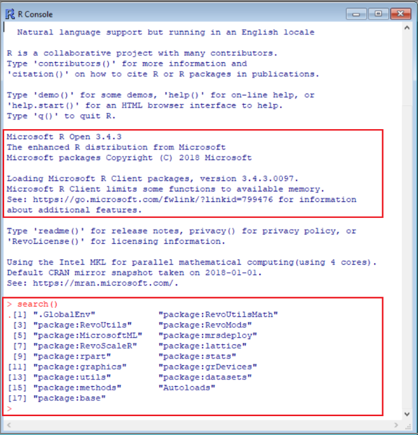
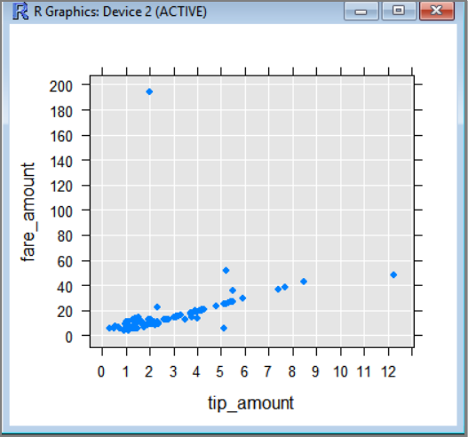

# Set up a data science client for R development on SQL Server
[!INCLUDE [SQL Server 2016-2019 2019 linux only](../../includes/applies-to-version/sqlserver2016-2019-2019linux-only.md)]

R integration is available in SQL Server 2016 or later when you include the R language option in an [SQL Server 2016 R Services](../install/sql-r-services-windows-install.md) or [SQL Server Machine Learning Services (In-Database)](../install/sql-machine-learning-services-windows-install.md) installation. 

> [!NOTE]
> Currently this article applies to [!INCLUDE[sssql16-md](../../includes/sssql16-md.md)], [!INCLUDE[sssql17-md](../../includes/sssql17-md.md)], [!INCLUDE[sssql19-md](../../includes/sssql19-md.md)], and [!INCLUDE[sssql19-md](../../includes/sssql19-md.md)] for Linux only.

To develop and deploy R solutions for SQL Server, install [Microsoft R Client](/machine-learning-server/r-client/what-is-microsoft-r-client) on your development workstation to get [RevoScaleR](/machine-learning-server/r-reference/revoscaler/revoscaler) and other R libraries. The RevoScaleR library, which is also required on the remote SQL Server instance, coordinates computing requests between both systems. 

In this article, learn how to configure an R client development workstation so that you can interact with a remote SQL Server enabled for machine learning and R integration. After completing the steps in this article, you will have the same R libraries as those on SQL Server. You will also know how to push computations from a local R session to a remote R session on SQL Server.


To validate the installation, you can use built-in **RGUI** tool as described in this article, or [link the libraries to RStudio or any another IDE](#install-ide) that you normally use.

## Commonly used tools

Whether you are an R developer new to SQL, or a SQL developer new to R and in-database analytics, you will need both an R development tool and a T-SQL query editor such as [SQL Server Management Studio (SSMS)](../../ssms/download-sql-server-management-studio-ssms.md) to exercise all of the capabilities of in-database analytics.

For simple R development scenarios, you can use the RGUI executable, bundled in the base R distribution in MRO and SQL Server. This article explains how to use RGUI for both local and remote R sessions. For improved productivity, you should use a full-featured IDE such as [RStudio or Visual Studio](#install-ide).

SSMS is a separate download, useful for creating and running stored procedures on SQL Server, including those containing R code. Almost any R code that you write in a development environment can be embedded in a stored procedure. You can step through other tutorials to learn about [SSMS and embedded R](../tutorials/r-taxi-classification-introduction.md).

## 1 - Install R packages

Microsoft's R packages are available in multiple products and services. On a local workstation, we recommend installing Microsoft R Client. R Client provides [RevoScaleR](/machine-learning-server/r-reference/revoscaler/revoscaler), [MicrosoftML](ref-r-microsoftml.md), [SQLRUtils](ref-r-sqlrutils.md), and other R packages.

1. [Download Microsoft R Client](https://aka.ms/rclient/download).

2. In the installation wizard, accept or change default installation path, accept or change the components list, and accept the Microsoft R Client license terms.

   When installation is finished, a welcome screen introduces you to the product and documentation.

3. Create an MKL_CBWR system environment variable to ensure consistent output on Intel Math Kernel Library (MKL) calculations.

   + In Control Panel, select **System and Security** > **System** > **Advanced System Settings** > **Environment Variables**.
   + Create a new System variable named **MKL_CBWR**, with a value set to **AUTO**.

## 2 - Locate executables

Locate and list the contents of the installation folder to confirm that R.exe, RGUI, and other packages are installed. 

1. In File Explorer, open the `%ProgramFiles%\Microsoft\R Client\R_SERVER\bin` folder to confirm the location of `R.exe`.

2. Open the x64 subfolder to confirm **RGUI**. You will use this tool in the next step.

3. Open `%ProgramFiles%\Microsoft\R Client\R_SERVER\library` to review the list of packages installed with R Client, including RevoScaleR, MicrosoftML, and others.


<a name="R-tools"></a>
 
## 3 - Start RGUI

When you install R with SQL Server, you get the same R tools that are standard to any base installation of R, such as RGui, Rterm, and so forth. These tools are lightweight, useful for checking package and library information, running ad hoc commands or script, or stepping through tutorials. You can use these tools to get R version information and confirm connectivity.

1. Open `%ProgramFiles%\Microsoft\R Client\R_SERVER\bin\x64` and double-click **RGui** to start an R session with an R command prompt.

   When you start an R session from a Microsoft program folder, several packages, including RevoScaleR, load automatically. 

2. Enter `print(Revo.version)` at the command prompt to return RevoScaleR package version information. You should have version 9.2.1 or 9.3.0 for RevoScaleR.

3. Enter **search()** at the R prompt for a list of installed packages.

   


## 4 - Get SQL permissions

In R Client, R processing is capped at two threads and in-memory data. For scalable processing using multiple cores and large data sets, you can shift execution (referred to as *compute context*) to the data sets and computational power of a remote SQL Server instance. This is the recommended approach for client integration with a production SQL Server instance, and you will need permissions and connection information to make it work.

To connect to an instance of SQL Server to run scripts and upload data, you must have a valid login on the database server. You can use either a SQL login or integrated Windows authentication. We generally recommend that you use Windows integrated authentication, but using the SQL login is simpler for some scenarios, particularly when your script contains connection strings to external data.

At a minimum, the account used to run code must have permission to read from the databases you are working with, plus the special permission EXECUTE ANY EXTERNAL SCRIPT. Most developers also require permissions to create stored procedures, and to write data into tables containing training data or scored data. 

Ask the database administrator to [configure the following permissions for your account](../security/user-permission.md), in the database where you use R:

+ **EXECUTE ANY EXTERNAL SCRIPT** to run R script on the server.
+ **db_datareader** privileges to run the queries used for training the model.
+ **db_datawriter** to write training data or scored data.
+ **db_owner** to create objects such as stored procedures, tables, functions. 
  You also need **db_owner** to create sample and test databases. 

If your code requires packages that are not installed by default with SQL Server, arrange with the database administrator to have the packages installed with the instance. SQL Server is a secured environment and there are restrictions on where packages can be installed. For more information, see [Install new R packages on SQL Server](../package-management/install-additional-r-packages-on-sql-server.md).

## 5 - Test connections

As a verification step, use **RGUI** and RevoScaleR to confirm connectivity to the remote server. SQL Server must be enabled for [remote connections](../../database-engine/configure-windows/view-or-configure-remote-server-connection-options-sql-server.md) and you must have permissions, including a user login and a database to connect to. 

The following steps assume the demo database, [NYCTaxi_Sample](../tutorials/demo-data-nyctaxi-in-sql.md), and Windows authentication.

1. Open **RGUI** on the client workstation. For example, go to `~\Program Files\Microsoft SQL Server\140\R_SERVER\bin\x64` and double-click **RGui.exe** to start it.

2. RevoScaleR loads automatically. Confirm RevoScaleR is operational by running this command: `print(Revo.version)`

3. Enter demo script that executes on the remote server. You must modify the following sample script to include a valid name for a remote SQL Server instance. This session begins as a local session, but the **rxSummary** function executes on the remote SQL Server instance.

   ```R
   # Define a connection. Replace server with a valid server name.
   connStr <- "Driver=SQL Server;Server=<your-server-name>;Database=NYCTaxi_Sample;Trusted_Connection=true"
  
   # Specify the input data in a SQL query.
   sampleQuery <-"SELECT DISTINCT TOP(100) tip_amount FROM [dbo].nyctaxi_sample ORDER BY tip_amount DESC;"
  
   # Define a remote compute context based on the remote server.
   cc <-RxInSqlServer(connectionString=connStr)

   # Execute the function using the remote compute context.
   rxSummary(formula = ~ ., data = RxSqlServerData(sqlQuery=sampleQuery, connectionString=connStr), computeContext=cc)
   ```

   **Results:**

   This script connects to a database on the remote server, provides a query, creates a compute context `cc` instruction for remote code execution, then provides the RevoScaleR function **rxSummary** to return a statistical summary of the query results.

   ```R
     Call:
   rxSummary(formula = ~., data = RxSqlServerData(sqlQuery = sampleQuery, 
       connectionString = connStr), computeContext = cc)

   Summary Statistics Results for: ~.
   Data: RxSqlServerData(sqlQuery = sampleQuery, connectionString = connStr) (RxSqlServerData Data Source)
   Number of valid observations: 100 
  
   Name       Mean   StdDev   Min Max ValidObs MissingObs
   tip_amount 63.245 31.61087 36  180 100      0     
   ```

4. Get and set the compute context. Once you set a compute context, it remains in effect for the duration of the session. If you aren't sure whether computation is local or remote, run the following command to find out. Results that specify a connection string indicate a remote compute context.

   ```R
   # Return the current compute context.
   rxGetComputeContext()

   # Revert to a local compute context.
   rxSetComputeContext("local")
   rxGetComputeContext()

   # Switch back to remote.
   connStr <- "Driver=SQL Server;Server=<your-server-name>;Database=NYCTaxi_Sample;Trusted_Connection=true"
   cc <-RxInSqlServer(connectionString=connStr)
   rxSetComputeContext(cc)
   rxGetComputeContext()
   ```  

5. Return information about variables in the data source, including name and type.

   ```R
   rxGetVarInfo(data = inDataSource)
   ```
   Results include 23 variables.


6. Generate a scatter plot to explore whether there are dependencies between two variables. 

   ```R
   # Set the connection string. Substitute a valid server name for the placeholder.
   connStr <- "Driver=SQL Server;Server=<your database name>;Database=NYCTaxi_Sample;Trusted_Connection=true"

   # Specify a query on the nyctaxi_sample table.
   # For variables on each axis, remove nulls. Use a WHERE clause and <> to do this.
   sampleQuery <-"SELECT DISTINCT TOP 100 * from [dbo].[nyctaxi_sample] WHERE fare_amount <> '' AND  tip_amount <> ''"
   cc <-RxInSqlServer(connectionString=connStr)

   # Generate a scatter plot.
   rxLinePlot(fare_amount ~ tip_amount, data = RxSqlServerData(sqlQuery=sampleQuery, connectionString=connStr, computeContext=cc), type="p")
   ```

   The following screenshot shows the input and scatter plot output.

   

<a name="install-ide"></a>

## 6 - Link tools to R.exe

For sustained and serious development projects, you should install an integrated development environment (IDE). SQL Server tools and the built-in R tools are not equipped for heavy R development. Once you have working code, you can deploy it as a stored procedure for execution on SQL Server.

Point your IDE to the local R libraries: base R, RevoScaleR, and so forth. Running workloads on a remote SQL Server occurs during script execution, when your script invokes a remote compute context on SQL Server, accessing data and operations on that server.

### RStudio

When using [RStudio](https://www.rstudio.com/), you can configure the environment to use the R libraries and executables that correspond to those on a remote SQL Server.

1. Check R package versions installed on SQL Server. For more information, see [Get R package information](../package-management/r-package-information.md).

1. Install Microsoft R Client to add RevoScaleR and other R packages, including the base R distribution used by your SQL Server instance. Choose a version at the same level or lower (packages are backward compatible) that provides the same package versions as on the server. To view the package versions installed on the server, see [List all installed R packages](../package-management/r-package-information.md#list-all-installed-r-packages).

1. In RStudio, [update your R path](https://support.rstudio.com/hc/articles/200486138-Using-Different-Versions-of-R) to point to the R environment providing RevoScaleR, Microsoft R Open, and other Microsoft packages. Look for `%ProgramFiles%\Microsoft\R Client\R_SERVER\bin\x64`.
   
1. Close and then open RStudio.

When you reopen RStudio, the R executable from R Client is the default R engine.


### R Tools for Visual Studio (RTVS)

If you don't already have a preferred IDE for R, we recommend **R Tools for Visual Studio**.

+ [Download R Tools for Visual Studio (RTVS)](https://marketplace.visualstudio.com/items?itemName=MikhailArkhipov007.RTVS2019)
+ [Installation instructions](/visualstudio/rtvs/installing-r-tools-for-visual-studio) - RTVS is available in several versions of Visual Studio.
+ [Get started with R Tools for Visual Studio](/visualstudio/rtvs/getting-started-with-r)

### Connect to SQL Server from RTVS

This example uses Visual Studio 2017 Community Edition, with the data science workload installed.

1. From the **File** menu, select **New** and then select **Project**.

2. The left-hand pane contains a list of preinstalled templates. Select **R**, and select **R Project**. In the **Name** box, type `dbtest` and select **OK**. 

   Visual Studio creates a new project folder and a default script file, `Script.R`. 

3. Type `.libPaths()` on the first line of the script file, and then press CTRL + ENTER.

   The current R library path should be displayed in the **R Interactive** window. 

4. Select the **R Tools** menu and select **Windows** to see a list of other R-specific windows that you can display in your workspace.
 
   + View help on packages in the current library by pressing CTRL + 3.
   + See R variables in the **Variable Explorer**, by pressing CTRL + 8.

## Next steps

Two different tutorials include exercises so that you can practice switching the compute context from local to a remote SQL Server instance.

+ [Tutorial: Use RevoScaleR R functions with SQL Server data](../tutorials/deepdive-data-science-deep-dive-using-the-revoscaler-packages.md)
+ [Data Science End-to-End Walkthrough](../tutorials/walkthrough-data-science-end-to-end-walkthrough.md)
