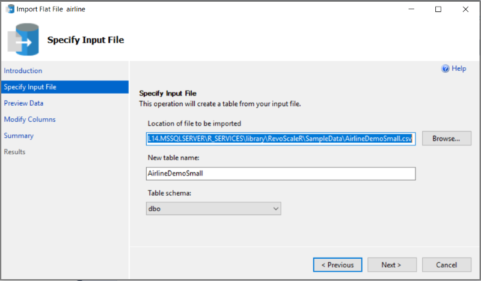

#  Airline flight arrival demo data for SQL Server Python and R tutorials
[!INCLUDE [SQL Server 2016 and later](../../includes/applies-to-version/sqlserver2016.md)]

In this exercise, create a SQL Server database to store imported data from R or Python built-in Airline demo data sets. R and Python distributions provide equivalent data, which you can import to a SQL Server database using Management Studio.

To complete this exercise, you should have [SQL Server Management Studio](../../ssms/download-sql-server-management-studio-ssms.md) or another tool that can run T-SQL queries.

Tutorials and quickstarts using this data set include the following:

+  [Create a Python model using revoscalepy](use-python-revoscalepy-to-create-model.md)

## Create the database

1. Start SQL Server Management Studio, connect to a database engine instance that has R or Python integration.  

2. In Object Explorer, right-click **Databases** and create a new database called **flightdata**.

3. Right-click **flightdata**, click **Tasks**, click **Import Flat File**.

4. Open the AirlineDemoData.csv file provided in the R or Python distribution, depending on which language you installed.

   For R, look for **AirlineDemoSmall.csv** at C:\Program Files\Microsoft SQL Server\MSSQL14.MSSQLSERVER\R_SERVICES\library\RevoScaleR\SampleData
   
   For Python, look for **AirlineDemoSmall.csv** at C:\Program Files\Microsoft SQL Server\MSSQL14.MSSQLSERVER\PYTHON_SERVICES\Lib\site-packages\revoscalepy\data\sample_data
  
When you select the file, default values are filled in for table name and schema.

  

Click through the remaining pages, accepting the defaults, to import the data.


## Query the data

As a validation step, run a query to confirm the data was uploaded.

1. In Object Explorer, under Databases, right-click the **flightdata** database, and start a new query.

2. Run some simple queries:

    ```sql
    SELECT TOP(10) * FROM AirlineDemoSmall;
    SELECT COUNT(*) FROM AirlineDemoSmall;
    ```

## Next steps

In the following lesson, you will create a linear regression model based on this data.

+ [Create a Python model using revoscalepy](use-python-revoscalepy-to-create-model.md)
