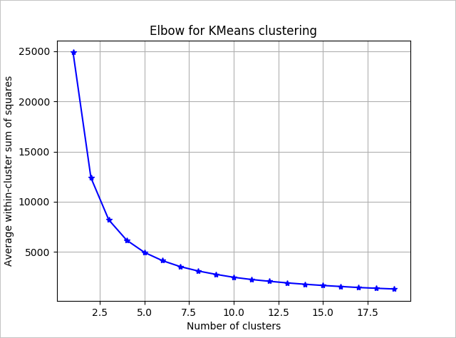

# Python tutorial: Build a model to categorize customers with SQL machine learning
[!INCLUDE [SQL Server 2017 SQL MI](../../includes/applies-to-version/sqlserver2017-asdbmi.md)]

::: moniker range=">=sql-server-ver15||>=sql-server-linux-ver15"
In part three of this four-part tutorial series, you'll build a K-Means model in Python to perform clustering. In the next part of this series, you'll deploy this model in a database with SQL Server Machine Learning Services or on Big Data Clusters.
::: moniker-end
::: moniker range="=sql-server-2017"
In part three of this four-part tutorial series, you'll build a K-Means model in Python to perform clustering. In the next part of this series, you'll deploy this model in a database with SQL Server Machine Learning Services.
::: moniker-end
::: moniker range="=azuresqldb-mi-current"
In part three of this four-part tutorial series, you'll build a K-Means model in Python to perform clustering. In the next part of this series, you'll deploy this model in a database with Azure SQL Managed Instance Machine Learning Services.
::: moniker-end

In this article, you'll learn how to:

> [!div class="checklist"]
> * Define the number of clusters for a K-Means algorithm
> * Perform clustering
> * Analyze the results

In [part one](python-clustering-model.md), you installed the prerequisites and restored the sample database.

In [part two](python-clustering-model-prepare-data.md), you learned how to prepare the data from a database to perform clustering.

In [part four](python-clustering-model-deploy.md), you'll learn how to create a stored procedure in a database that can perform clustering in Python based on new data.

## Prerequisites

* Part three of this tutorial assumes you have fulfilled the prerequisites of [**part one**](python-clustering-model.md), and completed the steps in [**part two**](python-clustering-model-prepare-data.md).

## Define the number of clusters

To cluster your customer data, you'll use the **K-Means** clustering algorithm, one of the simplest and most well-known ways of grouping data.
You can read more about K-Means in [A complete guide to K-means clustering algorithm](https://www.kdnuggets.com/2019/05/guide-k-means-clustering-algorithm.html).

The algorithm accepts two inputs: The data itself, and a predefined number "*k*" representing the number of clusters to generate.
The output is *k* clusters with the input data partitioned among the clusters.

The goal of K-means is to group the items into k clusters such that all items in same cluster are as similar to each other, and as different from items in other clusters, as possible.

To determine the number of clusters for the algorithm to use, use a plot of the within groups sum of squares, by number of clusters extracted. The appropriate number of clusters to use is at the bend or "elbow" of the plot.

```python
################################################################################################
## Determine number of clusters using the Elbow method
################################################################################################

cdata = customer_data
K = range(1, 20)
KM = (sk_cluster.KMeans(n_clusters=k).fit(cdata) for k in K)
centroids = (k.cluster_centers_ for k in KM)

D_k = (sci_distance.cdist(cdata, cent, 'euclidean') for cent in centroids)
dist = (np.min(D, axis=1) for D in D_k)
avgWithinSS = [sum(d) / cdata.shape[0] for d in dist]
plt.plot(K, avgWithinSS, 'b*-')
plt.grid(True)
plt.xlabel('Number of clusters')
plt.ylabel('Average within-cluster sum of squares')
plt.title('Elbow for KMeans clustering')
plt.show()
```



Based on the graph, it looks like *k = 4* would be a good value to try. That *k* value will group the customers into four clusters.

## Perform clustering

In the following Python script, you'll use the KMeans function from the sklearn package.

```python
################################################################################################
## Perform clustering using Kmeans
################################################################################################

# It looks like k=4 is a good number to use based on the elbow graph.
n_clusters = 4

means_cluster = sk_cluster.KMeans(n_clusters=n_clusters, random_state=111)
columns = ["orderRatio", "itemsRatio", "monetaryRatio", "frequency"]
est = means_cluster.fit(customer_data[columns])
clusters = est.labels_
customer_data['cluster'] = clusters

# Print some data about the clusters:

# For each cluster, count the members.
for c in range(n_clusters):
    cluster_members=customer_data[customer_data['cluster'] == c][:]
    print('Cluster{}(n={}):'.format(c, len(cluster_members)))
    print('-'* 17)
print(customer_data.groupby(['cluster']).mean())
```

## Analyze the results

Now that you've performed clustering using K-Means, the next step is to analyze the result and see if you can find any actionable information.

Look at the clustering mean values and cluster sizes printed from the previous script.

```results
Cluster0(n=31675):
-------------------
Cluster1(n=4989):
-------------------
Cluster2(n=1):
-------------------
Cluster3(n=671):
-------------------

         customer  orderRatio  itemsRatio  monetaryRatio  frequency
cluster
0        50854.809882    0.000000    0.000000       0.000000   0.000000
1        51332.535779    0.721604    0.453365       0.307721   1.097815
2        57044.000000    1.000000    2.000000     108.719154   1.000000
3        48516.023845    0.136277    0.078346       0.044497   4.271237
```

The four cluster means are given using the variables defined in [part one](python-clustering-model-prepare-data.md#separate-customers):

* *orderRatio* = return order ratio (total number of orders partially or fully returned versus the total number of orders)
* *itemsRatio* = return item ratio (total number of items returned versus the number of items purchased)
* *monetaryRatio* = return amount ratio (total monetary amount of items returned versus the amount purchased)
* *frequency* = return frequency

Data mining using K-Means often requires further analysis of the results, and further steps to better understand each cluster, but it can provide some good leads.
Here are a couple ways you could interpret these results:

* Cluster 0 seems to be a group of customers that are not active (all values are zero).
* Cluster 3 seems to be a group that stands out in terms of return behavior.

Cluster 0 is a set of customers who are clearly not active. Perhaps you can target marketing efforts towards this group to trigger an interest for purchases. In the next step, you'll query the database for the email addresses of customers in cluster 0, so that you can send a marketing email to them.

## Clean up resources

If you're not going to continue with this tutorial, delete the tpcxbb_1gb database.

## Next steps

In part three of this tutorial series, you completed these steps:

* Define the number of clusters for a K-Means algorithm
* Perform clustering
* Analyze the results

To deploy the machine learning model you've created, follow part four of this tutorial series:

> [!div class="nextstepaction"]
> [Python tutorial: Deploy a clustering model](python-clustering-model-deploy.md)