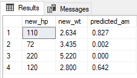

# Quickstart: Create and score a predictive model in R with SQL machine learning
[!INCLUDE [SQL Server 2016 SQL MI](../../includes/applies-to-version/sqlserver2016-asdbmi.md)]

::: moniker range=">=sql-server-ver15||>=sql-server-linux-ver15"
In this quickstart, you'll create and train a predictive model using T. You'll save the model to a table in your SQL Server instance, and then use the model to predict values from new data using [SQL Server Machine Learning Services](../sql-server-machine-learning-services.md) or on [Big Data Clusters](../../big-data-cluster/machine-learning-services.md).
::: moniker-end
::: moniker range="=sql-server-2017"
In this quickstart, you'll create and train a predictive model using T. You'll save the model to a table in your SQL Server instance, and then use the model to predict values from new data using [SQL Server Machine Learning Services](../sql-server-machine-learning-services.md).
::: moniker-end
::: moniker range="=sql-server-2016"
In this quickstart, you'll create and train a predictive model using T. You'll save the model to a table in your SQL Server instance, and then use the model to predict values from new data using [SQL Server R Services](../r/sql-server-r-services.md).
::: moniker-end
::: moniker range="=azuresqldb-mi-current"
In this quickstart, you'll create and train a predictive model using T. You'll save the model to a table in your SQL Server instance, and then use the model to predict values from new data using [Azure SQL Managed Instance Machine Learning Services](/azure/azure-sql/managed-instance/machine-learning-services-overview).
::: moniker-end

You'll create and execute two stored procedures running in SQL. The first one uses the **mtcars** dataset included with R and generates a simple generalized linear model (GLM) that predicts the probability that a vehicle has been fitted with a manual transmission. The second procedure is for scoring - it calls the model generated in the first procedure to output a set of predictions based on new data. By placing R code in a SQL stored procedure, operations are contained in SQL, are reusable, and can be called by other stored procedures and client applications.

> [!TIP]
> If you need a refresher on linear models, try this tutorial which describes the process of fitting a model using rxLinMod: [Fitting Linear Models](/machine-learning-server/r/how-to-revoscaler-linear-model)

By completing this quickstart, you'll learn:

> [!div class="checklist"]
> - How to embed R code in a stored procedure
> - How to pass inputs to your code through inputs on the stored procedure
> - How stored procedures are used to operationalize models

## Prerequisites

You need the following prerequisites to run this quickstart.

::: moniker range=">=sql-server-ver15||>=sql-server-linux-ver15"
- SQL Server Machine Learning Services. To install Machine Learning Services, see the [Windows installation guide](../install/sql-machine-learning-services-windows-install.md) or the [Linux installation guide](../../linux/sql-server-linux-setup-machine-learning.md?toc=%2Fsql%2Fmachine-learning%2Ftoc.json). You can also [enable Machine Learning Services on SQL Server Big Data Clusters](../../big-data-cluster/machine-learning-services.md).
::: moniker-end
::: moniker range="=sql-server-2017"
- SQL Server Machine Learning Services. To install Machine Learning Services, see the [Windows installation guide](../install/sql-machine-learning-services-windows-install.md). 
::: moniker-end
::: moniker range="=sql-server-2016"
- SQL Server 2016 R Services. To install R Services, see the [Windows installation guide](../install/sql-r-services-windows-install.md).
::: moniker-end
::: moniker range="=azuresqldb-mi-current"
- Azure SQL Managed Instance Machine Learning Services. For information, see the [Azure SQL Managed Instance Machine Learning Services overview](/azure/azure-sql/managed-instance/machine-learning-services-overview).
::: moniker-end

- A tool for running SQL queries that contain R scripts. This quickstart uses [Azure Data Studio](../../azure-data-studio/what-is-azure-data-studio.md).

## Create the model

To create the model, you'll create source data for training, create the model and train it using the data, then store the model in a database where it can be used to generate predictions with new data.

### Create the source data

1. Open Azure Data Studio, connect to your instance, and open a new query window.

1. Create a table to save the training data.

   ```sql
   CREATE TABLE dbo.MTCars(
       mpg decimal(10, 1) NOT NULL,
       cyl int NOT NULL,
       disp decimal(10, 1) NOT NULL,
       hp int NOT NULL,
       drat decimal(10, 2) NOT NULL,
       wt decimal(10, 3) NOT NULL,
       qsec decimal(10, 2) NOT NULL,
       vs int NOT NULL,
       am int NOT NULL,
       gear int NOT NULL,
       carb int NOT NULL
   );
   ```

1. Insert the data from the built-in dataset `mtcars`.

   ```SQL
   INSERT INTO dbo.MTCars
   EXEC sp_execute_external_script @language = N'R'
       , @script = N'MTCars <- mtcars;'
       , @input_data_1 = N''
       , @output_data_1_name = N'MTCars';
   ```

   > [!TIP]
   > Many datasets, small and large, are included with the R runtime. To get a list of datasets installed with R, type `library(help="datasets")` from an R command prompt.

### Create and train the model

The car speed data contains two columns, both numeric: horsepower (`hp`) and weight (`wt`). From this data, you'll create a generalized linear model (GLM) that estimates the probability that a vehicle has been fitted with a manual transmission.

To build the model, you define the formula inside your R code, and pass the data as an input parameter.

```sql
DROP PROCEDURE IF EXISTS generate_GLM;
GO
CREATE PROCEDURE generate_GLM
AS
BEGIN
    EXEC sp_execute_external_script
    @language = N'R'
    , @script = N'carsModel <- glm(formula = am ~ hp + wt, data = MTCarsData, family = binomial);
        trained_model <- data.frame(payload = as.raw(serialize(carsModel, connection=NULL)));'
    , @input_data_1 = N'SELECT hp, wt, am FROM MTCars'
    , @input_data_1_name = N'MTCarsData'
    , @output_data_1_name = N'trained_model'
    WITH RESULT SETS ((model VARBINARY(max)));
END;
GO
```

- The first argument to `glm` is the *formula* parameter, which defines `am` as dependent on `hp + wt`.
- The input data is stored in the variable `MTCarsData`, which is populated by the SQL query. If you don't assign a specific name to your input data, the default variable name would be _InputDataSet_.

### Store the model in the database

Next, store the model in a database so you can use it for prediction or retrain it. 

1. Create a table to store the model.

   The output of an R package that creates a model is usually a binary object. Therefore, the table where you store the model must provide a column of **varbinary(max)** type.

   ```sql
   CREATE TABLE GLM_models (
       model_name varchar(30) not null default('default model') primary key,
       model varbinary(max) not null
   );
   ```

1. Run the following Transact-SQL statement to call the stored procedure, generate the model, and save it to the table you created.

   ```sql
   INSERT INTO GLM_models(model)
   EXEC generate_GLM;
   ```

   > [!TIP]
   > If you run this code a second time, you get this error: "Violation of PRIMARY KEY constraint...Cannot insert duplicate key in object dbo.stopping_distance_models". One option for avoiding this error is to update the name for each new model. For example, you could change the name to something more descriptive, and include the model type, the day you created it, and so forth.

     ```sql
     UPDATE GLM_models
     SET model_name = 'GLM_' + format(getdate(), 'yyyy.MM.HH.mm', 'en-gb')
     WHERE model_name = 'default model'
     ```

## Score new data using the trained model

*Scoring* is a term used in data science to mean generating predictions, probabilities, or other values based on new data fed into a trained model. You'll use the model you created in the previous section to score predictions against new data.

### Create a table of new data

First, create a table with new data.

```sql
CREATE TABLE dbo.NewMTCars(
	hp INT NOT NULL
	, wt DECIMAL(10,3) NOT NULL
	, am INT NULL
)
GO

INSERT INTO dbo.NewMTCars(hp, wt)
VALUES (110, 2.634)

INSERT INTO dbo.NewMTCars(hp, wt)
VALUES (72, 3.435)

INSERT INTO dbo.NewMTCars(hp, wt)
VALUES (220, 5.220)

INSERT INTO dbo.NewMTCars(hp, wt)
VALUES (120, 2.800)
GO
```

### Predict manual transmission

To get predictions based on your model, write a SQL script that does the following:

1. Gets the model you want
1. Gets the new input data
1. Calls an R prediction function that is compatible with that model

Over time, the table might contain multiple R models, all built using different parameters or algorithms, or trained on different subsets of data. In this example, we'll use the model named `default model`.

```sql
DECLARE @glmmodel varbinary(max) = 
    (SELECT model FROM dbo.GLM_models WHERE model_name = 'default model');

EXEC sp_execute_external_script
    @language = N'R'
    , @script = N'
            current_model <- unserialize(as.raw(glmmodel));
            new <- data.frame(NewMTCars);
            predicted.am <- predict(current_model, new, type = "response");
            str(predicted.am);
            OutputDataSet <- cbind(new, predicted.am);
            '
    , @input_data_1 = N'SELECT hp, wt FROM dbo.NewMTCars'
    , @input_data_1_name = N'NewMTCars'
    , @params = N'@glmmodel varbinary(max)'
    , @glmmodel = @glmmodel
WITH RESULT SETS ((new_hp INT, new_wt DECIMAL(10,3), predicted_am DECIMAL(10,3)));
```

The script above performs the following steps:

- Use a SELECT statement to get a single model from the table, and pass it as an input parameter.

- After retrieving the model from the table, call the `unserialize` function on the model.

- Apply the `predict` function with appropriate arguments to the model, and provide the new input data.

> [!NOTE]
> In the example, the `str` function is added during the testing phase, to check the schema of data being returned from R. You can remove the statement later.
>
> The column names used in the R script are not necessarily passed to the stored procedure output. Here the WITH RESULTS clause is used to define some new column names.

**Results**



It's also possible to use the [PREDICT (Transact-SQL)](../../t-sql/queries/predict-transact-sql.md) statement to generate a predicted value or score based on a stored model.

## Next steps

For more information on tutorials for R with SQL machine learning, see:

- [R tutorials](r-tutorials.md)
