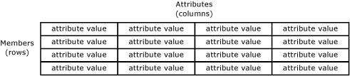
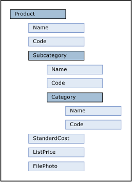

# Attributes (Master Data Services)

[!INCLUDE[appliesto-ss-xxxx-xxxx-xxx-md-winonly](../includes/appliesto-ss-xxxx-xxxx-xxx-md-winonly.md)]

  Attributes are objects that are contained in [!INCLUDE[ssMDSshort](../includes/ssmdsshort-md.md)] entities. Attribute values describe the members of the entity. An attribute can be used to describe a leaf member, a consolidated member, or a collection.  
  
## How Attributes Relate to Other Model Objects  
 You can think of an attribute as a column in an entity table. An attribute value is the value used to describe a specific member.  
  
   
  
 When you create an entity that contains many attributes, you can organize the attributes into attribute groups. For more information, see [Attribute Groups &#40;Master Data Services&#41;](../master-data-services/attribute-groups-master-data-services.md).  
  
## Required Attributes  
 When you create an entity, the Name and Code attributes are automatically created. Code requires a value and must be unique within the entity. You cannot remove the Name and Code attributes.  
  
## Attribute Types  
 There are three types of attributes:  
  
-   Free-form attributes, which allow free-form input for text, numbers, dates, or links.  
  
-   Domain-based attributes, which are populated by entities. For more information, see [Domain-Based Attributes &#40;Master Data Services&#41;](../master-data-services/domain-based-attributes-master-data-services.md).  
  
-   File attributes, which are used to store files, documents, or images. File attributes are intended to help with the consistency of your data by requiring files to have a specific extension. File attributes cannot be guaranteed to prevent a malicious user from uploading a file of a different type.  
  
### Numeric Free-Form Attributes  
 Numeric free-form attributes require special handling, because numeric free-form attribute values are limited to the **SqlDouble** value type.  
  
 By default, a **SqlDouble** value contains 15 decimal digits of precision, although a maximum of 17 digits is maintained internally. The precision of a floating-point number has several consequences:  
  
-   Two floating-point numbers that appear equal for a particular precision might not compare equal because their least significant digits are different.  
  
-   A mathematical or comparison operation that uses a floating-point number might not yield the same result if a decimal number is used because the floating-point number might not exactly approximate the decimal number.  
  
-   A value might not *roundtrip* if a floating-point number is involved. A value is said to roundtrip if an operation converts an original floating-point number to another form, an inverse operation transforms the converted form back to a floating-point number, and the final floating-point number is equal to the original floating-point number. The roundtrip might fail because one or more least significant digits are lost or changed in a conversion.  
  
## Attribute Examples  
 In the following example, the entity has the attributes: Name, Code, Subcategory, StandardCost, ListPrice, and FilePhoto. These attributes describe the members. Each member is represented by a single row of attribute values.  
  
   
  
 In the following example, the Product entity contains:  
  
-   The free-form attributes of Name, Code, StandardCost and ListPrice.  
  
-   The domain-based attribute of Subcategory.  
  
-   The file attribute of FilePhoto.  
  
 Subcategory is an entity that is used as a domain-based attribute of Product. Category is an entity that is used as a domain-based attribute of Subcategory. Like the Product entity, the Category and Subcategory entities each contain the default Name and Code attributes.  
  
   
  
## Related Tasks  
  
|Task Description|Topic|  
|----------------------|-----------|  
|Create a new free-form text attribute.|[Create a Text Attribute &#40;Master Data Services&#41;](../master-data-services/create-a-text-attribute-master-data-services.md)|  
|Create a new free-form numeric attribute.|[Create a Numeric Attribute &#40;Master Data Services&#41;](../master-data-services/create-a-numeric-attribute-master-data-services.md)|  
|Create a new free-form link attribute.|[Create a Link Attribute &#40;Master Data Services&#41;](../master-data-services/create-a-link-attribute-master-data-services.md)|  
|Create a new file attribute.|[Create a File Attribute &#40;Master Data Services&#41;](../master-data-services/create-a-file-attribute-master-data-services.md)|  
|Create a new domain-based attribute.|[Create a Domain-Based Attribute &#40;Master Data Services&#41;](../master-data-services/create-a-domain-based-attribute-master-data-services.md)|  
|Change the name of an existing attribute.|[Change an Attribute Name and Data Type &#40;Master Data Services&#41;](../master-data-services/change-an-attribute-name-and-data-type-master-data-services.md)|  
|Add existing attributes to a change tracking group.|[Add Attributes to a Change Tracking Group &#40;Master Data Services&#41;](../master-data-services/add-attributes-to-a-change-tracking-group-master-data-services.md)|  
|Delete an existing attribute.|[Delete an Attribute &#40;Master Data Services&#41;](../master-data-services/delete-an-attribute-master-data-services.md)|  
|Change the order of attributes.|[Change the Order of Attributes](../master-data-services/change-the-order-of-attributes.md)|  
|Create a date attribute|[Create a Date Attribute &#40;Master Data Services&#41;](../master-data-services/create-a-date-attribute-master-data-services.md)|  
  
## Related Content  
  
-   [Domain-Based Attributes &#40;Master Data Services&#41;](../master-data-services/domain-based-attributes-master-data-services.md)  
  
-   [Attribute Groups &#40;Master Data Services&#41;](../master-data-services/attribute-groups-master-data-services.md)  
  
-   [Members &#40;Master Data Services&#41;](../master-data-services/members-master-data-services.md)  
  
-   [Leaf Permissions &#40;Master Data Services&#41;](../master-data-services/leaf-permissions-master-data-services.md)
  
