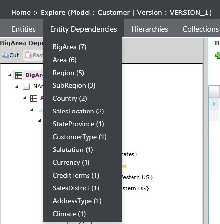
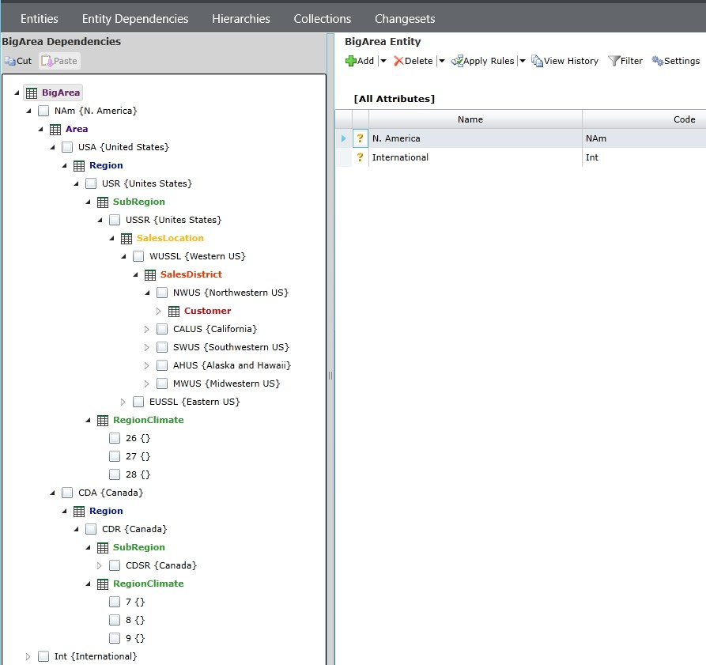
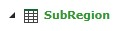

# Entity Dependencies Explorer

[!INCLUDE[appliesto-ss-xxxx-xxxx-xxx-md-winonly](../includes/appliesto-ss-xxxx-xxxx-xxx-md-winonly.md)]

  
[!INCLUDE[ssMDSshort_md](../includes/ssmdsshort-md.md)] 2016 adds a new explorer page, Entity Dependencies, that provides an alternate way to visualize relationships between entity members within a model, as specified by their domain-based attribute (DBA) values, but without having to first define a Derived Hierarchy.   
  
It helps answer the question "who is consuming my entity, and how?". The view is similar to the Derived Hierarchy explorer page, but it is more inclusive. It shows all DBA relationships, not just those defined as part of a particular hierarchy. A hierarchy definition is not required because the displayed hierarchical structure is simply inferred from existing DBAs.  
  
In the Explorer page menu, the Entity Dependencies menu item lists all entities in the model that are depended on by at least one entity (i.e. at least one entity has a DBA that references the listed entity). The number of dependencies (both direct and indirect) is shown next to the entity name, and the list is sorted by this number with the most heavily-referenced entities at the top. The below screenshot, taken from the Customer model of the [sample data](https://msdn.microsoft.com/library/master-data-services-sample.aspx), shows that the BigArea entity is referenced (directly or indirectly) by 7 entities:  
  
  
    
Clicking on this menu item opens the new Entity Dependencies explorer page for the BigArea entity, which displays how the entity members are consumed. It shows a hierarchical view with BigArea members at the top of the tree, with the members of its 7 consuming entities nested below:  
  
  
    
An entity may be directly consumed by more than one entity. In the above example, both the SubRegion and RegionClimate entities consume (have DBA references to) the Region entity. The members of each consuming entity are grouped together under a parent node that bears the entity name:   
  
  
  
These container tree nodes have a grid-like icon to the left of the entity name, and the text is colored by hierarchy level depth. The above example shows that the "CDSR {Canada}" SubRegion has a DBA reference to the "CDR {Canada}" Region, which references the "CDA {Canada}" Area, which references the "NAm {N. America}" BigArea.  
  
The view is fully editable, just like in the Hierarchy Explorer page. Parent-child relationships may be modified in the tree by cut-paste or drag-dropping child members from one parent to another. Other member attribute values may be modified in the details panel to the right of the tree.   
  
  
  
  

