# High Availability and Disaster Recovery for Master Data Services

[!INCLUDE[appliesto-ss-xxxx-xxxx-xxx-md-winonly](../../includes/appliesto-ss-xxxx-xxxx-xxx-md-winonly.md)]


**Summary:** This article describes a solution for Master Data Service
(MDS) hosted on AlwaysOn Availability Group configuration. The article
describes how to install and configure SQL 2016 Master Data Services on
a SQL 2016 AlwaysOn Availability group (AG). The main purpose of this
solution is to improve high availability and disaster recovery of MDS
backend data hosted on a SQL Server database.

## Introduction


This article describes a solution for Master Data Service (MDS) hosted
on an AlwaysOn Availability Group configuration. The article describes
how to install and configure SQL 2016 MDS on an SQL 2016 AlwaysOn
Availability group (AG). The main purpose of this solution is to improve
high availability and disaster recovery of MDS backend data hosted on a
SQL Server database.

To implement the solution, you need to complete the following tasks
covered in this article.

1.  [Install and set up Windows Server Failover Custer
    (WSFC)](#windows-server-failover-cluster-wsfc).

2.  [Set up AlwaysOn AG](#sql-server-alwayson-availability-group).

3.  [Configure MDS to run on an WSFC
    node](#configure-mds-to-run-on-an-wsfc-node).

The above sections will briefly introduce the technologies, followed by
instructions. For detailed information about the technologies, please
review the documents linked to in each section.

This solution described in this article is built on top of SQL Server
AlwaysOn AG, in which each database has multiple synchronous or
asynchronous replicas. Only one replica accepts the transaction (accepts
user requests). This is the primary replica.

Each replica has its own storage, so there is no centralized shared
storage in this solution. When there is a software failure or a hardware
failure affecting the primary replica, the primary replica can be failed
over to a synchronous or asynchronous replica either automatically or
manually based on the configuration and situations. This guarantees high
availability of the database with minimum interruption to the users.

Asynchronous replicas are usually hosted on a data center that is remote
from the primary replica data center. In case of disaster scenarios, the
primary replica can be failed over to another data center. This
guarantees disaster recovery of the database.

For demonstration purpose, the solution described in this article uses
the following versions of software. Older versions should work the same
with potentially minor differences.

-   Windows Server 2012R2 with Server Failover cluster

-   SQL Server 2016 with Master Data Service feature

Also, the solution uses two VMs, **MDS-HA1** and **MDS-HA2**, to host
two replicas. As long as it is supported by SQL Server AlwaysOn AG, MDS
does not limit how many replicas you can use.

This article assumes that you have basic knowledge about Windows Server,
Windows Server Failover Cluster, SQL Server AlwaysOn, and SQL Server
MDS.

## What is not covered

This document does not cover the following:

-   How to make IIS, the web server hosting the Master data service UI,
    highly available and recoverable after a disaster. MDS does not
    impose any particular requirement on IIS, so the standard
    techniques to make IIS highly available and load balancing can
    work here as well.

-   How to use SQL Server AlwaysOn failover (FCI) cluster to support
    high availability (HA) on the MDS backend. SQL Server failover
    clustering is a different HA solution and is officially supported
    by SQL Server, and it does work with MDS.

-   How to use a hybrid solution of SQL Server failover cluster (FCI)
    and AlwaysOn AG to support HA on the MDS backend. The hybrid
    solution does work with MDS.

## Design Consideration

Figure 1 shows a typical configuration used mostly in AlwaysOn AG. In
the primary data center, there are two replicas with a synchronous
commit relationship, and both replicas have the VOTE privilege. This is
mainly used to improve HA in case the primary replica fails.

In the Disaster Recovery Data Center, there is a secondary replica with
an asynchronous commit relationship with the primary. This data center
is usually in a Geo Region different than the primary data center. The
secondary replica does not have VOTE privilege.

This configuration is used to achieve recovery in case the primary data
center is in a disaster, such as a fire, earthquake, etc. The
configuration achieves both HA and disaster recover with relatively low
cost.

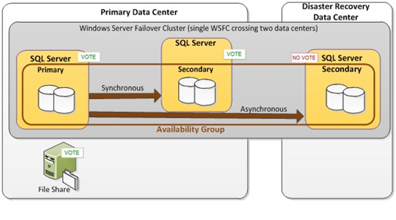

Figure 1. A Typical AlwaysOn Availability Group Configuration

If you don't need to consider disaster recovery, you don't need to have
a replica in a second data center. If you need to improve HA, then you
could have more synchronous replicas in the same primary data center
with.

So it is important to consider your scenarios and requirements, and
choose how many asynchronous and synchronous replicas you need, and
which data center you should put them in.

## Windows Server Failover Cluster (WSFC)

This section covers the following tasks.

1.  [Install Windows Failover Cluster
    feature](#install-failover-cluster-feature).

2.  [Create a Windows Server Failover
    Cluster](#create-a-windows-server-failover-cluster).

As shown in Figure 1 in the previous section, the solution described in
this article includes Windows Server Failover Cluster (WSFC). We need to
setup WSFC because SQL AlwaysOn depends on WFSC for failure detection
and failover.

WSFC is a feature to improve high availability of applications and
services. It consists of a group of independent windows server instances
with Microsoft Failover Cluster Service running on those instances. The
windows server instances (or nodes as they are called sometimes) are
connected so that they can communicate with each other, and the failure
detection is possible. WSFC provide failure detection and failover
functionalities. If a node or a service fails in the cluster, then the
failure is detected, and another node automatically or manually begins
to provide the services hosted on the failed node. As such, users only
experience minimum disruptions in services, and service availability is
improved.  

### Prerequisites

The Windows Server operating system is installed on all instances, and
all updates are patched.

>[!NOTE] 
>It is **highly recommended** that you install the same Windows
>version and the same feature set on all the instances to avoid any
>potential incompatibility issues.

### Install Failover Cluster Feature

Complete the following steps for each Windows Server instance to install
the WSFC feature on each instance. You need administrator permissions.

1.  Open **Server Manager** in Windows Server, and click **Add Roles and
    Features** in the right pane. This will launch the **Add Roles and
    Feature Wizard**.

2.  Click **Next** until you get to the **Features** page.

3.  Select the **Failover Clustering** checkbox, and then click **Next**
    to finish the installation. See Figure 2.

    If you're asked for confirmation to **Add features that are required
for Failover clustering**, click **Add Features**. See Figure 3.

    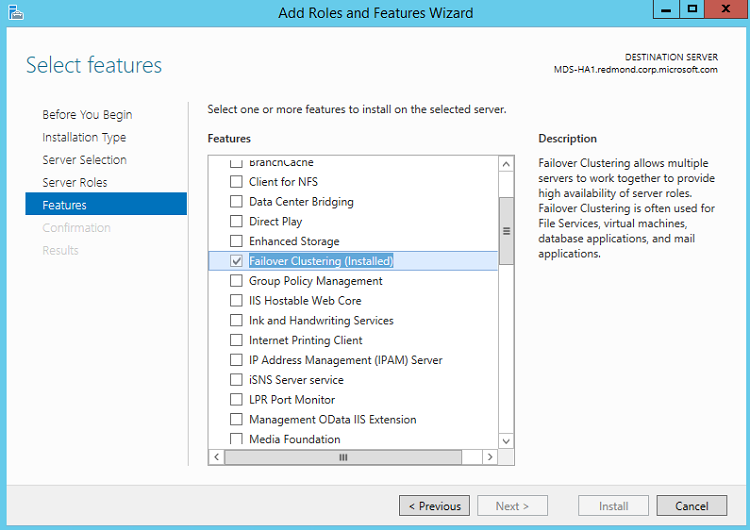

    Figure 2

    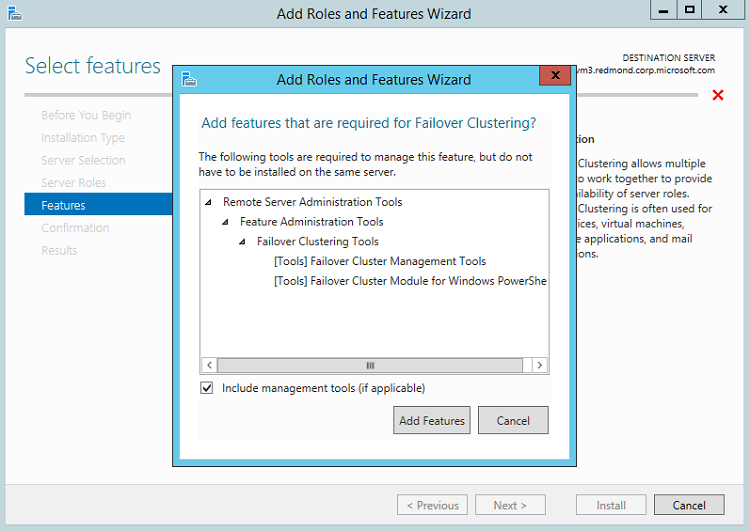

    Figure 3

4.  On the **Confirmation** page, click **Install** to install the
    failover clustering feature.

5.  On the **Result** page, make sure everything has been installed
    successfully without errors and warnings.

### Create a Windows Server Failover Cluster

After the WSFC feature is installed on all instances, you can configure
WSFC. You should only need to do this on one node.

1.  Open **Server Manager** in Windows Server, and click **Failover
    Cluster Manager** on the **Tool** menu at the top right corner to
    launch the manager.

2.  In **Failover Cluster Manager**, click **Validate Configuration** in
    the right pane. See Figure 4.

    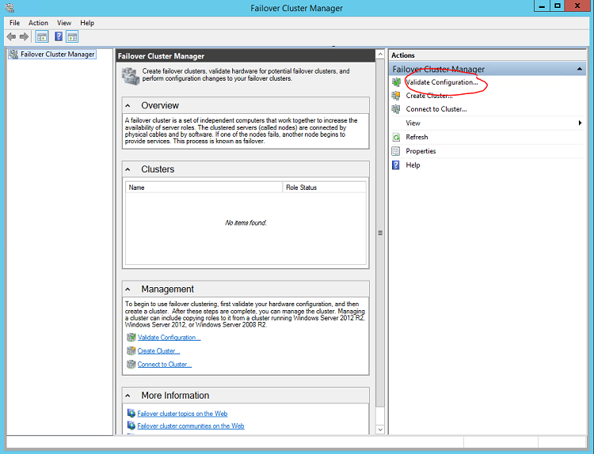

    Figure 4

3.  In the **Validate a Configuration** **Wizard**, click **Next**.

4.  In the **Select Servers or a Cluster** dialog box, add the server
    names that will host SQL Server, and then click **Next**. See
    Figure 5.

    In this example we added two instances, MDS-HA1 and MDS-HA2.

    

    Figure 5

5.  On the **Testing Options** page, click **Run all tests**, and then
    click **Next**.

6.  Click **Next** to finish the validation.

    The **Validating** page shows you the progress, and the **Summary**
page shows you the validation summary. See Figures 6 and 7.

7.  On the **Summary** page, check for any warning or error messages.

    Errors must be fixed. However, warnings may not be an issue. A warning
message means that "the tested item might meet the requirement, but
there is something you should check". For example, figure 7 shows a
"validate disk access latency" warning, that may be due to the disk
being busy on other tasks temporarily, and you may ignore it. You
should check the online document for each warning and error message
for more details. See Figure 7.
 
    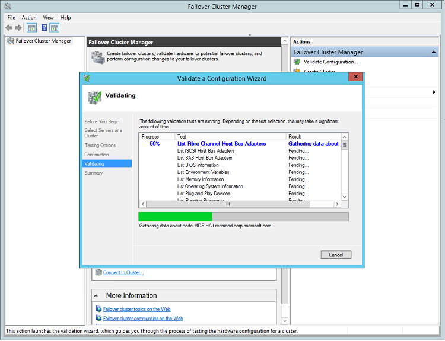

    Figure 6

    

    Figure 7

8.  On the **Summary** page, confirm that the **Create the cluster now
    using the validated nodes** checkbox is selected, and then click
    **Finish** to start the **Create Cluster** **Wizard**.

9.  In the **Create Cluster** **Wizard**, click **Next**.

10. On the **Access Point for Administering the Cluster** page, enter
   the WSFC cluster name, and then click **Next**. In this example,
   we use "MDS-HA" as the cluster name. See Figure 8.

    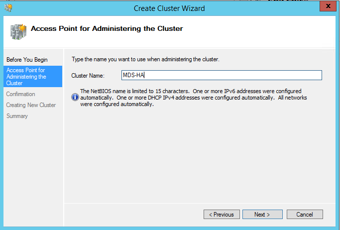

    Figure 8

11. Continue to click **Next** to finish creating the cluster. The
   **Summary of Cluster MDS-HA** section displays the cluster
   information. See Figure 9.

    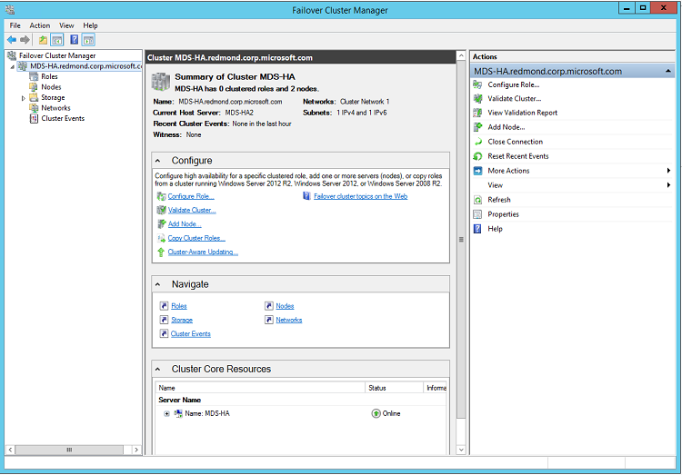

    Figure 9

    If you need to add a node later, click **Add Node** action in the right
pane in **Failover Cluster Manager**.

Notes:

-   The WSFC feature may not be available on all Windows Server
    editions. Make sure that your edition has this feature.

-   Make sure you have the proper permissions to setup WSFC in the
    active directory. If there are any issue, see [Failover Cluster
    Step-by-Step Guide: Configure Accounts in Active
    Directory](https://technet.microsoft.com/library/cc731002(v=ws.10).aspx).

For more detailed information about WSFC, see [Failover
Clusters](https://technet.microsoft.com/library/cc732488(v=ws.10).aspx).

## SQL Server AlwaysOn Availability Group

This section covers the following tasks.

1.  [Enable SQL Server AlwaysOn Availability
    Group](#enable-sql-server-alwayson-availability-group-on-every-sql-server-instance).

2.  [Create an Availability Group](#create-an-availability-group).

3.  [Validate and Test the Availability
    Group](#validation-and-test-the-availability-group).

SQLServer AlwaysOn solutions provide high availability and disaster
recovery for SQLServer databases. AlwaysOn has two possible solutions.
Both are built on top of WSFC.

-   AlwaysOn Availability Groups (AG)

-   AlwaysOn Failover Cluster Instances (FCI).

AG enhances the database-level high availability. The AG (a set of user
databases) and its virtual network name are registered as resources in
WSFC.

FCI enhances the instance-level high availability. SQL Server service
and the related services are registered as resources in WSFC. Also, the
FCI solution requires symmetrical shared disk storage, such as SAN or
SMB file shares, which must be available to all nodes in the WFC
cluster.


### Prerequisites

-   Install SQL Server on all nodes. For more information, see [Install
    SQL Server 2016](https://docs.microsoft.com/sql/database-engine/install-windows/install-sql-server).

-   (Recommended) Install the exact same SQL Server feature set and
    version on every node. In particular, MDS must be installed.

-   (Recommended) Use the same configuration on every SQL Server
    instance. In particular, the same server collation must be
    configured on all SQL Server instances.

-   (Recommended) Use the same service account to run every SQL Server
    instance. Otherwise, you will have to grant permission on each SQL
    Server instance to make sure the SQL Server instances can
    communicate with each other.

-   Confirm that the Windows firewall setting allows the SQL Server
    instances to communicate with each other.

### Enable SQL Server AlwaysOn Availability Group on Every SQL Server Instance

1.  In the **SQL Server Configuration Manager** click **SQL Server
    service** in the left pane, right-click **SQL Server** in the
    right pane, and then click **Properties**. See Figure 10.

    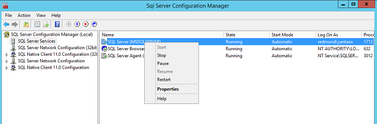

    Figure 10

2.  In the **SQL Server (MSSQLSERVER)** **Properties** dialog box, click
    the **AlwaysOn High Availability** tab, and then select the
    **Enable AlwaysOn Availability Groups** check box. When a value
    displays in the **Windows failover cluster name** text box, click
    **OK** to continue. See Figure 11.

    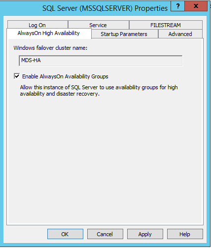

    Figure 11

3.  When a warning page displays, click **OK** to continue. See
    Figure 12.

    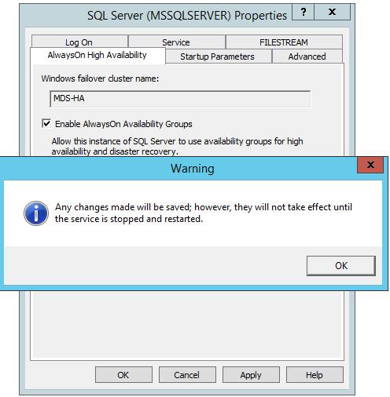

    Figure 12

4.  Click **Restart**, to restart the **SQL Server** service and make
    this change effective. See Figure 10.

>[!NOTE] 
>You can change the service account running the SQL Server service
>using the **SQL Server Configuration Manager**. Click the **Log On** tab
>in the **SQL Server (MSSQLSERVER)** **Properties** dialog box. See
>Figure 11.

### Create an Availability Group

After the AlwaysOn feature is enabled in all SQL Server instances, you
create a new AG that contains the MDS database on one node.

AG can only be created on existing databases. So either you create a MDS
database on one node, or create a temporary database and then drop the
temporary database. In this example, we create an emptyMDS database and
create an AG on this MDS database.

1.  Launch **SQL Server Management Studio** (**SSMS**) on a node, and
    connect to the local SQL Server instance with appropriate
    credentials.

2.  In SSMS, open a **new query** window and run the following script to
    create an empty database. Replace C:\\temp with the location you
    want to use to perform a full backup.

    ```
    CREATE DATABASE MDS\_Sample
    GO
    BACKUP DATABASE MDS\_Sample TO DISK='C:\\temp'
    GO
    ```

    >[!NOTE] 
    >A full database backup is necessary for creating the AG on this
    >database.

3.  In the **Object Explorer**, expand the **AlwaysOn High
    Availability** folder and click **New Availability Group Wizard**
    to launch the **New Availability Group Wizard**. See Figure 13.

    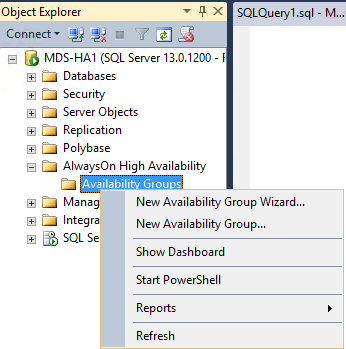

    Figure 13

4.  In the **New Availability Group** wizard, click **Next** to display
    the **Specify Name** page. Type a name for the AG, and then click
    **Next**. See Figure 14.

    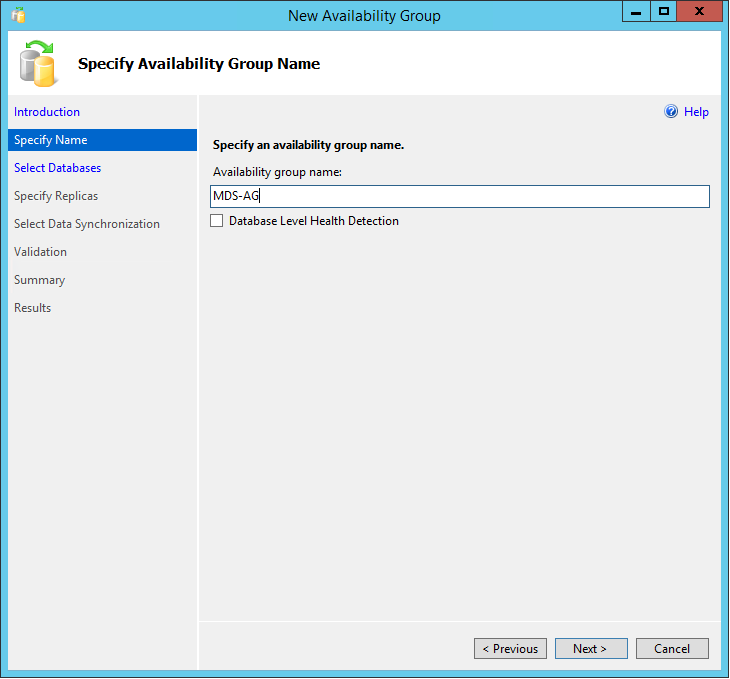

    Figure 14

5.  Click the database you just created on the **Select Database** page,
    and then click **Next**. See Figure 15.

    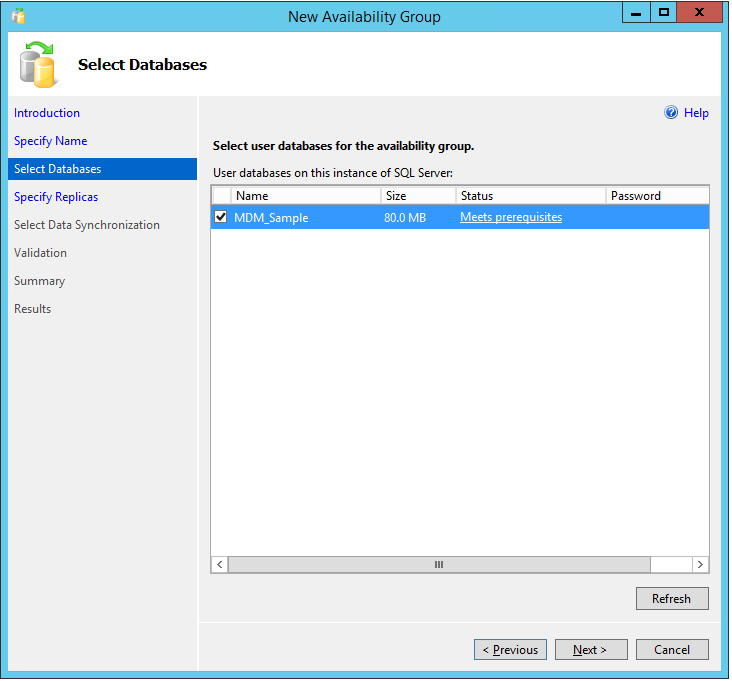

    Figure 15

6.  On the **Specify Replicas** page, add another replica by clicking
    **Add Replica**. This page already lists the current, local SQL
    Server instances as a replica. See Figure 16.

7.  In the **Connect to Server** dialog box, add the appropriate
    credentials and click **Connect**.

    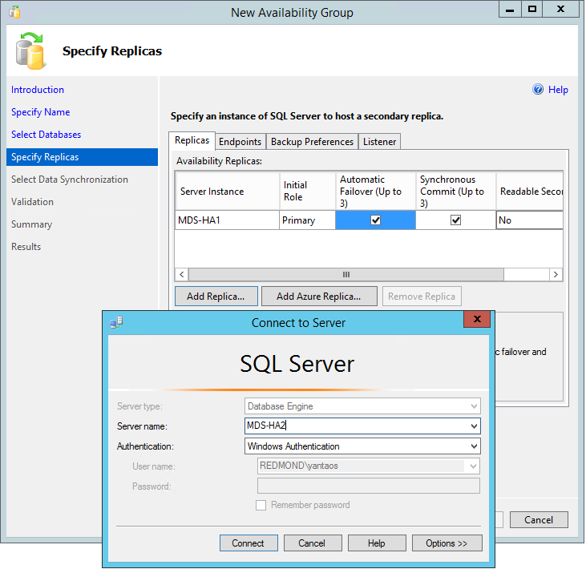

    Figure 16

    Now you should see two replicas in the list. Repeat this step to add
other nodes as replicas. See Figure 17.

    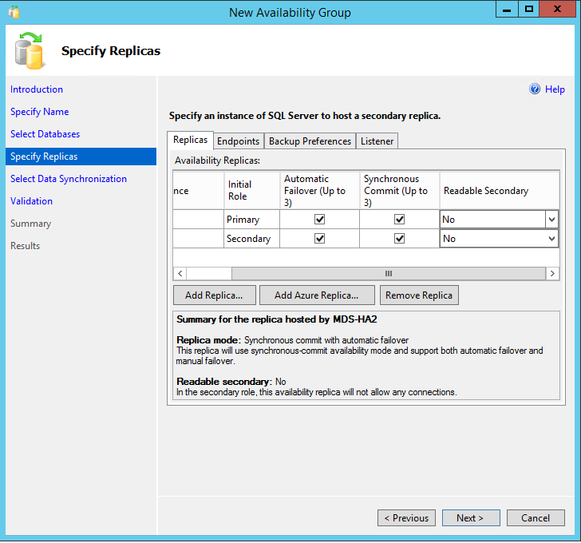

    Figure 17

    For each replica, configure the following **Synchronous Commit**,
**Automatic Failover**, and **Readable Secondary** settings. See Figure
17.

    **Synchronous Commit**: This guarantees that if a transaction is
committed on the primary replica of a database, then the transaction
is also committed on all other synchronous replicas. Asynchronous
commit does not guarantee this, and it may lag behind the primary
replica.

    You should usually enable synchronous commit only when the two nodes
are in the same data center. If they are in different data centers,
synchronous commit may slow down the database performance.

    If this checkbox is not selected, then asynchronous commit is used.

    **Automatic Failover:** When the primary replica is down, the AG will
automatically failover to its secondary replica when automatic
failover is selected. This can only be enabled on the replicas with
synchronous commits.

    **Readable Secondary:** By default, users cannot connect to any
secondary replicas. This will enable users to connect to the secondary
replica with read-only access.

8.  On the **Specify Replicas** page, click the **Listener** tab and do
    the following. See Figure 18.

    a.  Click **Create an availability group listener** to set up an
        availability group listener for the MDS database connection.

    b.  Enter a **listener DNS Name**, such as MDSSQLServer.

    c.  Enter the default SQL port,1433, in the **Port** text box.

    d.  Enter DHCP in the **Network Mode** text box, and then click **Next** to continue.

    >[!NOTE] 
    >Optionally, you can choose "Static IP" as the **Network Mode**
    >and enter a static IP. You can also enter a port other than 1433. 

    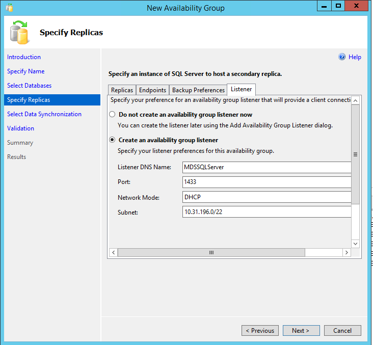

    Figure 18

9.  On the **Select Data Synchronization** page, click **Full**, and
    specify a network share that every node can access. Click **Next**
    to continue. See Figure 19.

    This network share will be used to store the database backup to create
secondary replicas. If this is not available for your organization,
choose another data synchronization preference. Refer to [SQL Server
2016 AlwaysOn Availability Group](https://docs.microsoft.com/sql/database-engine/availability-groups/windows/always-on-availability-groups-sql-server) on how to use other options to create secondary replicas. The figure 17 also
lists other options.

    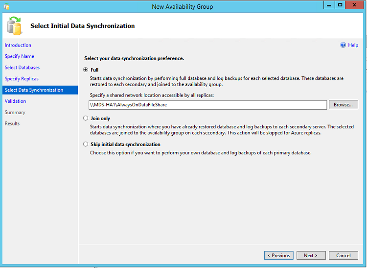

    Figure 19 

10. On the **Validation** page, make sure all validations pass
    successfully, and correct any errors. Click **Next** to continue.

11. On the **Summary** page, review all the configuration settings and
    click **Finish**. This will create the availability group and
    configure it.

12. On the **Result** page, confirm that all necessary steps were
    completed.

### Validation and Test the Availability Group

1.  Open SSMS and connect to the listener DNS name you just created in
    the [Create an Availability Group](#create-an-availability-group)
    section. In this example, it is MDSSQLServer.

2.  In **Object Explorer**, expand the **AlwaysOn High Availability**
    folder, right click the AG you just created in the [Create an
    Availability Group](#create-an-availability-group) section, and
    then click **Show Dashboard**. See Figure 20. The status of the
    new AG and its replicas appears.

    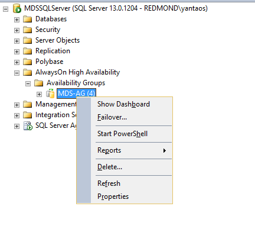

    Figure 20 

3.  Click **Failover** to do a failover to a synchronous replica and an
    asynchronous replica. This is to verify that failover happens
    correctly without issues.

 The AlwaysOn setup is completed.

For more information about AlwaysOn Availability Group, see [SQL Server
2016 AlwaysOn Availability Group](https://docs.microsoft.com/sql/database-engine/availability-groups/windows/always-on-availability-groups-sql-server).

## Configure MDS to Run on an WSFC Node

This solution presented in this article only requires the MDS backend
database running on WSFC. Other parts of MDS, such as web applications
and MDS configuration manager, can be run either on the node in WSFC or
outside WSFC, as long as MDS can connect to the AG.

1.  Open **Master Data Service Configuration Manager** on one node,
    click **Database Configuration**, and then click **Create
    Database** to launch the **Create Database Wizard**.

2.  On the **Database Server** page, type the AG listener DNS name in
    the **SQL Server instance** text box, click **Test Connection**,
    and then click **Next**. See Figure 21.

    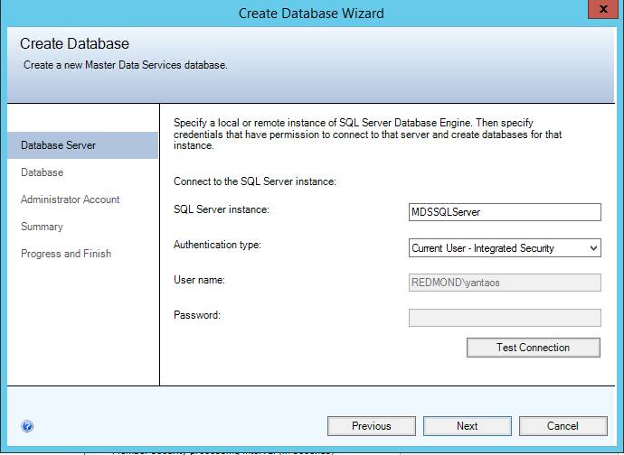

    Figure 21

3.  On the **Database** page, type the name of the database that you
    created in the [Create an Availability
    Group](#create-an-availability-group) section, and then click
    **Next**. See Figure 22.

    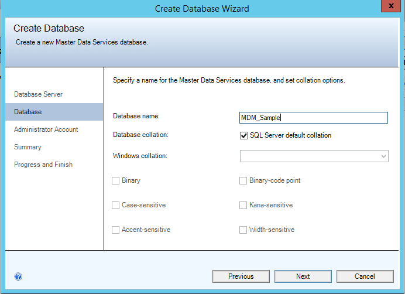

    Figure 22

4.  Complete the **Create Database** **Wizard**. For more information,
    see [Master Data Services Installation and Configuration](https://docs.microsoft.com/sql/master-data-services/master-data-services-installation-and-configuration).

5.  Click **Web Applications** in **Master Data Service Configuration
    Manager** to configure the Web Application, and then click
    **Apply** to apply the settings to MDS. See Figure 23. For more
    information, see [Master Data Services Installation and Configuration](https://docs.microsoft.com/sql/master-data-services/master-data-services-installation-and-configuration).

    

    Figure 23

    The MDS setup is completed. You can repeat the above steps to set up
MDS to run on all nodes. The backend database is the same on the same
AG.

6.  If previously you created a temporary database (see [Create an
    Availability Group](#create-an-availability-group) section) to
    create AlwaysOn AG, then you should drop the temporary database

    For more information about Master Data Service, refer to [Master Data
Services](https://docs.microsoft.com/sql/master-data-services/master-data-services-overview-mds).

## Conclusion

In this white paper, we have seen how to set up and configure the Master
Data Services backend database on top of SQL Server AlwaysOn
Availability Group. This configuration provides high availability and
disaster recovery on the Master Data Services backend database. To
implement this configuration, you need to install and configure Windows
Server Failover Cluster, SQL Server AlwaysOn Availability Group, and
Master Data Services.

## Feedback

Did this paper help you? Please give us your feedback by clicking **Comments** at the top of the article. 

Your feedback will help us improve the quality of white papers we
release. 

