# Master Data Services Installation and Configuration

[!INCLUDE [SQL Server - Windows only ASDBMI](../includes/applies-to-version/sql-windows-only-asdbmi.md)]

  This article covers how to install [!INCLUDE[ssMDSshort_md](../includes/ssmdsshort-md.md)] on a Windows Server 2012 R2 machine, set up the MDS database and website, and deploy the sample models and data. [!INCLUDE[ssMDSshort](../includes/ssmdsshort-md.md)] (MDS) enables your organization to manage a trusted version of data.   
  
> [!NOTE] 
> You can install [!INCLUDE[ssMDSshort_md](../includes/ssmdsshort-md.md)] on a Windows 10 machine when you use the Developer edition that now supports [!INCLUDE[ssMDSshort_md](../includes/ssmdsshort-md.md)]. 
>>For more information on operating system support for different editions, [SQL Server 2019: Hardware and software requirements](../sql-server/install/hardware-and-software-requirements-for-installing-sql-server-2019.md).

For an overview of how you organize data in [!INCLUDE[ssMDSshort_md](../includes/ssmdsshort-md.md)], see [Master Data Services Overview (MDS)](../master-data-services/master-data-services-overview-mds.md).     
  
For information about the new features, see [What's New in Master Data Services &#40;MDS&#41;](../master-data-services/what-s-new-in-master-data-services-mds.md).  
 
For links to videos and other training resources to help you learn [!INCLUDE[ssMDSshort_md](../includes/ssmdsshort-md.md)], see [Learn Master Data Services](../master-data-services/learn-sql-server-master-data-services.md). 
  
> **Download**  
> -   To download [!INCLUDE[ssnoversion](../includes/ssnoversion-md.md)], go to  **[[!INCLUDE[ssnoversion](../includes/ssnoversion-md.md)] downloads](https://www.microsoft.com/sql-server/sql-server-downloads)**.
> -   Have an Azure account?  Then go to **[Quickstart: Create [!INCLUDE[ssnoversion](../includes/ssnoversion-md.md)] on a Windows virtual machine in the Azure portal](/azure/azure-sql/virtual-machines/windows/sql-vm-create-portal-quickstart)** to spin up a Virtual Machine with SQL Server already installed.  
> 
> **Can't create an MDS web site?**
> >Check out this Microsoft support article for instructions on how to resolve this problem.
> [Can't create an MDS website through a low-privilege account in SQL Server 2016](https://aka.ms/mdssupport) 

## Internet Explorer and Silverlight
- When you install [!INCLUDE[ssMDSshort_md](../includes/ssmdsshort-md.md)] on a Windows Server 2012 machine, you may have to configure Internet Explorer Enhanced Security to allow scripting for the Web application site. Otherwise, browsing to the site on the server computer will fail.
- Prior to [!INCLUDE[sqlv15](../includes/sssql19-md.md)], to work in the Web application, Silverlight 5 must be installed on the client computer. If you do not have the required version of Silverlight, you will be prompted to install it when you navigate to an area of the Web application that requires it. You can install Silverlight 5 from **[here](https://www.microsoft.com/silverlight/)**.
- Starting in [!INCLUDE[sqlv15](../includes/sssql19-md.md)], HTML controls replace all former Silverlight components, therefore the Silverlight dependency removed. More browsers, including Chrome and Edge, now work for accessing the Master Data Services web app.

## [!INCLUDE[ssMDSshort_md](../includes/ssmdsshort-md.md)] on an Azure Virtual Machine
By default, when you spin up an Azure Virtual Machine with [!INCLUDE[ssnoversion_md](../includes/ssnoversion-md.md)] already installed, [!INCLUDE[ssMDSshort_md](../includes/ssmdsshort-md.md)] is also installed. 

You're next step is to install Internet Information Services (IIS). See the [Installing and Configuring IIS](#InstallIIS) section. 

If you're interested in making changes to the installation of [!INCLUDE[ssnoversion_md](../includes/ssnoversion-md.md)], you'll find the setup.exe file in the default location, `<drive>`:\SQLServer_13.0_Full.
  
## <a name="InstallMDS"></a> Installing Master Data Services  
 You use the [!INCLUDE[ssNoVersion](../includes/ssnoversion-md.md)] setup installation wizard or a command prompt to install [!INCLUDE[ssMDSshort](../includes/ssmdsshort-md.md)].  
  
 **To install [!INCLUDE[ssMDSshort](../includes/ssmdsshort-md.md)] using [!INCLUDE[ssNoVersion](../includes/ssnoversion-md.md)] Setup on a Windows Server machine**  
  
1.  Double-click Setup.exe, and follow the steps in the installation wizard.  
  
2.  Select [!INCLUDE[ssMDSshort](../includes/ssmdsshort-md.md)] on the **Feature Selection** page under **Shared Features**.  
  
     This installs [!INCLUDE[ssMDScfgmgr](../includes/ssmdscfgmgr-md.md)], assemblies, a Windows PowerShell snap-in, and folders and files for Web applications and services.  
  
     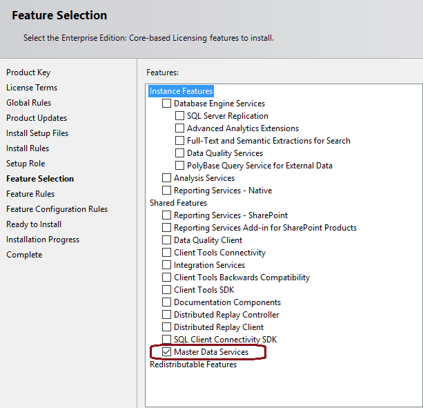  
  
3.  Complete the installation wizard.  

## <a name="InstallIIS"></a> Installing and Configuring IIS
  
1.  In [!INCLUDE[winserver2012r2](../includes/winserver2012r2-md.md)], click the **Server Manager** icon on the taskbar on the **Desktop**.  
  
     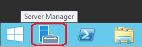  
  
5.  In **Server Manager**, on the **Manage** menu, click **Add Roles and Features**.
   
     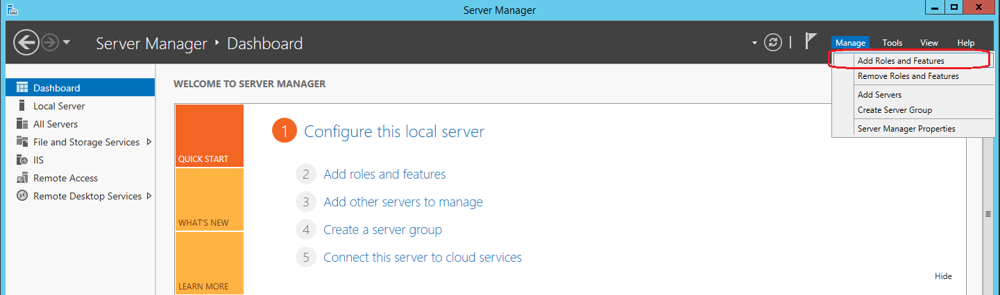  
  
6.  On the **Installation Type** page of the **Add Roles and Features Wizard**, accept the default value (**Role-based or feature-based installation**) and click **Next**.  
  
7.  Click **Select a server from the server pool**, and then click the server where you installed [!INCLUDE[ssMDSshort](../includes/ssmdsshort-md.md)].  
  
     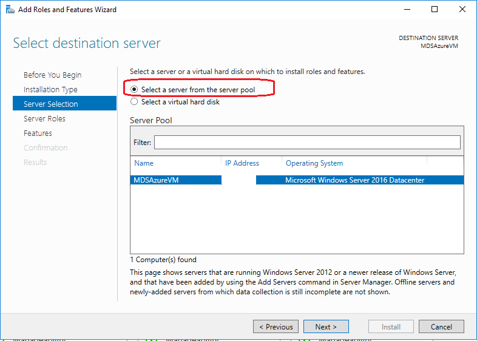 
  
8. On the **Server Roles** page, click **Web Server** and then click **Next**. 

   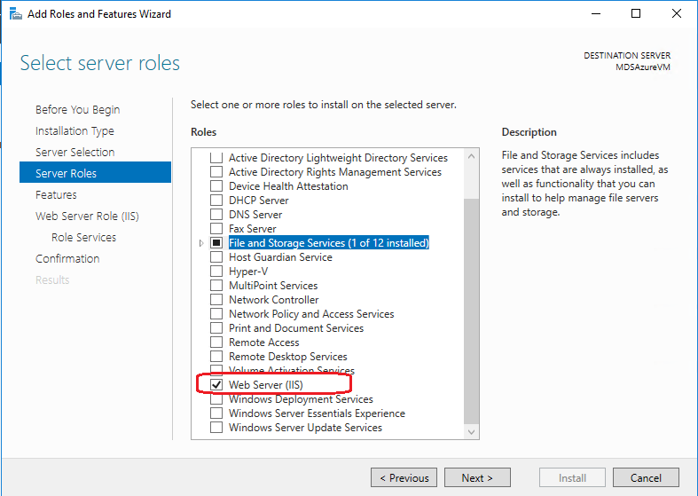
   
9. On the **Features** page, confirm that the following features are selected, and then click **Next**. These features are required for [!INCLUDE[ssMDSshort_md](../includes/ssmdsshort-md.md)] on [!INCLUDE[winserver2012r2_md](../includes/winserver2012r2-md.md)].
  
    |Features|Features|  
    |--------------|--------------|  
    |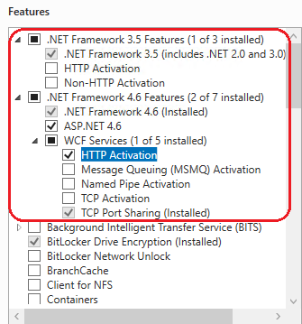|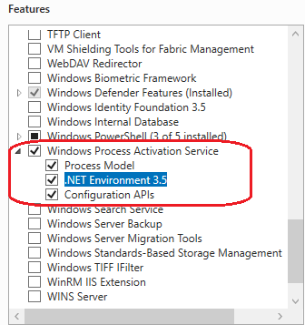|  

10. In the left-hand pane, click **Web Server Role (IIS)** and then click **Role Services**.
11. On the **Role Services** page, confirm that the following services are selected, and then click **Next**. These services are required for [!INCLUDE[ssMDSshort](../includes/ssmdsshort-md.md)] on [!INCLUDE[winserver2012r2](../includes/winserver2012r2-md.md)].

    > [!WARNING]  
    >  Do not install the WebDAV Publishing role service. WebDAV Publishing is not compatible with [!INCLUDE[ssMDSshort](../includes/ssmdsshort-md.md)].  
  
     |Role Services|Role Services|  
    |-----------------------------|-----------------------------|  
    |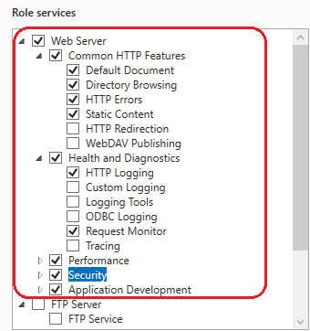|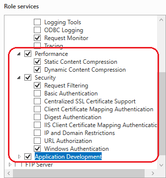|  
    |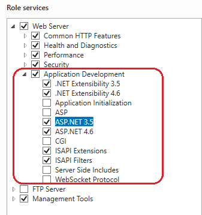|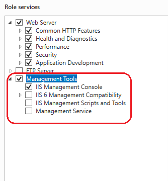|  
  
     For a list of the required features and roles services on other operating systems, see [Web Application Requirements &#40;Master Data Services&#41;](../master-data-services/install-windows/web-application-requirements-master-data-services.md) .   
  
 For more information about installing [!INCLUDE[ssNoVersion](../includes/ssnoversion-md.md)] using setup, see [Install SQL Server 2016 from the Installation Wizard &#40;Setup&#41;](../database-engine/install-windows/install-sql-server-from-the-installation-wizard-setup.md).  
  
 For more information about installing [!INCLUDE[ssNoVersion](../includes/ssnoversion-md.md)] using a command prompt, see [Install SQL Server 2016 from the Command Prompt](../database-engine/install-windows/install-sql-server-from-the-command-prompt.md). When you use a command prompt, [!INCLUDE[ssMDSshort](../includes/ssmdsshort-md.md)] is available as a feature parameter.  
  
 For a brief description with links to additional information about pre-installation tasks, see [Install Master Data Services](../master-data-services/install-windows/install-master-data-services.md).  
  
##  <a name="SetUpWeb"></a> Setting up the Database and Website  
 **To set up the database and website using the [!INCLUDE[ssMDScfgmgr](../includes/ssmdscfgmgr-md.md)]**  

 
> [!WARNING]
>  You must [install IIS](#InstallIIS) before launching the [!INCLUDE[ssMDSshort_md](../includes/ssmdsshort-md.md)] Configuration Manager. Otherwise, the Configuration Manager will display an Internet Information Services error and you will not be able to create the [!INCLUDE[ssMDSshort_md](../includes/ssmdsshort-md.md)] web application.  
> 
> **Browser Requirement**
> The [!INCLUDE[ssMDSshort_md](../includes/ssmdsshort-md.md)] web application works only in Internet Explorer (IE) 9 or later. IE 8 and earlier versions, Microsoft Edge and Chrome are not supported.    
> Starting in [!INCLUDE[sqlv15](../includes/sssql19-md.md)], HTML controls replace all former Silverlight components, therefore the Silverlight dependency removed. More browsers, including Chrome and Edge, now work for the Master Data Services web app.
  
1.  Launch the [!INCLUDE[ssMDScfgmgr](../includes/ssmdscfgmgr-md.md)], and click **Database Configuration** in the left pane.  
  
2.  Click **Create Database**, and then click **Next** in the **Create Database Wizard**.  
  
3.  On the **Database Server** page, specify the SQL Server instance. 

    >  [!INCLUDE[sqlv15](../includes/sssql19-md.md)] adds support for SQL Server Managed Instance. Set the value of **SQL Server Instance** to the host of the managed instance. For example, `xxxxxx.xxxxxx.database.windows.net`.

4. Select the **Authentication type** and then click **Test Connection** to confirm that you can connect to the database using the credentials for the authentication type you selected. Click **Next**.

    >For [!INCLUDE[sqlv15](../includes/sssql19-md.md)], to connect to the managed instance, use one of the following authentication types:
    >
    >- Azure Active Directory Integrated Authentication: **Current User – Active Directory Integrated**
    >- SQL Server Authentication: **SQL Server Account**.
    >
    >In SQL Managed Instance, the user must be a member of the `sysadmin` fixed server role.

    > [!NOTE]  
    >  When you select **Current User - Integrated Security** as the authentication type, **User name** box is read-only and displays the name of the Windows user account that is logged on to the computer. If you are running [!INCLUDE[ssnoversion_md](../includes/ssnoversion-md.md)] [!INCLUDE[ssMDSshort_md](../includes/ssmdsshort-md.md)] on an Azure Virtual Machine (VM), the **User name** box displays the VM name and the user name for the local administrator account on the VM. 

    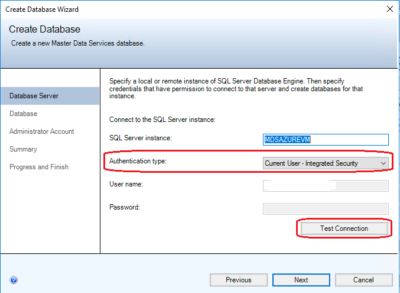  
  
4.  Type a name in the **Database name** field. Optionally, to select a Windows collation, clear the **SQL Server default collation** checkbox and click one or more of the available options such as **Case-sensitive**. Click **Next**.

    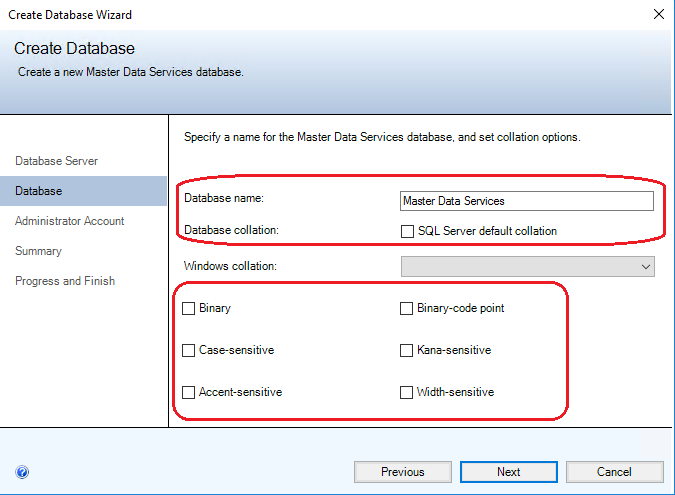  
  
     For more information about Windows collation, see [Windows Collation Name (Transact-SQL)](../t-sql/statements/windows-collation-name-transact-sql.md).  
  
5.  In the **User name** field, specify  the Windows account of the user that will be the default Super User for Master Data Services. A Super User has access to all functional areas and can add, delete, and update all models.  

    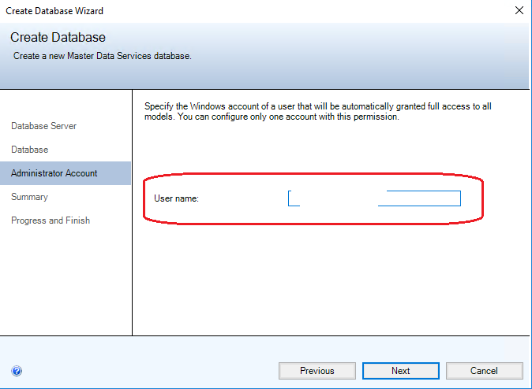  
  
6.  Click **Next** to view a summary of the settings for the [!INCLUDE[ssMDSshort](../includes/ssmdsshort-md.md)] database, and then click **Next** again to create the database. The **Progress and Finish** page appears.

7. When the database is created and configured, click **Finish**.  
  
     For more information about the settings in the **Create Database Wizard**, see [Create Database Wizard &#40;Master Data Services Configuration Manager&#41;](../master-data-services/create-database-wizard-master-data-services-configuration-manager.md).  
  
7.  On the **Database Configuration** page in the [!INCLUDE[ssMDScfgmgr](../includes/ssmdscfgmgr-md.md)],  click **Select Database**.  
  
8.  Click **Connect**, select the [!INCLUDE[ssMDSshort](../includes/ssmdsshort-md.md)] database that you created in Step 7, and then click **OK**. 

    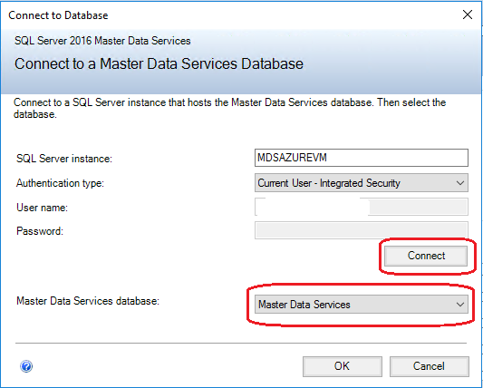  
  
     You've finished setting up the database. The **Database Configuration** page now displays the [!INCLUDE[ssNoVersion](../includes/ssnoversion-md.md)] instance that you're connected to for [!INCLUDE[ssMDSshort](../includes/ssmdsshort-md.md)], the  database you've created and the current database version.  

    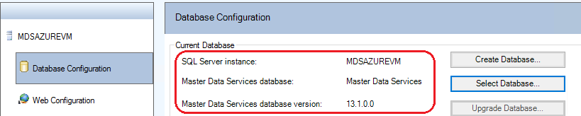   
  
9. In [!INCLUDE[ssMDScfgmgr](../includes/ssmdscfgmgr-md.md)], and click **Web Configuration** in the left pane.  
  
10. In the **Website** list box, click **Default Web Site**, and then click **Create** to create a Web application.  
  
    > [!NOTE]  
    >  When you select **Default Web Site**, you must create a Web application. If you select **Create new website** in the list box, the application is automatically created.  

     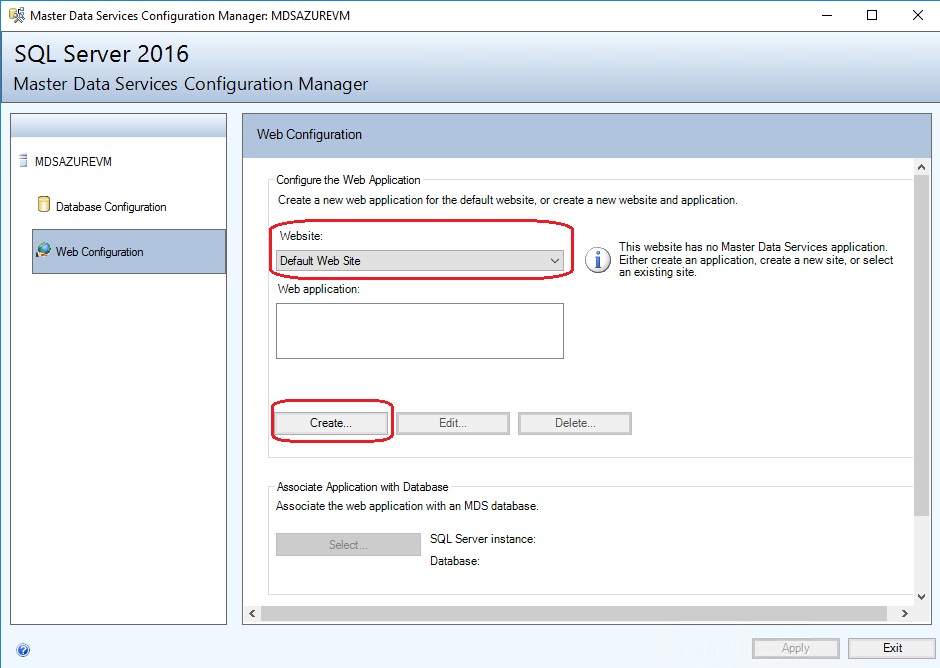  
  
11. In the **Application Pool** section, do one of the following.  
  
    -   Enter the same user name that you entered in Step 5 for the database **Administrator Account**, enter the password, and then click **OK**.  
  
         **-OR-**  
  
    -   Enter a different user name, enter the password, and then click OK.  
  
         You don't have to use the same account when you create the database and the web application.
         
        > [!NOTE] 
        >  Your MDS Application Pool identity must be a part of the Windows Authorization Access Group.

        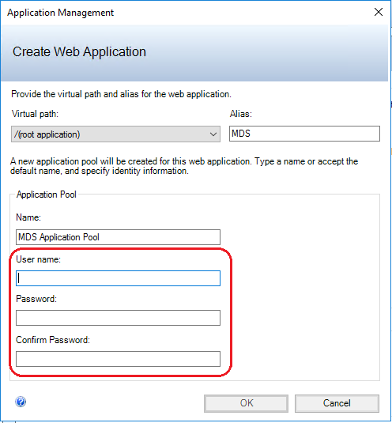   
  
     For more information about the **Create Web Application** dialog box, see [Create Web Application Dialog Box &#40;Master Data Services Configuration Manager&#41;](../master-data-services/create-web-application-dialog-box-master-data-services-configuration-manager.md).  

    > [!NOTE] 
    >  If your domain implemented [2020 LDAP channel binding and LDAP signing requirements for Windows](https://support.microsoft.com/help/4520412/2020-ldap-channel-binding-and-ldap-signing-requirements-for-windows), you'll see the error message "The credentials could not be verified in Active Directory" when you use the domain account to create an Application Pool. For a resolution, instead of the domain user, use a *local machine user*. This bypasses the credential checking with Active Directory. After you create the web application, you can change the identity to the domain user in Internet Information Services (IIS) Manager.
   
12. On the **Web Configuration** page in the **Web application** box, click the application you've created, and then click **Select** in the  **Associate Application with Database** section.  
  
13. Click **Connect**, select the [!INCLUDE[ssMDSshort](../includes/ssmdsshort-md.md)] database that you want to associate with the Web application, and then click **OK**.  
  
     You've finished setting up the Website. The **Web Configuration** page now displays the Website you selected,  Web application you created, and the [!INCLUDE[ssMDSshort](../includes/ssmdsshort-md.md)] database  associated with the application.  

     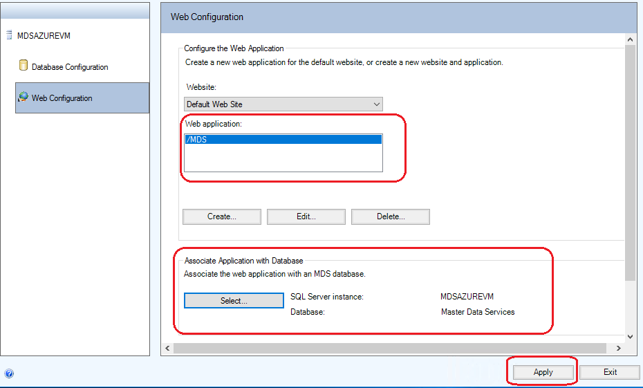  
 
     
15. Click **Apply**. The **Configuration Complete** message box displays. Click **OK** in the message box to launch the web application. The web site address is https://*server name*/*web application*/. 


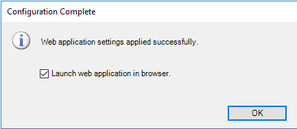 
  
For more information about the settings on the Web Configuration page, see [Web Configuration Page &#40;Master Data Services Configuration Manager&#41;](../master-data-services/web-configuration-page-master-data-services-configuration-manager.md)  
  
 You can also use [!INCLUDE[ssMDScfgmgr](../includes/ssmdscfgmgr-md.md)] to specify other settings for the Web applications and services associated with the [!INCLUDE[ssMDSshort](../includes/ssmdsshort-md.md)] database. For example, you can specify how frequently data is loaded or how often validation emails are sent. For more information, see [System Settings &#40;Master Data Services&#41;](../master-data-services/system-settings-master-data-services.md).  
  
##  <a name="deploySample"></a> Deploying Sample Models and Data  
 The following three sample model packages are included with  [!INCLUDE[ssMDSshort](../includes/ssmdsshort-md.md)].   These sample models include data. **The default location for the sample model packages is %programfiles%\Microsoft SQL Server\140\Master Data Services\Samples\Packages.**
  
-   chartofaccounts_en.pkg  
-   customer_en.pkg  
-   product_en.pkg  
  
 You deploy the packages using the MDSModelDeploy tool. The default location for the MDSModelDeploy tool is *drive*\Program Files\Microsoft SQL Server\ 140\Master Data Services\Configuration.  
  
 For information about prerequisites for running this tool, see [Deploy a Model Deployment Package by Using MDSModelDeploy](../master-data-services/deploy-a-model-deployment-package-by-using-mdsmodeldeploy.md).  
  
 For information about updates made to the data to support new features in [!INCLUDE[ssnoversion](../includes/ssnoversion-md.md)][!INCLUDE[ssMDSshort](../includes/ssmdsshort-md.md)], see [SQL Server Samples: Model Deployment Packages (MDS)](../master-data-services/sql-server-samples-model-deployment-packages-mds.md).  
  
 **To deploy the sample models**  
  
1.  Copy the sample model packages to *drive*\Program Files\Microsoft SQL Server\140\Master Data Services\Configuration.  
  
2.  Open an Administrator: Command Prompt and navigate to MDSModelDeploy.exe, by running the following command.  
  
    ```  
    cd c:\Program Files\Microsoft SQL Server\140\Master Data Services\Configuration  
    ```  
  
3.  Deploy each of the sample models to [!INCLUDE[ssMDSshort](../includes/ssmdsshort-md.md)] by running each of the following commands.  
  
    > [!IMPORTANT]  
    >  In the examples below, the `MDS1` service value is specified. You use this value if you selected  **Default Web Site** when you set up the [!INCLUDE[ssMDSshort](../includes/ssmdsshort-md.md)] Web site.  See the [Setting up the Database and Website](#SetUpWeb) section.  
    >   
    >  If you created a new web site or selected another existing web site, run the following command first to determine the correct service value.  
    >   
    >  `MDSModelDeploy listservices`  
    >   
    >  The first service value in the list of values returned, is the one you specify to deploy a model.  

    > [!NOTE]
    > In order to know more about the metadata information of the sample models, please refer to the readme file available at this  location "c:\Program Files\Microsoft SQL Server\140\Master Data Services\Configuration"
   
     **To deploy the chartofaccounts_en.pkg sample model**  
  
    ```console
    MDSModelDeploy deploynew -package chartofaccounts_en.pkg -model ChartofAccounts -service MDS1  
    ```  
  
     **To deploy the customer_en.pkg sample model**  
  
    ```console
    MDSModelDeploy deploynew -package customer_en.pkg -model Customer -service MDS1  
    ```  
  
     **To deploy the product_en.pkg sample model**  
  
    ```console
    MDSModelDeploy deploynew -package product_en.pkg -model Product -service MDS1  
    ```  
  
     When a model is successfully deployed, the **MDSModelDeploy operation completed** message is displayed.  
  
     The following image shows the command for deploying the product_en.pkg sample model.  
  
     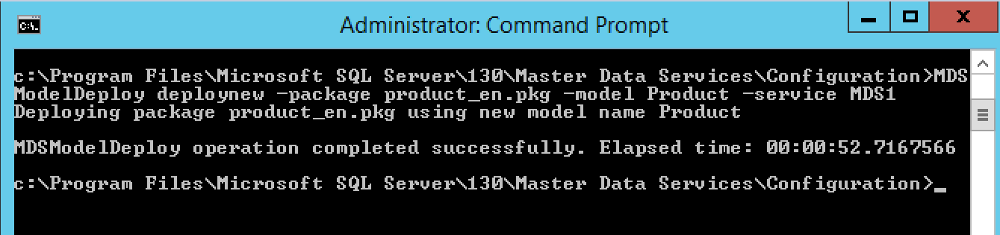  
  
4.  To view the sample models, do the following.  
  
    1.  Navigate to the [!INCLUDE[ssMDSshort](../includes/ssmdsshort-md.md)] web site that you set up. See the [Setting up the Database and Website](#SetUpWeb) section.  
  
         The web site address is https://*server name*/*web application*/.  
  
    2.  Select a model from the **Model** list box, and click **Explorer**.  
  
         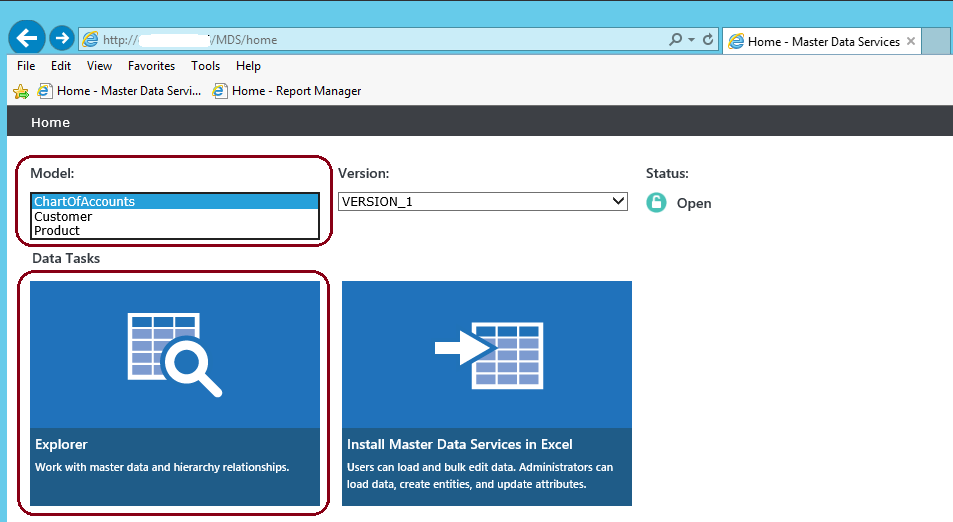  
  
## Next Step  
 Create a new model and entities for your data. See [Create a Model &#40;Master Data Services&#41;](../master-data-services/create-a-model-master-data-services.md) and [Create an Entity &#40;Master Data Services&#41;](../master-data-services/create-an-entity-master-data-services.md).  
  
 For an overview of how you use a model and entities to build a structure for your data in [!INCLUDE[ssMDSshort](../includes/ssmdsshort-md.md)], see [Master Data Services Overview &#40;MDS&#41;](../master-data-services/master-data-services-overview-mds.md)  
    
## See Also  
 [Master Data Services Database](../master-data-services/master-data-services-database.md)   
 [Master Data Manager Web Application](../master-data-services/master-data-manager-web-application.md)   
 [Database Configuration Page &#40;Master Data Services Configuration Manager&#41;](../master-data-services/database-configuration-page-master-data-services-configuration-manager.md)   
 [What's New in Master Data Services &#40;MDS&#41;](../master-data-services/what-s-new-in-master-data-services-mds.md)  
