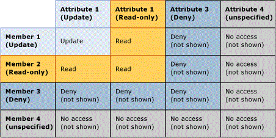

# Overlapping Model and Member Permissions (Master Data Services)

[!INCLUDE[appliesto-ss-xxxx-xxxx-xxx-md-winonly](../includes/appliesto-ss-xxxx-xxxx-xxx-md-winonly.md)]

  Permission assigned to a member can overlap with permission assigned to a model object. When overlaps occur, the more restrictive permission takes effect.  
  
 If a member has permission that is different than its corresponding model object, the following rules apply:  
  
-   **Deny** overrides all other permissions.  
  
-   **Admin** permission on the Model level overrides all other permissions and is changed to All (CRUD) access permission on sub levels.  
  
-   Effective access permission intersects permissions for members and attributes.  
  
     For example, if member permissions include **Create** and **Update**, the permission for attributes is **Update**. The effective permission is **Update**.  
  
 The following image shows which permissions take effect on an individual attribute value when attribute permissions are different than member permissions.  
  
   
  
## Example 1  
   
  
 On the **Models** tab, the Product entity has **Update** permission assigned. All attributes in the entity inherit that permission.  
  
 On the **Hierarchy Members** tab, the Mountain Bikes subcategory node in a derived hierarchy has **Update** permission assigned.  
  
 Result: In **Explorer**, the user has **Update** permission to all attribute values for all members in the Mountain Bikes node. All other members and attributes are hidden.  
  
   
  
## Example 2  
   
  
 On the **Models** tab, the Subcategory attribute has **Update** permission assigned.  
  
 On the **Hierarchy Members** tab, the Mountain Bikes subcategory node in a derived hierarchy is explicitly assigned **Read** permission.  
  
 Result: In **Explorer**, the user has **Read** permission to the Subcategory attribute values for the members in the Mountain Bikes node. All other members and attributes are hidden.  
  
   
  
## Example 3  
   
  
 On the **Models** tab, the Subcategory attribute has **Read** permission assigned.  
  
 On the **Hierarchy Members** tab, the Mountain Bikes subcategory in a derived hierarchy is explicitly assigned **Update** permission.  
  
 Result: In **Explorer**, the user has **Read** permission to the attribute values. All other members and attributes are hidden.  
  
   
  
## See Also  
 [How Permissions Are Determined &#40;Master Data Services&#41;](../master-data-services/how-permissions-are-determined-master-data-services.md)   
 [Overlapping User and Group Permissions &#40;Master Data Services&#41;](../master-data-services/overlapping-user-and-group-permissions-master-data-services.md)  
  
  
