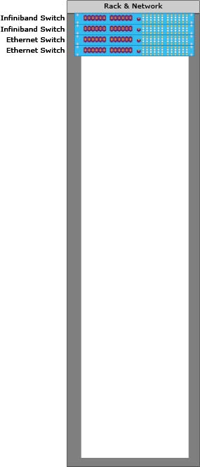
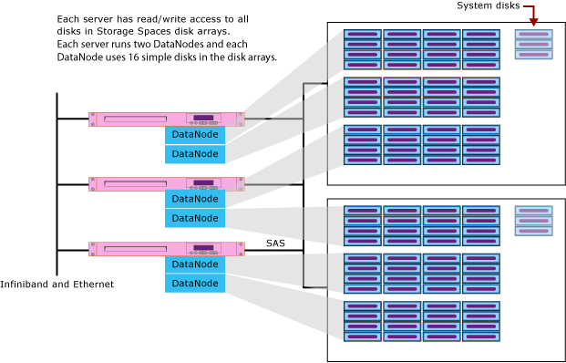
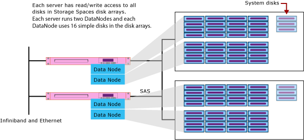
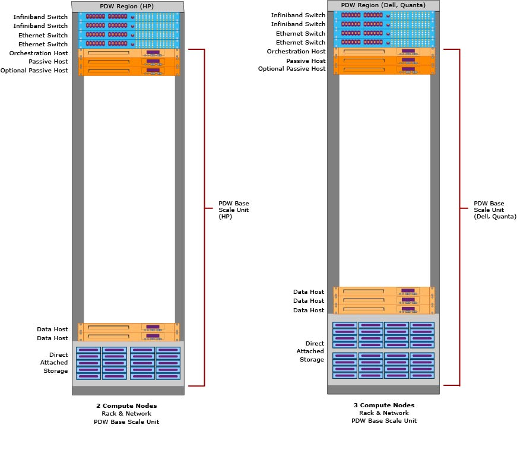
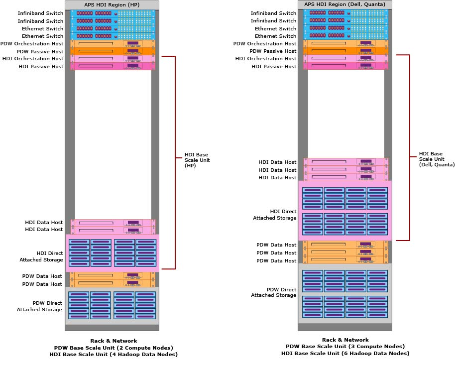

# Hardware Components (Analytics Platform System)
Analytics Platform System hardware is architected with scalable components so that you buy the right amount of processing and storage according to your business requirements. When you order Analytics Platform System, you will need a combination of these core hardware components. Specific hardware vendors might use different naming conventions or have additional components.  
  
> [!NOTE]  
> When you determine the capacity of the HDInsight Region, please take into consideration that you cannot expand the HDInsight region by simply adding more hardware. If you need to expand with this version, you can do this by adding hardware and then rebuilding the HDI region.  
  
## Contents  
  
-   [Rack & Network](#rackandnetwork)  
  
-   [Data Scale Unit](#datascaleunit)  
  
-   [PDW Base Scale Unit](#pdwbasescaleunit)  
  
-   [HDI Base Scale Unit](#hdibasescaleunit)  
  
## Rack & Network  
APS components are all stored in one or more racks that fit into your data center. Each rack comes with power distribution units (PDUs), two InfiniBand switches, and two Ethernet switches.  
  
  
  
## Data Scale Unit  
A Data Scale Unit contains the data hosts and direct attached storage (DAS) for processing and storing user data. To add capacity you add Data Scale Units according to configurations that are supported by your hardware vendor. As the number of Data Scale Units grows, you need to add additional Rack & Network components, as necessary, to provide more power, network, and rack infrastructure.  
  
data host  
A data host is a server dedicated to processing user data. Each Data Scale Unit is dedicated to either the PDW Region or the HDI Region. PDW runs one Compute node on each data host. HDI runs two data nodes on each data host. For HPE appliances, the Data Scale Unit has two data hosts. For Dell and Quanta appliances, the Data Scale Unit has three data hosts.  
  
direct attached storage (DAS)  
The direct attached storage is a pool of disks connected to the data hosts. All of the data hosts can access any of the disks. As part of the shared nothing architecture, the Compute nodes running on the data hosts do not share individual disks. However, for high availability, the storage access is shared and each of the data hosts can access any of the disks.  
  
### PDW Data Scale Unit Architecture - DELL and Quanta  
  
  
### PDW Data Scale Unit Architecture - HPE  
  
  
### Description  
For PDW, a Data Scale Unit has one server (host) for each Compute Node and one direct-attached disk array that is attached with Serial Attached SCSI (SAS). Within the storage cabinet, the disk array is divided into two halves that each have redundant power supplies. Windows Server Storage Spaces manages user data by duplicating data across RAID 1 mirrored disk pairs. The disks in each disk pair are stored in different halves of the disk array.  
  
The disk array also contains hot spare disks and a system disk. If a disk fails, Storage Spaces uses the good copy of the data on the functioning disk to rebuild a duplicate copy of the data on a hot spare. This is an important self-healing capability that helps to protect against data loss.  
  
The total number of disks for the Compute nodes:  
  
-   DELL has 96 disks = (3 servers) * (16 disks per server) \* (2 for redundant disks).  
  
-   HPE has 64 disks = (2 servers) * (16 disks per server) \* (2 for redundant disks).  
  
-   In addition, each disk array has hot spare disks and a system disk.  
  
**For high availability**, when a Compute node fails over it can still function and access its user data through the other host in the Data Scale Unit. At least one of the direct attached physical hosts MUST be functioning or data access to the storage is lost.  
  
**For disk sizes**, the direct attached storage can have 1, 2, or 3 Terabyte disk drives. All Data Scale Units must have disks of the same size.  
  
### HDI Scale Unit Architecture  
The HDI and PDW scale units use the same hardware, but have different hardware configurations. For example, HDInsight leverages HDFS replication for data redundancy. It stores multiple copies of each data block and therefore does not need to mirror each disk, whereas PDW uses a RAID hardware mirror for redundancy. Since the redundancy is handled by HDInsight, each server hosts two DataNodes that each write to 16 disks in the Storage Spaces disk arrays. When a disk fails, HDInsight uses an existing copy of the data to rebuild the failed data.  
  
#### DELL Scale Unit  
The DELL scale unit has 3 servers and 96 disks, plus a few system disks. Each server hosts 2 DataNodes that each write to 16 simple disks in the Storage Spaces disk arrays. Altogether there are 6 DataNodes in the scale unit.  
  
  
  
#### HPE Scale Unit  
The HPE scale unit has 2 servers and 64 disks, plus a few system disks. Each server hosts 2 Hadoop Data Nodes that each write to 16 simple disks in the Storage Spaces disk arrays. Altogether there are 4 Hadoop Data Nodes in the HP E scale unit.  
  
  
  
## PDW Base Scale Unit  
The PDW Base Scale unit contains the minimum number of brain-power hosts, data hosts, and direct attached storage that is required for a PDW Region. It includes these components.  
  
orchestration host  
This server runs the brains of PDW, and also provides some management functions for the HDI Region.  
  
passive host  
This server provides high availability. It is online and ready to run jobs in case there is a failure on the orchestration or data host. For the PDW Region, the PDW orchestration host, passive host, and Data Scale Unit servers are configured as a Windows failover cluster. Each rack in the appliance that contains PDW Data Scale Units requires one PDW passive host.  
  
optional passive host  
To add further redundancy, you have the option to add a second passive host to the PDW Base Scale Unit.  
  
Data Scale Unit  
The PDW Base Scale Unit includes one Data Scale Unit which is placed at the bottom of the rack.  
  
This diagram shows the PDW Base Scale Unit plus the Rack and Network. This is the minimum configuration for an Analytics Platform System appliance.  
  
  
  
## HDI Base Scale Unit  
In order to add an HDI Base Scale Unit, you must first have a PDW Base Scale Unit. The HDI Base Scale Unit contains the hosts and minimum storage that is required for an HDI Region. You can add more capacity to the HDI Region by adding more Data Scale Units.  
  
### Orchestration host  
This is a server that runs the brains of HDInsight, and it also provides some management functions for the HDI Region.  
  
### Passive host  
This is a passive server provided for high availability of the orchestration host and the data hosts. For the HDI Region, the HDI orchestration host, passive host, and Data Scale Unit servers are configured as a Windows failover cluster.  
  
### Data Scale Unit 
The HDI Base Scale Unit contains one Data Scale Unit.  
  
  
