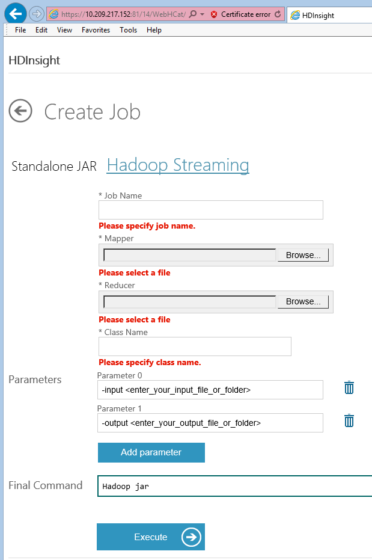

# Create Job - HDInsight Region Developer Dashboard (Analytics Platform System)
Use the **Create Job** page of the HDInsight Developer Dashboard to submit jobs to HDInsight. The **Create Job** page presents two options; **Standalone JAR** or **Hadoop Streaming**. Select one to present that type of page.  
  
## Create Job  
  
### Standalone JAR  
  
  
The **Standalone JAR** page has the following sections.  
  
-   **Job Name**  
  
    Provide a name for this new job.  
  
-   **Local JAR File**  
  
    Browse to select a file with the **.JAR** extension, containing MapReduce code.  
  
-   **Class Name**  
  
    Provide a class name.  
  
-   **Add parameter**  
  
    Click the **Add parameter** button to add a box where you can provide a parameter.  
  
-   **Final Command**  
  
    When parameters are added, displays the command as it is constructed.  
  
-   **Execute**  
  
    Creates the specified job.  
  
##### To Submit a Job  
  
1.  Open the Developer Dashboard. For more information on how to open the developer dashboard, see [HDInsight Region Developer Dashboard &#40;Analytics Platform System&#41;](../hdinsight/hdinsight-region-developer-dashboard-analytics-platform-system.md).  
  
2.  Click on **Create Job**.  
  
3.  In the **Job Name** box, type a name for this job.  
  
4.  In the **Local JAR File** box, type a path and name, or browse to a job file.  
  
5.  In the **Class Name** box, type a class name.  
  
6.  If the job requires a parameter, click the **Add parameter** button and provide the parameter value.  
  
7.  Click **Execute** to run the job.  
  
### Hadoop Streaming  
  
  
The **Hadoop Streaming** page has the following sections.  
  
-   **Job Name**  
  
    Provide a name for this new job.  
  
-   **Mapper**  
  
    Browse to select a mapper file.  
  
-   **Reducer**  
  
    Browse to select a reducer file.  
  
-   **Parameters**  
  
    Replace the content of the Parameter 0 edit box with `-input <HDFS_path_to_input_file_or_directory>` which represents input file(s) to the Mappers.  
  
    Replace the content of the Parameter 1 edit box with `-output < HDFS_path_to_output_directory>` that will contain the result files that the Reducers output. This path must not exist in HDFS prior to creating this job.  
  
## See Also  
[HDInsight Region Developer Dashboard &#40;Analytics Platform System&#41;](../hdinsight/hdinsight-region-developer-dashboard-analytics-platform-system.md)  
  
