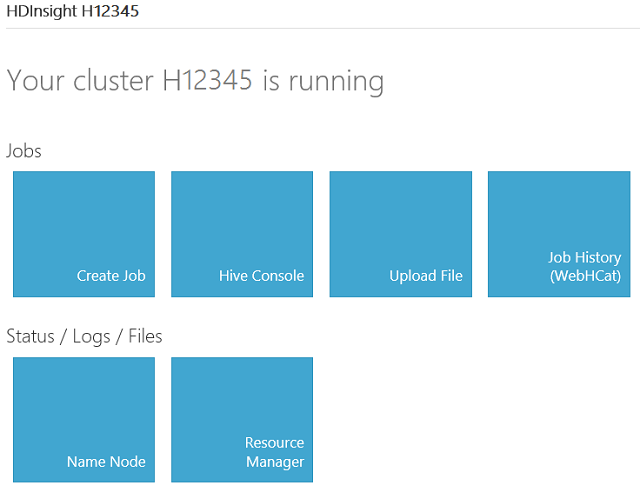

# HDInsight Region Developer Dashboard (Analytics Platform System)
Use the HDInsight Developer Dashboard to interact with the Hadoop components of the Analytics Platform System HDInsight Region. The Developer Dashboard is implemented as a web application that obtains information from the standard Hadoop components and tools. Use the Developer Dashboard to:  
  
-   Quickly upload sample files and executables.  
  
-   Quickly and easily run and monitor ad-hoc jobs.  
  
-   Easily gain insight into Hive metadata, and to run and monitor queries.  
  
-   Gain access to standard Hadoop web interfaces (Name Node UI and Resource Manager) for HDFS file browsing and download, name node and job tracker logs, etc.  
  
To connect to the Developer Dashboard, using a web browser connect to the IP address of the HSN01computer, in the format **https://xxx.xxx.xxx.xxx:81** When prompted, provide the credentials of your user account.  
  
> [!IMPORTANT]  
> The Developer Dashboard does not pass credentials to other programs. Pages that navigate to Hadoop tools require you to login again. You can login with the same or with different credentials.  
  
## Main Page  
  
  
The **Main** page of the **Developer Dashboard** presents the following sections.  
  
### The Jobs area:  
  
|Title|Description|  
|---------|---------------|  
|[Create Job - HDInsight Region Developer Dashboard &#40;Analytics Platform System&#41;](../hdinsight/create-job-hdinsight-region-developer-dashboard-analytics-platform-system.md)|Create Map/Reduce and Streaming jobs.|  
|[Hive Console - HDInsight Region Developer Dashboard &#40;Analytics Platform System&#41;](../hdinsight/hive-console-hdinsight-region-developer-dashboard-analytics-platform-system.md)|Provides the REPL experience to HDInsight developers, the ability to experiment with Hadoop data through the Hive QL interface.|  
|[Upload File - HDInsight Region Developer Dashboard &#40;Analytics Platform System&#41;](../hdinsight/upload-file-hdinsight-region-developer-dashboard-analytics-platform-system.md)|Copy a file to a selected path on the HDFS.|  
|[Job History - HDInsight Region Developer Dashboard &#40;Analytics Platform System&#41;](../hdinsight/job-history-hdinsight-region-developer-dashboard-analytics-platform-system.md)|Uses the **WebHCat** tool to monitor the status of current and previous jobs.|  
  
### The Status / Logs / Files area:  
  
|Title|Description|  
|---------|---------------|  
|[Name Node - HDInsight Region Developer Dashboard &#40;Analytics Platform System&#41;](../hdinsight/name-node-hdinsight-region-developer-dashboard-analytics-platform-system.md)|Presents the Hadoop **Namenode UI** used for browsing the file system and accessing the NameNode log. Use the Name Node UI page to view cluster summary information (health).|  
|[Resource Manager - HDInsight Region Developer Dashboard &#40;Analytics Platform System&#41;](../hdinsight/resource-manager-hdinsight-region-developer-dashboard-analytics-platform-system.md)|The default UI tool for inspection of job history on Hadoop. It displays all jobs, running, completed, failed and retired. This page gets data from the History Server and is not dependent on **WebHCat**. The **Job History** page provides a light weight view on the jobs submitted through **WebHCat** and also displays additional information provided by HDInsight.|  
  
