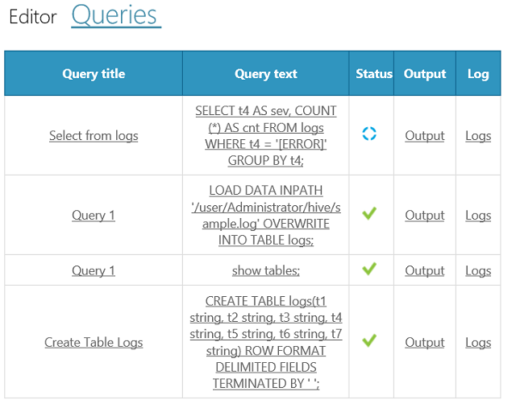

# Hive Console - HDInsight Region Developer Dashboard (Analytics Platform System)
The **Hive Console** page provides the **REPL** experience to HDInsight developers; the ability to experiment with Hadoop data through the Hive QL interface. This console is accessed from the developer dashboard.  
  
## Hive Console  
The console consists of two main components: The **Object Explorer** and a second component with both **Editor** and **Queries** tabs.  
  
## Object Explorer  
The Object Explorer component represents available Hive objects in a Database/table/columns navigation tree. Double click on table objects in the Object Explorer to submit a query that retrieves the DDL statement of that table and automatically copy the DDL into the Query editor. After the query returns, the DDL can easily be modified and a similar table created. This feature is supported for databases and tables, but not for partitions.  
  
  
  
## Editor Tab  
Use the **Editor** tab to create queries. When complete, click **Run Query** to submit the query. Optionally, provide a unique query title to help identify the query later in the **Queries** history section.  
  
  
  
> [!TIP]  
> The Hive Console submits queries using WebHCat (Templeton). Follow WebHCat formats, such as enclosing literal values in single quotes not double quotes. For example, use 'WesternRegion' not "WesternRegion".  
  
## Queries Tab  
The **Queries** tab contains a list of all the queries run in the current user session. Query execution details are listed: **Query Title**, **Query Text**, **Status**, **Output**, and **Log**. The **Query Title** and **Query Text** fields within a row, link back to the Editor window and populate the editor window with the query text. The **Output** and **Log** columns link to the query deep dive tab whereas query title, text, output and logs are shown.  
  
> [!NOTE]  
> The **Job History** page keeps data across all user sessions in the dashboard because it is retrieved from the Job Tracker. The **Queries** tab is limited to the current user session.  
  
  
  
## See Also  
[HDInsight Region Developer Dashboard &#40;Analytics Platform System&#41;](../../mpp/hdinsight/hdinsight-region-developer-dashboard-analytics-platform-system.md)  
  
