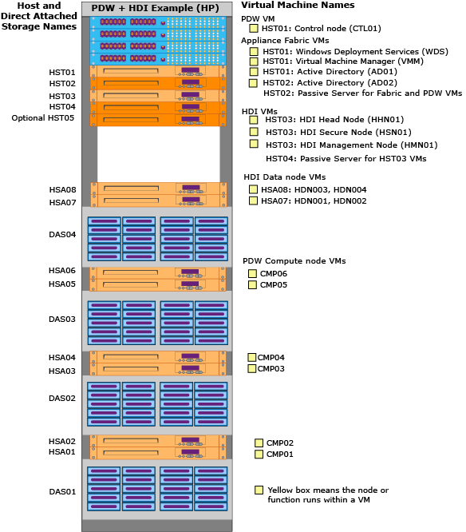

# HDInsight Physical Components (Analytics Platform System)
Names and descriptions for the HDInsight (HDI) Region physical components on the Analytics Platform System appliance.  
  
This topic focuses on the HDI components. For explanations of the PDW and appliance fabric physical components, see [PDW and Appliance Fabric Physical Components &#40;Analytics Platform System&#41;](../../mpp/management/pdw-and-appliance-fabric-physical-components-analytics-platform-system.md).  
  
## Contents  
  
-   [Component Diagrams](#diagrams)  
  
-   [HDI Virtual Machines](#hdi)  
  
-   [Appliance Fabric Components](#fabric)  
  
## Component Diagrams  
This shows the names of the physical components and where they are located in the first rack of an appliance. The appliance has both a PDW Region and an HDI Region. The PDW Region has 6 Compute nodes and the HDI Region has 4 Data nodes.  
  
  
  
The actual name for HDI components is the HDI Region name, followed by a dash, followed by the component name. For example, if the HDI Region name is HDI123, the actual names are **HDI123-HHN01**, **HDI123-HDN001**, etc.  
  
Here is a consolidated view of an HDI Region with 12 Data nodes. It assumes that the appliance uses more than one rack, and that HSA01-HSA06 are being used for PDW Compute nodes.  
  
  
  
## HDI Virtual Machines  
The HST03 virtual machines can failover to HST04. The Data nodes do not failover.  
  
*HDI_region*-HHN01  
A virtual machine that runs Hadoop master services, libraries and command line tools.  
  
Services: Head node, secondary Name node (HDFS), Job Tracker (Map Reduce), History Server (Map Reduce), Resource Manager (Yarn), Hive Metastore, HiveServer2 (Hive), TempletonService (WebHCat), OozieService(Oozie).  
  
Libraries: Pig, Sqoop  
  
> [!WARNING]  
> Analytics Platform System does not support the creation of a snapshot of the HHN01 virtual machine by using Hyper-V Manager. Snapshots rely upon local storage, which will cause errors if the virtual machine attempts to failover to its backup. Creating a snapshot can also cause reliability issues with the other VM's that failover to the passive server.  
  
*HDI_region*-HSN01  
A virtual machine that runs the secure node gateway which performs authentication and authorization of all incoming external requests. PolyBase requests are not routed to the secure gateway. HSN01 also hosts the HDInsight Region Developer Dashboard.  
  
*HDI_region*-HMN01  
A virtual machine that hosts components used for deployment, monitoring and management of the HDI region. HMN01 also runs SQL Server to store data for management operations and backups of HDI configuration files.  
  
*HDI_region*-HDN001 through *HDI_region*-HDN012  
A virtual machine that runs these Hadoop distributed processing components: Data Node (HDFS), TaskTracker (Map Reduce), and Node Manager (Yarn).  
  
A virtual machine that run the HDI Data node. In this 12-Data node diagram, the hosts HSA07 through HSA12 run Data node VMs HDN001 through HDN012.  
  
These virtual machines, while configured as roles in the Hadoop Cluster, do not failover since the Hadoop file system (HDFS) already handles replicated copies of the data. If a Data node fails, Hadoop rebuilds the data on another node.  
  
## Appliance Fabric Components  
These HDI components are part of the appliance fabric.  
  
### Hosts  
*appliance_domain*-HST03 through *appliance_domain*-HST04  
The hosts for the HDI Region. The Head node, Secure node, and Management node run on HST03 and can failover to HST04. When an HDI Region is present, the PDW optional passive host is HST05.  
  
*appliance_domain*-HSA07 through *appliance_domain*-HSA12  
The hosts with storage attached (HSA). Each HSA runs two Data node VMs and one ISCSI VM.  
  
### Cluster for HDI  
*appliance_domain*-WFOHST02  
The HDI cluster is named WFOHST02. It manages all of the physical hosts and virtual machines that belong to HDI.  
  
### Direct Attached Storage  
*appliance_domain*-DAS04 through *appliance_domain*-DAS06  
This is the direct attached storage that is connected to the Data nodes. HP has one DAS for every four Data nodes. Dell and Quanta have one DAS for every six Data nodes.  
  
## See Also  
[Hardware Configurations &#40;Analytics Platform System&#41;](../../mpp/architecture/hardware-configurations-analytics-platform-system.md)  
[Appliance Configuration &#40;Analytics Platform System&#41;](../../mpp/management/appliance-configuration-analytics-platform-system.md)  
[Appliance Management Tasks &#40;Analytics Platform System&#41;](../../mpp/management/appliance-management-tasks-analytics-platform-system.md)  
  
