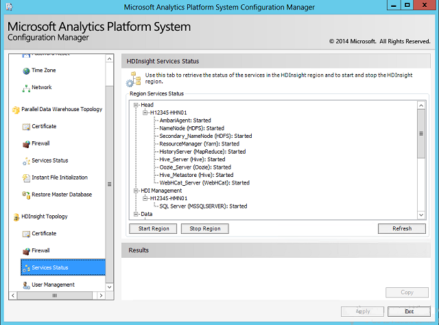

# HDInsight Services Status (Analytics Platform System)
The HDInsight **Services Status** page in the Microsoft Analytics Platform System Configuration Manager shows the current status of all HDInsight services, and provides the ability to stop and start the HDInsight services. This is the only supported method for starting and stopping the HDInsight services. Note that individual components or services cannot be started independently.  
  
#### To start or stop the HDInsight services  
  
1.  To start the HDI services, click **Start Region**.  
  
2.  To stop the HDI services, click **Stop Region**.  
  
It is not necessary to click **Apply** when starting and stopping the services by using **Start Region** and **Stop Region**.  
  
  
  
> [!NOTE]  
> Stopping the PDW Region also stops the PDW agent (sqldwagent) on the nodes of the HDInsight Region. The HDInsight Region is still functional, however health monitoring will not be available. (The PDW agent requires the PDW control node to report health monitoring.)  
  
## See Also  
[Power the APS Appliance On or Off &#40;Analytics Platform System&#41;](../../mpp/management/power-the-aps-appliance-on-or-off-analytics-platform-system.md)  
  
