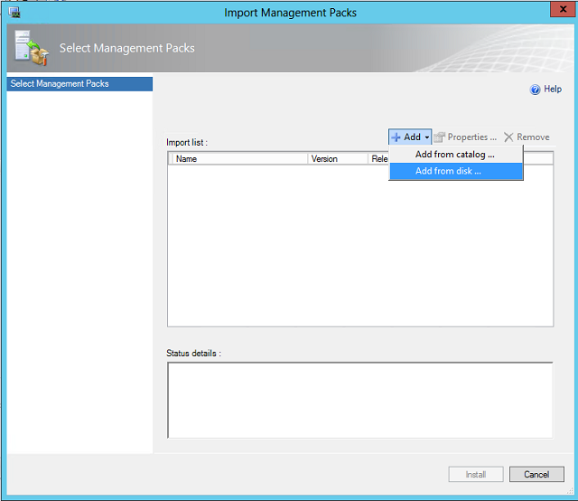
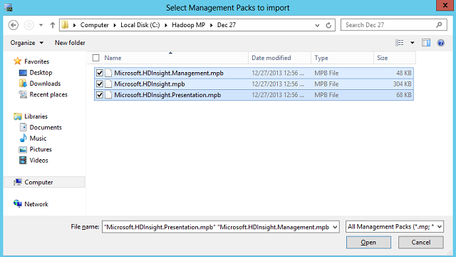
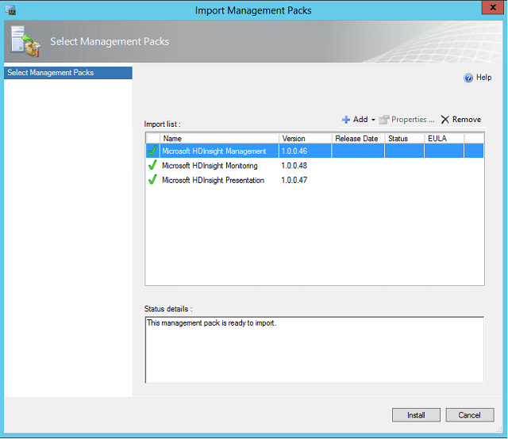
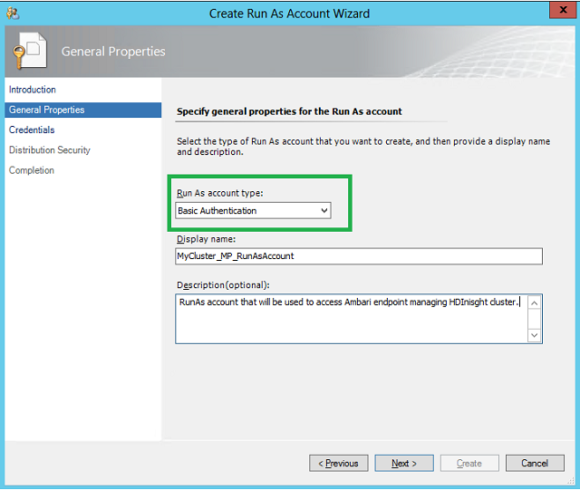
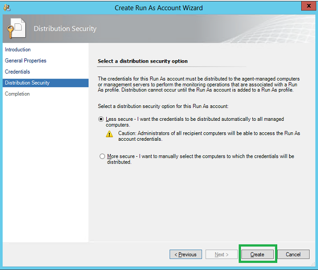

# Import the SCOM Management Pack for HDInsight (Analytics Platform System)
Follow these steps to import the System Center Operations Manager (SCOM) Management Packs for Analytics Platform System HDInsight. The Management Packs are required to monitor HDInsight from SCOM.  
  
## Import the HDInsight Management Pack for System Center 2012  
  
1.  Install the HDI Management Pack as described in [Install the SCOM Management Packs &#40;Analytics Platform System&#41;](../../mpp/management/install-the-scom-management-packs-analytics-platform-system.md).  
  
2.  In System Center 2012, right-click the **Management Packs** node, and then click **Import Management Packs**.  
  
3.  Point to **Add**, and then click **Add from disk**.  
  
      
  
4.  Navigate to the folder where you extracted the HDInsight Management Packs for System Center 2012 and select the three management packs in the **Selected Management packs to import** section, and then click **Open**.  
  
      
  
5.  In the **Select Management Packs** dialog box, with the three HDInsight Management Packs selected, click **Install**.  
  
      
  
6.  When the status for each pack is **Imported**, click **Close**.  
  
      
  
## Configure the Account used by the Management Pack to Connect to HDInsight  
The HDInsight Management Pack interacts with the cluster using the Ambari API. To configure the discovery wizard correctly, an account is needed for the connection to **RunAs**.  
  
1.  In System Center 2012, in the **Administration** section, expand **Run As configuration**, expand to **Accounts**, and then right-click **Run As Account**, to start the **Create Run As Account Wizard**.  
  
2.  On the General Properties page, in the **Run As account type** box, click **Basic Authentication**, and then click **Next**. (HDInisght only supports Basic Authentication.)  
  
      
  
3.  On the **Credentials** page, enter an account name and password, and then click **Next**.  
  
    > [!IMPORTANT]  
    > You should use a HDInsight Cluster Admin account created using Configuration Manager, not a high privileged account such as a HDInsight domain administrator. For more information, see [HDInsight User Management &#40;Analytics Platform System&#41;](../../mpp/management/hdinsight-user-management-analytics-platform-system.md).  
  
      
  
4.  On the Distribution Security page, typically select **Less secure**, and then click **Create**.  
  
    > [!IMPORTANT]  
    > Less secure is a reasonable option because the APS has limited outside connectivity. See your domain administrator for information about your company policy.  
  
      
  
## See Also  
[Monitor the Appliance by Using System Center Operations Manager &#40;Analytics Platform System&#41;](../../mpp/management/monitor-the-appliance-by-using-system-center-operations-manager-analytics-platform-system.md)  
[HDInsight Management Tasks Using SCOM &#40;Analytics Platform System&#41;](../../mpp/management/hdinsight-management-tasks-using-scom-analytics-platform-system.md)  
  
