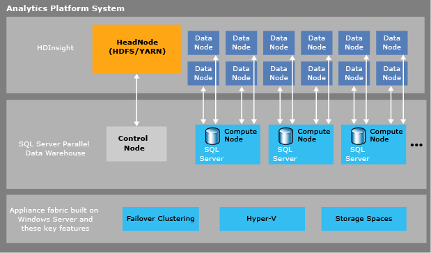

# Product Documentation (Analytics Platform System)
Welcome to the product documentation for Microsoft® Analytics Platform System Appliance Update 5.  
  
Help file version: Appliance Update 5, Date: 2016-08-08 
  
## Microsoft Analytics Platform System  
Microsoft Analytics Platform System (APS), a data platform designed for data warehousing and Big Data analytics, offers deep data integration, high-speed query processing, highly scalable storage, and simple maintenance for your end-to-end business intelligence solutions.  
  
  
  
Analytics Platform System hosts both Microsoft SQL Server Parallel Data Warehouse (PDW) and Microsoft HDInsight (HDI) workloads, all in the same appliance.  
  
PolyBase technology combines relational PDW data with Hadoop data from multiple sources including Hortonworks on Windows Server, Hortonworks on Linux, Cloudera on Linux, HDInsight’s Windows Azure blob storage, and HDInsight on Analytics Platform System. These advanced data integration abilities, plus deep integration with Business Intelligence tools, allow Analytics Platform System to return integrated analysis that enables your business decision makers to make better and more insightful business decisions.  
  
Analytics Platform System ships to your data center as an appliance with hardware and software pre-installed and pre-configured to run multiple workloads. When you purchase Analytics Platform System, you purchase Compute nodes for PDW and optionally purchase additional nodes for HDInsight according to your business requirements.  
  
Analytics Platform System is not only fast and scalable, it is designed with high redundancy and high availability, making it a reliable platform you can trust with your most business critical data. Analytics Platform System is designed for simplicity which makes it easy to learn and to manage. PDW’s PolyBase technology for analyzing Hadoop data, and its deep integration with Business Intelligence tools make it a comprehensive platform for building end-to- end solutions.  
  
## HDInsight  
HDInsight is a 100 percent Apache Hadoop-based data platform that provides a Hadoop-based cloud solution for Windows Azure services, and an on-premises solution for Analytics Platform System. HDInsight manages data of any type, whether relational or nonrelational, and of any size. With APS, you can store and analyze HDInsight data on your own premises.  
  
With APS, you can perform more complex analysis faster by using SQL Server PDW’s PolyBase to integrate analysis of your HDInsight non-relational data and your PDW relational data, all on the same appliance.  
  
HDInsight, running on APS, makes it easy to:  
  
-   Load data of any structure into PDW. By first loading your data into HDInsight, you can transform and process it, and then use PDW’s PolyBase to quickly load the data into PDW relational tables.  
  
-   Perform fast integrated analysis of HDInsight data and PDW data. The data are stored within close proximity of each other on the same appliance, making it fast to run integrated analysis with PDW’s PolyBase.  
  
-   Export relational data to HDInsight region for a *cold data* store. To reduce the size of data stored in SQL Server PDW, you can move it to HDInsight and query the data at any time.  
  
-   Trust that your data will be protected with the Analytics Platform System built-in high availability.  
  
-   Monitor and manage HDInsight by using centralized appliance management tools.  
  
For information, see [HDInsight  &#40;Analytics Platform System&#41;](../mpp/hdinsight/hdinsight-analytics-platform-system.md) in this documentation and [HDInsight benefits](http://www.windowsazure.com/en-us/services/hdinsight/) on the Windows Azure web site.  
  
## SQL Server Parallel Data Warehouse  
Use SQL Server Parallel Data Warehouse as the core relational data warehousing component of your end-to-end business intelligence solutions. With PDW’s massively parallel processing (MPP) design, queries commonly complete 50 times faster than traditional data warehouses built on symmetric multi-processing (SMP) database management systems.  
  
> [!NOTE]  
> 50 times faster means that queries complete in minutes instead of hours, or seconds instead of minutes. With this breakthrough performance, your business analysts can generate more extensive results faster, and can easily perform ad-hoc queries or drill down into the details. As a result, your business can make better decisions, faster.  
  
In addition to achieving breakthrough query performance, PDW makes it easy to:  
  
-   Grow your data warehouse to anywhere from a few terabytes to over 6 petabytes of data in a single appliance by adding “scale units” to your existing system  
  
-   Trust your data will be there when you need it because of the built- in high redundancy and high availability,  
  
-   Solve modern data challenges of loading and consolidating data  
  
-   Integrate Hadoop data with relational data for fast analysis by using PDW’s highly parallelized PolyBase technology  
  
-   Use Business Intelligence tools to build comprehensive end-to-end solutions.  
  
For more information about the benefits of PDW, see the whitepaper [A Breakthrough Platform for Next-Generation Data Warehousing and Big Data Solutions](http://msdn.microsoft.com/library/dn520808.aspx) on MSDN.  
  
