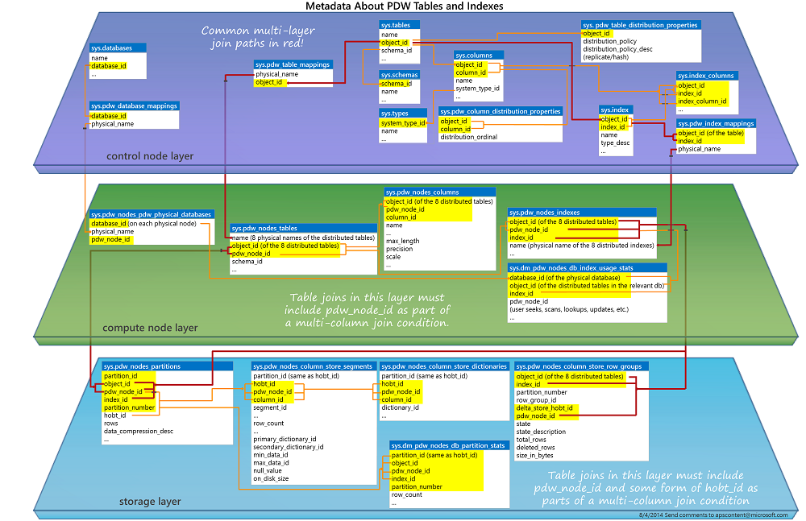
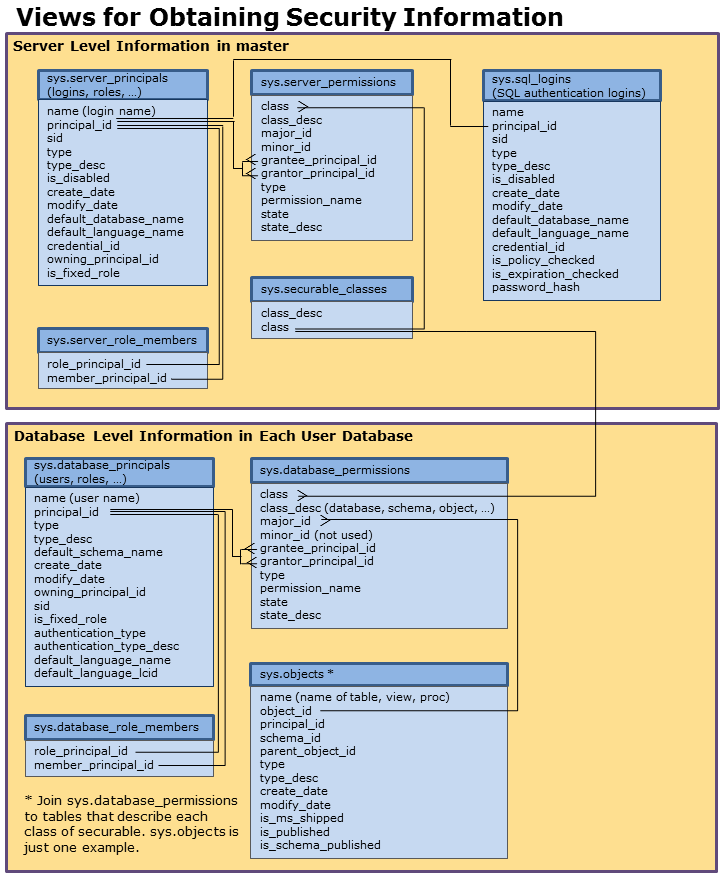

# Common Metadata Query Examples (SQL Server PDW)
This topic provides examples of common metadata queries for SQL Server PDW.  
  
## Contents  
  
-   [Distributed and Replicated Table Queries](#DistRep)  
  
-   [Partitioned Tables](#partitions)  
  
-   [Collations](#collations)  
  
-   [Appliance Health and State](#Health)  
  
-   [Security Information](#Security)  
  
-   [Workload Management](#WorkloadManagement)  
  
## Joining Tables for User-table Metadata  
The following graphic shows some of the system tables and views that present metadata about your user-tables and indexes. The graphic can help you determine which tables and views you should join together in your queries. For a printable version of this graphic, see [System Table chart on the Yammer site](http://go.microsoft.com/fwlink/?LinkId=509888).  
  
  
  
## <a name="DistRep"></a>Distributed and Replicated Table Queries  
These queries show how to find distribution-related information. They apply to the **AdventureWorksPDW2012** database.  
  
### A. List all replicated tables  
  
```  
/* List all of the replicated tables */  
USE AdventureWorksPDW2012;  
SELECT a.name AS [Table Name],   
b.distribution_policy_desc AS [Distribution Type]  
FROM sys.tables AS a   
JOIN sys.pdw_table_distribution_properties AS b   
    ON a.object_id = b.object_id  
WHERE b.distribution_policy = 3;  
```  
  
### B. List all distributed tables  
  
```  
/* List all of the distributed tables */  
USE AdventureWorksPDW2012;  
SELECT a.name AS [Table Name],   
b.distribution_policy_desc AS [Distribution Type]   
FROM sys.tables AS a   
JOIN sys.pdw_table_distribution_properties AS b   
    ON a.object_id = b.object_id  
WHERE b.distribution_policy = 2;  
```  
  
### C. List the distribution type for all tables  
  
```  
/* List all the tables in AdventureWorksPDW2012 and show whether they are replicated or HASH distributed */  
USE AdventureWorksPDW2012;  
SELECT a.name AS [Table Name],   
b.distribution_policy_desc AS [Distribution Type]  
FROM sys.tables AS a   
JOIN sys.pdw_table_distribution_properties AS b  
    ON a.object_id = b.object_id;  
```  
  
### D. List the distribution column for one table  
  
```  
/* List the distribution column for the table DimProduct  
   Distribution column is ProductKey */  
USE AdventureWorksPDW2012;  
SELECT a.name AS [Table Name], c.name AS [Column Name],   
d.distribution_ordinal AS [Distributed]  
FROM sys.pdw_column_distribution_properties AS d  
INNER JOIN sys.columns AS c   
    ON c.object_id = d.object_id  
INNER JOIN sys.tables AS a   
    ON a.object_id = d.object_id  
WHERE a.name = 'DimProduct'   
    AND d.distribution_ordinal = 1   
    AND c.column_id = d.column_id;  
```  
  
### E. List the distribution column for all distributed tables  
  
```  
/* List all of the distributed tables and their distribution columns */  
USE AdventureWorksPDW2012;  
SELECT a.name AS [Table Name], c.name AS [Distribution Column],   
b.name AS [Data Type], d.distribution_ordinal AS [Distributed]  
FROM sys.pdw_column_distribution_properties AS d  
INNER JOIN sys.columns AS c   
    ON c.object_id = d.object_id  
INNER JOIN sys.tables AS a   
    ON a.object_id = d.object_id  
LEFT OUTER JOIN sys.types AS b   
    ON c.user_type_id = b.user_type_id  
WHERE d.distribution_ordinal = 1 AND c.column_id = d.column_id  
;  
```  
  
### F. List common information about tables.  
The following query joins sys.tables, sys.schemas, sys.pdw_table_distribution_properties, sys.columns, sys.types, and sys.pdw_column_distribution_properties to return common information about tables and their columns.  
  
```  
SELECT t.name, t.object_id, s.name,  tdp.distribution_policy_desc,   
  c.name, c.column_id, ty.name, ty.max_length, ty.precision, ty.scale,   
  cdp.distribution_ordinal  
FROM sys.tables AS t  
JOIN sys.schemas AS s  
     ON t.schema_id = s.schema_id  
JOIN sys.pdw_table_distribution_properties AS tdp   
    ON t.object_id = tdp.object_id  
JOIN sys.columns AS c   
    ON t.object_id = c.object_id  
JOIN sys.types AS ty   
    ON c.user_type_id = ty.user_type_id  
JOIN sys.pdw_column_distribution_properties AS cdp   
    ON c.object_id = cdp.object_id AND c.column_id = cdp.column_id  
ORDER BY t.name, c.column_id;  
```  
  
## <a name="partitions"></a>Partitioned Tables  
  
### A. Get boundary information for each partition  
The following example returns the partition numbers, boundary values, boundary value types, and rows per boundary for a partitioned table. This example uses the FactResellerSales table in the **AdventureWorksPDW2012** database.  
  
```  
USE AdventureWorksPDW2012;  
  
-- Obtain partition numbers, boundary values, boundary value types,   
-- and rows per boundary for the partitions in the FactResellerSales   
-- table of the AdventureWorksPDW2012 database.  
SELECT sp.partition_number, prv.value AS boundary_value,   
lower(sty.name) AS boundary_value_type, sp.rows   
FROM sys.tables AS st   
JOIN sys.indexes AS si   
    ON st.object_id = si.object_id AND si.index_id <2  
JOIN sys.partitions AS sp   
    ON sp.object_id = st.object_id AND sp.index_id = si.index_id  
JOIN sys.partition_schemes AS ps   
    ON ps.data_space_id = si.data_space_id   
JOIN sys.partition_range_values AS prv   
    ON prv.function_id = ps.function_id   
JOIN sys.partition_parameters AS pp   
    ON pp.function_id = ps.function_id   
JOIN sys.types AS sty   
    ON sty.user_type_id = pp.user_type_id   
        AND prv.boundary_id = sp.partition_number   
WHERE st.object_id =   
    (SELECT object_id   
     FROM sys.objects   
     WHERE name = 'FactResellerSales')   
ORDER BY sp.partition_number  
;  
```  
  
## Database and Table Size  
  
### Determining the size of table  
DBCC PDW_SHOWSPACEUSED is useful for gathering space information.  
  
```  
DBCC PDW_SHOWSPACEUSED ( "AdventureWorksPDW2012.dbo.DimCustomer" );  
```  
  
### B. Finding the number of rows in each partition  
The following query returns the number of rows on each partition.  
  
```  
SELECT t.name, pnp.index_id, pnp.partition_id, pnp.rows,   
    pnp.data_compression_desc, pnp.pdw_node_id  
FROM sys.pdw_nodes_partitions AS pnp  
JOIN sys.pdw_nodes_tables AS NTables  
    ON pnp.object_id = NTables.object_id  
    AND pnp.pdw_node_id = NTables.pdw_node_id  
JOIN sys.pdw_table_mappings AS TMap  
    ON NTables.name = TMap.physical_name  
JOIN sys.tables AS t  
    ON TMap.object_id = t.object_id  
WHERE t.name = 'DimCustomer'  
ORDER BY t.name, pnp.index_id, pnp.partition_id;  
```  
  
### C. View the size of columnstore indexes  
The following example joins the **sys.pdw_nodes_column_store_row_groups** table to other system tables to return information about specific tables. The calculated `PercentDeletedRows` column is an estimate of the efficiency of the row group; how many deleted rows are consuming space. To find information on a single table remove the comment hyphens in front of the WHERE clause and provide a table name.  
  
```  
SELECT IndexMap.object_id,   
  object_name(IndexMap.object_id) AS LogicalTableName,   
  i.name AS LogicalIndexName, IndexMap.index_id, NI.type_desc,   
  IndexMap.physical_name AS PhyIndexNameFromIMap,   
  CSRowGroups.*,  
  100*(ISNULL(deleted_rows,0))/total_rows AS PercentDeletedRows   
FROM sys.tables AS t  
JOIN sys.indexes AS i  
    ON t.object_id = i.object_id  
JOIN sys.pdw_index_mappings AS IndexMap  
    ON i.object_id = IndexMap.object_id  
    AND i.index_id = IndexMap.index_id  
JOIN sys.pdw_nodes_indexes AS NI  
    ON IndexMap.physical_name = NI.name  
    AND IndexMap.index_id = NI.index_id  
JOIN sys.pdw_nodes_column_store_row_groups AS CSRowGroups  
    ON CSRowGroups.object_id = NI.object_id   
    AND CSRowGroups.pdw_node_id = NI.pdw_node_id  
    AND CSRowGroups.index_id = NI.index_id      
--WHERE t.name = '<table_name>'   
ORDER BY object_name(i.object_id), i.name, IndexMap.physical_name, pdw_node_id;  
```  
  
## <a name="collations"></a>Collations  
  
### A. View columns with Latin1_General_100_CI_AS_KS_WS collation  
  
```  
/* View all columns in DimProduct having the   
   Latin1_General_100_CI_AS_KS_WS collation */  
USE AdventureWorksPDW2012;  
SELECT a.name AS 'Table Name', b.name AS 'Column Name',   
b.collation_name AS 'Collation Name'  
FROM sys.tables AS a   
JOIN sys.columns AS b   
    ON a.object_id=b.object_id  
WHERE b.collation_name = 'Latin1_General_100_CI_AS_KS_WS'  
AND a.name = 'DimProduct';  
```  
  
## <a name="Health"></a>Appliance Health and State  
  
### A. Query for a DMV on all Compute nodes.  
This query returns the sys.dm_pdw_os_threads DMV on all Compute nodes. The results contain all rows of the DMV from each Compute node.  
  
```  
SELECT * FROM sys.dm_pdw_os_threads;  
```  
  
### B. Query for a DMV on a subset of Compute nodes  
This query returns the sys.dm_pdw_os_threads DMV on Compute nodes 2, 3, and 4. The results contain all rows of the DMV from Compute nodes 2, 3, and 4.  
  
```  
SELECT * FROM sys.dm_pdw_os_threads  
WHERE pdw_node_id IN (2, 3, 4);  
```  
  
## <a name="Security"></a>Security Information  
These queries show information about who can access databases and database objects. The graphic shows the relationships of the system views used to gather security information.  
  
  
  
### A. List who can access a database  
While in a database, execute the following statement to list the users and roles with access to that database.  
  
```  
SELECT name, type_desc   
FROM sys.database_principals   
ORDER BY type_desc;  
```  
  
### B. Determine the members of database roles  
Execute the following statement to show the members of the database roles.  
  
```  
SELECT 'Database Role' AS Type, Role.name AS RoleName,   
Member.name AS MemberName   
FROM sys.database_role_members AS DRM  
JOIN sys.database_principals AS Member  
    ON DRM.member_principal_id = Member.principal_ID  
RIGHT OUTER JOIN sys.database_principals AS Role  
    ON DRM.role_principal_id = Role.principal_id  
WHERE Role.type_desc = 'DATABASE_ROLE'  
ORDER BY RoleName, MemberName;  
```  
  
### C. Determine the members of server roles  
Execute the following statement to show the members of the server roles.  
  
```  
SELECT 'Server Role' AS Type, Role.name AS RoleName,   
Member.name AS MemberName   
FROM sys.server_role_members AS SRM  
JOIN sys.server_principals AS Member  
    ON SRM.member_principal_id = Member.principal_ID  
RIGHT OUTER JOIN sys.server_principals AS Role  
    ON SRM.role_principal_id = Role.principal_id  
WHERE Role.type_desc = 'SERVER_ROLE'  
ORDER BY Type, Role.name;  
```  
  
### D. List the permissions explicitly granted or denied in the database  
Execute the following query to return the permissions that were explicitly granted or denied to a user or role. This list does not include access that is derived from the fixed server roles (e.g. sysadmin) or the fixed database roles (e.g. db_datareader). When not 0, the major_id value can be used to lookup the names of objects in other system tables.  
  
```  
SELECT Prin.name, state_desc, permission_name, class_desc, major_id  
FROM sys.database_principals AS Prin  
JOIN sys.database_permissions AS Perm  
    ON Prin.principal_id = Perm.grantee_principal_id  
ORDER BY name;  
```  
  
## <a name="WorkloadManagement"></a>Workload Management  
For more information, about workload management, see [Workload Management &#40;SQL Server PDW&#41;](../sqlpdw/workload-management-sql-server-pdw.md)  
  
### A. Display the members of each resource class  
CPU, memory, and concurrency resources are allocate to requests according to login membership in resource class server roles. The following query shows the membership in resource classes for each login.  
  
```  
SELECT l.name AS [member], r.name AS [server role]  
FROM sys.server_role_members AS rm  
JOIN sys.server_principals AS l  
    ON l.principal_id = rm.member_principal_id  
JOIN sys.server_principals AS r  
    ON r.principal_id = rm.role_principal_id  
WHERE l.[type] = 'S'   
    AND r.[type] = 'R'  
    AND r.name IN ('mediumrc', 'largerc', 'xlargerc' );  
```  
  
### B. Find the number of active requests for each resource group  
Run the following query to view the number of active requests for each resource group. The sys.dm_pdw_nodes_resource_governor_workload_groups provides the number of active requests per resource group. The  sys.dm_pdw_nodes_exec_sessions DMV provides the number of sessions for each group.  The LEFT OUTER JOIN narrows the results to only show the session count for resource groups instead of all groups  
  
```  
SELECT g.group_id, g.name AS GroupName,   
COALESCE ( s.SessionCount, 0 ) AS ConnectedSessions,  
g.active_request_count AS ActiveRequests  
FROM sys.dm_pdw_nodes_resource_governor_workload_groups AS g  
LEFT OUTER JOIN  
(  
    SELECT group_id, SessionCount = COUNT(*)  
    FROM sys.dm_pdw_nodes_exec_sessions  
    GROUP BY group_id  
) AS s  
ON g.group_id = s.group_id;  
```  
  
### C. Determine if my requests need more memory  
This example shows you how to figure out whether your requests might benefit from running with more memory. If a request needs more memory in future runs, you can change the maximum memory by running it under a login that is a member of a larger resource class.  
  
The following query retrieves memory grant information for all of my requests in the current session. The results are listed for each Compute node.  
  
```  
SELECT pr.request_id, [mem].granted_memory_kb,   
[mem].requested_memory_kb, [mem].ideal_memory_kb,   
( [mem].ideal_memory_kb - [mem].granted_memory_kb )/( 1024 * 1024 )   
    AS requested_memory_gap  
-- Get all pdw requests  
FROM sys.dm_pdw_exec_requests AS pr  
-- For each request_id, add the associated SQL requests on the Compute nodes.  
JOIN sys.dm_pdw_sql_requests AS psqlr   
    ON psqlr.request_id = pr.request_id  
-- Reduce the results to only return requests that are   
-- currently running in my session.  
JOIN sys.dm_pdw_nodes_exec_requests AS sqlr   
    ON sqlr.[session_id] = psqlr.[spid]  
        AND sqlr.[pdw_node_id] = psqlr.[pdw_node_id]  
-- Add in the memory grant information  
JOIN sys.dm_pdw_nodes_exec_query_memory_grants AS [mem]   
    ON [mem].[session_id] = psqlr.[spid]   
        AND [mem].[pdw_node_id] = psqlr.[pdw_node_id];  
```  
  
### D. Determine if there are a high number of query optimizations or suboptimal plan generations.  
  
```  
SELECT p.pool_id, p.name, g.group_id, g.name,  
g.total_query_optimization_count, g.total_suboptimal_plan_generation_count  
FROM sys.dm_pdw_nodes_resource_governor_workload_groups AS g  
INNER JOIN sys.dm_pdw_nodes_resource_governor_resource_pools AS p   
    ON g.pool_id = p.pool_id  
ORDER BY g.total_suboptimal_plan_generation_count DESC;  
```  
  
### E. Determine Average CPU time per request in each resource pool to date  
  
```  
SELECT p.pool_id, p.name,   
COALESCE ( SUM (t.total_request_count), 0 ) AS total_request_count,  
COALESCE (SUM ( t.total_cpu_usage_ms), 0 ) AS total_cpu_usage_ms,  
CASE WHEN SUM (t.total_request_count ) > 0   
     THEN SUM ( t.total_cpu_usage_ms) / SUM (t.total_request_count )   
     ELSE 0   
END  
FROM sys.dm_pdw_nodes_resource_governor_resource_pools AS p  
LEFT OUTER JOIN  
(  
    SELECT g.pool_id, g.total_request_count, g.total_cpu_usage_ms  
    FROM sys.dm_pdw_nodes_resource_governor_workload_groups AS g  
    WHERE g.pool_id > 1  
) AS t  
ON p.pool_id = t.pool_id  
GROUP BY p.pool_id, p.name;  
```  
  
## Object Definitions  
Use the following query to return the definition of a stored procedure.  
  
```  
SELECT pr.name, modu.definition   
FROM sys.procedures AS pr  
JOIN sys.sql_modules AS modu  
    ON pr.object_ID = modu.object_id  
WHERE pr.name = '<proc_name>';  
```  
  
## See Also  
[System Views &#40;SQL Server PDW&#41;](../sqlpdw/system-views-sql-server-pdw.md)  
  
