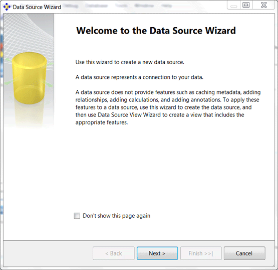
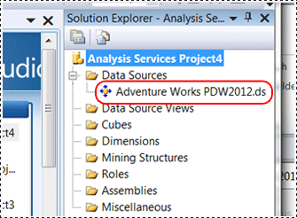
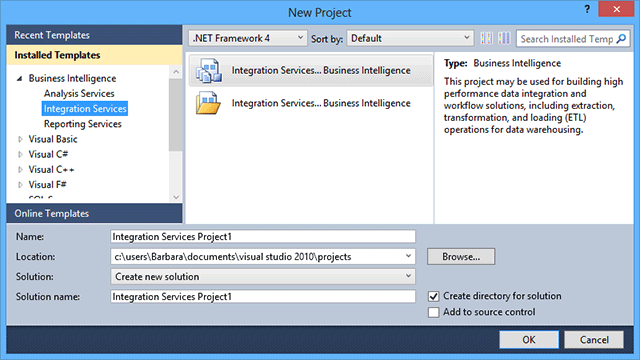

# Connect With SQL Server Integration Services for Querying (SQL Server PDW)
This topic describes how to create an Integration Services connection for querying SQL Server PDW.  
  
## Contents  
  
-   [Connect With SQL Server 2008 R2 Integration Services](#SQLServer2008R2)  
  
-   [Connect With SQL Server 2012 Integration Services](#SQLServer2012)  
  
-   [Connect With SQL Server 2014 Integration Services](#SQLServer2014)  
  
## Connect With SQL Server 2008 R2 Integration Services  
  
### Before You Begin  
**Permissions**  
  
To query data on SQL Server PDW, you need a SQL Server PDW login that has read permission on the data you plan to query.  
  
**Software Prerequisites**  
  
-   SQL Server 2008 R2 Integration Services, standard or enterprise edition.  
  
-   SQL Server Business Intelligence Development Studio (BIDS). See [Introducing Business Intelligence Development Studio](http://msdn.microsoft.com/en-us/library/ms173767(v=sql11).aspx).  
  
-   .NET Framework 3.5 SP1 or higher. See [Microsoft .NET Framework 3.5 Service Pack 1](http://www.microsoft.com/downloads/en/confirmation.aspx?familyId=ab99342f-5d1a-413d-8319-81da479ab0d7&displayLang=en). If you have Windows 7 or later, you already have this.  
  
-   SQL Server Native Client (SNAC) 10.0. See [Install SQL Server Native Client &#40;SQL Server PDW&#41;](../sqlpdw/install-sql-server-native-client-sql-server-pdw.md).  
  
### Create an Integration Services Project  
Create an Integration Services project by using Business Intelligence Development Studio. To do this:  
  
1.  Open Business Intelligence Development Studio. To do this, in Windows click **Start**, choose **Programs**, choose **SQL Server 2008 R2**, and then select **SQL Server Business Intelligence Development Studio**.  
  
2.  Open a new project. To do this, on the **File** menu, select **New**, and choose **Project**.  
  
3.  In the **New Project** window, for **Project type**, select **Business Intelligence Projects**, and then select the template, **Integration Services Project**. Enter a project name and solution name, and click OK.  
  
  
  
### Add a Data Source  
To add a data source:  
  
1.  In Solution Explorer, under your new project, right-click **Data Sources**, and select **New Data Source**.  
  
2.  Click **Next** to connect.  
  
3.  In the **Welcome to the Data Source Wizard** screen, click **Next**.  
  
      
  
4.  In the **Select how to define the connection** screen, choose **Create a data source based on an existing or new connection**, and click **New**.  
  
5.  In the **Connection Manager** window, make the following selections:  
  
    -   **Provider**: Select **Native OLE DB\SQL Server Native Client 10.0**.  
  
    -   **Server name** for Ethernet connections: enter the IP address of the Control node cluster, followed by a comma (,), followed by port 17001. For example, 10.192.63.147,17001 .  
  
        **Server name** for InfiniBand connections: enter `<appliance-name>-SQLCTL01,17001`  
  
    -   Choose **Use Windows Authentication**, or choose **Use SQL Server Authentication**.  
  
    -   **User name** and **Password** fields: enter your SQL Server PDW login and password if using SQL Server Authentication.  
  
    -   **Select or enter a Database Name**: Select or enter the name of the target database.  
  
          
  
6.  Click **Test Connection** to verify that the new data source is available.  
  
7.  Click **OK** to return to the page, **Select how to define the connection**.  
  
8.  In the **Select how to define the connection** window, view your new connection listed under Data Connections.  
  
9. Click **Finish** to bypass the **Impersonation Information** page.  
  
10. On the **Completing the Wizard** page, type a friendly name for your data source.  
  
11. You can now see your data source listed in Solution Explorer under your Integration Services Project.  
  
      
  
## Connect With SQL Server 2012 Integration Services  
  
### Before You Begin  
**Software Prerequisites for SQL Server 2012 Integration Services**  
  
-   SQL Server 2012 Integration Services, standard or enterprise edition.  
  
-   SQL Server Data Tools. These are already installed unless you unchecked Client Connectivity Tools in your SQL Server 2012 installation.  
  
-   .NET Framework 3.5 SP1 or higher. See [Microsoft .NET Framework 3.5 Service Pack 1](http://www.microsoft.com/downloads/en/confirmation.aspx?familyId=ab99342f-5d1a-413d-8319-81da479ab0d7&displayLang=en). If you have Windows 7 or later, you already have this.  
  
-   SQL Server Native Client (SNAC) 11.0. If you have SQL Server 2012, you already have this unless you unchecked Client Connectivity Tools during SQL Server 2012 setup. See [Install SQL Server Native Client &#40;SQL Server PDW&#41;](../sqlpdw/install-sql-server-native-client-sql-server-pdw.md).  
  
### Create an Integration Services Project  
To create an Integration Services Project:  
  
1.  Open SQL Server Data Tools from your SQL Server 2012 installation. This opens the Visual Studio 2010 Integrated Shell.  
  
    -   On Windows 7, click on the Windows **Start** menu, select **All Programs**, select **Microsoft SQL Server 2012**, and select **SQL Server Data Tools**.  
  
    -   On Windows 8, press the Start key, select search, click Apps, find Microsoft SQL Server 2012. Under Microsoft SQL Server 2012, click SQL Server Data Tools.  
  
      
  
2.  Open an existing Integration Services project or create a new one. To create a project:  
  
    -   Click on the **File** menu, choose **New**, choose **Project**.  
  
          
  
    -   In the new project window, choose Integration Services Project and click OK.  
  
### Add a Data Source  
To add a data source:  
  
1.  In Solution Explorer, under your new project, right-click **Data Sources**, and select **New Data Source**.  
  
2.  Click **Next** to connect.  
  
3.  In the **Welcome to the Data Source Wizard** screen, click **Next**.  
  
      
  
4.  In the **Select how to define the connection** screen, choose **Create a data source based on an existing or new connection**, and click **New**.  
  
5.  In the **Connection Manager** window, make the following selections:  
  
    -   **Provider**: Select **Native OLE DB\SQL Server Native Client 10.0**.  
  
    -   **Server name** for Ethernet connections: enter the IP address of the Control node cluster, followed by a comma (,), followed by port 17001. For example, 10.192.63.147,17001 .  
  
        **Server name** for InfiniBand connections: enter `<appliance-name>-SQLCTL01,17001`  
  
    -   Choose **Use Windows Authentication**, or choose **Use SQL Server Authentication**.  
  
    -   **User name** and **Password** fields: enter your SQL Server PDW login and password if using SQL Server Authentication.  
  
    -   **Select or enter a Database Name**: Select or enter the name of the target database.  
  
          
  
6.  Click **Test Connection** to verify that the new data source is available.  
  
7.  Click **OK** to return to the page, **Select how to define the connection**.  
  
8.  In the **Select how to define the connection** window, view your new connection listed under Data Connections.  
  
9. Click **Finish** to bypass the **Impersonation Information** page.  
  
10. On the **Completing the Wizard** page, type a friendly name for your data source.  
  
11. You can now see your data source listed in Solution Explorer under your Integration Services Project.  
  
      
  
## Connect With SQL Server 2014 Integration Services  
  
### Before You Begin  
**Software Prerequisites for SQL Server 2014 Integration Services**  
  
-   SQL Server 2014 Integration Services, standard or enterprise edition.  
  
-   SQL Server Data Tools. These are already installed unless you unchecked Client Connectivity Tools in your SQL Server 2014 installation.  
  
-   .NET Framework 3.5 SP1 or higher. See [Microsoft .NET Framework 3.5 Service Pack 1](http://www.microsoft.com/downloads/en/confirmation.aspx?familyId=ab99342f-5d1a-413d-8319-81da479ab0d7&displayLang=en). If you have Windows 7 or later, you already have this.  
  
-   SQL Server Native Client (SNAC) 12.0. If you have SQL Server 2014, you already have this unless you unchecked Client Connectivity Tools during SQL Server 2014 setup. See [Install SQL Server Native Client &#40;SQL Server PDW&#41;](../sqlpdw/install-sql-server-native-client-sql-server-pdw.md).  
  
## See Also  
[Connecting to SQL Server PDW (SQL Server PDW)](assetId:///721851d5-e521-4d5b-ba6d-8e2e9d3c7808)  
  
