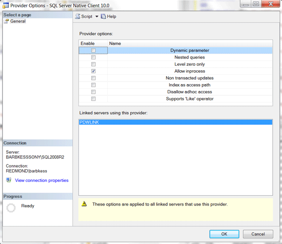
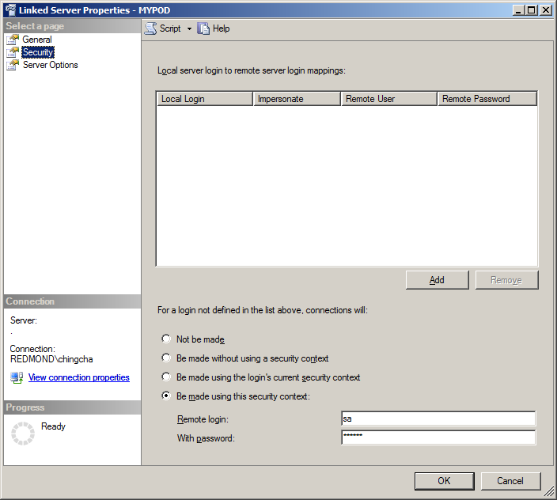
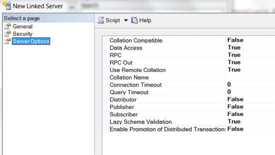

# Connect With SQL Server Linked Server (SQL Server PDW)
Describes how to register and use a linked server connection from SQL Server to SQL Server PDW. This enables you to use SQL Server to submit SQL statements to SQL Server PDW by using existing SQL Server linked server technology.  
  
## Contents  
  
-   [Before You Begin](#BeforeYouBegin)  
  
-   [Limitations and Restrictions](#LimitRestrict)  
  
-   [Security](#Security)  
  
-   [Examples](#Examples)  
  
## <a name="BeforeYouBegin"></a>Before You Begin  
  
### Software Prerequisites  
SNAC 10.0 for SQL Server 2008 R2. SNAC 11.0 for SQL Server 2012. See [Install SQL Server Native Client &#40;SQL Server PDW&#41;](../../mpp/sqlpdw/install-sql-server-native-client-sql-server-pdw.md)  
  
The server that will be configured to make a linked server connection to SQL Server PDW must be running SQL Server Enterprise or Data Center Edition. For example the **lazy schema validation** option, which we recommend setting to TRUE, is not available in SQL Server Standard Edition.  
  
## <a name="LimitRestrict"></a>Limitations and Restrictions  
SQL Server PDW cannot be configured to make an outgoing linked server connection.  
  
SQL statements must be submitted using the linked server EXECUTE statement. Using the EXECUTE statement avoids using four-part names for objects, which is not supported by SQL Server PDW. For example:  
  
-   Use this: `EXEC ('SELECT * FROM AdventureWorksPDW2012.dbo.dimCustomer') AT PDWLINK;`  
  
-   Don’t use this: `SELECT * FROM PDWLINK.AdventureWorksPDW2012.dbo.dimCustomer`  
  
Other linked server functionality is not supported. For more information about using linked servers see [Linking Servers](http://msdn.microsoft.com/en-us/library/ms188279(v=sql11).aspx) on MSDN.  
  
The linked server provider must be run using the **AllowInProcess** option. The **AllowInProcess** option can be set in Management Studio by using the **Properties** dialog box for the **Microsoft.SQLServerMPPOLEDBProvider** provider.  
  
To select this, in SQL Server Management Studio, in Object Explorer, expand Linked Servers, expand Providers, right click on SQLNCLI10 and choose Properties. In the Provider Options window, under **Provider Options**, enable **Allow inprocess**, and click OK.  
  
  
  
## <a name="Security"></a>Security  
One way to create a linked server script is to use the linked server UI in SQL Server Management Studio to generate the script. When using this approach, if you enter the user id and password as part of the connection string on the General properties page, the resulting script will contain the user id and password in plain text. To block the plain text password from appearing in the script, enter the user id and password on the Security properties page of the linked server UI.  
  
The following diagram shows the Security page for the linked server UI in SQL Server Management Studio where you should enter your credentials.  
  
  
  
## <a name="Examples"></a>Examples  
  
### Create a Linked Server by Using SQL Server Management Studio  
Open SQL Server Management Studio.  
  
1.  Open SQL Server Management Studio.  
  
2.  In Object Explorer, expand **Server Objects**, right-click on **Linked Servers** and choose **New Linked Server**.  
  
3.  On the New Linked Server page, enter the following field information:  
  
    -   Linked Server: Enter a name for the Linked Server object.  
  
    -   Server Type: Choose **other data source**.  
  
    -   Provider: Select SQL Server Native Client 10.0.  
  
    -   Product name: Enter PDW.  
  
    -   Provider string: For the Server use the IP address of the Control node cluster, followed by a comma, followed by port 17001. For the Database, enter master or your own database. Add the Pooling=False parameter.  
  
        Server=<control_node cluster_IP>,17001;  
  
        Database=master;  
  
        Pooling=False;  
  
    -   Catalog: Same as the Database parameter.  
  
      
  
Enter information into the Security Page.  
  
1.  Under the Select a page pane, select Security.  
  
2.  On the Security page, enter the following information.  
  
3.  Login not defined in the list above, connecitons will: choose **Be made using this security context**.  
  
4.  Remote Login: Enter the login name that will log into SQL Server PDW.  
  
5.  With password: Enter the password for the connection. By using the remote login,  
  
  
  
Enter information into the Server Options Page.  
  
1.  Under the Select a page pane, select Server Options.  
  
2.  On the Server Options, enter the following information.  
  
3.  RPC: True  
  
4.  RPC Out: True  
  
5.  Collation Compatible: False  
  
6.  Data Access: True  
  
7.  Use Remote Collation: True  
  
8.  Collation name: leave blank  
  
9. Connection Timeout: 0  
  
10. Query Timeout: 0  
  
11. Distributor: False  
  
12. Publisher: False  
  
13. Subscriber: False  
  
14. Lazy Schema Validation: True  
  
15. Enable Promotion of Distributed Transaction: False  
  
You are ready to create the Linked Server. You can either  
  
Click OK at the bottom right to generate the Linked Server.  
  
  
  
### <a name="CreateLinked"></a>A. Use a Script That Creates a Linked Server From SQL Server to SQL Server PDW  
To build a linked server in SQL Server that points to SQL Server PDW, run the script below after editing the connection string to point to your own SQL Server PDW.  
  
```  
EXEC master.dbo.sp_MSset_oledb_prop N'SQLNCLI', N'AllowInProcess', 1  
GO  
  
EXEC master.dbo.sp_addlinkedserver  
@server = N'PDWLINK', @srvproduct=N'PDW',   
@provider=N'SQLNCLI', @provstr=N'Server=<ip_control_node_cluster>,17001', @catalog=N'<database>';  
GO  
  
EXEC master.dbo.sp_addlinkedsrvlogin  
@rmtsrvname=N'PDWLINK',@useself=N'False',  
@rmtuser=N'<PDW_login_name>',@rmtpassword='<PDW_login_password>'  
GO  
  
EXEC master.dbo.sp_serveroption  
@server=N'PDWLINK', @optname=N'rpc',  
@optvalue=N'true'  
GO  
  
EXEC master.dbo.sp_serveroption  
@server=N'PDWLINK', @optname=N'rpc out',  
@optvalue=N'true'  
GO  
  
-- The options below are not required  
EXEC master.dbo.sp_serveroption  
@server=N'PDWLINK', @optname=N'collation compatible',  
@optvalue=N'false'  
GO  
  
EXEC master.dbo.sp_serveroption  
@server=N'PDWLINK', @optname=N'data access',  
@optvalue=N'true'  
GO  
  
EXEC master.dbo.sp_serveroption  
@server=N'PDWLINK', @optname=N'dist',  
@optvalue=N'false'  
GO  
EXEC master.dbo.sp_serveroption  
@server=N'PDWLINK', @optname=N'pub',  
@optvalue=N'false'  
GO  
  
EXEC master.dbo.sp_serveroption  
@server=N'PDWLINK', @optname=N'sub',  
@optvalue=N'false'  
GO  
  
EXEC master.dbo.sp_serveroption  
@server=N'PDWLINK', @optname=N'connect timeout',  
@optvalue=N'0'  
GO  
  
EXEC master.dbo.sp_serveroption  
@server=N'PDWLINK', @optname=N'collation name',  
@optvalue=null  
GO  
  
EXEC master.dbo.sp_serveroption  
@server=N'PDWLINK', @optname=N'lazy schema validation',  
@optvalue=N'true'  
GO  
  
EXEC master.dbo.sp_serveroption  
@server=N'PDWLINK', @optname=N'query timeout',  
@optvalue=N'0'  
GO  
  
EXEC master.dbo.sp_serveroption  
@server=N'PDWLINK', @optname=N'use remote collation',  
@optvalue=N'true'  
GO  
  
EXEC master.dbo.sp_serveroption  
@server=N'PDWLINK', @optname=N'remote proc transaction promotion',  
@optvalue=N'false'  
GO  
```  
  
### <a name="UseLinked"></a>B. Use EXEC to Submit a Query to a Linked Server  
The following is an example of a query submitted to a linked server named PDWLINK by using the EXEC command. The EXEC command is run in SQL Server and the results are obtained from SQL Server PDW.  
  
This example uses EXEC … AT.  
  
```  
EXEC ('SELECT SUM(SalesAmount) AS Amount, COUNT (DISTINCT ProductKey) AS NumberOfRows  
FROM AdventureWorksPDW2012.dbo.FactInternetSales') AT PDWLINK;  
```  
  
This example uses OPENQUERY.  
  
```  
SELECT * FROM OPENQUERY( PDWLINK, 'SELECT SUM(SalesAmount), COUNT (DISTINCT ProductKey)  
FROM AdventureWorksPDW2012.dbo.FactInternetSales');  
```  
  
### C. Use Escape Characters To Specify Text in a Linked Server Query  
This example uses the single quote (') escape character around single-quoted text in a linked server query. This is required because the entire query is enclosed with single quotes.  
  
```  
EXEC ('SELECT f.OrderDateKey, f.SalesOrderNumber   
FROM AdventureWorksPDW2012.dbo.FactInternetSales AS f  
WHERE f.OrderDateKey > 20040000  
AND f.SalesOrderNumber LIKE ''SO67%'';') AT PDWLINK  
```  
  
## See Also  
[Connect With Applications &#40;SQL Server PDW&#41;](../../mpp/sqlpdw/connect-with-applications-sql-server-pdw.md)  
[Using Linked Server With SQL Server](http://go.microsoft.com/fwlink/?LinkId=247740)  
  
