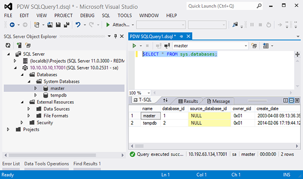
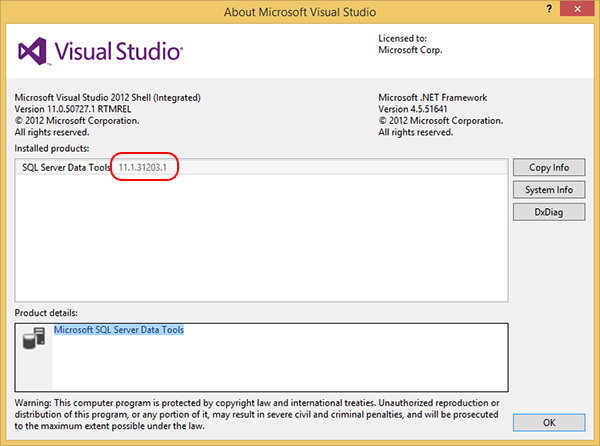

# Install SQL Server database tooling  for Visual Studio (SQL Server PDW)
Visual Studio provides SQL Server database tooling (formerly called SQL Server Data Tools) in an integrated environment for database developers to carry out all their database design work for any SQL Server platform (both on- and off-premises), all from within Visual Studio. Use this, as our recommended GUI query client SQL Server PDW.  
  
## Contents  
  
-   [Step 1: Determine Capacity Requirements](#Step1)  
  
-   [Step 2: Acquire the Server](#Step2)  
  
-   [Step 3: Connect the Server to the InfiniBand Networks](#Step3)  
  
-   [Limitations and Restrictions](#Limits)  
  
-   [Examples](#Examples)  
  
## Download and Install SQL Server Database Tooling for Visual Studio  
SQL Server database tooling, formerly called SQL Server Data Tools, is available in Visual Studio 2012 and 2013. AU2 support is included in the July 2014 update for both versions.  
  
If you have Visual Studio 2013 Ultimate, Premium, or Professional, you will only need to update SQL Server database tooling component. If you have Visual Studio 2013 Express for Windows Desktop, you will also need to apply Visual Studio Update 3 in addition to the SQL Server database tooling update. We recommend that you install Visual Studio Update 3, regardless of the edition you have to ensure you have the latest bug fixes from Visual Studio.  
  
To apply the updates to Visual Studio 2013:  
  
1.  Open Visual Studio and go to the **Tools** > **Extensions and Updates…** menu.  
  
2.  In the **Extensions and Updates** dialog, click on **Updates**. If you do not have either of the updates applied, you should see **Microsoft SQL Server Update for database tooling** and **Visual Studio 2013 Update 3** in the list.  
  
3.  Apply both of these updates.  
  
4.  Restart Visual Studio after the updates are applied if it was not closed during the update.  
  
If you have Visual Studio 2012, install the latest download of SQL Server tooling from [SQL Server Data Tools for Visual Studio 2012](http://msdn.microsoft.com/en-us/data/hh297027).  
  
Note that if you do not already have Visual Studio 2012, the SSDT installer will install everything it needs, including the Visual Studio Integrated Shell. If you already have Visual Studio 2012, you probably already have SQL Server Data Tools. It is installed with Visual Studio, unless you unselected it during setup.  
  
Visual Studio 2010 is not supported for Analytics Platform System Appliance Update 2.  
  
To install SQL Server tooling onto a computer that does not have internet access, see the instructions on setting up an Administrative Install Point on the [Get Started with Microsoft SQL Server Data Tools](http://go.microsoft.com/fwlink/?LinkID=225933) page on MSDN.  
  
## Create a Connection  
To connect to your SQL Server PDW appliance:  
  
1.  Open Visual Studio.  
  
    -   If you have Visual Studio 2013 or Visual Studio 2012, open it from the Start menu.  
  
    -   If you installed SSDT and Visual Studio 2012 was not already installed, open SQL Server Data Tools 2012 from the Start menu.  
  
2.  If the **SQL Server Object Explorer** window is not visible, open SQL Server Object Explorer. To do this, click **View** and select SQL Server Object Explorer.  
  
3.  In the SQL Server Object Explorer window, right-click SQL Server, and select **Add SQL Server …**.  
  
4.  In the Connect to Server window enter the following:  
  
    -   **Server name:** Enter the appliance Infiniband DNS name of the Control node, followed by a comma (,), followed by port 17001. For example, pdw1-CTRL,17001. To enter a friendly name, or to enter the server name if the Control node does not have a DNS name, see Tip C in [Examples](#Examples) at the end of this topic.  
  
    -   **Authentication:** Choose **Windows Authentication**, or **SQL Server Authentication**.  
  
    -   **Login:** Enter your user name if using SQL Server Authentication.  
  
    -   **Password:** Enter your password if using SQL Server Authentication.  
  
      
  
5.  Click **Connect**.  
  
6.  If the connection is successful, your appliance connection will appear in the SQL Server list in SQL Server Object Explorer.  
  
## Run a Query  
  
1.  Open the query editor. To do this, expand your SQL Server PDW appliance node in SQL Server Object Explorer, expand the Databases folder right-click on the Database you want to query, and select **New Query**.  
  
2.  Enter the query in the query editor window.  
  
3.  To run the query, click the Execute button.  
  
      
  
## Limitations and Restrictions  
Some SQL Server Data Tools features are not supported in this release of SQL Server PDW. For example, these features are not supported:  
  
-   IntelliSense  
  
-   Power buffer  
  
-   Offline DB projects  
  
-   Schema compare  
  
-   Query debugging  
  
The SQL Server Data Tools options apply to all of your SQL Server connections including SQL Server PDW. Options that are not supported with SQL Server PDW connections will be ignored. To view or set the SQL Server Data Tools options, in the main menu click **Tools**, **Options…**, and select **SQL Server Tools**.  
  
You cannot use **SQL** main menu to open a new query window for SQL Server PDW queries. For example, if you click the **SQL** menu, **Transact-SQL Editor**, and **New Query…** , SQL Server Data Tools will open the Transact-SQL Editor which does not query SQL Server PDW databases. Instead, follow the instructions in [Step 3: Connect the Server to the InfiniBand Networks](#Step3) to open the SQL editor for SQL Server PDW.  
  
## Tips and Examples  
  
### A. How to Open SQL Server Data Tools for Visual Studio 2012  
SQL Server Data Tools might appear in multiple places among the Programs in the All Programs menu in Windows.  
  
> [!CAUTION]  
> You cannot use the SQL Server 2012 SQL Server Data Tools to browse database objects and to run SQL queries. This version of SQL Server Data Tools that installs with SQL Server 2012 contains the tools for Business Intelligence projects, and does not contain the tools for browsing and querying databases.  
  
To open SQL Server Data Tools for the purpose of running SQL queries on SQL Server 2012 Parallel Data Warehouse, select any of the following links in the Windows Start menu.  
  
-   **All Programs | SQL Server Data Tools 2012**. You get this if you install SQL Server Data Tools for Visual Studio 2012, and Visual Studio 2012 is not already installed.  
  
-   **All Programs | Microsoft Visual Studio 2012 | Visual Studio 2012**.  
  
### B. Change Keyboard Shortcuts  
You may want to change some of the pre-defined keyboard shortcuts in SQL Server Data Tools. For example, pressing Ctrl+Shift+E in the Query Editor Window will run the query. Users who are accustomed to SQL Server Management Studio might prefer pressing F5 to run a query.  
  
The following example shows how to change the keyboard shortcut for running a query in SQL Server Data Tools from CTRL+SHIFT+E to F5.  
  
1.  From the main menu, click **Tools**, **Options…**, **Environment**, **Keyboard**.  
  
2.  In the **Show Commands Containing field:**, type ExecuteQuery to search, and select **SQL.TSqlEditorExecuteQuery** from the list.  
  
3.  For **Use new shortcut in:**, choose  Microsoft SQL Server Data Tools, T-SQL Editor.  
  
4.  In the Press shortcut keys: field, press F5, or any other key combination that you want to assign to this action.  
  
5.  Click Assign, and then click OK.  
  
### C. Assign a friendly name to a connection  
Although you cannot change the name of the connection to a friendly name from within SQL Server Data Tools, you can create a connection that has a friendly name by editing the Windows system hosts file before creating the connection.  
  
This is useful when the connection name is the IP address of your server, and you want to change it to a friendly name. For example, if your server does not have an assigned name in DNS, SQL Server Data Tools will display the IP address of your server as the connection name.  
  
To assign a friendly name to an IP address in the Windows system hosts file  
  
1.  Open a command prompt as an administrator. To do this, click **Start**, **All Programs**, and **Accessories**.  Under Accessories, right-click **Command Prompt** and select **Run as Administrator**.  
  
2.  To edit the list of host names, enter `notepad %SystemRoot%\System32\drivers\etc\hosts` on the command window and press Enter.  
  
3.  Add a new line to the hosts file that specifies the IP address of your appliance, followed by a friendly name for the connection. For example, add the line: `xxx.xxx.xxx.xxx SalesPDW`.  
  
4.  Save the file and exit notepad.  
  
To assign a friendly name to a new connection  
  
1.  Create a new connection as described by [Step 2: Acquire the Server](#Step2).  
  
2.  In the connection window, instead of entering `xxx.xxx.xxx.xxx,17001` as the connection name, enter `SalesPDW,17001`.  
  
### D. View SQL Server Data Tools Version Information  
To verify which version of SQL Server Data Tools is installed  
  
1.  Open SQL Server Data Tools for Visual Studio 2012 or open Visual Studio 2013.  
  
2.  From the main menu, click **Help**, and select **About Microsoft Visual Studio**.  
  
3.  Find **SQL Server Data Tools** in the list and view the version information.  
  
  
  
## See Also  
[Client Tools and Applications &#40;SQL Server PDW&#41;](../sqlpdw/client-tools-and-applications-sql-server-pdw.md)  
  
