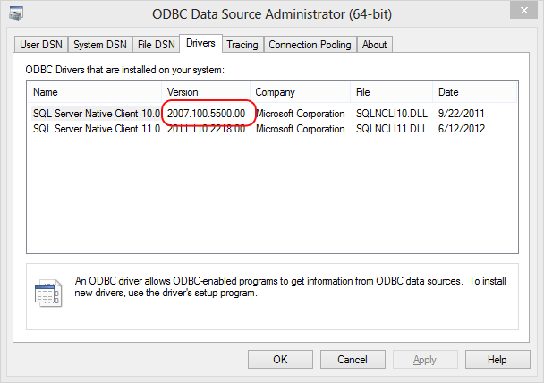

# Install SQL Server Native Client (SQL Server PDW)
This topic explains how to install the SQL Server Native Client onto the client that will connect to SQL Server PDW. SQL Server Native Client is required for many application connections to SQL Server PDW.  
  
Parent Topic: [Client Tools and Applications &#40;SQL Server PDW&#41;](../sqlpdw/client-tools-and-applications-sql-server-pdw.md)  
  
## Contents  
  
-   [Basics](#Basics)  
  
-   [Before You Begin](#BeforeBegin)  
  
-   [Step 4: Verify the Destination Adapters](#Verify)  
  
-   [Step 2: Install SQL Server Native Client 10.0](#InstallSNAC10)  
  
-   [Step 3: Install SQL Server Native Client 11.0](#InstallSNAC11)  
  
## Basics  
Microsoft SQL Server Native Client contains the OLE DB provider for SQL Server and the ODBC Driver for SQL Server, all in one native dynamic link library (DLL). SQL Server Native Client supports applications that use native-code APIs (ODBC, OLE DB and ADO) to communicate with SQL Server.  
  
SQL Server Native Client is required for all ODBC and OLE DB application connections to SQL Server PDW. You can install SQL Server Native Client with SQL Server, or as a separate download package.  
  
-   SQL Server 2008 R2 installs SQL Server Native Client 10.0.  
  
-   SQL Server 2012 installs SQL Server Native Client 11.0.  
  
When connecting with SQL Server Native Client, specify port 17001.  
  
For more information, see these topics:  
  
-   [The SQL Server Native Client ...](http://msdn.microsoft.com/en-us/sqlserver/ff658532.aspx) on MSDN.  
  
-   [Connection Strings for OLE DB and SQL Server Native Client &#40;SQL Server PDW&#41;](../sqlpdw/connection-strings-for-ole-db-and-sql-server-native-client-sql-server-pdw.md)  
  
-   [Connection Strings for ODBC and SQL Server Native Client &#40;SQL Server PDW&#41;](../sqlpdw/connection-strings-for-odbc-and-sql-server-native-client-sql-server-pdw.md)  
  
## Before You Begin  
  
### Software Requirements  
You can install SQL Server Native Client with SQL Server, or as a separate download package.  
  
First, decide which version of SQL Server Native Client you will need in order to connect to SQL Server PDW. It’s a good idea to install both SQL Server Native Client 10.0 and SQL Server Native Client 11.0, if they are not already installed, to avoid not having the right version of SQL Server Native Client when you need it.  
  
**SQL Server PDW applications that work with SQL Server Native Client 10.0 or SQL Server Native Client 11.0**  
  
-   SQL Server PDW**dwloader** for loading data  
  
**Microsoft applications that require SQL Server Native Client 10.0**  
  
-   SQL Server 2008 R2 sqlcmd  
  
-   SQL Server 2008 R2 Business Intelligence Development Studio.  
  
-   SQL Server 2008 R2 Integration Services  
  
-   SQL Server 2008 R2 PowerPivot for Excel  
  
-   SQL Server 2008 R2 Reporting Services  
  
-   SQL Server 2008 R2 Analysis Services  
  
-   SQL Server 2008 R2 Linked Server  
  
**Microsoft applications that require SQL Server Native Client 11.0**  
  
-   SQL Server 2012 sqlcmd  
  
-   SQL Server 2012 SQL Server Data Tools  
  
-   SQL Server 2012 Integration Services  
  
-   SQL Server 2012 PowerPivot for Excel  
  
-   SQL Server 2012 Reporting Services  
  
-   SQL Server 2012 Analysis Services  
  
-   SQL Server 2012 Linked Server  
  
## Step 1: Verify Your Current Installation  
You might already have SQL Server Native Client 10.0 and SQL Server Native Client 11.0 installed. Use these instructions to verify if you have the correct versions installed.  
  
> [!NOTE]  
> You need the 10.5 version of SQL Server Native Client 10.0.  Using the ODBC Administrator (odbcad32.exe), the driver name shows as SQL Server Native Client 10.0, and the version shows as 2007.100.5500.00.  
  
***To verify the version of SQL Server Native Client***  
  
-   In Windows, click **Start** and enter odbcad32.exe in the search box.  
  
-   In the ODBC Data Source Administrator Window click the **System DSN** tab.  
  
-   Click the **Drivers** tab.  
  
-   If you see SQL Server Native Client 10.0, verify the version is 2007.100.5500.00 or later. This is the version that ships with SQL Server 2008 R2. If the version is less than 2007.100.5500.00, you need to update the client.  
  
      
  
-   If you see SQL Server Native Client 11.0, then it is already installed. Both 10.0 and 11.0 can be installed on the same system.  
  
-   Close the ODBC Data Source Administrator window.  
  
If the correct SQL Server Native Client is already installed, you don’t need to proceed any further with this topic.  
  
## Step 2: Install SQL Server Native Client 10.0  
Install SQL Server Native Client 10.0 2007.100.5500.00 (or later), if it is not already installed, on the computer that is connecting to SQL Server PDW.  
  
**To install SQL Server Native Client 10.0 with SQL Server 2008 R2**  
  
-   Run SQL Server 2008 R2 setup and from the installer’s Features page, select “Client Connectivity Tools.”  
  
**To install SQL Server Native Client 10.0 from the Microsoft Download Center**  
  
Search on the internet to find the latest Microsoft SQL Server 2008 R2 Feature pack, and install SQL Server Native Client 10.0 from the links listed on the feature pack page.  
  
For example, you can install SQL Server Native Client 10.0 from the [Microsoft SQL Server 2008 R2 SP1 Feature Pack](http://www.microsoft.com/en-us/download/details.aspx?id=26728), published 7/11/2011 on the Microsoft Download Center.  
  
-   For x86 computers, install 1033\x86\sqlncli.msi.  
  
-   For x64 computers, install 1033\x64\sqlncli.msi.  
  
For more information, see [Installing SQL Server Native Client](http://msdn.microsoft.com/en-us/library/ms131321(v=sql.105).aspx) on MSDN.  
  
## Step 3: Install SQL Server Native Client 11.0  
Install SQL Server Native Client 11.0, if it is not already installed, on the computer that is connecting to SQL Server PDW.  
  
**To install SQL Server Native Client 11.0 with SQL Server 2012**  
  
-   Run SQL Server 2012 setup and from the installer’s Features page, select “Client Connectivity Tools.”  
  
**To install SQL Server Native Client 11.0 from the Microsoft Download Center**  
  
Search on the internet to find the latest Microsoft SQL Server 2012 Feature pack, and install SQL Server Native Client 11.0 from the links listed on the feature pack page.  
  
For example, you can install SQL Server Native Client 11.0 from the [Microsoft SQL Server 2012 SP1 Feature Pack](http://www.microsoft.com/en-us/download/details.aspx?id=35580), published 11/13/2012 on the Microsoft Download Center.  
  
-   For x86 computers, install ENU\x86\sqlncli.msi.  
  
-   For x64 computers, install ENU\x64\sqlncli.msi.  
  
For more information, see [Installing SQL Server Native Client](http://msdn.microsoft.com/en-us/library/ms131321(v=sql.110).aspx) on MSDN.  
  
