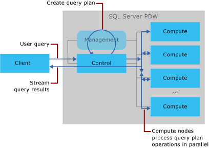

# Query Process (SQL Server PDW)
This topic describes how SQL Server PDW processes queries in parallel across the Compute nodes.  
  
## Understanding the Query Process  
User-submitted SQL queries are processed by the Control node. The Control node engine parses the query and creates a query plan that defines the sequence of operations it will use to run the query on the appliance. The Control node distributed query plan operations run serially. When a query plan operation uses multiple parallel operations, the SQL Server PDW engine waits for all parallel operations to complete before starting the next distributed query plan operation.  
  
  
  
And this is the query execution sequence:  
  
  
  
For more information about queries, see the [Query &#40;SQL Server PDW&#41;](../sqlpdw/query-sql-server-pdw.md) section of the documentation.  
  
