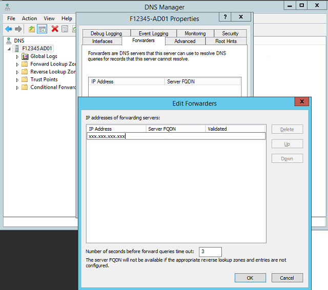

# Security - Configure Domain Trusts (SQL Server PDW)
Perform the following steps to configure SQL Server PDW to accept Windows Authentication logins from a corporate domain, and configure a corporate DNS server to provide authentication to SQL Server PDW. For all steps, login as a domain administrator or other high privileged user. This process includes the following steps:  
  
-   Configure a Forwarder on PDW DNS  
  
-   Configure a Forward Lookup Zone on the Corporate DNS  
  
-   Configure a Reverse Lookup Zone on the Corporate DNS  
  
-   Add Records for CTL and AD Nodes to the New FLZ on the Corporate DNS Server  
  
-   Add SRV Records Needed for Kerberos on the Corporate DNS Server  
  
-   Add Aliases for the CTL and AD Nodes to the Corporate DNS  
  
-   Create a Trust  
  
-   Validate the Trust  
  
## Steps on the SQL Server PDW  
  
### Configure a Forwarder on PDW DNS  
  
1.  Log in to ***appliance_domain*-HST01** as the appliance domain administrator.  
  
2.  Open the **Hyper-V Manager** program (**virtmgmt.msc**).  
  
    1.  Connect to ***appliance_domain*-HST01**, if not connected by default.  
  
    2.  In the **Virtual Machines** pane, right-click ***appliance_domain*-AD01**, and click **Connect**.  
  
    3.  Log on to the ***appliance_domain*-AD01** as the appliance domain administrator.  
  
3.  While on ***appliance_domain*-AD01**, open the **DNS Manager** (**dnsmgmt.msc**).  
  
4.  Right-click your DNS Server (***appliance_domain*-AD01**), and then click **Properties**.  
  
5.  On the **Advanced** tab, clear the checkbox for **Disable recursion** (also disables forwarders) to permit forwarders, and then click **Apply**.  
  
6.  On the **Forwarders** tab, click **Edit**.  
  
7.  In the **Edit Forwarders** dialog box, type the IP address of the DNS server for the corporate domain that will provide authentication.  
  
8.  Click **OK** to close the **Edit Forwarders** dialog box, and **OK** to close the **DNS Properties** dialog box.  
  
9. While on ***appliance_domain*-HST01**, go back to the **Hyper-V Manager**.  
  
    1.  Connect to ***appliance_domain*-HST02**, if not connected by default.  
  
    2.  In the **Virtual Machines** pane, right-click ***appliance_domain*-AD02**, and then click **Connect**.  
  
    3.  Log on to the ***appliance_domain*-AD02** as the appliance domain administrator.  
  
    4.  While on ***appliance_domain*-AD02**, perform steps 3 – 8 above.  
  
  
  
## Steps to Set Up Active Directory and DNS on the Corporate Domain  
  
### Configure a Forward Lookup Zone (FLZ) on the Corporate DNS  
  
1.  Open the DNS Manager (**dnsmgmt.msc**) on a corporate DC of the domain that will provide authentication.  
  
2.  In the left pane, expand the DNS Server for the authenticating domain, right-click **Forward Lookup Zones**, and then click **New Zone**.  
  
3.  Complete the **New Zone Wizard** to create a **Primary zone** using the name of the appliance domain as the **Zone Name**. The name will be in the format: **F12345.pdw.local** where **F12345** is the appliance domain. See your domain administrator for the preferred selection for the other options.  
  
> [!TIP]  
> At this point you should be able to successfully use **ping** to connect to the IP addresses of the SQL Server PDW management and control nodes, in the format **ping xxx.xxx.xxx.xxx**  
  
### Configure a Reverse Lookup Zone (RLZ) on the Corporate DNS  
  
1.  Continue using the DNS Manager on a corporate DC of the domain that will provide authentication. In the left pane, expand the DNS Server for the authenticating domain, right-click **Reverse Lookup Zones**, and then click **New Zone**.  
  
2.  Complete the **New Zone Wizard** to create a **Primary zone**, and specifying an **IPv4 Reverse Lookup Zone**. In the Network ID box, provide enough of the IP address to indicate the IP addresses that belong to this zone. (Typically this will be the first 3 octets of the SQL Server PDW IP addresses.) See your domain administrator for the preferred selection for the other options or if your IP addresses are not typical.  
  
  
  
### Add Records for CTL and Appliance AD Nodes to the New FLZ on the Corporate DNS Server  
  
1.  Continue using the DNS Manager on a corporate DC of the domain that will provide authentication. In the left-pane, expand **Forward Lookup Zones**, and then right-click on the new FLZ of SQL Server PDW (that you created in a previous step), and then click **New Host (A or AAAA)**.  
  
    1.  In the **New Host** dialog box, in the **Name** box, type the name of the PDW control node, in the format ***PDW_region*-ctl01**, such as **P12345-ctl01**.  
  
    2.  In the **IP address** box, type the external IP address of the control node.  
  
    3.  Check the **Create associated pointer (PTR)** record box.  
  
    4.  Click **Add Host** to create a reverse lookup entry for the control node.  
  
2.  Repeat the **New Host** process to create a pointer record for both ***appliance_domain*-AD01** and ***appliance_domain*-AD02**.  
  
  
  
> [!TIP]  
> At this point you should be able to successfully use **ping** to connect to the FQDN's of the SQL Server PDW**Control node**, ***appliance_domain*-AD01**, and ***appliance_domain*-AD02**, by using the following **ping** commands:  
>   
> -   **ping PDW_region-CTL01.appliance_domain.local**  
> -   **ping appliance_domain-AD01.appliance_domain.local**  
> -   **ping appliance_domain-AD02.appliance_domain.local**  
  
### Add SRV Records Needed for Kerberos on the Corporate DNS Server  
  
1.  Continue using the DNS Manager on a corporate DC of the domain that will provide authentication. Right-click on the FLZ for PDW created earlier, and then click **New Domain**.  
  
2.  In the **New DNS Domain** dialog box, type **dc._msdcs**, and then click **OK**.  
  
3.  In the left-pane, expand **Forward Lookup Zones**, expand your PDW zone name, expand **_msdcs** node, right click **dc**, and click **Other New Records**.  
  
4.  In the **Resource Record Type** dialog box, click **Service Location (SRV)**, and then click **Create Record**.  
  
5.  In the **Service** box, select **_ldap**, and in the **Host offering this service** box, enter the full DNS name of the ***appliance_domain*-AD01** node, suffixed by a dot. For example, **F12345-AD01.F12345.pdw.local**. Click **OK**.  
  
6.  In the **Resource Record Type** dialog box, click **Service Location (SRV)**, and then click **Create Record**.  
  
7.  In the **Service** box, select **_kerberos**, and in the **Host offering this service** box, enter the full DNS name of the  ***appliance_domain*-AD01** node, suffixed by a dot. For example, **F12345-AD01.F12345.pdw.local**. Click **OK**.  
  
8.  To close the **Resource Record Type** dialog box, click **Done**.  
  
9. Repeat steps 4 – 8 to create **_ldap** and **_kerberos** records for ***appliance_domain*-AD02**.  
  
  
  
### Add Aliases for the CTL and AD Nodes to the Corporate DNS  
  
1.  Continue using the DNS Manager on a corporate DC of the domain that will provide authentication. Right-click on the a FLZ of the authenticating corporate domain, and then click **New Alias (CNAME)**.  
  
2.  In the **New Resource Record** dialog box, in the **Alias name** box, type the name that you wish to use for the control node. This example uses **PdwControl**.  
  
3.  In the **Fully qualified domain name (FQDN) for target host** box, type the full internal name of the control node, or click **Browse** to find it on the DNS (in the FLZ with the SQL Server PDW appliance domain name).  
  
4.  In the **New Resource Record** dialog box, in the **Alias name** box, type the name that you wish to use for the ***appliance_domain*-AD01**. This example uses **FabAd01**.  
  
5.  In the **Fully qualified domain name (FQDN) for target host** box, type the full internal name of the ***appliance_domain*-AD01**, or click **Browse** to find it on the DNS (in the FLZ with the SQL Server PDW appliance domain name).  
  
6.  Repeat steps 4 – 6 for the ***appliance_domain*-AD02** to create a **FabAd02** alias.  
  
    > [!NOTE]  
    > These aliases should be used when accessing the PDW from corporate domain.  
  
  
  
> [!TIP]  
> At this point you should be able to successfully use **ping** to connect to the alias names of the SQL Server PDW Control and Active Directory nodes, in the format **ping PdwControl** and **ping FabAd01** and **ping FabAD02**  
  
### Create a Trust  
  
1.  On a corporate domain controller, open **Active Directory Domains and Trusts** (**domain.msc**).  
  
2.  In the left pane, right-click on the domain name, and then click **Properties**.  
  
3.  On the **Trusts** tab, click **New Trust**, and then complete the **New Trust Wizard** providing appliance domain administrator credentials when asked.  
  
    1.  For **Trust Name** enter the fully qualified appliance domain name, in the format **F1234.pdw.local**  
  
    2.  Choose a **Forest trust**.  
  
    3.  Choose **One-way: incoming**.  
  
        > [!NOTE]  
        > A **Two-way** trust can be created but it is not necessary.  
  
    4.  Choose **Both this domain and the specified domain**. You will be prompted for administrator credentials on the appliance domain.  
  
    5.  In most cases choose **Forest-wide authentication**. Choose **Selective authentication** if you wish to add additional restrictions on authentication.  
  
### Validate the Trust  
  
1.  Select the new trust in the list of incoming trusts, and then click **Properties**. Click **Validate**.  
  
2.  Choose **Yes, validate the incoming trust** and enter appliance domain administrator credentials.  
  
  
  
## See Also  
[Security - Windows Authentication and SQL Server Authentication &#40;SQL Server PDW&#41;](../../mpp/sqlpdw/security-windows-authentication-and-sql-server-authentication-sql-server-pdw.md)  
  
