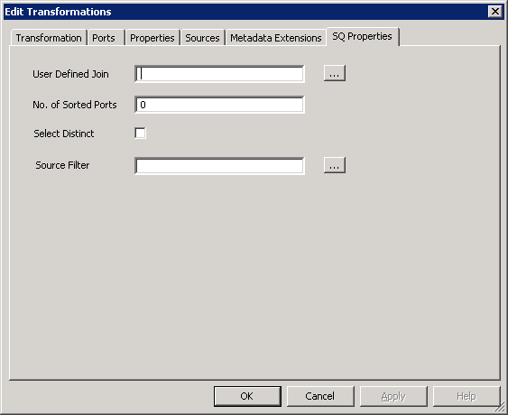
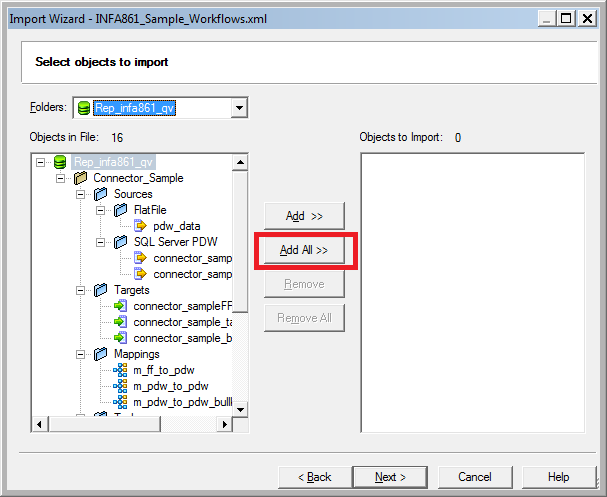
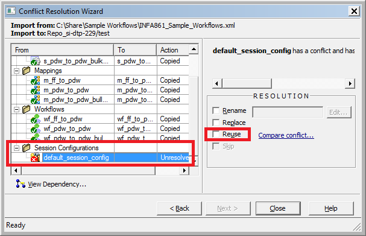
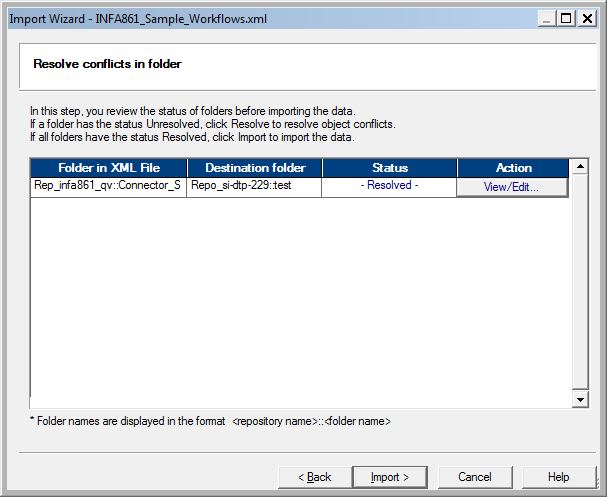
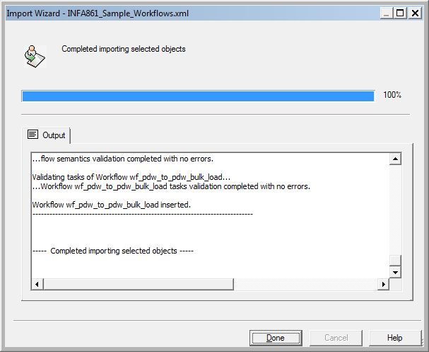

# Troubleshooting the SQL Server PDW Informatica Connector (SQL Server PDW)
This section helps you identify problems related to the SQL Server PDW Informatica connector. Problems may also arise from your Informatica applications, so it may be helpful to consult the Informatica Power Center documentation as well.  
  
Before troubleshooting, check that Informatica and the SQL Server PDW Informatica Connector are successfully installed on the specified system and the plug-in is registered in the Informatica Admin Console.  
  
## The SQ Property Page  
Use the following steps to set the value of the SQ property page.  
  
  
  
1.  Open the Informatica Mapping Designer and connect to the desired repository.  
  
2.  Navigate to required mapping with the Microsoft SQL Server PDW sources.  
  
3.  Right-click the mapping, and then click **Edit Application** source qualifier.  
  
4.  On the **SQ Properties** tab, enter the desired properties.  
  
    User Defined Join  
    Specify a join condition for multiple tables.  
  
    No. of Sorted Ports  
    Specify the number of sorted ports which must be less than the total number of columns.  
  
    Select Distinct  
    Select distinct values from the table.  
  
    Source Filter  
    Restrict the rows returned by providing a filter condition.  
  
5.  Click **OK**.  
  
## Override Query at Session Level  
Users can create a customized query at mapping level. Use this feature to override those queries.  
  
  
  
1.  Open the Informatica Workflow Manager and connect to the desired repository.  
  
2.  Navigate to the required session.  
  
3.  Right-click the session, and then click **Edit session**.  
  
4.  In the **Edit Tasks** dialog box, on the **Mapping** tab, in the left pane, expand **Sources**, and then select a table.  
  
5.  In the **Readers** area, click **SQL Server PDW Reader**.  
  
6.  In the **Connections** area, in the **Type** box, select **Relational**.  
  
7.  In the **Value** box, select your SQL Server PDW Relational Connection.  
  
8.  On the **Properties** section, enter the desired attributes and values. Query attributes entered here will override the query of **SQ Properties** tab.  
  
    User Defined Join  
    Specify a join condition for multiple tables.  
  
    Number of Sorted Ports  
    Specify the number of sorted ports which must be less than the total number of columns.  
  
    Select Distinct  
    Select distinct values from the table.  
  
    Source Filter  
    Restrict the rows returned by providing a filter condition.  
  
9. Click **OK**.  
  
## Importing Sample Workflows  
Use the following steps to import sample workflows into Informatica PowerCenter. These steps are the same for different versions of Informatica.  
  
Before importing, create sample tables as directed in the text file **Table Scripts for PDW.txt**. Then insert data into these tables using insert scripts provided in the files **Insert Script - connector_sample bulk_load_ source.txt** and **Insert Script - connector_sample.txt** files. These scripts are included in the SQL Server PDW Informatica Connector msi and installed with the connector. The default location for the files is **C:\Informatica\9.5.1\clients\PowerCenterClient\client\Microsoft\Sample**.  
  
1.  Open the Informatica Repository Manager and connect to the desired repository.  
  
    If you are already in the Informatica PowerCenter Designer, you can access the Repository Manager by clicking on the **R** icon on the toolbar.  
  
      
  
2.  Click on the folder in which the workflows are to be imported.  
  
3.  On the **Repository**, click **Import Objects**.  
  
      
  
4.  Select the XML file installed at **INFA_HOME\client\Microsoft\Sample**, and then click **Next**. You must choose the appropriate file for your version of Informatica. (**INFA861_Sample_Workflows.xml** for INFA861 and **INFA901_Sample_Workflows.xml** for INFA901.)  
  
    Click **Add All**, and then click **Next**.  
  
      
  
5.  In the **Destination folder** box, select the folder where you want to import workflows, and then click **Next**.  
  
      
  
6.  In the **Sessions Configurations** area, select **default_session_config**, and then select the **Reuse** checkbox.  
  
      
  
7.  Click **Close** to return to the import wizard.  
  
8.  Review the status, and then click **Import** to import the workflows in the selected folder.  
  
      
  
9. Informatica will import all the sample workflows into the repository. The user should see a final status message as **Completed importing selected objects**.  
  
      
  
10. After importing, copy the flat file source names **pdw_data.txt** from **INFA_HOME\client\Microsoft\Sample** to the **INFA_HOME\server\infa_shared\SrcFiles** folder.  
  
11. When this is completed, you can run the imported mappings. You must make sure that connections are properly created and set to the mappings before running them.  
  
## See Also  
[Installing the Informatica Connector &#40;SQL Server PDW&#41;](../sqlpdw/installing-the-informatica-connector-sql-server-pdw.md)  
[Using SQL Server PDW tables as Informatica Sources and Targets &#40;SQL Server PDW&#41;](../sqlpdw/using-sql-server-pdw-tables-as-informatica-sources-and-targets-sql-server-pdw.md)  
[Using Informatica to create SQL Server PDW connections in workflow manager &#40;SQL Server PDW&#41;](../sqlpdw/using-informatica-to-create-sql-server-pdw-connections-in-workflow-manager-sql-server-pdw.md)  
[Creating Sessions and Workflows in Informatica &#40;SQL Server PDW&#41;](../sqlpdw/creating-sessions-and-workflows-in-informatica-sql-server-pdw.md)  
  
