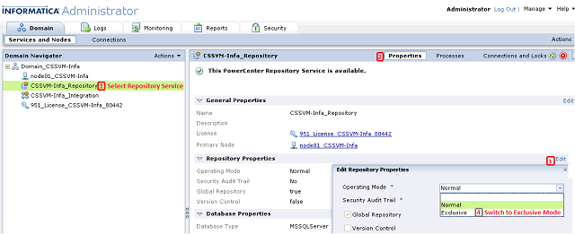
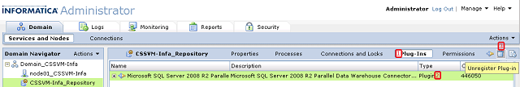

# Uninstalling the Informatica Connector Server (SQL Server PDW)
Use the following steps to uninstall the SQL Server PDW Informatica Connector. These instructions apply to all versions of PDW and all versions of Informatica.  
  
### Uninstalling the Informatica Connector Server  
  
1.  Open the Informatica Administrator and connect to the desired repository.  
  
2.  In the Domain Navigator pane, right-click the repository.  
  
3.  On the **Properties** tab, click **Edit**.  
  
4.  In the **Edit Repository Properties** section, in the **Operating Mode** box, select **Exclusive**.  
  
      
  
5.  Restart the service when prompted.  
  
6.  In the section for your repository, select **Plugins**, select the PDW plugin, and then click **Unregister Plug-in**.  
  
      
  
7.  In the Windows Control Panel, Programs and Features, Uninstall or change a program page, select the **Microsoft SQL Server PDW Connector for Informatica Server** for your version, and then click **Uninstall**.  
  
## .NET Framework Security  
  
## See Also  
[Installing the Informatica Connector &#40;SQL Server PDW&#41;](../../mpp/sqlpdw/installing-the-informatica-connector-sql-server-pdw.md)  
[Informatica Connector User Guide &#40;SQL Server PDW&#41;](../../mpp/sqlpdw/informatica-connector-user-guide-sql-server-pdw.md)  
  
