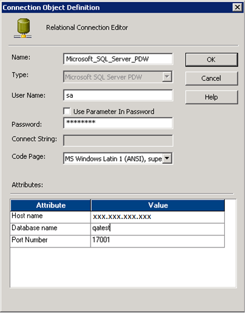

# Using Informatica to create SQL Server PDW connections in workflow manager (SQL Server PDW)
Informatica can make connections to SQL Server PDW for use in relational queries, or for loading data.  
  
## How to create a relational connection  
  
  
1.  Open the Informatica Workflow Manager and connect to the desired repository.  
  
2.  On the **Connections** menu, click **Relational**.  
  
3.  In the **Select Type** box, select **Microsoft SQL Server PDW**, and then click **New**.  
  
4.  In the **Name** box, provide a name for this connection.  
  
5.  In the **User Name** and **Password** boxes, provide the credentials for connecting to PDW.  
  
6.  Optionally, select a **Code Page**.  
  
7.  In the **Attributes** area, specify the connection string values.  
  
    -   **Host Name**: The name or IP address of the SQL Server PDW.  
  
    -   **Database Name**: Name of the database.  
  
    -   **Port Number**: 17001.  
  
8.  Click **OK**.  
  
## How to create a loader connection  
  
  
1.  Open the Informatica Workflow Manager and connect to the desired repository.  
  
2.  On the **Connections** menu, click **Loader**.  
  
3.  In the **Type** box, select **Microsoft SQL Server PDW Loader**, and then click **New**.  
  
4.  In the **Name** box, provide a name for this connection.  
  
5.  In the **User Name** and **Password** boxes, provide the credentials for connecting to PDW.  
  
6.  Optionally, specify the **Code Page**.  
  
7.  In the **Attributes** area, specify the connection string values.  
  
    -   **Host Name**: The name or IP address of the SQL Server PDW.  
  
    -   **Database Name**: Name of the database.  
  
8.  Optionally, specify additional attributes. The following attributes and values are typical.  
  
    -   **Batch Size**: Batch size indicates the number of rows to be written to each intermediate output file. Once created, these output files are loaded to the PDW in parallel (as they are created) by the Bulk Loader component. The default value is 5000. The user should configure this according to number of input rows to be loaded in the PDW. Very large values are not recommended because of the resources required for I/O operations.  
  
    -   **Use SSL**: If this option is set to true (the default value), data will encrypted before it is sent to PDW. This is more secure but slows down the transfer.  
  
9. Click **OK**.  
  
## See Also  
[Installing the Informatica Connector &#40;SQL Server PDW&#41;](../../mpp/sqlpdw/installing-the-informatica-connector-sql-server-pdw.md)  
[Using SQL Server PDW tables as Informatica Sources and Targets &#40;SQL Server PDW&#41;](../../mpp/sqlpdw/using-sql-server-pdw-tables-as-informatica-sources-and-targets-sql-server-pdw.md)  
[Creating Sessions and Workflows in Informatica &#40;SQL Server PDW&#41;](../../mpp/sqlpdw/creating-sessions-and-workflows-in-informatica-sql-server-pdw.md)  
  
