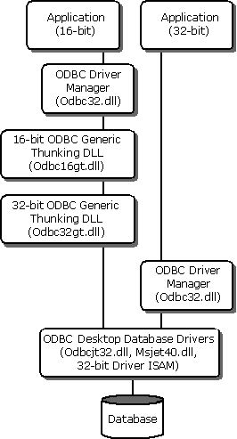

# Desktop Database Drivers Architecture
These drivers are designed for use on Microsoft Windows 95 or later, or Windows NT 4.0 and Windows 2000. Only 32-bit applications are supported on Windows 95 or later; 16-bit and 32-bit applications are supported on Windows NT 4.0 and Windows 2000.  
  
> [!NOTE]  
>  For information about the version of ODBC to be used with these drivers, refer to the *ODBC Programmer's Reference*, and past and current release notes. Except for noted areas, these drivers conform to the *ODBC Programmer's Reference*.  
  
 The ODBC Desktop Database Drivers include 32-bit drivers for Microsoft Access, dBASE, Microsoft Excel, Paradox, and Text. No 16-bit drivers are included. (A driver for Microsoft FoxPro is available separately.)  
  
 The application/driver architecture on Windows 95 or later is:  
  
   
  
 The use of these drivers by 16-bit applications on Windows 95 is not supported.  
  
 The application/driver architecture on Windows NT 4.0 and Windows 2000 is:  
  
   
  
 The Desktop Database Drivers are two-tier drivers. In a two-tier configuration, the driver does not perform the process of parsing, validating, optimizing, and executing the query. Instead, Microsoft Jet performs these tasks. It processes ODBC API calls and acts as an SQL engine. Microsoft Jet has become an integral, inseparable part of the drivers: It is shipped with the drivers and resides with the drivers, even if no other application on the computer uses it.  
  
 The Desktop Database Drivers consist of six different drivers - or, more precisely, one driver file (Odbcjt32.dll) that the ODBC [Driver Manager](../../odbc/reference/the-driver-manager.md) uses in six different ways. The DRIVERID flag in the registry entry for a data source determines which driver in Odbcjt32.dll the Driver Manager uses. An application passes this flag in the connection string included in a call to **SQLDriverConnect**. By default, the flag is the ID of the Microsoft Access driver.  
  
 The driver setup file changes the DRIVERID flag at setup time. All drivers except the Microsoft Access driver have an associated setup DLL. When you click **Setup** in the [Microsoft ODBC Data Source Administrator](../../odbc/admin/odbc-data-source-administrator.md) for a data source, the ODBC installer DLL (Odbcinst.dll) loads the setup DLL. The setup DLL exports the ODBC installer function **SQLConfigDataSource**. If a window handle is passed to **SQLConfigDataSource**, this function displays a setup window and changes the DRIVERID flag according to the driver selected from the user interface.  
  
 When a file is created programmatically, a NULL window handle is passed to **SQLConfigDataSource**, and the function creates a data source dynamically, changing the DRIVERID flag according to the *lpszDriver* argument in the function call.  
  
 Odbcjt32.dll implements ODBC functions on top of the Microsoft Jet API. There is no direct mapping between ODBC and Microsoft Jet functions, however. Many factors, such as the cursor models and SQL mapping, prevent a direct correlation of the functions.  
  
 The ODBC driver resides between the Microsoft Jet engine and the ODBC Driver Manager. Some ODBC functions called by an application are handled by the Driver Manager and not passed to the driver. For these functions, Microsoft Jet never sees the function call because it does not have a direct connection to the Driver Manager.
