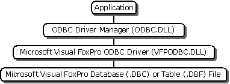

# Driver Architecture Overview
The Microsoft Visual FoxPro ODBC Driver is a 32-bit driver that enables you to open and query a Microsoft Visual FoxPro database or FoxPro tables through the Open Database Connectivity (ODBC) interface. You can access FoxPro data using the following types of applications:  
  
-   A Microsoft Office application, such as Microsoft Excel or Microsoft Word, that uses Microsoft Query to communicate with ODBC.  
  
-   An application written in Microsoft Visual C++ or C that uses the ODBC SDK API.  
  
-   An application written in Microsoft Visual Basic or Microsoft Visual Basic for Applications.  
  
 In each case, the request for information uses the ODBC API. The ODBC Driver Manager works with the Visual FoxPro ODBC Driver to open and retrieve data from FoxPro tables and databases.  
  
 The architecture is represented in the following diagram:  
  
   
  
 This section contains the following topics.  
  
-   [Visual FoxPro Terminology](../../odbc/microsoft/visual-foxpro-terminology.md)  
  
-   [Installing and Configuring the Visual FoxPro ODBC Driver](../../odbc/microsoft/installing-and-configuring.md)  
  
-   [Using the Visual FoxPro ODBC Driver](../../odbc/microsoft/using-the-visual-foxpro-odbc-driver.md)