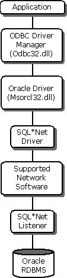

# ODBC Driver for Oracle
> [!IMPORTANT]  
>  This feature will be removed in a future version of Windows. Avoid using this feature in new development work, and plan to modify applications that currently use this feature. Instead, use the ODBC driver provided by Oracle.  
  
 The Microsoft® ODBC Driver for Oracle allows you to connect your ODBC-compliant application to an Oracle database. The ODBC Driver for Oracle conforms to the Open Database Connectivity (ODBC) specification described in the *ODBC Programmer's Reference*. It allows access to PL/SQL packages, XA/DTC integration, and Oracle access from within Internet Information Services (IIS).  
  
 Oracle RDBMS is a multiuser relational database management system that runs with various workstation and minicomputer operating systems. IBM-compatible computers running Microsoft Windows can communicate with Oracle database servers over a network. Supported networks include Microsoft LAN Manager, NetWare, VINES, DECnet, and any network that supports TCP/IP.  
  
 The ODBC Driver for Oracle enables an application to access data in an Oracle database through the ODBC interface. The driver can access local Oracle databases or it can communicate with the network through SQL*Net. The following diagram details this application and driver architecture.  
  
   
  
 The ODBC Driver for Oracle complies with API Conformance Level 1 and SQL Conformance Level Core. It also supports some functions in API Conformance Level 2 and most of the grammar in the Core and Extended SQL conformance levels. The driver is ODBC 2.5 compliant and supports 32-bit systems. Oracle 7.3x is supported fully; Oracle8 has limited support. The ODBC Driver for Oracle does not support any of the new Oracle8 data types - Unicode data types, BLOBs, CLOBs, and so on - nor does it support Oracle's new Relational Object Model. For more information about supported data types, see [Supported Data Types](../../odbc/microsoft/supported-data-types-odbc-driver-for-oracle.md) in this guide.  
  
 To access Oracle data, the following components are required:  
  
-   The ODBC Driver for Oracle  
  
-   An Oracle RDBMS database  
  
-   Oracle Client Software  
  
 Additionally, for remote connections:  
  
-   A network that connects the computers that run the driver and the database. The network must support SQL*Net connections.  
  
## Component Documentation  
 This guide contains detailed information about setting up and configuring the Microsoft ODBC Driver for Oracle and adding programmatic functionality. It also contains technical reference material.  
  
 For information regarding specific Oracle product behavior, consult the documentation that accompanies the Oracle product.  
  
 For information about setting up or configuring the Microsoft ODBC Driver for Oracle using the ODBC Data Source Administrator, see the [ODBC Data Source Administrator](../../odbc/admin/odbc-data-source-administrator.md) documentation.  
  
 This section contains the following topics.  
  
-   [ODBC Driver for Oracle User's Guide](../../odbc/microsoft/odbc-driver-for-oracle-user-s-guide.md)  
  
-   [ODBC Driver for Oracle Programmer's Reference](../../odbc/microsoft/odbc-driver-for-oracle-programmer-s-reference.md)
