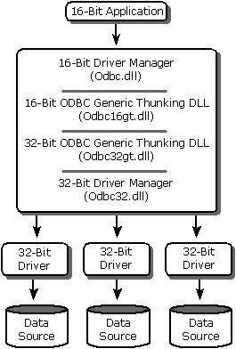
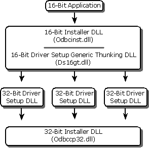

# Using 16-Bit Applications with 32-Bit Drivers
> [!IMPORTANT]  
>  This feature will be removed in a future version of Windows. Avoid using this feature in new development work and plan to modify applications that currently use this feature. Use 32-bit or 64-bit driver manager instead.  
  
 You can run 16-bit applications with 32-bit drivers on your Windows-based system as long as the 32-bit driver does not explicitly call Win32 API functions that create threads. The Windows on Windows (WOW) subsystem runs the applications in 16-bit mode and resolves 16-bit calls to the operating system. ODBC thunking DLLs resolve 16-bit calls from the application to 32-bit drivers. The 16-bit applications use the Windows API, and 32-bit drivers use the Win32 API.  
  
## Architecture  
 The following illustration shows how 16-bit applications communicate with 32-bit drivers. Between the 16-bit Driver Manager and the 32-bit drivers are generic thunking DLLs that convert 16-bit ODBC calls to 32-bit ODBC calls.  
  
   
  
> [!NOTE]  
>  Anytime a 16-bit application interacts with a 32-bit driver, the 32-bit Driver Manager always returns "2.0" as the version of ODBC supported by the driver.  
  
## Administration  
 You can manage data sources for 32-bit drivers by using the ODBC Data Source Administrator. To open the ODBC Administrator on computers running Microsoft® Windows® 2000, open the Windows Control Panel, double-click **Administrative Tools**, and then double-click **Data Sources (ODBC)**. On computers running previous versions of Microsoft Windows, the icon is named **32-bit ODBC** or simply **ODBC**.  
  
 The following illustration shows how a 16-bit application calls a 32-bit driver setup DLL. Between the 16-bit installer DLL and the 32-bit driver setup DLL is a generic thunking DLL that converts 16-bit installer DLL calls to 32-bit installer DLL calls.  
  
   
  
 In Windows on Windows (16-bit to 32-bit thunking), an additional thunking DLL named Ds32gt.dll converts 16-bit argument values passed through a 32-bit setup DLL back to 16-bit.  
  
## Components  
 The ODBC component of the MDAC 2.8 SP1 SDK includes the following files for running 16-bit applications with 32-bit drivers. These components are in the \Redist directory.  
  
|File name|Description|  
|---------------|-----------------|  
|Odbc16gt.dll|16-bit ODBC generic thunking DLL|  
|Odbc32gt.dll|32-bit ODBC generic thunking DLL|  
|Odbccp32.dll|32-bit installer DLL|  
|Odbcad32.exe|32-bit Administrator program|  
|Odbcinst.hlp|Installer Help file|  
|Ds16gt.dll|16-bit driver setup generic thunking DLL|  
|Ctl3d32.dll|32-bit three-dimensional window style library|  
  
 In addition, the following files along with the 16-bit ODBC 2.10 Driver Manager, which are not part of ODBC 3.51, are required by and should be installed with the 16-bit application.  
  
|File name|Description|  
|---------------|-----------------|  
|Odbc.dll|16-bit Driver Manager|  
|Odbcinst.dll|16-bit Installer DLL|  
|Odbcadm.exe|16-bit ODBC Administrator program|
